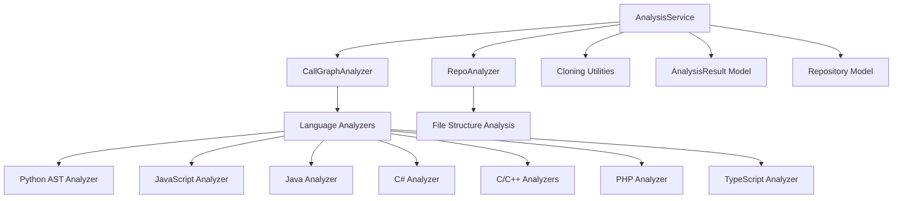
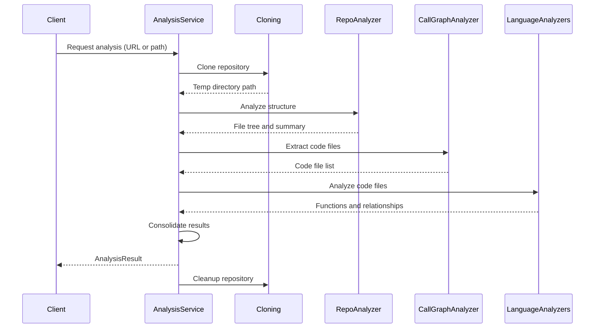

# Analysis Service Module Documentation

## Overview

The Analysis Service module provides a centralized service for repository analysis with support for multiple programming languages. It orchestrates the complete analysis workflow including repository cloning, structure analysis, and multi-language AST parsing for call graph generation. This service serves as the main entry point for repository analysis operations within the dependency analyzer system.

## Architecture

The Analysis Service module is part of the dependency analyzer system and works in conjunction with several other modules:



## Core Components

### AnalysisService Class

The main class that orchestrates the analysis workflow:

- **Purpose**: Centralized service for repository analysis supporting multiple programming languages
- **Responsibilities**:
  - Repository cloning and validation
  - File structure analysis with filtering
  - Multi-language AST parsing and call graph generation
  - Result consolidation and cleanup

## Functionality

### Analysis Methods

The AnalysisService provides three main analysis methods:

#### 1. Local Repository Analysis
```python
def analyze_local_repository(
    self,
    repo_path: str,
    max_files: int = 100,
    languages: Optional[List[str]] = None
) -> Dict[str, Any]
```
Analyzes a local repository folder with optional file limits and language filtering.

#### 2. Full Repository Analysis
```python
def analyze_repository_full(
    self,
    github_url: str,
    include_patterns: Optional[List[str]] = None,
    exclude_patterns: Optional[List[str]] = None,
) -> AnalysisResult
```
Performs complete repository analysis including call graph generation, cloning from GitHub URL.

#### 3. Structure-Only Analysis
```python
def analyze_repository_structure_only(
    self,
    github_url: str,
    include_patterns: Optional[List[str]] = None,
    exclude_patterns: Optional[List[str]] = None,
) -> Dict[str, Any]
```
Performs lightweight structure-only analysis without call graph generation.

## Data Flow



## Component Interactions

The AnalysisService interacts with several key components:

- **[cloning](dependency_analyzer.md)**: Handles repository cloning and cleanup operations
- **[repo_analyzer](repo_analyzer.md)**: Performs file structure analysis and filtering
- **[call_graph_analyzer](call_graph_analyzer.md)**: Orchestrates multi-language AST parsing
- **[language_analyzers](language_analyzers.md)**: Language-specific AST parsing implementations
- **[analysis_models](analysis_models.md)**: Data models for analysis results
- **[core_models](core_models.md)**: Core data models like Repository and Node

## Supported Languages

The service supports analysis of the following programming languages:
- Python
- JavaScript
- TypeScript
- Java
- C#
- C
- C++
- PHP
- Go
- Rust

## Security Features

The AnalysisService includes security measures:
- Path validation using `assert_safe_path` to prevent directory traversal attacks
- Safe file reading using `safe_open_text` for README files
- Temporary directory management with automatic cleanup

## Error Handling

The service implements comprehensive error handling:
- Try-catch blocks around all major operations
- Automatic cleanup of temporary directories on failure
- Detailed logging for debugging purposes
- Proper exception propagation with context

## Cleanup Process

The AnalysisService manages temporary directories created during repository cloning:
- Tracks all temporary directories in `_temp_directories` list
- Cleans up after successful analysis
- Ensures cleanup on service destruction via `__del__` method
- Provides `cleanup_all()` method for manual cleanup

## Backward Compatibility

The module provides backward compatibility functions:
- `analyze_repository()` - Maintains old interface for full analysis
- `analyze_repository_structure_only()` - Maintains old interface for structure-only analysis

## Integration Points

The AnalysisService integrates with the broader system through:
- [dependency_analyzer](dependency_analyzer.md) - Main entry point for analysis operations
- [cli_core](cli_core.md) - Command-line interface for repository analysis
- [web_frontend](web_frontend.md) - Web-based repository analysis interface
- [documentation_generator](documentation_generator.md) - Provides analysis data for documentation generation

## Usage Examples

The AnalysisService can be used in various contexts:
- Direct API calls for programmatic analysis
- CLI commands for batch processing
- Web interface for interactive analysis
- Automated analysis pipelines