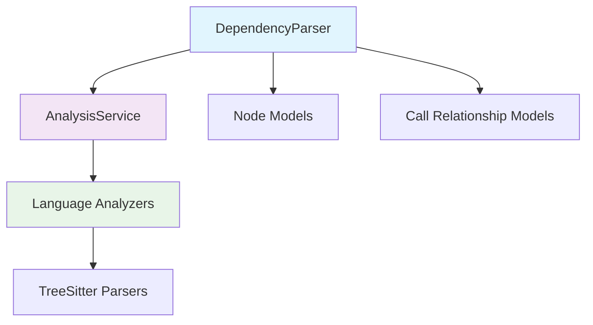
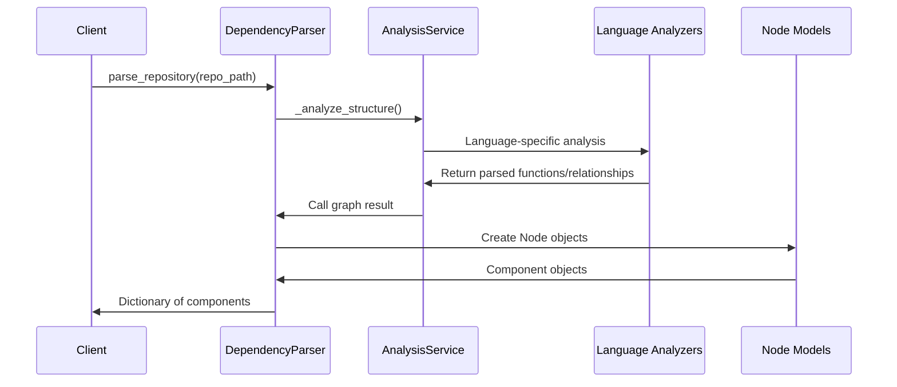
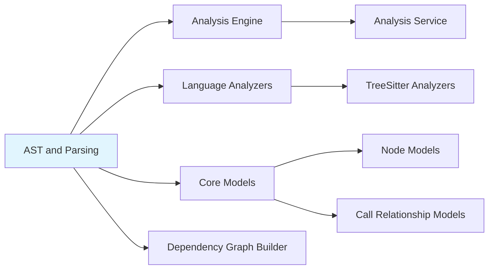

# AST and Parsing Module Documentation

## Introduction

The AST and Parsing module is a core component of the dependency analyzer system that handles the parsing of source code repositories into structured representations. This module provides the `DependencyParser` class which serves as the primary interface for extracting code components from multi-language repositories using AST (Abstract Syntax Tree) analysis and parsing techniques.

The module works in conjunction with the [analysis_engine](analysis_engine.md) to process source code and generate structured representations of code components that can be used for dependency analysis, documentation generation, and other code understanding tasks.

## Architecture Overview

The AST and Parsing module follows a layered architecture where the `DependencyParser` acts as the main orchestrator, leveraging the [analysis_service](analysis_service.md) to perform the actual parsing and analysis work.



## Core Components

### DependencyParser

The `DependencyParser` class is the main entry point for the AST and Parsing module. It provides functionality to:

- Parse entire repositories and extract code components
- Build dependency relationships between components
- Save parsed results to structured output formats
- Handle multi-language codebases

#### Key Methods

- `parse_repository()`: Main method to parse a repository and extract components
- `_build_components_from_analysis()`: Internal method to construct component objects from analysis results
- `save_dependency_graph()`: Export parsed components to JSON format

## Data Flow

The data flow in the AST and Parsing module follows this sequence:



## Component Relationships

The AST and Parsing module interacts with several other modules in the system:



## Integration with Other Modules

### Analysis Engine Integration

The `DependencyParser` relies heavily on the [analysis_service](analysis_service.md) to perform the actual parsing work. It calls the analysis service's `_analyze_structure` and `_analyze_call_graph` methods to extract function definitions and relationships from the codebase.

### Core Models Usage

The module uses [Node](core_models.md) models to represent parsed code components. Each parsed function, class, or method is converted into a Node object with properties like name, type, file path, source code, and dependencies.

### Dependency Graph Builder

Parsed components from this module feed into the [dependency_graph_builder](dependency_graph_builder.md) which constructs the final dependency graph representation.

## Usage Examples

### Basic Repository Parsing

```python
from codewiki.src.be.dependency_analyzer.ast_parser import DependencyParser

parser = DependencyParser("/path/to/repository")
components = parser.parse_repository()
```

### Saving Parsed Results

```python
# Parse repository and save results
parser = DependencyParser("/path/to/repository")
components = parser.parse_repository()
parser.save_dependency_graph("/output/dependency_graph.json")
```

## Configuration and Parameters

The `DependencyParser` accepts the following parameters:

- `repo_path`: Path to the repository to be parsed
- `filtered_folders`: Optional list of folders to include/exclude from parsing (passed to analysis service)

## Error Handling

The module includes comprehensive logging through Python's logging module to track parsing progress and identify issues. Error handling is primarily delegated to the underlying [analysis_service](analysis_service.md) which handles language-specific parsing errors.

## Performance Considerations

- The parser processes repositories incrementally to handle large codebases
- Language-specific analyzers are optimized for their respective languages
- Memory usage scales with the size of the repository being parsed

## File Extensions Supported

The module supports parsing of multiple programming languages through the underlying [language_analyzers](language_analyzers.md):

- Python (.py)
- JavaScript (.js, .jsx, .mjs, .cjs)
- TypeScript (.ts, .tsx)
- Java (.java)
- C# (.cs)
- C/C++ (.c, .cpp, .h, .hpp, .cc, .cxx)
- PHP (.php)

## Output Format

The parsed components are stored as [Node](core_models.md) objects with the following key properties:

- `id`: Unique identifier for the component
- `name`: Name of the function/class/method
- `component_type`: Type of component (function, class, method, etc.)
- `file_path`: Absolute path to the source file
- `relative_path`: Path relative to repository root
- `source_code`: Extracted source code snippet
- `depends_on`: Set of component IDs this component depends on

## Dependencies

- [AnalysisService](analysis_service.md): For performing the actual parsing and analysis
- [Node](core_models.md): For representing parsed code components
- TreeSitter libraries: For language-specific parsing (managed through language analyzers)

## Future Enhancements

- Support for additional programming languages
- Improved handling of complex dependency relationships
- Performance optimizations for large repositories
- Enhanced error recovery mechanisms

For more information about related components, see:
- [analysis_engine.md](analysis_engine.md)
- [language_analyzers.md](language_analyzers.md)
- [core_models.md](core_models.md)
- [dependency_graph_builder.md](dependency_graph_builder.md)