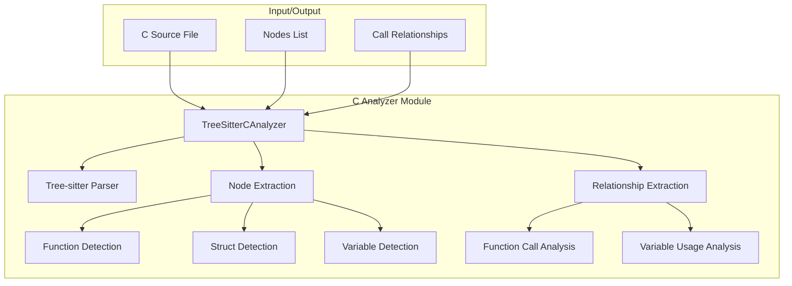
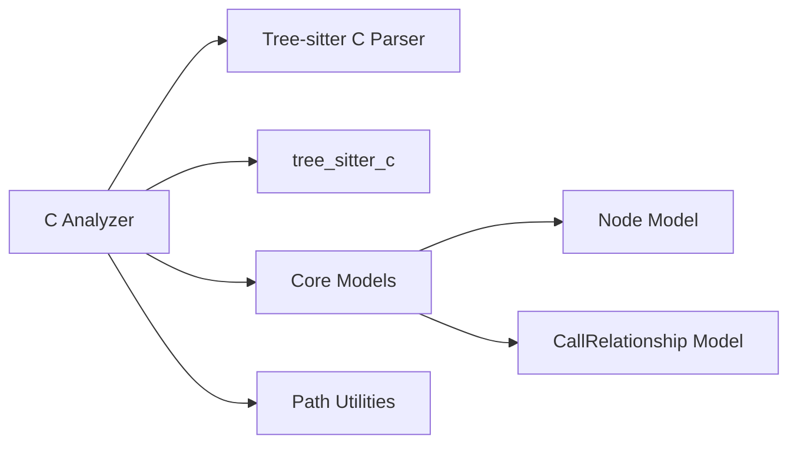
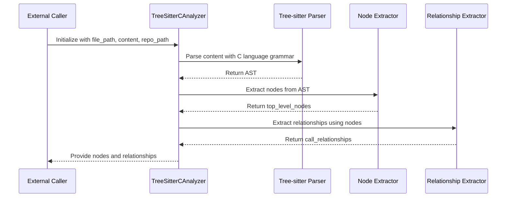

# C Analyzer Module Documentation

## Introduction

The C Analyzer module (`c_analyzer`) is a specialized component within the dependency analyzer system that handles parsing and analysis of C source code files. It leverages Tree-sitter's C language parser to extract structural information, identify functions, structs, and global variables, and determine relationships between these elements. This module is part of the broader language analyzer family that supports multiple programming languages.

## Architecture Overview

The C Analyzer module follows a tree-sitter-based parsing approach to analyze C source code. It identifies top-level constructs such as functions, structs, and global variables, and establishes relationships between them including function calls and variable usage.



## Core Components

### TreeSitterCAnalyzer Class

The main component of this module is the `TreeSitterCAnalyzer` class, which provides the core functionality for analyzing C source code.

#### Constructor
```python
def __init__(self, file_path: str, content: str, repo_path: str = None)
```

- `file_path`: Path to the C source file being analyzed
- `content`: The actual content of the C source file
- `repo_path`: Optional repository path for relative path calculations

#### Key Methods

1. **`_analyze()`**: Main analysis method that orchestrates the parsing and extraction process
2. **`_extract_nodes()`**: Recursively extracts top-level nodes (functions, structs, variables)
3. **`_extract_relationships()`**: Identifies relationships between nodes
4. **`_get_component_id()`**: Generates unique component IDs based on module path
5. **`_find_containing_function()`**: Determines which function contains a given node

#### Node Detection Capabilities

The analyzer identifies the following C constructs:

- **Functions**: Detected through `function_definition` nodes and `function_declarator`
- **Structs**: Identified through `struct_specifier` and `type_definition` nodes
- **Global Variables**: Found in `declaration` nodes that are not within function scope

#### Relationship Analysis

The analyzer identifies several types of relationships:

- **Function Calls**: When one function calls another
- **Variable Usage**: When functions use global variables
- **Cross-file References**: Function calls that may reference external implementations

## Dependencies and Integration

The C Analyzer module depends on several external libraries and internal components:



### External Dependencies
- `tree_sitter`: Core parsing library
- `tree_sitter_c`: C language grammar for Tree-sitter
- Standard Python libraries: `logging`, `pathlib`, `typing`, etc.

### Internal Dependencies
- [core_models](core_models.md): Uses `Node` and `CallRelationship` models
- [analysis_engine](analysis_engine.md): Integrated with the broader analysis service

## Data Flow

The data flow within the C Analyzer follows this pattern:



## Usage Context

The C Analyzer is typically used as part of the broader dependency analysis pipeline:

1. The [RepoAnalyzer](repo_analyzer.md) identifies C files in a repository
2. Each C file is processed by the `TreeSitterCAnalyzer`
3. Results are aggregated by the [DependencyGraphBuilder](dependency_graph_builder.md)
4. The [CallGraphAnalyzer](call_graph_analyzer.md) resolves cross-file relationships

## System Integration

The C Analyzer module integrates with the overall dependency analysis system through:

- **Input**: Receives C source code content from the repository analysis process
- **Output**: Provides structured node and relationship data to the dependency graph builder
- **Coordination**: Works alongside other language analyzers in the [language_analyzers](language_analyzers.md) module

## Special Features

### System Function Recognition

The analyzer includes a built-in list of common C library functions to distinguish between user-defined functions and system functions:

```python
system_functions = {
    "printf", "scanf", "malloc", "free", "strlen", "strcpy", "strcmp", 
    "memcpy", "memset", "exit", "abort", "fopen", "fclose", "fread", "fwrite",
    "SDL_Init", "SDL_CreateWindow", "SDL_Log", "SDL_GetError", "SDL_Quit"
}
```

### Path Resolution

The analyzer provides utilities for:
- Converting file paths to module paths
- Calculating relative paths within repositories
- Generating unique component IDs

## Error Handling

The analyzer includes error handling for:
- Invalid file paths
- Malformed C source code
- Repository path resolution issues

## Performance Considerations

- Uses efficient tree-sitter parsing for fast analysis
- Recursive traversal for comprehensive node detection
- Memory-efficient processing of large C files

## Limitations

- Primarily focuses on top-level constructs (functions, structs, global variables)
- Limited semantic analysis beyond syntactic relationships
- May not handle complex macro-based code generation