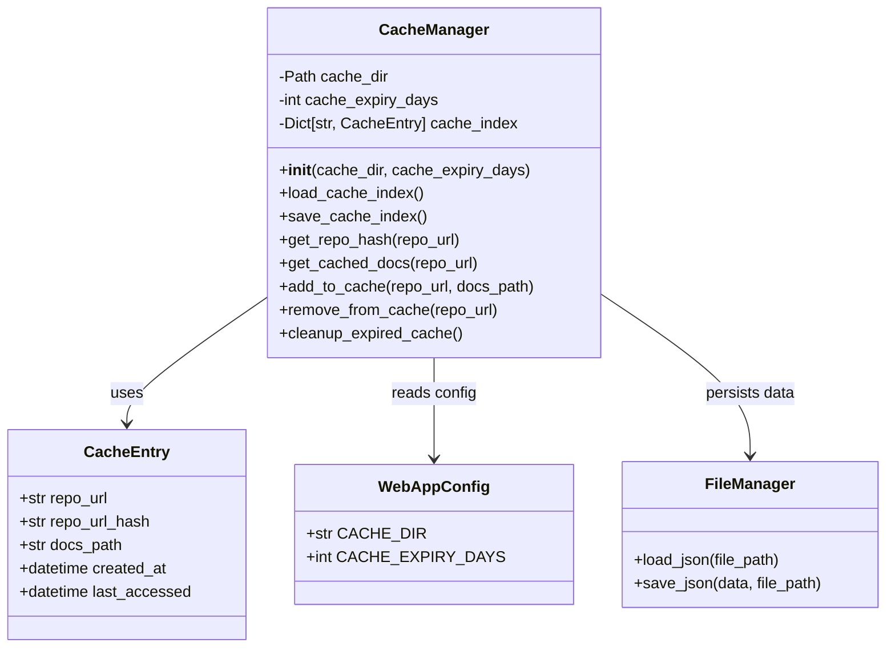
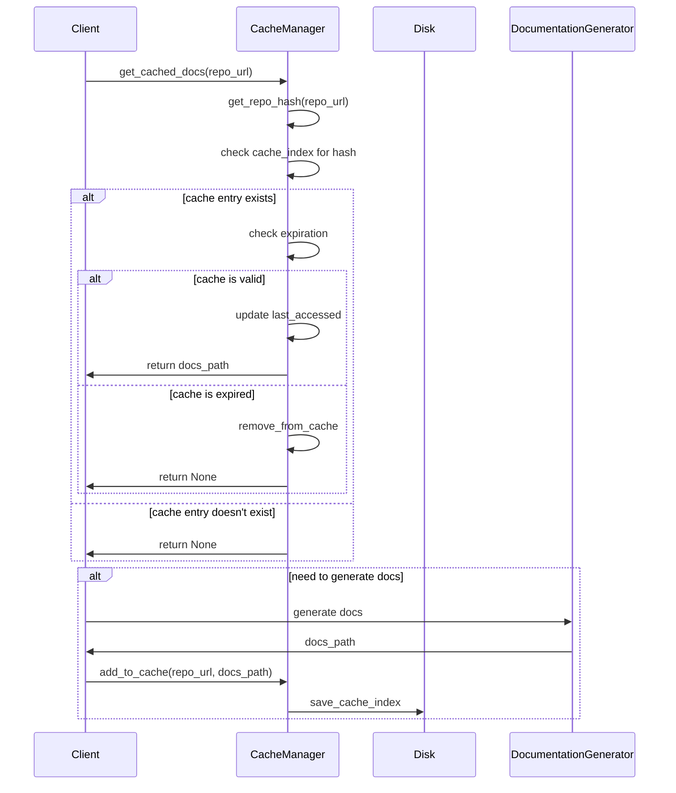

# Caching System Module Documentation

## Overview

The caching_system module is a critical component of the CodeWiki web application that manages the caching of generated documentation for repositories. It provides efficient storage and retrieval mechanisms to avoid redundant documentation generation for the same repository, significantly improving performance and reducing computational overhead.

The module consists of two main components:
- **CacheManager**: The primary service class that handles cache operations
- **CacheEntry**: The data model representing individual cache entries

## Architecture

## Core Components

### CacheManager

The `CacheManager` class is the primary service responsible for managing the documentation cache. It handles all cache operations including storage, retrieval, and maintenance.

#### Key Features:
- **Hash-based indexing**: Uses SHA-256 hashes of repository URLs for efficient key generation
- **Automatic expiration**: Implements time-based cache invalidation
- **Persistent storage**: Maintains cache index on disk for persistence across application restarts
- **Last-accessed tracking**: Updates access timestamps to support potential future LRU eviction policies

#### Methods:

**`__init__(cache_dir: str = None, cache_expiry_days: int = None)`**
- Initializes the cache manager with specified directory and expiry settings
- Creates cache directory if it doesn't exist
- Loads existing cache index from disk

**`load_cache_index()`**
- Loads the cache index from `cache_index.json` file
- Recreates `CacheEntry` objects from stored JSON data
- Handles errors gracefully if index file is corrupted

**`save_cache_index()`**
- Persists the current cache index to `cache_index.json` file
- Serializes `CacheEntry` objects to JSON-compatible format
- Handles errors during save operations

**`get_repo_hash(repo_url: str) -> str`**
- Generates a 16-character SHA-256 hash of the repository URL
- Provides consistent key generation for cache lookups

**`get_cached_docs(repo_url: str) -> Optional[str]`**
- Retrieves cached documentation path if available and valid
- Checks cache expiration before returning results
- Updates last accessed timestamp when returning valid cache
- Removes expired entries automatically

**`add_to_cache(repo_url: str, docs_path: str)`**
- Adds a new documentation path to the cache
- Creates a new `CacheEntry` with current timestamps
- Persists the updated cache index

**`remove_from_cache(repo_url: str)`**
- Removes a specific repository from the cache
- Updates the cache index file

**`cleanup_expired_cache()`**
- Removes all expired cache entries based on expiry configuration
- Useful for periodic maintenance tasks

### CacheEntry

The `CacheEntry` dataclass represents a single cached documentation result with metadata.

#### Properties:
- `repo_url`: The original repository URL
- `repo_url_hash`: The hashed version of the repository URL used as cache key
- `docs_path`: File system path to the cached documentation
- `created_at`: Timestamp when the cache entry was created
- `last_accessed`: Timestamp of the last access to this cache entry

## Data Flow

## Integration with Other Modules

The caching_system module integrates with several other modules in the CodeWiki application:

- **[web_routing](web_routing.md)**: The cache manager is used by web routes to check for existing documentation before initiating generation
- **[job_management](job_management.md)**: Cache results are associated with job status tracking
- **[core_utils](core_utils.md)**: Uses the FileManager utility for JSON persistence operations
- **[core_config](core_config.md)**: Reads cache configuration settings from the global configuration

## Configuration

The cache system uses configuration values from [WebAppConfig](web_routing.md):
- `CACHE_DIR`: Directory where cache files are stored
- `CACHE_EXPIRY_DAYS`: Number of days before cache entries expire

## Error Handling

The caching system implements robust error handling:
- Graceful degradation when cache index files are corrupted
- Error logging for cache persistence operations
- Automatic cleanup of invalid cache entries

## Performance Considerations

- Hash-based lookups provide O(1) average time complexity
- In-memory cache index for fast access
- Automatic cleanup prevents unbounded growth
- File system operations are batched through index persistence

## Security Considerations

- Repository URLs are hashed to prevent information disclosure
- Cache directory is configurable to allow proper access controls
- No sensitive information is stored in cache entries

## Future Enhancements

Potential improvements to the caching system could include:
- LRU (Least Recently Used) eviction policies
- Cache size limits with automatic cleanup
- Distributed caching support
- Compression of cached documentation