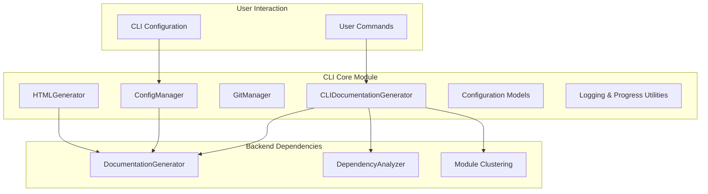

# CLI Core Module Documentation

## Overview

The `cli_core` module provides the command-line interface functionality for CodeWiki, a documentation generation tool that creates comprehensive documentation for code repositories. This module serves as the bridge between the user-facing CLI and the backend documentation generation system, handling configuration management, git operations, progress tracking, and HTML generation for GitHub Pages.

## Architecture Overview

## Core Components

### CLIDocumentationGenerator
The main adapter class that wraps the backend documentation generator and provides CLI-specific functionality like progress reporting. It manages the entire documentation generation workflow from dependency analysis to final output.

### ConfigManager
Handles secure storage and retrieval of user configuration, including API keys stored in the system keyring and other settings stored in JSON format.

### GitManager
Manages git operations for documentation generation, including branch creation, status checking, and committing documentation changes.

### HTMLGenerator
Generates static HTML documentation viewers for GitHub Pages, creating self-contained documentation sites.

### Configuration Models
Data models for managing configuration settings, job definitions, and generation options.

## Sub-Module Documentation

For detailed information about specific components, see the following documentation files:

- [Configuration Management](config_management.md) - Detailed documentation on configuration handling and keyring integration
- [Git Operations](git_operations.md) - Comprehensive guide to git management features
- [HTML Generation](html_generation.md) - In-depth documentation on HTML viewer generation
- [Job Models](job_models.md) - Detailed information about job data models and status tracking
- [Progress Tracking](progress_tracking.md) - Documentation on progress indicators and user feedback systems
- [Logging Utilities](logging_utils.md) - Information about CLI logging with colored output

## Integration with Other Modules

The CLI Core module integrates with several other modules in the CodeWiki system:

- **[dependency_analyzer.md](dependency_analyzer.md)**: Used for analyzing code dependencies and building call graphs
- **[documentation_generator.md](documentation_generator.md)**: The backend system that performs actual documentation generation
- **[core_config.md](core_config.md)**: Configuration system that bridges CLI and backend settings
- **[core_utils.md](core_utils.md)**: File management utilities used throughout the documentation process

## Key Features

1. **Secure Configuration Management**: API keys are stored in system keyring for security
2. **Progress Tracking**: Real-time progress indicators with ETA estimation
3. **Git Integration**: Automated branch creation and documentation commit workflows
4. **GitHub Pages Support**: HTML generation for hosting documentation on GitHub Pages
5. **Modular Architecture**: Clean separation of concerns with dedicated components for each function
6. **Error Handling**: Comprehensive error reporting and recovery mechanisms

## Workflow

The typical workflow for documentation generation involves:

1. Loading user configuration from secure storage
2. Analyzing repository dependencies using the backend analyzer
3. Clustering modules using LLM-based algorithms
4. Generating documentation for each module
5. Creating HTML viewer for GitHub Pages (optional)
6. Committing changes to git repository (optional)

This architecture ensures a smooth user experience while maintaining security and providing comprehensive documentation generation capabilities.