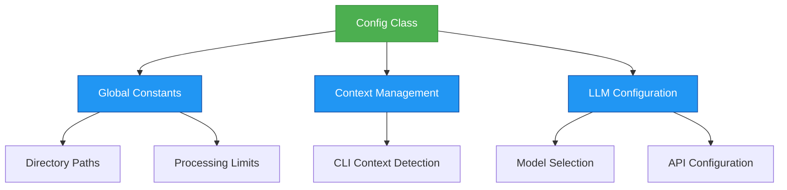
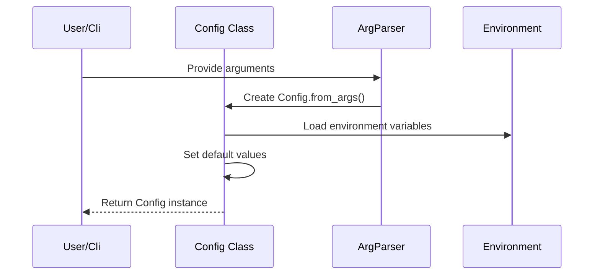
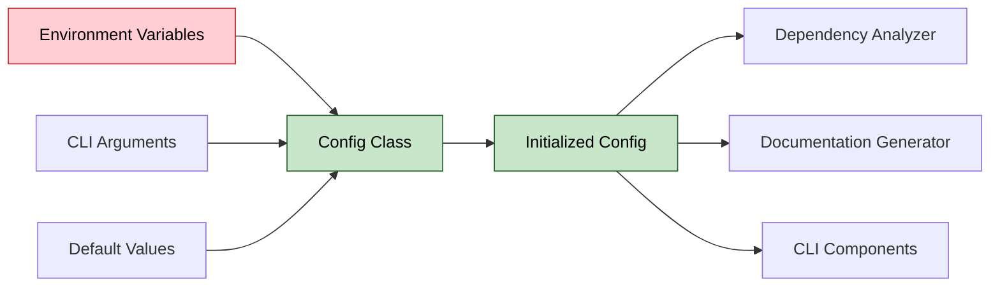

# Core Configuration Module (core_config)

## Introduction

The `core_config` module provides the foundational configuration system for CodeWiki. It defines global constants, configuration classes, and context management utilities that are used throughout the application. This module serves as the central point for managing application settings, LLM configurations, and CLI vs web application context detection.

## Architecture Overview



## Core Components

### Config Dataclass

The `Config` dataclass is the primary configuration container that holds all application settings:

- **repo_path**: Path to the repository being analyzed
- **output_dir**: Base directory for output files
- **dependency_graph_dir**: Directory for storing dependency graphs
- **docs_dir**: Directory for generated documentation
- **max_depth**: Maximum depth for module tree analysis
- **llm_base_url**: Base URL for LLM API calls
- **llm_api_key**: API key for LLM services
- **main_model**: Primary LLM model for processing
- **cluster_model**: Model used for clustering operations
- **fallback_model**: Fallback model when primary fails

### Global Constants

The module defines several important constants:

- **OUTPUT_BASE_DIR**: Base directory for all output ('output')
- **DEPENDENCY_GRAPHS_DIR**: Subdirectory for dependency graphs ('dependency_graphs')
- **DOCS_DIR**: Subdirectory for documentation ('docs')
- **FIRST_MODULE_TREE_FILENAME**: Filename for initial module tree ('first_module_tree.json')
- **MODULE_TREE_FILENAME**: Filename for processed module tree ('module_tree.json')
- **OVERVIEW_FILENAME**: Filename for overview documentation ('overview.md')
- **MAX_DEPTH**: Maximum depth for module analysis (2)
- **MAX_TOKEN_PER_MODULE**: Token limit per module (36,369)
- **MAX_TOKEN_PER_LEAF_MODULE**: Token limit per leaf module (16,000)

### Context Management

The module provides utilities to detect and manage the application context:

- **set_cli_context(enabled)**: Sets whether the application is running in CLI mode
- **is_cli_context()**: Checks if currently in CLI context
- **_CLI_CONTEXT**: Internal flag tracking the current context

### LLM Configuration

Default LLM settings are defined as global variables:

- **MAIN_MODEL**: Primary model ('claude-sonnet-4')
- **FALLBACK_MODEL_1**: First fallback model ('glm-4p5')
- **CLUSTER_MODEL**: Clustering model (defaults to MAIN_MODEL)
- **LLM_BASE_URL**: API endpoint ('http://0.0.0.0:4000/')
- **LLM_API_KEY**: Authentication key ('sk-1234')

## Component Interactions



## Usage Patterns

### From Command Line Arguments

The `from_args` class method creates a configuration instance from parsed command-line arguments:

```python
config = Config.from_args(parsed_args)
```

This method automatically:
- Sanitizes the repository name for directory creation
- Sets up the output directory structure
- Loads LLM configuration from environment variables

### From CLI Context

The `from_cli` class method creates a configuration specifically for CLI usage:

```python
config = Config.from_cli(
    repo_path="/path/to/repo",
    output_dir="/output/dir",
    llm_base_url="http://api.example.com",
    llm_api_key="api-key",
    main_model="model-name",
    cluster_model="cluster-model",
    fallback_model="fallback-model"
)
```

## Dependencies and Integration

The core_config module integrates with several other modules:

- **[cli_core](cli_core.md)**: Uses configuration for CLI operations and job management
- **[dependency_analyzer](dependency_analyzer.md)**: Provides configuration for analysis depth and output paths
- **[documentation_generator](documentation_generator.md)**: Supplies directory paths and LLM settings for documentation generation
- **[web_frontend](web_frontend.md)**: Provides web application configuration and context detection

## Data Flow



## Context Detection

The module handles different execution contexts:

- **CLI Context**: When running from command line, configuration may be loaded from `~/.codewiki/config.json` and keyring
- **Web App Context**: When running as web application, configuration is loaded from environment variables

## Error Handling and Validation

The configuration system includes basic validation through:
- Path normalization for repository paths
- Sanitization of repository names for directory creation
- Default fallback values for all configuration parameters

## Integration Points

This configuration module serves as the foundation for:

- **[dependency_analyzer](dependency_analyzer.md)**: Provides analysis parameters and output paths
- **[documentation_generator](documentation_generator.md)**: Supplies LLM settings and output directories
- **[cli_core](cli_core.md)**: Manages CLI-specific configuration and job parameters
- **[web_frontend](web_frontend.md)**: Provides web application settings and context detection

## Best Practices

1. Always use the provided class methods (`from_args`, `from_cli`) to create Config instances
2. Set the CLI context appropriately using `set_cli_context()` when initializing the application
3. Leverage environment variables for sensitive configuration like API keys
4. Use the global constants for consistent directory and file naming conventions

## Security Considerations

- API keys are loaded from environment variables to avoid hardcoding
- The configuration system supports both CLI and web contexts with different security models
- Default API keys should be changed in production environments