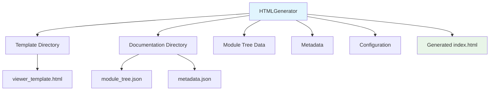
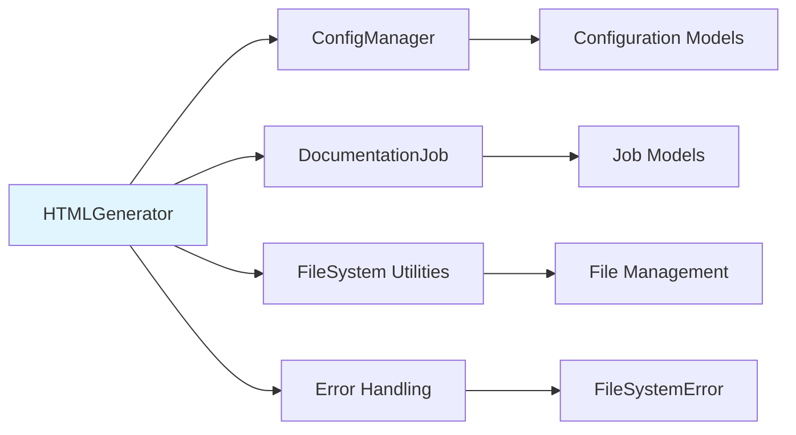
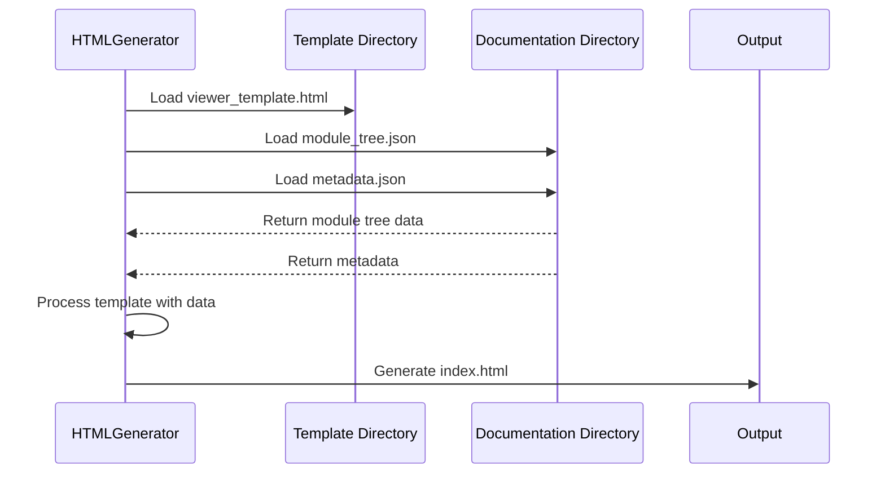

# HTML Generation Module Documentation

## Overview

The HTML Generation module (`html_generation`) is responsible for creating static HTML documentation viewers for GitHub Pages. It generates a self-contained `index.html` file with embedded styles, scripts, and configuration for client-side markdown rendering. This module serves as the final output component in the documentation generation pipeline, transforming processed documentation data into a user-friendly web interface.

## Architecture

## Core Components

### HTMLGenerator

The primary class in this module is `HTMLGenerator`, which handles the creation of static HTML documentation viewers. Key responsibilities include:

- Loading module tree and metadata from documentation directories
- Processing HTML templates with dynamic content
- Generating self-contained HTML files for GitHub Pages
- Detecting repository information from git

## Dependencies and Relationships

## Data Flow

## Component Interactions

The HTML Generation module interacts with several other modules in the system:

- **Config Management**: Uses configuration data from [config_management](config_management.md) to customize the generated HTML
- **Job Models**: Works with [job_models](job_models.md) to understand documentation generation parameters
- **File System Utilities**: Leverages [core_utils](core_utils.md) for safe file operations
- **Git Operations**: May use [git_operations](git_operations.md) to detect repository information

## Key Features

### Template Processing
The module uses a template-based approach to generate HTML, with placeholders that are replaced with actual data during generation:

- `{{TITLE}}`: Documentation title
- `{{REPO_LINK}}`: Link to the source repository
- `{{SHOW_INFO}}`: Visibility setting for info section
- `{{INFO_CONTENT}}`: Repository information content
- `{{CONFIG_JSON}}`: Embedded configuration data
- `{{MODULE_TREE_JSON}}`: Module tree structure
- `{{METADATA_JSON}}`: Metadata information
- `{{DOCS_BASE_PATH}}`: Base path for documentation links

### Repository Information Detection
The module can automatically detect repository information from git, including:
- Repository name
- GitHub URL
- GitHub Pages URL

### Safe File Operations
All file operations use safe read/write utilities to prevent file system errors and ensure data integrity.

## Integration Points

The HTML Generation module integrates with the broader system through:

1. **Documentation Generation Pipeline**: Receives processed documentation data from [documentation_generator](documentation_generator.md)
2. **CLI Core**: Part of the [cli_core](cli_core.md) module structure
3. **Template System**: Works with template files stored in the package directory

## Error Handling

The module implements comprehensive error handling for:
- Missing template files
- Invalid JSON data
- File system operations
- Git repository access issues

## Usage Context

This module is typically used in the final stage of documentation generation, after:
1. Repository analysis by [dependency_analyzer](dependency_analyzer.md)
2. Documentation generation by [documentation_generator](documentation_generator.md)
3. Processing of module trees and metadata

The generated HTML files are designed to be deployed to GitHub Pages for public viewing of repository documentation.