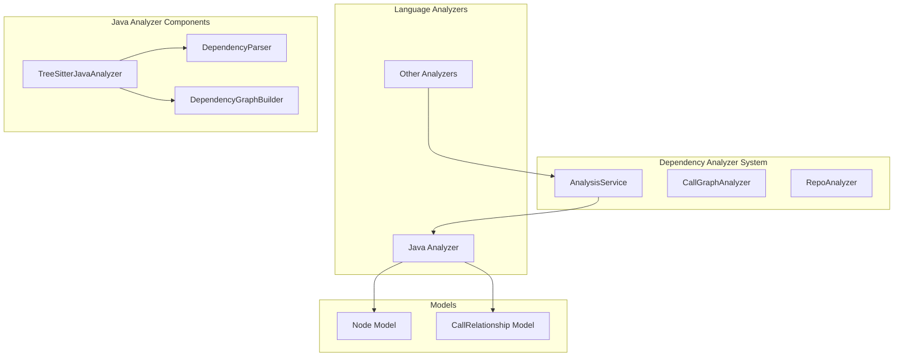
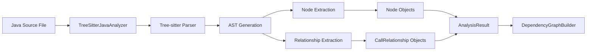

# Java Analyzer Module

## Overview

The Java Analyzer module (`TreeSitterJavaAnalyzer`) is a specialized component within the dependency_analyzer system that provides static analysis capabilities for Java source code files. It leverages the Tree-sitter parsing library with Java-specific grammar to extract structural information, identify code components, and map relationships between different elements in Java code.

This module is part of the broader language_analyzers subsystem and works in conjunction with other language-specific analyzers to provide comprehensive multi-language code analysis capabilities.

## Architecture



## Core Components

### TreeSitterJavaAnalyzer

The main class responsible for analyzing Java source code files. It implements the following key functionalities:

- **File Analysis**: Parses Java source code using Tree-sitter parser
- **Node Extraction**: Identifies and extracts various Java language constructs
- **Relationship Mapping**: Maps dependencies and relationships between code elements
- **Path Resolution**: Handles module path and relative path calculations

#### Key Methods

- `_analyze()`: Main analysis entry point that orchestrates parsing and extraction
- `_extract_nodes()`: Identifies and creates Node objects for Java constructs
- `_extract_relationships()`: Maps relationships between different code elements
- `_get_component_id()`: Generates unique identifiers for code components

## Functionality

### Supported Java Constructs

The analyzer identifies and processes the following Java language constructs:

- **Classes**: Regular and abstract classes
- **Interfaces**: Interface declarations
- **Enums**: Enumeration types
- **Records**: Java record types (Java 14+)
- **Annotations**: Annotation type declarations
- **Methods**: Method declarations within classes

### Relationship Types

The analyzer maps several types of relationships between Java code elements:

1. **Inheritance**: Class extends another class
2. **Interface Implementation**: Class/enum/record implements interface
3. **Field Type Use**: Class has field of another class/interface type
4. **Method Calls**: Method invocations on objects
5. **Object Creation**: Instantiation of classes using new operator

### Path Handling

The analyzer provides utilities for:
- Calculating module paths from file paths
- Determining relative paths from repository root
- Generating component IDs based on package structure

## Data Flow



## Integration Points

### With Analysis Engine
The Java Analyzer integrates with the [analysis_engine](analysis_engine.md) through the AnalysisService, which coordinates analysis across multiple files and languages.

### With Dependency Graph Builder
Extracted nodes and relationships are passed to the [dependency_graph_builder](dependency_graph_builder.md) to construct comprehensive dependency graphs.

### With Core Models
The analyzer produces [Node](core_models.md) and [CallRelationship](core_models.md) objects that conform to the system's core data models.

## Usage Context

The Java Analyzer is typically invoked by the [RepoAnalyzer](repo_analyzer.md) when processing Java repositories. It works alongside other language analyzers in the [language_analyzers](language_analyzers.md) module to provide multi-language support.

## Dependencies

- **tree_sitter**: Parsing library for creating ASTs
- **tree_sitter_java**: Java-specific Tree-sitter grammar
- **[Node Model](core_models.md)**: For representing code components
- **[CallRelationship Model](core_models.md)**: For representing dependencies
- **[Analysis Models](analysis_models.md)**: For analysis results

## Key Features

1. **Multi-Construct Support**: Handles all major Java language constructs
2. **Relationship Mapping**: Comprehensive dependency tracking
3. **Path Resolution**: Proper handling of Java package structures
4. **Type Resolution**: Identification of primitive vs. custom types
5. **Variable Type Inference**: Basic type inference for local variables

## Limitations

- Limited type inference for complex scenarios
- May not resolve types across complex import structures
- Basic handling of generic types
- No runtime behavior analysis

## Example Usage

The analyzer is typically used through the `analyze_java_file` function which returns a tuple of extracted nodes and relationships:

```python
nodes, relationships = analyze_java_file(file_path, content, repo_path)
```

This integration allows the system to build comprehensive dependency graphs that span multiple Java files and understand the relationships between different components in a Java codebase.