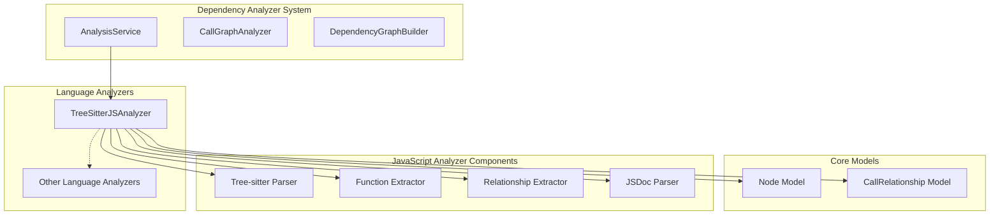
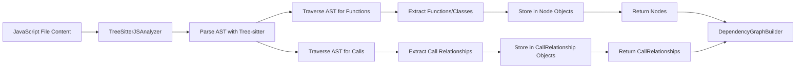
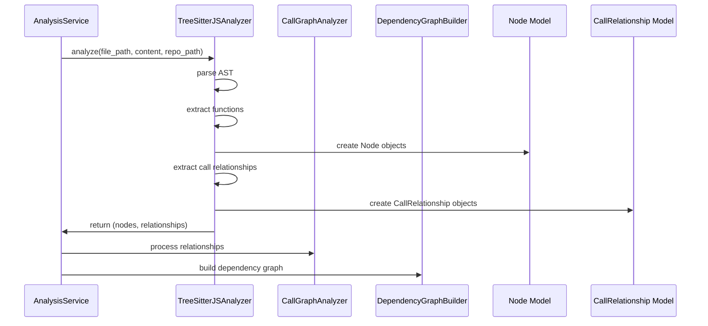

# JavaScript Analyzer Module Documentation

## Introduction

The JavaScript Analyzer module (`TreeSitterJSAnalyzer`) is a specialized component within the dependency analyzer system that provides static analysis capabilities for JavaScript and related files (JSX, TypeScript, etc.). This module leverages Tree-sitter parsing technology to extract function declarations, class definitions, method calls, and dependency relationships from JavaScript source code.

The analyzer is part of the broader language analyzer family that includes support for multiple programming languages, and it integrates with the core dependency analysis engine to build comprehensive call graphs and dependency relationships.

## Architecture Overview



## Core Components

### TreeSitterJSAnalyzer Class

The main component of this module is the `TreeSitterJSAnalyzer` class, which provides the following key capabilities:

- **File Analysis**: Parses JavaScript files using Tree-sitter
- **Function Extraction**: Identifies and extracts function declarations, arrow functions, and method definitions
- **Class Analysis**: Extracts class declarations, abstract classes, and interfaces
- **Call Relationship Detection**: Identifies function calls and method invocations
- **JSDoc Type Dependencies**: Extracts type dependencies from JSDoc comments
- **Inheritance Tracking**: Identifies class inheritance relationships

### Key Methods

- `analyze()`: Main entry point that orchestrates the analysis process
- `_extract_functions()`: Discovers and extracts function and class declarations
- `_extract_call_relationships()`: Identifies function calls and method invocations
- `_parse_jsdoc_types()`: Extracts type dependencies from JSDoc comments

## Data Flow



## Component Interactions



## File Type Support

The JavaScript analyzer supports multiple JavaScript-related file extensions:

- `.js` - Standard JavaScript files
- `.jsx` - JavaScript with JSX syntax
- `.ts` - TypeScript files (with tree-sitter-typescript support)
- `.tsx` - TypeScript with JSX syntax
- `.mjs` - JavaScript modules
- `.cjs` - CommonJS files

## Analysis Process

### 1. Initialization
The analyzer initializes with:
- File path and content
- Repository path (for relative path calculations)
- Tree-sitter JavaScript parser

### 2. AST Parsing
The content is parsed into an Abstract Syntax Tree using Tree-sitter's JavaScript grammar.

### 3. Function/Class Extraction
The analyzer traverses the AST to identify and extract:
- Function declarations (`function myFunc()`)
- Arrow functions (`const myFunc = () =>`)
- Class declarations (`class MyClass`)
- Method definitions (`myMethod() {}`)
- Exported functions (`export function myFunc()`)

### 4. Call Relationship Detection
The analyzer identifies function calls and creates relationships between:
- Callers and callees
- Classes and their base classes
- Functions and their dependencies

### 5. JSDoc Type Analysis
The analyzer parses JSDoc comments to extract type dependencies and relationships.

## Integration with Other Modules

### [dependency_graph_builder.md](dependency_graph_builder.md)
The extracted nodes and relationships are passed to the DependencyGraphBuilder to create comprehensive dependency graphs.

### [analysis_service.md](analysis_service.md)
The analyzer is invoked by the AnalysisService as part of the overall repository analysis process.

### [core_models.md](core_models.md)
The analyzer produces `Node` and `CallRelationship` objects that conform to the core models defined in the system.

### [call_graph_analyzer.md](call_graph_analyzer.md)
The extracted relationships feed into the call graph analysis to build comprehensive call graphs across the codebase.

## Error Handling

The JavaScript analyzer includes robust error handling:
- Parser initialization failures are logged and handled gracefully
- Individual function extraction errors don't halt the entire analysis
- Invalid AST nodes are skipped with appropriate logging
- File processing continues even if specific elements cannot be parsed

## Performance Considerations

- The analyzer uses Tree-sitter for efficient parsing
- Relationships are deduplicated to prevent redundant entries
- Memory usage is optimized by processing files individually
- Logging is configurable to reduce overhead in production

## Configuration and Customization

The analyzer can be configured through:
- Repository path for relative path calculations
- File content for analysis
- Logging levels for debugging

## Dependencies

- `tree_sitter`: Core parsing library
- `tree_sitter_javascript`: JavaScript grammar for Tree-sitter
- `tree_sitter_typescript`: TypeScript grammar (optional)
- Standard Python libraries for file handling and logging

## Usage Examples

The analyzer is typically used as part of the broader dependency analysis system:

```python
from codewiki.src.be.dependency_analyzer.analyzers.javascript import analyze_javascript_file_treesitter

nodes, relationships = analyze_javascript_file_treesitter(
    file_path="path/to/file.js",
    content="function example() { return 'hello'; }",
    repo_path="/path/to/repo"
)
```

## Testing and Validation

The JavaScript analyzer should be tested with:
- Various JavaScript syntax patterns
- Different file types (.js, .jsx, .ts, etc.)
- Complex inheritance hierarchies
- JSDoc comment variations
- Error conditions and malformed code

## Future Enhancements

Potential improvements to the JavaScript analyzer could include:
- Enhanced TypeScript support with type checking
- Import/export dependency analysis
- Module resolution capabilities
- Performance optimizations for large files
- Support for additional JavaScript frameworks and patterns