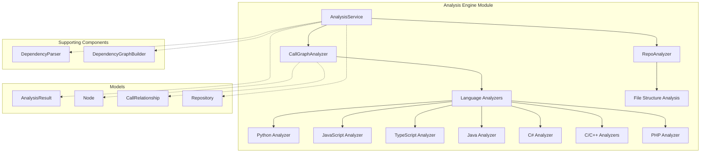

# Analysis Engine Module Documentation

## Overview

The Analysis Engine module is a core component of the dependency_analyzer system that provides comprehensive repository analysis capabilities. It orchestrates the complete analysis workflow including repository cloning, structure analysis, multi-language AST parsing, and call graph generation.

The module supports analysis of multiple programming languages including Python, JavaScript, TypeScript, Java, C#, C, C++, PHP, Go, and Rust. It handles both local repository analysis and remote GitHub repository analysis with full cleanup management.

## Architecture Overview

## Core Components

### AnalysisService
The central orchestrator that manages the complete analysis workflow. It handles repository cloning, structure analysis, call graph generation, and result consolidation with proper cleanup.

**Key Responsibilities:**
- Repository cloning and validation
- File structure analysis with filtering
- Multi-language AST parsing and call graph generation
- Result consolidation and cleanup management
- Local and remote repository analysis

### CallGraphAnalyzer
The multi-language call graph analyzer that coordinates language-specific analyzers to build comprehensive call graphs across different programming languages.

**Key Responsibilities:**
- Analyzing code files across multiple languages
- Building call relationships between functions
- Resolving function call relationships
- Generating visualization data for graph rendering
- Supporting 8+ programming languages

### RepoAnalyzer
Handles repository structure analysis and generates detailed file tree representations with filtering capabilities.

**Key Responsibilities:**
- Building file tree representations
- Filtering files based on include/exclude patterns
- Calculating repository statistics (file count, size)
- Path validation and security checks

## Sub-Modules

For detailed information about specific sub-modules, see:
- [analysis_service.md](analysis_service.md) - Analysis service orchestration
- [call_graph_analyzer.md](call_graph_analyzer.md) - Multi-language call graph analysis
- [repo_analyzer.md](repo_analyzer.md) - Repository structure analysis
- [language_analyzers.md](language_analyzers.md) - Language-specific analyzers
- [ast_and_parsing.md](ast_and_parsing.md) - AST parsing components
- [dependency_graph_builder.md](dependency_graph_builder.md) - Dependency graph construction
- [analysis_models.md](analysis_models.md) - Analysis data models
- [core_models.md](core_models.md) - Core data models

## Integration Points

The Analysis Engine module integrates with other system components:

- **[dependency_analyzer.md](dependency_analyzer.md)** - Parent module providing overall dependency analysis capabilities
- **[core_utils.md](core_utils.md)** - Utilizes file management utilities
- **[core_config.md](core_config.md)** - Configuration management

## Usage Patterns

The module provides both high-level and granular analysis capabilities:

1. **Full Repository Analysis** - Complete analysis including call graphs
2. **Structure-Only Analysis** - Lightweight file structure analysis
3. **Local Repository Analysis** - Analysis of local codebases
4. **Multi-Language Support** - Simultaneous analysis of mixed-language repositories

## Security Considerations

- Path validation to prevent directory traversal attacks
- Safe file reading with security checks
- Repository cleanup after analysis completion
- Symlink and escaped path rejection in file tree building

## Error Handling

The module implements comprehensive error handling with:
- Graceful failure recovery
- Proper cleanup on exceptions
- Detailed logging for debugging
- Validation of repository URLs and paths