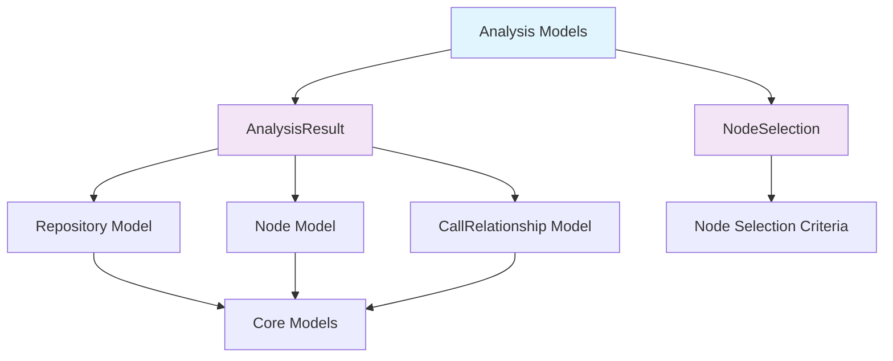
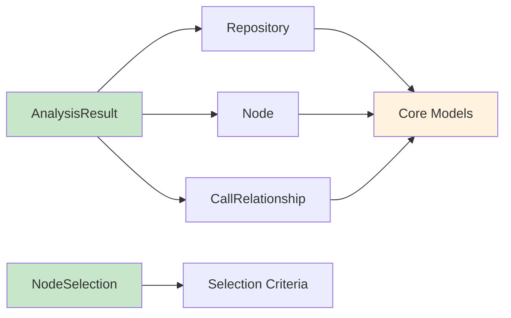
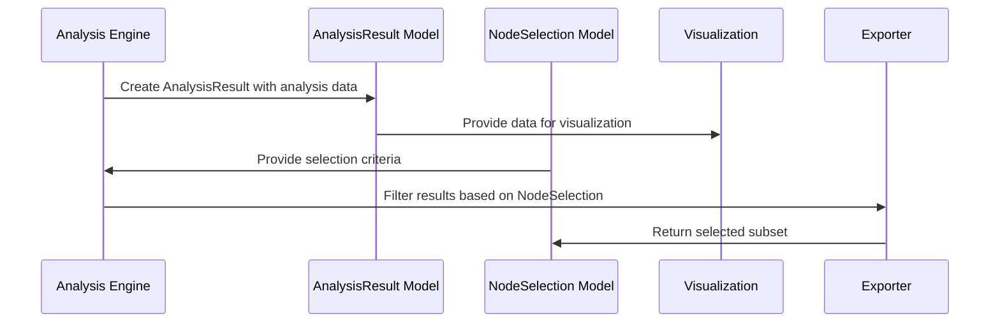

# Analysis Models Module Documentation

## Introduction

The `analysis_models` module is part of the dependency analyzer component in the CodeWiki system. This module provides Pydantic data models that represent the results of code analysis and node selection operations. These models serve as the structured data format for storing and transferring analysis results between different components of the system.

## Module Overview

The analysis_models module contains two core data models:
- `AnalysisResult`: Represents the complete result of analyzing a repository
- `NodeSelection`: Represents selected nodes for partial export operations

These models are used throughout the dependency analysis pipeline to maintain consistent data structures for analysis results and node selection criteria.

## Architecture



## Core Components

### AnalysisResult Model

The `AnalysisResult` model represents the complete result of analyzing a repository. It contains all the essential information gathered during the analysis process.

#### Attributes:
- `repository`: Repository object containing metadata about the analyzed repository
- `functions`: List of Node objects representing functions found in the codebase
- `relationships`: List of CallRelationship objects representing function call relationships
- `file_tree`: Dictionary containing the file structure of the repository
- `summary`: Dictionary containing summary statistics about the analysis
- `visualization`: Dictionary containing visualization data (default: empty dict)
- `readme_content`: Optional string containing README content (default: None)

#### Usage:
This model is used by the [analysis_service](analysis_service.md) to return complete analysis results and by the [dependency_graph_builder](dependency_graph_builder.md) to store the final analysis output.

### NodeSelection Model

The `NodeSelection` model represents selected nodes for partial export operations. It allows users to specify which nodes should be included in a partial analysis result.

#### Attributes:
- `selected_nodes`: List of strings representing node identifiers to be selected (default: empty list)
- `include_relationships`: Boolean indicating whether to include relationships in the export (default: True)
- `custom_names`: Dictionary mapping node identifiers to custom names for export (default: empty dict)

#### Usage:
This model is used when users want to export only specific parts of the analysis result, allowing for focused analysis of particular components.

## Component Relationships



## Data Flow



## Integration with Other Modules

The analysis_models module integrates with several other modules in the system:

- **[core_models](core_models.md)**: The AnalysisResult model depends on Repository, Node, and CallRelationship models from the core_models module
- **[analysis_service](analysis_service.md)**: Uses AnalysisResult to return analysis results
- **[dependency_graph_builder](dependency_graph_builder.md)**: Produces AnalysisResult objects as final output
- **[documentation_generator](documentation_generator.md)**: May use AnalysisResult data to generate documentation

## Usage Examples

### Creating an AnalysisResult
```python
from codewiki.src.be.dependency_analyzer.models.analysis import AnalysisResult
from codewiki.src.be.dependency_analyzer.models.core import Repository

# Create a repository object
repo = Repository(name="example-repo", path="/path/to/repo")

# Create an analysis result
result = AnalysisResult(
    repository=repo,
    functions=[],
    relationships=[],
    file_tree={},
    summary={}
)
```

### Creating a NodeSelection
```python
from codewiki.src.be.dependency_analyzer.models.analysis import NodeSelection

# Create a node selection for partial export
selection = NodeSelection(
    selected_nodes=["function1", "function2"],
    include_relationships=True,
    custom_names={"function1": "MyFunction1"}
)
```

## Dependencies

The analysis_models module has the following dependencies:

- **Pydantic**: Used for BaseModel and validation
- **[core_models](core_models.md)**: Provides Repository, Node, and CallRelationship models
- **Typing**: Standard library for type hints

## Error Handling

The models use Pydantic's built-in validation to ensure data integrity. When creating instances of these models, Pydantic will validate the input data and raise validation errors if the data doesn't match the expected structure.

## Testing Considerations

When testing components that use these models, consider:

- Validating that AnalysisResult objects contain all required fields
- Testing NodeSelection with various combinations of selected nodes and relationship inclusion
- Ensuring proper serialization and deserialization of model instances
- Verifying that optional fields are handled correctly

## Future Enhancements

Potential improvements to the analysis_models module could include:

- Adding more detailed validation rules for specific fields
- Implementing custom serialization methods for complex data structures
- Adding methods to merge or compare AnalysisResult objects
- Enhancing NodeSelection with more sophisticated filtering options