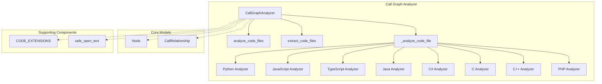
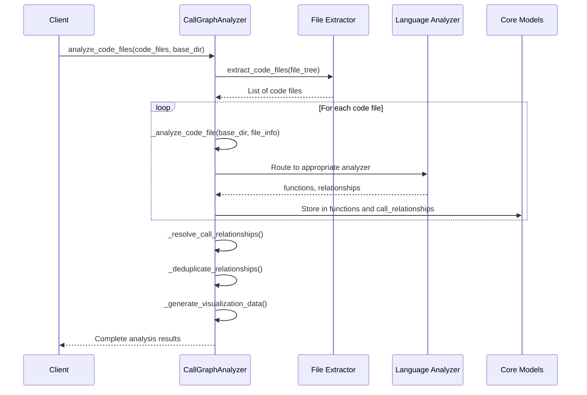
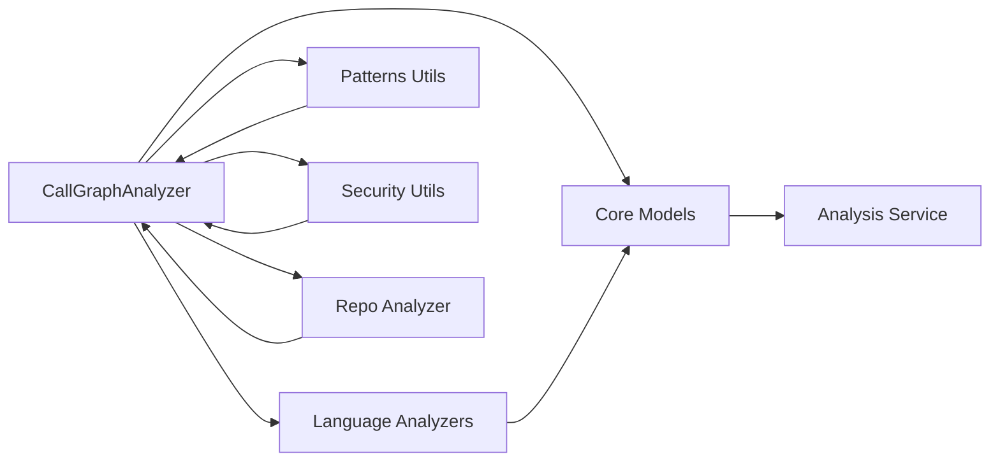

# Call Graph Analyzer Module

## Overview

The Call Graph Analyzer module is a central orchestrator for multi-language call graph analysis within the dependency analyzer system. It coordinates language-specific analyzers to build comprehensive call graphs across different programming languages in a repository, providing insights into function relationships and code structure.

The module serves as the primary entry point for analyzing codebases and extracting function definitions, method calls, and their interdependencies. It supports multiple programming languages including Python, JavaScript, TypeScript, Java, C#, C, C++, and PHP.

## Architecture



## Core Components

### CallGraphAnalyzer

The main class responsible for orchestrating the call graph analysis process. It manages the analysis of multiple code files across different programming languages and builds comprehensive call graphs.

#### Key Properties
- `functions`: Dictionary mapping function IDs to Node objects
- `call_relationships`: List of CallRelationship objects representing function calls

#### Key Methods

**`analyze_code_files(code_files: List[Dict], base_dir: str) -> Dict`**
- Performs complete analysis of all code files
- Extracts functions and relationships
- Builds complete call graph
- Returns comprehensive analysis results

**`extract_code_files(file_tree: Dict) -> List[Dict]`**
- Extracts code files from file tree structure
- Filters based on supported extensions
- Excludes test/config files

**`_analyze_code_file(repo_dir: str, file_info: Dict)`**
- Analyzes a single code file based on its language
- Routes to appropriate language-specific analyzer

**`_resolve_call_relationships()`**
- Resolves function call relationships across all languages
- Matches function calls to actual function definitions

**`_deduplicate_relationships()`**
- Removes duplicate call relationships
- Preserves first occurrence of each caller-callee pair

**`_generate_visualization_data()`**
- Creates Cytoscape.js compatible graph data
- Generates nodes and edges for visualization

## Data Flow



## Language Support

The Call Graph Analyzer supports multiple programming languages through dedicated analyzers:

### Python Analysis
- Uses AST parsing to extract function definitions and calls
- Handles classes, methods, and top-level functions
- Resolves function calls within the same file scope
- [See python_analyzer module](python_analyzer.md) for details

### JavaScript/TypeScript Analysis
- Uses Tree-sitter for efficient parsing
- Extracts functions, methods, and class definitions
- Handles arrow functions and various declaration patterns
- [See javascript_analyzer module](javascript_analyzer.md) for details

### Java Analysis
- Extracts classes, methods, and interfaces
- Handles inheritance relationships
- Resolves method calls and dependencies
- [See java_analyzer module](java_analyzer.md) for details

### C/C++ Analysis
- Uses Tree-sitter for parsing C/C++ code
- Extracts functions, classes, and method definitions
- Handles function pointers and complex call patterns
- [See c_analyzer module](c_analyzer.md) for details

### C# Analysis
- Extracts classes, methods, and interfaces
- Handles .NET-specific patterns and dependencies
- Resolves method calls and inheritance relationships
- [See csharp_analyzer module](csharp_analyzer.md) for details

### PHP Analysis
- Extracts functions, classes, and method definitions
- Handles namespace resolution and class relationships
- Resolves function calls and method invocations
- [See php_analyzer module](php_analyzer.md) for details

## Component Interactions



## Integration with Other Modules

### Analysis Service
The CallGraphAnalyzer integrates with the [Analysis Service](analysis_service.md) to provide comprehensive analysis capabilities. The Analysis Service orchestrates the overall analysis process and uses the CallGraphAnalyzer for call graph extraction.

### Repo Analyzer
The [Repo Analyzer](repo_analyzer.md) uses the CallGraphAnalyzer to analyze repository structures and extract call graphs from the codebase. It provides the file tree and code file information needed by the CallGraphAnalyzer.

### Dependency Graph Builder
The results from the CallGraphAnalyzer feed into the [Dependency Graph Builder](dependency_graph_builder.md) to create comprehensive dependency graphs that include call relationships.

## Data Models

### Node Model
The [Node model](core_models.md) represents functions, methods, classes, and other code elements extracted during analysis. Each node contains information about the element's name, location, parameters, and other metadata.

### CallRelationship Model
The [CallRelationship model](core_models.md) represents function calls between different code elements. It contains information about the caller, callee, and call location.

## Security Considerations

The CallGraphAnalyzer uses the `safe_open_text` utility from the security module to safely read code files, preventing path traversal vulnerabilities when analyzing repository files.

## Performance Characteristics

- **File Processing**: Processes files sequentially, with language-specific analysis times
- **Memory Usage**: Maintains function and relationship data in memory during analysis
- **Scalability**: Performance scales with codebase size and complexity
- **Deduplication**: Reduces noise by removing duplicate relationships

## Error Handling

The CallGraphAnalyzer implements comprehensive error handling:
- Catches and logs parsing errors for individual files
- Continues analysis when individual files fail
- Provides detailed error information for debugging
- Gracefully handles unsupported languages

## Visualization Output

The module generates Cytoscape.js compatible visualization data:
- **Nodes**: Function and method representations with language-specific styling
- **Edges**: Call relationships between functions
- **Classes**: Language-specific CSS classes for visual differentiation
- **Summary**: Statistics about the analyzed codebase

## Usage Examples

The CallGraphAnalyzer is typically used as part of the broader analysis pipeline:

```python
from codewiki.src.be.dependency_analyzer.analysis.call_graph_analyzer import CallGraphAnalyzer

analyzer = CallGraphAnalyzer()
results = analyzer.analyze_code_files(code_files, base_directory)
# Results include functions, relationships, and visualization data
```

## Configuration

The analyzer uses the [CODE_EXTENSIONS](patterns.md) mapping from the patterns module to identify supported file types and route them to appropriate language analyzers.

## Dependencies

- [Core Models](core_models.md): Node and CallRelationship models
- [Language Analyzers](language_analyzers.md): Python, JavaScript, TypeScript, Java, C#, C, C++, PHP analyzers
- [Patterns Utils](patterns.md): File extension mappings and analysis patterns
- [Security Utils](security.md): Safe file reading utilities
- [Analysis Service](analysis_service.md): Orchestration layer
- [Repo Analyzer](repo_analyzer.md): Repository structure analysis