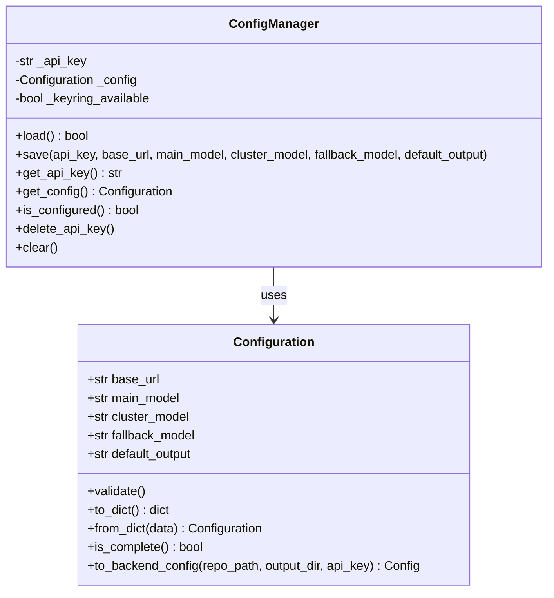
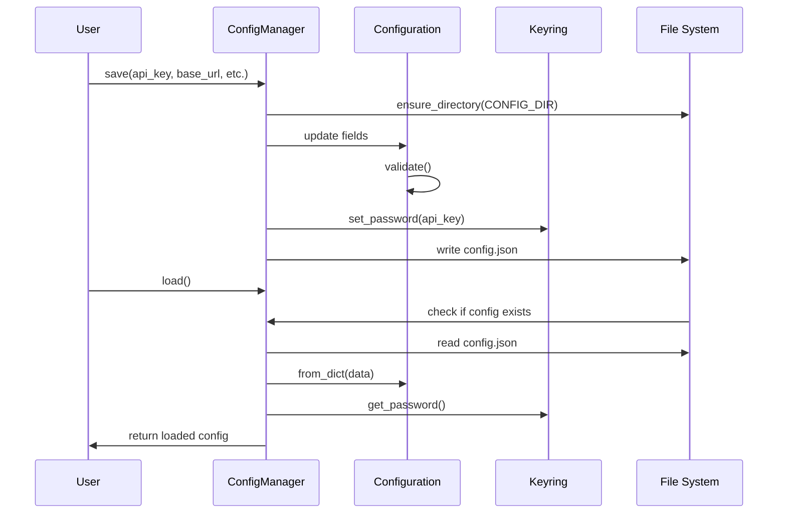

# Config Management Module

## Overview

The config_management module handles the storage, retrieval, and management of user configuration settings for CodeWiki CLI. It provides secure storage for sensitive credentials like API keys using system keyring services, while storing non-sensitive configuration in a local JSON file.

## Architecture

The module consists of two main components that work together to provide a complete configuration management solution:



## Components

### ConfigManager

The `ConfigManager` class is the primary interface for configuration management. It handles:

- Loading and saving configuration from/to persistent storage
- Secure API key storage using system keyring
- Validation of configuration settings
- Checking configuration completeness

#### Key Features:
- **Secure Storage**: API keys are stored in the system keyring (macOS Keychain, Windows Credential Manager, Linux Secret Service)
- **Persistent Storage**: Non-sensitive settings are stored in `~/.codewiki/config.json`
- **Validation**: Ensures configuration values are valid before saving
- **Migration Ready**: Versioned configuration supports future schema changes

#### Storage Locations:
- API Key: System keyring service
- Configuration File: `~/.codewiki/config.json`

### Configuration

The `Configuration` class is a data model that represents the user's persistent settings. It includes:

- LLM API configuration (base URL, model names)
- Default output directory
- Validation methods
- Conversion to backend configuration

## Data Flow



## Dependencies

The config_management module depends on several other modules:

- **[job_models](job_models.md)**: Uses `Configuration` model for persistent settings
- **[core_config](core_config.md)**: `Configuration.to_backend_config()` creates backend `Config` instances
- **[core_utils](core_utils.md)**: Uses file system utilities for safe read/write operations
- **[logging_utils](logging_utils.md)**: Uses error handling and logging utilities

## Integration with System

### CLI Integration
The config_management module integrates with the CLI through the `ConfigManager` which is used by:
- Command-line configuration commands
- Job initialization processes
- API key management utilities

### Backend Integration
The `Configuration.to_backend_config()` method bridges CLI configuration to backend systems by converting persistent user settings to runtime job configuration used by the documentation generation system.

## Security Considerations

- API keys are stored in system keyring rather than plain text files
- Keyring availability is checked at runtime to handle systems without keyring support
- Configuration validation prevents invalid settings from being saved
- Secure file system operations prevent race conditions during config file access

## Error Handling

The module handles several types of errors:
- Keyring unavailability (system keychain issues)
- File system errors (permissions, disk space)
- Configuration validation failures
- JSON parsing errors

## Usage Patterns

### Initialization
```python
config_manager = ConfigManager()
if not config_manager.load():
    # Handle first-time setup
    config_manager.save(api_key="...", base_url="...")
```

### Configuration Check
```python
if config_manager.is_configured():
    # Ready to run documentation generation
    config = config_manager.get_config()
    api_key = config_manager.get_api_key()
else:
    # Prompt user to configure
```

## File Structure

```
~/.codewiki/
├── config.json          # Non-sensitive configuration
└── [keyring service]    # API key storage
```

The configuration file follows this structure:
```json
{
  "version": "1.0",
  "base_url": "https://api.example.com",
  "main_model": "gpt-4",
  "cluster_model": "gpt-3.5-turbo",
  "fallback_model": "glm-4p5",
  "default_output": "docs"
}
```