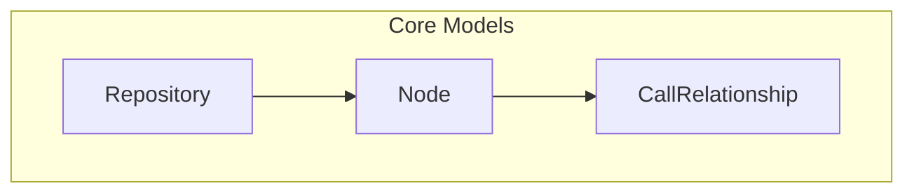
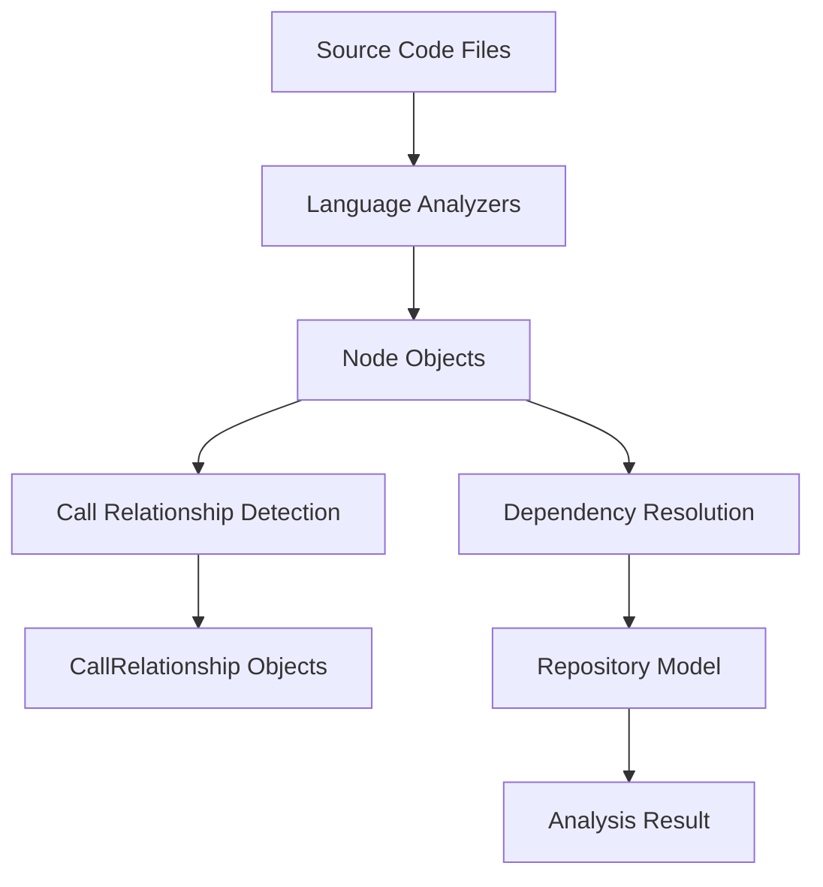
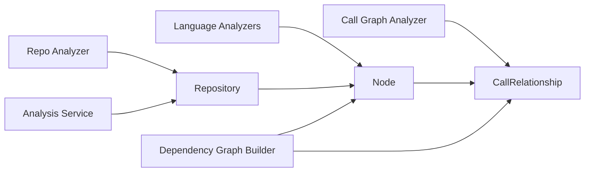

# Core Models Module Documentation

## Introduction

The `core_models` module provides the fundamental data structures used throughout the dependency analyzer system. These Pydantic models define the core entities that represent code components, their relationships, and the repositories they belong to. The models serve as the foundation for all dependency analysis operations and provide a standardized way to represent code structure and relationships.

## Architecture Overview

The core models module consists of three primary data models that work together to represent the codebase structure:

## Component Details

### Node Model

The `Node` model represents individual code components such as functions, classes, methods, or other code entities within the analyzed codebase.

#### Fields

| Field | Type | Description |
|-------|------|-------------|
| `id` | `str` | Unique identifier for the node |
| `name` | `str` | Name of the code component |
| `component_type` | `str` | Type of component (e.g., function, class, method) |
| `file_path` | `str` | Absolute path to the file containing the node |
| `relative_path` | `str` | Relative path from the repository root |
| `depends_on` | `Set[str]` | Set of node IDs that this node depends on |
| `source_code` | `Optional[str]` | The actual source code of the node |
| `start_line` | `int` | Starting line number in the source file |
| `end_line` | `int` | Ending line number in the source file |
| `has_docstring` | `bool` | Whether the node has a docstring |
| `docstring` | `str` | The docstring content |
| `parameters` | `Optional[List[str]]` | List of parameter names for functions/methods |
| `node_type` | `Optional[str]` | Additional type information |
| `base_classes` | `Optional[List[str]]` | List of base classes for class nodes |
| `class_name` | `Optional[str]` | Name of the containing class |
| `display_name` | `Optional[str]` | Name to use for display purposes |
| `component_id` | `Optional[str]` | Additional component identifier |

#### Methods

- `get_display_name()`: Returns the display name if set, otherwise returns the regular name

### CallRelationship Model

The `CallRelationship` model represents the relationship between code components where one calls another.

#### Fields

| Field | Type | Description |
|-------|------|-------------|
| `caller` | `str` | ID of the node that makes the call |
| `callee` | `str` | ID of the node being called |
| `call_line` | `Optional[int]` | Line number where the call occurs |
| `is_resolved` | `bool` | Whether the call relationship has been resolved |

### Repository Model

The `Repository` model represents a code repository being analyzed.

#### Fields

| Field | Type | Description |
|-------|------|-------------|
| `url` | `str` | URL of the repository |
| `name` | `str` | Name of the repository |
| `clone_path` | `str` | Local path where the repository is cloned |
| `analysis_id` | `str` | Unique identifier for the analysis session |

## Data Flow

The core models participate in the following data flow within the dependency analyzer system:

## Component Interactions

The core models interact with various components throughout the system:

## Usage Examples

The core models are used throughout the dependency analyzer system:

- **Language Analyzers** ([language_analyzers.md](language_analyzers.md)): Create `Node` objects from parsed source code
- **Call Graph Analyzer** ([call_graph_analyzer.md](call_graph_analyzer.md)): Creates `CallRelationship` objects based on call patterns
- **Repo Analyzer** ([repo_analyzer.md](repo_analyzer.md)): Creates `Repository` objects for analysis targets
- **Dependency Graph Builder** ([dependency_graph_builder.md](dependency_graph_builder.md)): Uses all three models to build dependency graphs
- **Analysis Service** ([analysis_service.md](analysis_service.md)): Coordinates the use of all models during analysis

## Integration with Other Modules

The core models serve as the foundation for the entire dependency analysis system:

- **Analysis Models** ([analysis_models.md](analysis_models.md)): Build upon these core models to provide analysis results
- **AST and Parsing** ([ast_and_parsing.md](ast_and_parsing.md)): Uses these models to represent parsed code structures
- **Dependency Graph Builder** ([dependency_graph_builder.md](dependency_graph_builder.md)): Constructs graphs using these models
- **Analysis Engine** ([analysis_engine.md](analysis_engine.md)): Uses these models as the basis for all analysis operations

## Design Principles

1. **Standardization**: Provides consistent data structures across all language analyzers
2. **Extensibility**: Designed to accommodate different types of code components and relationships
3. **Interoperability**: Pydantic models ensure compatibility with JSON serialization and API responses
4. **Rich Metadata**: Captures comprehensive information about code components for detailed analysis

## Dependencies

This module has minimal external dependencies:
- Pydantic for model validation and serialization
- Standard library types for type hints

## Future Considerations

- Adding support for more complex relationship types beyond simple calls
- Extending node metadata for different programming paradigms
- Performance optimization for large codebases