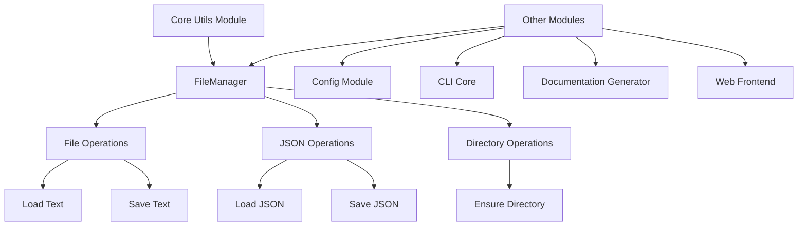
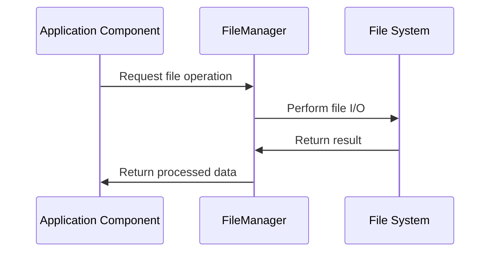

# Core Utils Module Documentation

## Introduction

The `core_utils` module provides essential utility functions that support various operations across the CodeWiki system. This module contains fundamental tools that are used by other modules for common operations such as file management, configuration handling, and data processing.

The primary component of this module is the `FileManager` class, which provides a centralized interface for file operations including reading/writing JSON files, text files, and directory management.

## Architecture Overview



## Core Components

### FileManager

The `FileManager` class is a utility class that provides static methods for common file operations. It serves as a centralized interface for file I/O operations across the application.

#### Class Definition
```python
class FileManager:
    """Handles file I/O operations."""
```

#### Methods

**ensure_directory(path: str) -> None**
- Creates a directory if it doesn't exist
- Uses `os.makedirs(path, exist_ok=True)` to create the directory
- Ensures that the directory structure exists before file operations

**save_json(data: Any, filepath: str) -> None**
- Saves data as JSON to the specified file
- Uses 4-space indentation for readable JSON output
- Creates the file if it doesn't exist

**load_json(filepath: str) -> Optional[Dict[str, Any]]**
- Loads JSON data from the specified file
- Returns `None` if the file doesn't exist
- Returns the parsed JSON data as a dictionary

**save_text(content: str, filepath: str) -> None**
- Saves text content to the specified file
- Overwrites the file if it already exists

**load_text(filepath: str) -> str**
- Loads text content from the specified file
- Returns the entire file content as a string

#### Instance
The module also provides a global instance of the FileManager class:
```python
file_manager = FileManager()
```

## Dependencies and Integration

The `core_utils` module is designed to be a foundational utility module with minimal external dependencies. It primarily uses Python's standard library modules:

- `os` - For directory operations
- `json` - For JSON serialization/deserialization
- `typing` - For type hints

### Integration with Other Modules

The `FileManager` utility is used across various modules in the CodeWiki system:

- **[cli_core](cli_core.md)** - For configuration file management and job status persistence
- **[core_config](core_config.md)** - For loading and saving configuration files
- **[documentation_generator](documentation_generator.md)** - For saving generated documentation files
- **[web_frontend](web_frontend.md)** - For caching and temporary file operations

## Data Flow



## Usage Examples

### Basic File Operations
```python
# Using the global instance
from codewiki.src.utils import file_manager

# Create directory
file_manager.ensure_directory("/path/to/directory")

# Save text file
file_manager.save_text("Hello, World!", "/path/to/file.txt")

# Load text file
content = file_manager.load_text("/path/to/file.txt")
```

### JSON Operations
```python
# Save JSON data
data = {"name": "example", "value": 42}
file_manager.save_json(data, "/path/to/data.json")

# Load JSON data
loaded_data = file_manager.load_json("/path/to/data.json")
```

## Error Handling

The `FileManager` class implements basic error handling:

- The `load_json` method returns `None` if the file doesn't exist, preventing FileNotFoundError
- Other methods may raise standard I/O exceptions which should be handled by the calling code
- The `ensure_directory` method uses `exist_ok=True` to avoid errors if the directory already exists

## Best Practices

1. **Use the global instance**: Use the provided `file_manager` instance rather than creating new instances
2. **Handle JSON loading carefully**: Always check if `load_json` returns `None` before using the result
3. **Validate file paths**: Ensure file paths are valid and accessible before operations
4. **Consider permissions**: Be aware of file system permissions when performing operations

## Module Relationships


## Performance Considerations

- The `FileManager` uses basic file operations without caching
- For large files, consider the memory implications of loading entire files into memory
- JSON operations are synchronous and may block for large data sets
- Directory creation operations are efficient due to the `exist_ok=True` parameter

## Security Considerations

- Validate file paths to prevent directory traversal attacks
- Sanitize file names when constructing file paths
- Be cautious when loading files from untrusted sources
- Consider file permissions when creating new files

## Future Enhancements

Potential improvements to the `FileManager` class could include:

- Asynchronous file operations for better performance
- File validation and sanitization methods
- Caching mechanisms for frequently accessed files
- Support for additional file formats beyond JSON and text
- File locking mechanisms for concurrent access