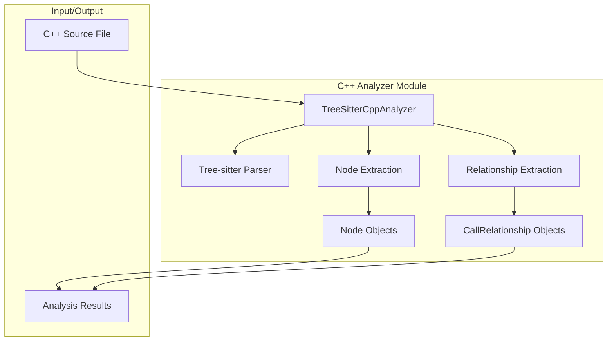
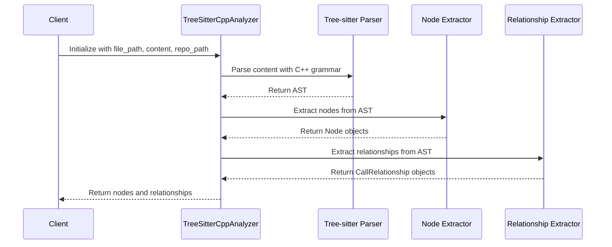
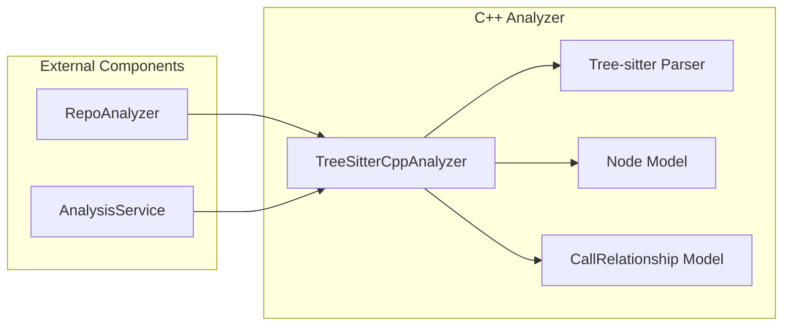

# C++ Analyzer Module Documentation

## Introduction

The C++ Analyzer module (`cpp_analyzer`) is a specialized component of the dependency_analyzer system that provides static analysis capabilities for C++ source code files. It leverages Tree-sitter parsing technology to extract structural information, identify code elements (classes, functions, variables), and map relationships between them.

This module is part of the language_analyzers subsystem and works in conjunction with other language-specific analyzers to provide comprehensive multi-language code analysis capabilities.

## Architecture Overview

The C++ Analyzer module follows a parser-based approach using Tree-sitter, a modern incremental parsing system that can handle complex language grammars efficiently. The module is designed to extract nodes and relationships from C++ source code to support dependency analysis and code understanding tasks.



## Core Components

### TreeSitterCppAnalyzer Class

The main component of this module is the `TreeSitterCppAnalyzer` class, which provides the following functionality:

- **File Analysis**: Parses C++ source files and extracts structural information
- **Node Detection**: Identifies classes, functions, methods, structs, namespaces, and variables
- **Relationship Mapping**: Discovers call relationships, inheritance, and usage patterns
- **Component ID Generation**: Creates unique identifiers for code elements

#### Key Methods

- `_analyze()`: Main analysis entry point that orchestrates parsing and extraction
- `_extract_nodes()`: Recursively extracts top-level nodes from the AST
- `_extract_relationships()`: Identifies relationships between code elements
- `_get_component_id()`: Generates unique component identifiers

## Detailed Functionality

### Node Extraction

The analyzer identifies and extracts the following types of nodes:

- **Classes**: Defined with `class` keyword
- **Structs**: Defined with `struct` keyword  
- **Functions**: Top-level function definitions
- **Methods**: Functions defined within classes/structs
- **Variables**: Global variables
- **Namespaces**: Defined with `namespace` keyword

### Relationship Extraction

The analyzer identifies several types of relationships:

- **Call Relationships**: Function/method calls (`calls` relationship type)
- **Inheritance**: Class inheritance (`inherits` relationship type)
- **Object Creation**: Use of `new` operator (`creates` relationship type)
- **Variable Usage**: Access to variables (`uses` relationship type)

### Component ID Generation

The analyzer generates unique component IDs using the module path and element names:

```
module_path.class_name.method_name
```

For example: `src.main.MyClass.myMethod`

## Dependencies and Integration

The C++ Analyzer module depends on:

- [Tree-sitter C++](https://github.com/tree-sitter/tree-sitter-cpp) grammar for parsing
- [Core Models](core_models.md) for Node and CallRelationship data structures
- [Analysis Models](analysis_models.md) for analysis results

The module integrates with:

- [Analysis Engine](analysis_engine.md) for coordinated analysis
- [Dependency Graph Builder](dependency_graph_builder.md) for relationship aggregation
- [AST Parser](ast_and_parsing.md) for common parsing utilities

## Data Flow



## Usage Example

```python
from codewiki.src.be.dependency_analyzer.analyzers.cpp import analyze_cpp_file

# Analyze a C++ file
nodes, relationships = analyze_cpp_file(
    file_path="src/main.cpp",
    content="// C++ source code...",
    repo_path="/path/to/repo"
)

# Process extracted nodes and relationships
for node in nodes:
    print(f"Found {node.component_type}: {node.name}")

for rel in relationships:
    print(f"{rel.caller} -> {rel.callee} ({rel.relationship_type})")
```

## Component Interaction



## Error Handling and Limitations

The C++ Analyzer handles common parsing scenarios but has some limitations:

- Complex template syntax may not be fully analyzed
- Macro-based code generation is not processed
- System/library functions are filtered out from relationships
- Only top-level nodes are extracted (nested functions are not supported)

## Integration with Overall System

The C++ Analyzer module works as part of the broader dependency analysis system:

1. **Input**: Receives C++ source files from the [Repo Analyzer](repo_analyzer.md)
2. **Processing**: Performs language-specific analysis using Tree-sitter
3. **Output**: Provides structured data to the [Dependency Graph Builder](dependency_graph_builder.md)
4. **Integration**: Contributes to comprehensive multi-language analysis results

For more information about the overall dependency analysis system, see the [Dependency Analyzer](dependency_analyzer.md) documentation.