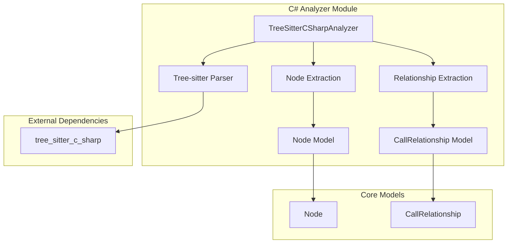
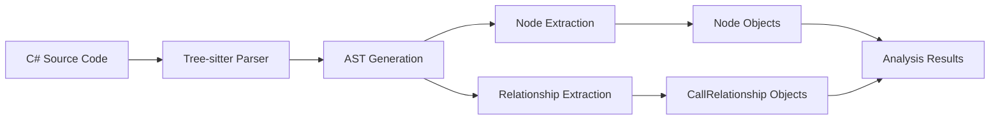

# C# Analyzer Module Documentation

## Overview

The C# Analyzer module (`csharp_analyzer`) is a specialized component of the dependency analyzer system that provides C# language-specific code analysis capabilities. It leverages Tree-sitter parsing technology to extract structural information from C# source code files, identifying key language constructs and their relationships.

This module is part of the broader `dependency_analyzer` system and specifically handles the analysis of C# files (.cs extensions) to extract nodes (classes, interfaces, structs, enums, etc.) and their relationships (inheritance, method calls, type dependencies).

## Architecture



## Core Components

### TreeSitterCSharpAnalyzer

The main analyzer class that processes C# source code files and extracts structural information.

**Key Responsibilities:**
- Parse C# source code using Tree-sitter
- Extract language constructs (classes, interfaces, structs, enums, etc.)
- Identify relationships between constructs
- Generate standardized Node and CallRelationship objects

**Constructor Parameters:**
- `file_path` (str): Path to the C# source file being analyzed
- `content` (str): Content of the C# source file
- `repo_path` (str, optional): Path to the repository root for relative path calculations

**Key Methods:**
- `_analyze()`: Main analysis entry point that orchestrates parsing and extraction
- `_extract_nodes()`: Identifies and extracts C# language constructs
- `_extract_relationships()`: Identifies relationships between constructs
- `_get_component_id()`: Generates unique component identifiers

## Supported C# Language Constructs

The analyzer identifies and extracts the following C# language constructs:

- **Classes**: Regular, abstract, and static classes
- **Interfaces**: Interface declarations
- **Structs**: Struct declarations
- **Enums**: Enumerations
- **Records**: Record declarations (C# 9.0+)
- **Delegates**: Delegate declarations
- **Methods**: Method declarations within classes
- **Properties**: Property declarations
- **Fields**: Field declarations

## Data Flow



## Relationship Analysis

The analyzer identifies several types of relationships between C# constructs:

### Inheritance Relationships
- Class inheritance from base classes
- Interface implementation
- Base class references in class declarations

### Type Dependencies
- Property type references
- Field type references
- Method parameter type references
- Generic type constraints

### Resolution Status
- **Resolved**: Relationships to constructs within the same file/repository
- **Unresolved**: References to external types (framework types, third-party libraries)

## Supported C# Primitive Types

The analyzer recognizes common C# primitive and built-in types to avoid false positive relationships:

- **Primitives**: `bool`, `byte`, `char`, `decimal`, `double`, `float`, `int`, `long`, `short`, `string`, `object`, `void`
- **Framework Types**: `List`, `Dictionary`, `Task`, `DateTime`, `Guid`, etc.
- **Full Framework Names**: `Boolean`, `Int32`, `String`, `Object`, etc.

## Integration with Dependency Analysis System

The C# analyzer integrates with the broader dependency analysis system through:

- **[analysis_engine](analysis_engine.md)**: Provides analysis services to the main engine
- **[dependency_graph_builder](dependency_graph_builder.md)**: Supplies extracted nodes and relationships for graph construction
- **[core_models](core_models.md)**: Uses standardized Node and CallRelationship models for consistency

## Usage Example

```python
from codewiki.src.be.dependency_analyzer.analyzers.csharp import analyze_csharp_file

# Analyze a C# file
nodes, relationships = analyze_csharp_file(
    file_path="src/MyClass.cs",
    content="// C# source code content",
    repo_path="/path/to/repository"
)

# Process extracted information
for node in nodes:
    print(f"Found {node.component_type}: {node.name}")

for rel in relationships:
    print(f"Relationship: {rel.caller} -> {rel.callee}")
```

## Dependencies

- **tree_sitter**: Core parsing library
- **tree_sitter_c_sharp**: C# language grammar for Tree-sitter
- **[core_models](core_models.md)**: Node and CallRelationship data models

## Error Handling

The analyzer includes robust error handling for:
- Invalid file paths
- Malformed C# source code
- Tree-sitter parsing errors
- Repository path resolution issues

## Performance Considerations

- Uses efficient Tree-sitter parsing for fast analysis
- Processes files individually for parallelization
- Minimal memory footprint through streaming analysis

## Limitations

- Limited semantic analysis (focuses on syntactic structure)
- May not resolve all external type references
- Complex generic relationships may not be fully captured
- Requires valid C# syntax for accurate parsing

## Related Modules

- **[language_analyzers](language_analyzers.md)**: Parent module containing all language-specific analyzers
- **[analysis_engine](analysis_engine.md)**: Core analysis orchestration
- **[ast_and_parsing](ast_and_parsing.md)**: AST parsing utilities
- **[core_models](core_models.md)**: Shared data models