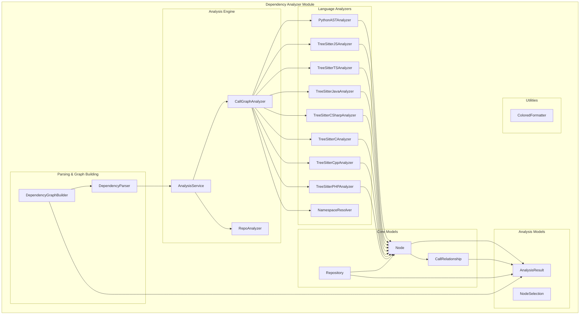

# Dependency Analyzer Module Overview

## Purpose

The `dependency_analyzer` module is a comprehensive code analysis system designed to extract and analyze dependencies within software repositories. It provides multi-language support for analyzing codebases written in Python, JavaScript, TypeScript, Java, C#, C, C++, PHP, and other programming languages. The module generates detailed dependency graphs, call relationships, and repository structure information to help developers understand code architecture and relationships between components.

Key capabilities include:
- Multi-language code parsing and analysis using AST and tree-sitter parsers
- Call graph generation to visualize function/method relationships
- Repository structure analysis with file tree visualization
- Dependency graph construction for comprehensive code understanding
- Support for both local and remote GitHub repository analysis

## Architecture

## Core Components Documentation

- **[Analysis Engine](analysis_engine.md)** - Central orchestration system managing repository analysis workflows, call graph generation, and result consolidation across multiple programming languages

- **[Language Analyzers](language_analyzers.md)** - Specialized parsers for different programming languages using tree-sitter and AST analysis to extract code entities and relationships

- **[Core Models](core_models.md)** - Fundamental data structures (Node, CallRelationship, Repository) that represent code components and their relationships

- **[Analysis Models](analysis_models.md)** - Pydantic models for representing analysis results and node selection criteria for partial exports

- **[AST and Parsing](ast_and_parsing.md)** - AST-based parsing system that converts source code into structured representations for dependency analysis

- **[Dependency Graph Builder](dependency_graph_builder.md)** - Constructs comprehensive dependency graphs from parsed repository data and identifies leaf nodes for documentation