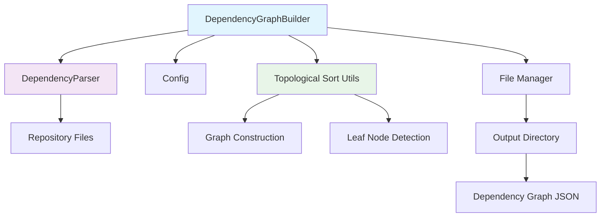
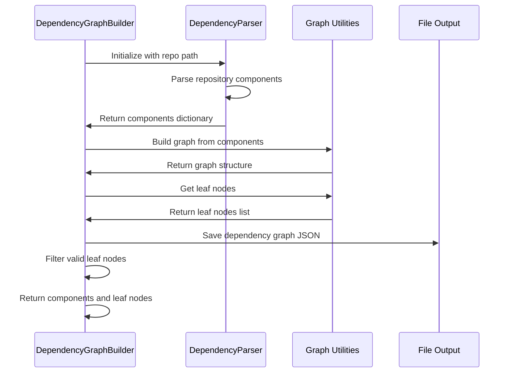
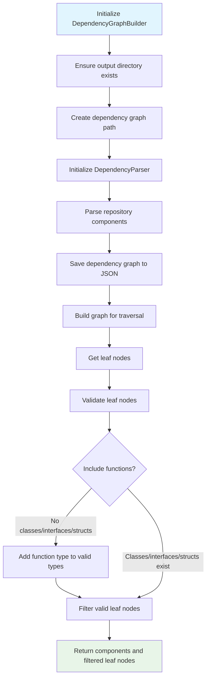

# Dependency Graph Builder Module

The Dependency Graph Builder module is responsible for constructing dependency graphs from code repositories. It processes the parsed code components and creates structured representations of how different code elements depend on each other, which is essential for understanding code architecture and relationships.

## Overview

The `DependencyGraphBuilder` class orchestrates the process of building dependency graphs from parsed repository data. It works in conjunction with the AST parser and topological sorting utilities to create a comprehensive representation of code dependencies that can be used for documentation generation and code analysis.

## Architecture

## Core Components

### DependencyGraphBuilder

The main class that handles the dependency analysis and graph building process:

- **Purpose**: Coordinates the building of dependency graphs from parsed repository data
- **Configuration**: Uses `Config` object to determine repository paths and output locations
- **Output**: Generates dependency graph JSON files and identifies leaf nodes for documentation

## Data Flow

## Process Flow

## Dependencies

The Dependency Graph Builder module depends on several other modules:

- **[ast_and_parsing](ast_and_parsing.md)**: Uses `DependencyParser` to parse repository components
- **[core_config](core_config.md)**: Uses `Config` for repository path and output directory settings
- **[core_utils](core_utils.md)**: Uses `FileManager` for file operations and directory management
- **analysis_engine**: Uses topological sorting utilities for graph construction and leaf node detection

## Integration Points

The module integrates with the broader system through:

1. **Analysis Pipeline**: Receives parsed components from the AST parser and processes them into dependency graphs
2. **Output Generation**: Creates JSON files that can be consumed by documentation generators
3. **Repository Analysis**: Works as part of the overall dependency analysis workflow

## Key Features

- **Repository Processing**: Builds dependency graphs from entire code repositories
- **Output Management**: Creates and manages output files in designated directories
- **Leaf Node Identification**: Identifies leaf nodes that are important for documentation
- **Type Filtering**: Filters leaf nodes based on component types (class, interface, struct, function)
- **File Management**: Handles JSON output and directory creation

## Usage Context

The Dependency Graph Builder is typically used as part of the larger dependency analysis workflow:

1. Repository analyzer identifies code files to process
2. Language-specific analyzers parse individual files
3. AST parser creates component representations
4. Dependency Graph Builder constructs the overall dependency graph
5. Leaf nodes are identified for focused documentation

This module is essential for creating structured representations of code dependencies that can be used for documentation generation and code understanding tasks.