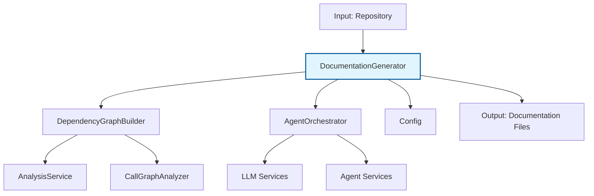
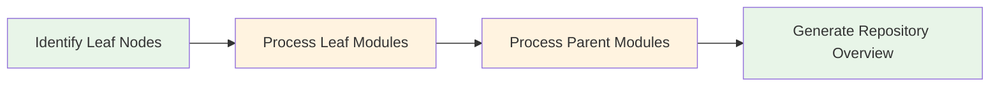
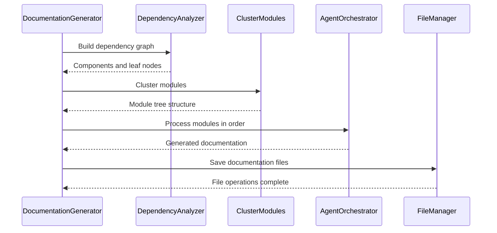

# Documentation Generator Module

## Overview

The Documentation Generator module is the core orchestrator responsible for generating comprehensive documentation for code repositories. It implements a dynamic programming approach to efficiently process code modules in dependency order, starting with leaf modules and working up to parent modules and repository overviews.

The module leverages dependency analysis from the [dependency_analyzer](dependency_analyzer.md) module and uses AI agents through the [agent_orchestrator](agent_orchestrator.md) to generate high-quality documentation for each module in the repository.

## Architecture

## Core Components

### DocumentationGenerator Class

The main orchestrator class that manages the entire documentation generation process:

- **Purpose**: Coordinates the complete documentation generation workflow
- **Key Responsibilities**:
  - Builds dependency graphs using [DependencyGraphBuilder](dependency_analyzer.md)
  - Clusters modules using the [cluster_modules](cluster_modules.md) service
  - Orchestrates documentation generation via [AgentOrchestrator](agent_orchestrator.md)
  - Manages processing order using topological sorting
  - Generates parent module documentation based on child module documentation
  - Creates metadata files with generation statistics

## Key Features

### 1. Dynamic Programming Approach

The module implements a dynamic programming strategy that processes modules in dependency order:

- **Leaf modules first**: Individual code components are processed first
- **Parent modules second**: Higher-level modules are documented based on their children's documentation
- **Repository overview last**: Final repository-level documentation is generated

### 2. Topological Processing Order

### 3. Module Clustering

The module uses the [cluster_modules](cluster_modules.md) service to group related code components into logical modules, creating a hierarchical structure that reflects the repository's architecture.

### 4. Context-Aware Documentation

For repositories that fit within the LLM context window, the module can process the entire repository as a single unit, optimizing for efficiency.

## Dependencies

### Core Dependencies

- **[dependency_analyzer](dependency_analyzer.md)**: Provides dependency graph building capabilities
- **[agent_orchestrator](agent_orchestrator.md)**: Manages AI agents for documentation generation
- **[Config](core_config.md)**: Configuration management
- **[FileManager](core_utils.md)**: File system operations
- **[LLM Services](llm_services.md)**: AI model interactions
- **[Prompt Templates](prompt_template.md)**: Documentation generation prompts

### Data Flow

## Processing Workflow

### 1. Initialization Phase
- Initialize with configuration and optional commit ID
- Create dependency graph builder and agent orchestrator instances

### 2. Analysis Phase
- Build dependency graph using [DependencyGraphBuilder](dependency_analyzer.md)
- Identify leaf nodes (modules with no dependencies)
- Cluster related components into logical modules

### 3. Generation Phase
- Process modules in topological order (leaf modules first)
- Generate documentation for each module using AI agents
- Create parent module documentation based on child documentation
- Generate repository overview

### 4. Finalization Phase
- Create metadata file with generation statistics
- Validate all documentation files are properly generated
- Return path to generated documentation

## Key Methods

### `run()`
Main entry point that orchestrates the entire documentation generation process.

### `generate_module_documentation()`
Handles the core documentation generation using dynamic programming approach.

### `generate_parent_module_docs()`
Generates documentation for parent modules based on their children's documentation.

### `get_processing_order()`
Implements topological sorting to determine the optimal processing order.

### `create_documentation_metadata()`
Creates metadata file with generation statistics and information.

## File Outputs

The module generates several key files:

- **overview.md**: Repository-level documentation overview
- **module_tree.json**: Final module structure with documentation links
- **first_module_tree.json**: Initial clustered module structure
- **metadata.json**: Generation statistics and configuration information
- **Module-specific .md files**: Individual module documentation files

## Integration Points

### With CLI Layer
The [cli_core](cli_core.md) module uses this generator to provide command-line documentation generation capabilities.

### With Web Frontend
The [web_frontend](web_frontend.md) module can trigger documentation generation through this module.

### With Configuration System
Relies on the [core_config](core_config.md) module for repository paths, model settings, and generation parameters.

## Error Handling

The module implements comprehensive error handling:

- Graceful failure handling for individual module processing
- Logging of errors with stack traces
- Continuation of processing even if individual modules fail
- Validation of required dependencies before processing

## Performance Considerations

- Uses dynamic programming to avoid redundant processing
- Implements caching through file system checks
- Processes modules in optimal order to maximize information reuse
- Handles large repositories by clustering components into manageable modules

## Configuration Options

The module respects configuration settings from the [Config](core_config.md) class, including:

- Repository path and commit ID
- Documentation output directory
- Maximum processing depth
- LLM model selection and parameters