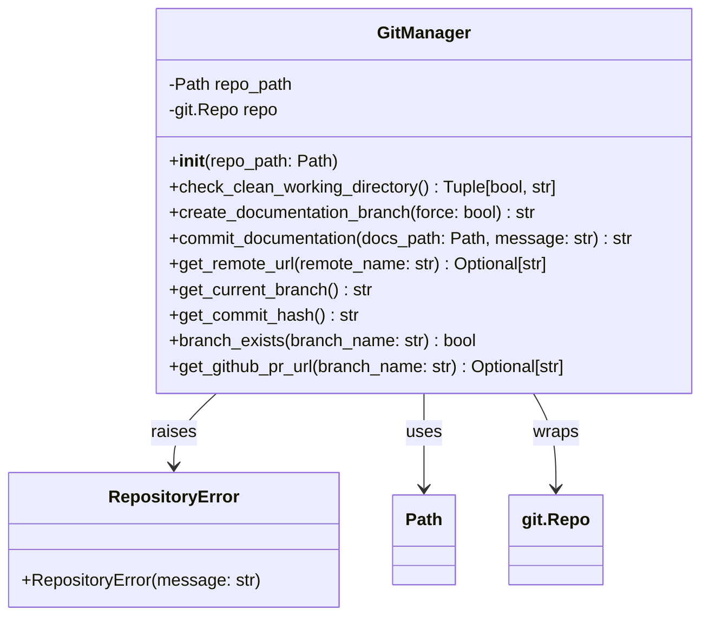
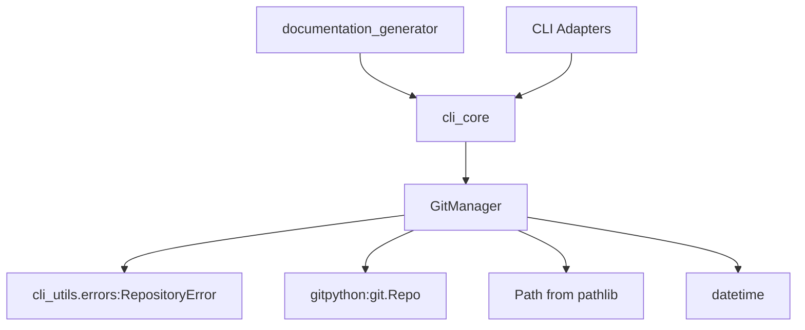
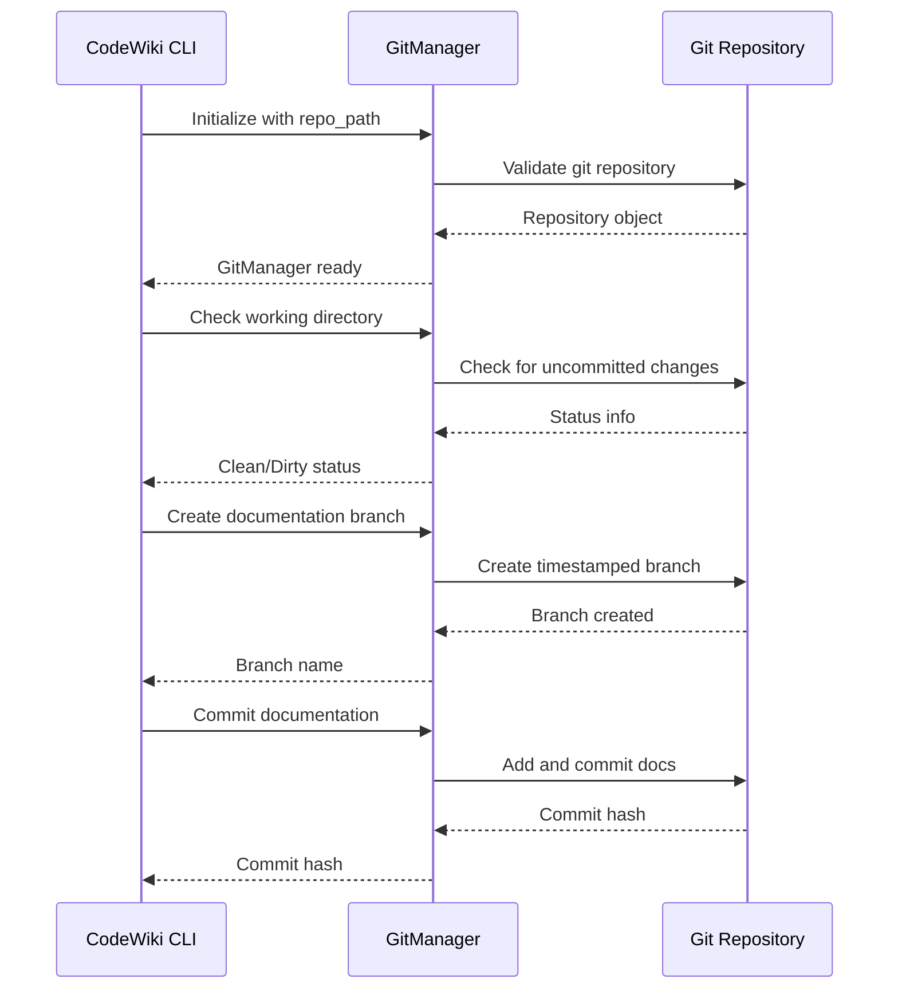
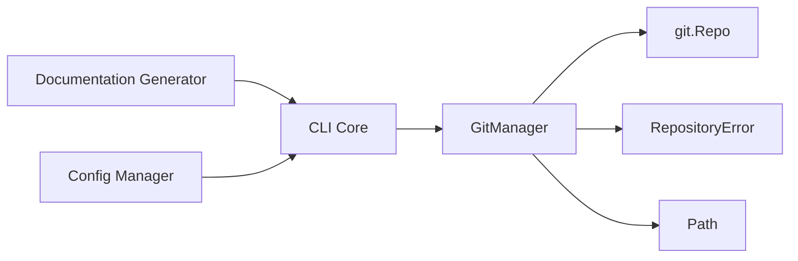

# Git Operations Module Documentation

## Overview

The Git Operations module (`git_operations`) is a core component of the CodeWiki CLI that manages all git-related operations for documentation generation workflows. This module provides a clean interface for handling git repositories, creating documentation branches, committing generated documentation, and managing repository state during the documentation process.

The module is built around the `GitManager` class which serves as the primary interface for all git operations within the CodeWiki system.

## Architecture

## Core Components

### GitManager

The `GitManager` class is the central component of this module, providing a comprehensive interface for git operations:

- **Repository Initialization**: Validates and initializes git repository connections
- **Status Checking**: Verifies clean working directory state before operations
- **Branch Management**: Creates timestamped documentation branches
- **Commit Operations**: Commits generated documentation with appropriate messages
- **Remote Operations**: Retrieves remote repository information
- **GitHub Integration**: Generates PR URLs for GitHub repositories

## Dependencies and Integration

The Git Operations module integrates with several other modules in the CodeWiki system:

### Integration Points

1. **CLI Core Module**: The GitManager is used by the CLI core to manage repository state during documentation generation
2. **Error Handling**: Uses `RepositoryError` from the error utilities module for consistent error reporting
3. **Configuration Management**: Works with the [config_management](config_management.md) module to handle repository paths
4. **Progress Tracking**: Integrates with [progress_tracking](progress_tracking.md) for status updates during git operations

## Data Flow

## Key Features

### 1. Repository Validation
The GitManager validates that the provided path is a valid git repository, raising appropriate errors if not.

### 2. Working Directory Status
Before performing operations, the manager checks if the working directory is clean, preventing conflicts with uncommitted changes.

### 3. Documentation Branch Creation
Automatically creates timestamped branches in the format `docs/codewiki-YYYYMMDD-HHMMSS` to organize documentation work.

### 4. Commit Management
Handles the complete commit process for generated documentation with customizable commit messages.

### 5. GitHub Integration
Provides automatic GitHub PR URL generation for easy pull request creation.

## Usage Patterns

The Git Operations module is typically used in the following workflow:

1. Initialize GitManager with repository path
2. Validate clean working directory
3. Create documentation branch
4. Generate documentation using [documentation_generator](documentation_generator.md)
5. Commit documentation to the branch
6. Provide GitHub PR URL for review

## Error Handling

The module implements comprehensive error handling through the `RepositoryError` exception, covering:

- Invalid git repositories
- Dirty working directories
- Branch creation failures
- Commit operation failures
- Remote access issues

## Component Interactions

## Integration with Overall System

The Git Operations module serves as a critical component in the CodeWiki documentation generation pipeline, working alongside:

- [config_management](config_management.md) for repository path configuration
- [documentation_generator](documentation_generator.md) for the actual documentation creation
- [cli_adapters](cli_core.md) for command-line interface operations
- [progress_tracking](progress_tracking.md) for user feedback during operations

This module ensures that all documentation generation activities are properly tracked within the git workflow, maintaining version control integrity while enabling automated documentation processes.