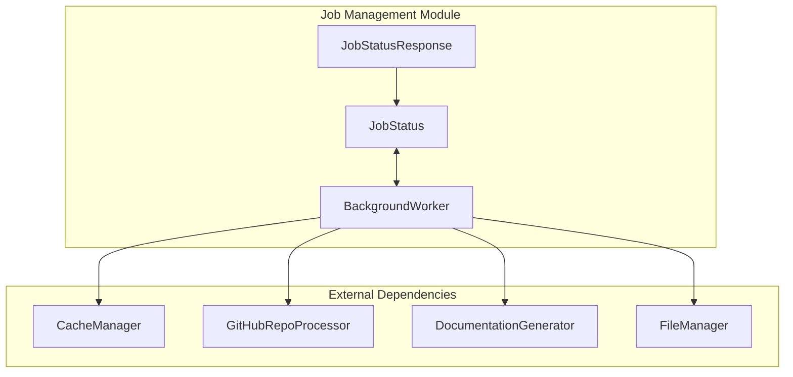
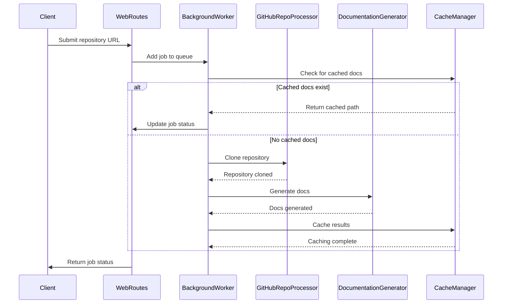
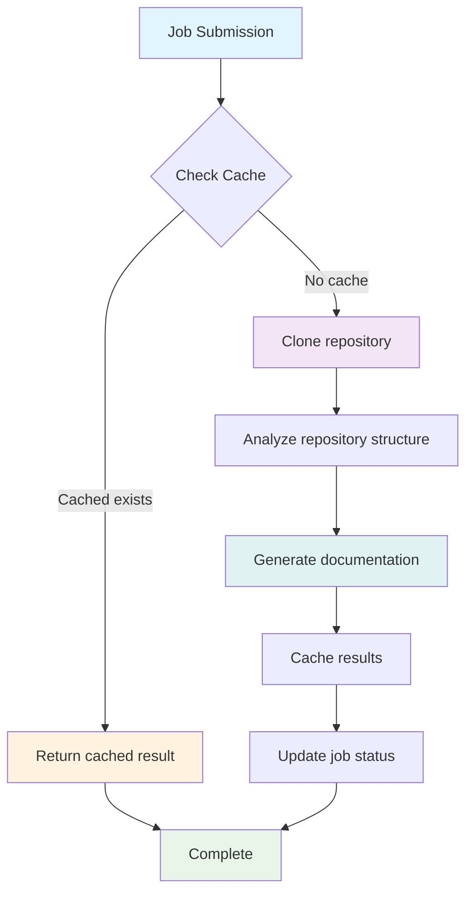

# Job Management Module

## Overview

The job management module handles the lifecycle of documentation generation jobs in the CodeWiki web application. It provides background processing capabilities for repository analysis and documentation generation, with support for job queuing, status tracking, and result caching. This module ensures that documentation generation tasks run asynchronously without blocking the web interface.

## Architecture

The job management module consists of three core components that work together to process documentation generation requests:

- **BackgroundWorker**: The main processing engine that handles job execution in background threads
- **JobStatus**: Data model that tracks the state and metadata of individual jobs
- **JobStatusResponse**: API response model for job status queries

## Core Components

### BackgroundWorker

The `BackgroundWorker` class is the primary processing engine responsible for managing the job queue and executing documentation generation tasks. It operates as a daemon thread that continuously monitors the job queue and processes jobs asynchronously.

#### Key Features:
- **Job Queue Management**: Maintains a queue of pending jobs with configurable size limits
- **Asynchronous Processing**: Runs documentation generation tasks in background threads
- **Status Tracking**: Updates job status throughout the processing lifecycle
- **Persistence**: Saves and loads job statuses to/from disk
- **Cache Integration**: Checks for cached results before processing new jobs
- **Repository Operations**: Handles cloning and cleanup of repository data

#### Job Lifecycle:
1. **Queued**: Job is added to the processing queue
2. **Processing**: Worker begins repository analysis and documentation generation
3. **Completed**: Documentation is successfully generated and cached
4. **Failed**: An error occurred during processing

### JobStatus

The `JobStatus` dataclass represents the current state of a documentation generation job. It contains metadata about the job including timestamps, progress information, and error details.

#### Properties:
- `job_id`: Unique identifier for the job
- `repo_url`: URL of the repository being processed
- `status`: Current status (queued, processing, completed, failed)
- `created_at`: Timestamp when the job was created
- `started_at`: Timestamp when processing began
- `completed_at`: Timestamp when processing completed
- `error_message`: Error details if the job failed
- `progress`: Human-readable progress message
- `docs_path`: Path to generated documentation
- `main_model`: Model used for documentation generation
- `commit_id`: Specific commit being processed

### JobStatusResponse

The `JobStatusResponse` Pydantic model is used for API responses when querying job status. It provides a structured format for returning job information to clients.

## Data Flow

## Component Interactions

The job management module integrates with several other modules in the CodeWiki system:

- **[caching_system](caching_system.md)**: Uses CacheManager to store and retrieve generated documentation
- **[repository_processing](repository_processing.md)**: Leverages GitHubRepoProcessor for repository cloning and analysis
- **[documentation_generator](documentation_generator.md)**: Utilizes DocumentationGenerator for the actual documentation creation process
- **[core_utils](core_utils.md)**: Uses FileManager for JSON persistence operations

## Process Flow

## Error Handling

The job management module implements comprehensive error handling:

- **Repository cloning failures**: Jobs are marked as failed with appropriate error messages
- **Documentation generation errors**: Errors are captured and stored in the job status
- **Cache operation failures**: Non-critical errors are logged but don't stop processing
- **Temporary file cleanup**: Ensures cleanup of temporary repository clones even when errors occur

## Configuration

The module uses configuration from [web_routing](web_routing.md) module:
- `WebAppConfig.TEMP_DIR`: Directory for temporary repository clones
- `WebAppConfig.QUEUE_SIZE`: Maximum number of jobs in the processing queue
- `WebAppConfig.CACHE_DIR`: Directory for storing job status persistence

## Integration Points

The job management module serves as a critical component in the overall system architecture, connecting:
- Web interface requests to background processing
- Repository analysis capabilities to documentation generation
- Caching systems to job status tracking
- API endpoints to long-running operations

For more information about related components, see the documentation for [caching_system](caching_system.md), [repository_processing](repository_processing.md), and [web_routing](web_routing.md) modules.