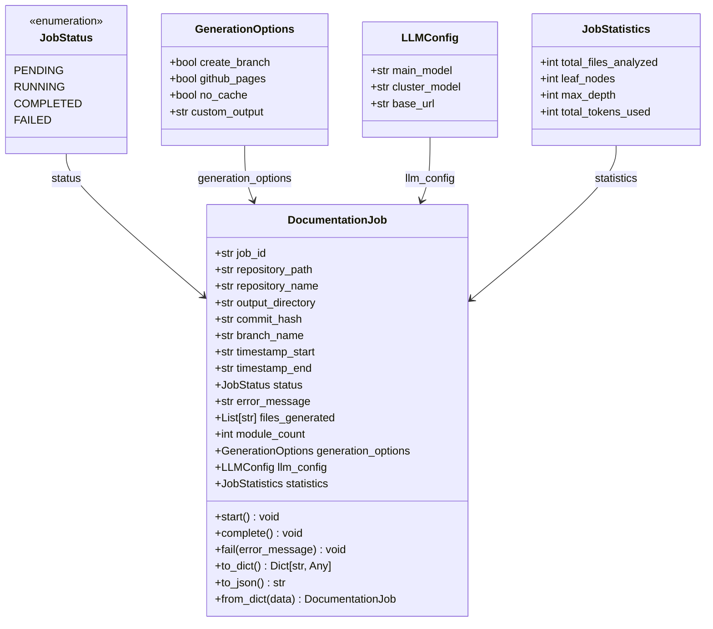
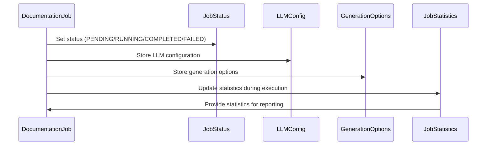
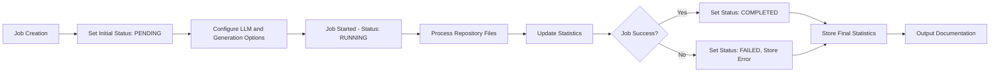

# Job Models Module Documentation

## Overview

The job_models module provides data models for managing documentation generation jobs in the codewiki system. These models define the structure and state of documentation jobs, including their configuration, status, statistics, and lifecycle management. The module is part of the CLI core functionality and works in conjunction with other modules like [config_management](config_management.md), [git_operations](git_operations.md), and [progress_tracking](progress_tracking.md).

## Architecture



## Core Components

### JobStatus Enum

The `JobStatus` enum defines the possible states of a documentation job:

- `PENDING`: Job is queued and waiting to start
- `RUNNING`: Job is currently executing
- `COMPLETED`: Job finished successfully
- `FAILED`: Job encountered an error and stopped

### GenerationOptions Dataclass

The `GenerationOptions` dataclass contains configuration options for documentation generation:

- `create_branch`: Whether to create a new git branch for changes
- `github_pages`: Whether to generate GitHub Pages compatible output
- `no_cache`: Whether to bypass caching mechanisms
- `custom_output`: Custom output directory path (optional)

### JobStatistics Dataclass

The `JobStatistics` dataclass tracks metrics for a documentation job:

- `total_files_analyzed`: Number of files processed during documentation generation
- `leaf_nodes`: Count of leaf nodes in the dependency graph
- `max_depth`: Maximum depth of the dependency graph
- `total_tokens_used`: Total number of tokens consumed by the LLM

### LLMConfig Dataclass

The `LLMConfig` dataclass holds configuration for language model usage:

- `main_model`: Primary language model to use for documentation
- `cluster_model`: Model used for clustering and analysis
- `base_url`: Base URL for the LLM API

### DocumentationJob Dataclass

The `DocumentationJob` dataclass is the central model representing a documentation generation job with the following attributes:

- `job_id`: Unique identifier for the job (UUID)
- `repository_path`: Absolute path to the repository being documented
- `repository_name`: Name of the repository
- `output_directory`: Path where documentation will be generated
- `commit_hash`: Git commit SHA at the time of job execution
- `branch_name`: Git branch name (if applicable)
- `timestamp_start`: ISO format timestamp when job started
- `timestamp_end`: ISO format timestamp when job ended (if completed)
- `status`: Current status of the job (JobStatus enum)
- `error_message`: Error message if job failed
- `files_generated`: List of files that were generated
- `module_count`: Number of modules documented
- `generation_options`: Generation options used for this job
- `llm_config`: LLM configuration used for this job
- `statistics`: Statistics collected during job execution

## Component Interactions



## Data Flow



## Usage Examples

### Creating a New Job

```python
from codewiki.cli.models.job import DocumentationJob, GenerationOptions, LLMConfig

# Create a new documentation job
job = DocumentationJob(
    repository_path="/path/to/repo",
    repository_name="my-repo",
    output_directory="/output/docs",
    generation_options=GenerationOptions(
        create_branch=True,
        github_pages=True
    ),
    llm_config=LLMConfig(
        main_model="gpt-4",
        cluster_model="gpt-3.5-turbo",
        base_url="https://api.openai.com/v1"
    )
)
```

### Starting and Completing a Job

```python
# Mark job as started
job.start()

# Perform documentation generation work...

# Mark job as completed
job.complete()
```

### Handling Job Failure

```python
try:
    job.start()
    # Perform documentation generation work...
except Exception as e:
    job.fail(str(e))
```

### Serialization

```python
# Convert job to dictionary for storage/transmission
job_dict = job.to_dict()

# Convert job to JSON string
json_str = job.to_json()

# Recreate job from dictionary
restored_job = DocumentationJob.from_dict(job_dict)
```

## Dependencies

The job_models module depends on and integrates with:

- [config_management](config_management.md): For configuration management
- [git_operations](git_operations.md): For repository operations and commit tracking
- [progress_tracking](progress_tracking.md): For job progress monitoring
- [logging_utils](logging_utils.md): For job status logging

## Integration Points

The job_models module integrates with the broader system through:

1. **CLI Core**: Used by the CLI to manage documentation jobs
2. **Documentation Generator**: Provides job context for the documentation generation process
3. **Web Frontend**: Used by the web interface to track job status and results
4. **Dependency Analyzer**: Receives analysis results to populate job statistics

## Error Handling

The module provides built-in error handling through:

- The `JobStatus.FAILED` state for failed jobs
- The `error_message` field to store specific error details
- Proper timestamp tracking for failed jobs

## Performance Considerations

- Jobs are designed to be lightweight data containers
- Serialization methods are optimized for JSON conversion
- Statistics tracking is designed to be updated incrementally during job execution