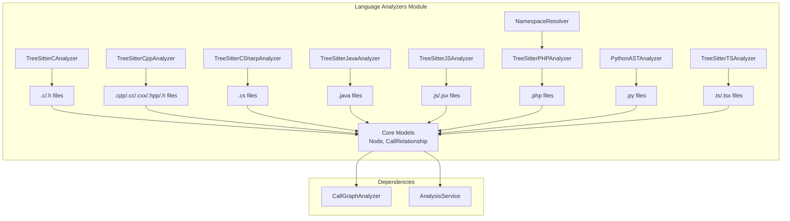
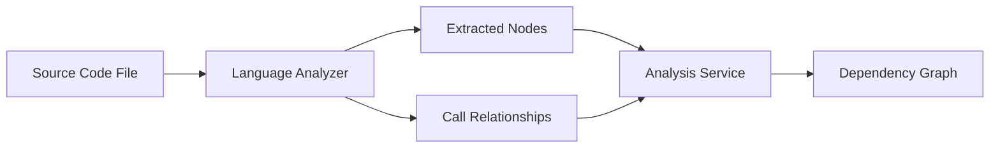
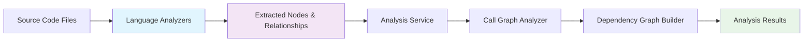

# Language Analyzers Module

The Language Analyzers module is a core component of the dependency analysis system that provides language-specific parsing and analysis capabilities. It uses tree-sitter parsers and AST analysis to extract code entities (classes, functions, methods, etc.) and their relationships from source code files across multiple programming languages.

## Architecture Overview

## Module Purpose

The Language Analyzers module serves as the foundation for code understanding and dependency extraction. It provides:

- **Multi-language support**: Analyzes code in C, C++, C#, Java, JavaScript, PHP, Python, and TypeScript
- **AST-based parsing**: Uses tree-sitter parsers and Python's AST module for accurate code analysis
- **Entity extraction**: Identifies classes, functions, methods, interfaces, enums, and other language constructs
- **Relationship mapping**: Extracts call relationships, inheritance, and type dependencies
- **Cross-file resolution**: Handles dependencies between files and modules

## Core Components

### C Language Analyzer
- **Component**: `TreeSitterCAnalyzer`
- **Purpose**: Analyzes C and C header files to extract functions, structs, and global variables
- **Features**: Function call detection, struct definitions, global variable tracking
- **Documentation**: [C Analyzer Documentation](c_analyzer.md)

### C++ Language Analyzer
- **Component**: `TreeSitterCppAnalyzer`
- **Purpose**: Analyzes C++ files to extract classes, functions, methods, and inheritance relationships
- **Features**: Class/method detection, inheritance analysis, object creation tracking
- **Documentation**: [C++ Analyzer Documentation](cpp_analyzer.md)

### C# Language Analyzer
- **Component**: `TreeSitterCSharpAnalyzer`
- **Purpose**: Analyzes C# files to extract classes, interfaces, enums, and type relationships
- **Features**: Interface implementation, property/field type analysis, delegate detection
- **Documentation**: [C# Analyzer Documentation](csharp_analyzer.md)

### Java Language Analyzer
- **Component**: `TreeSitterJavaAnalyzer`
- **Purpose**: Analyzes Java files to extract classes, interfaces, enums, and method relationships
- **Features**: Inheritance detection, interface implementation, method invocation tracking
- **Documentation**: [Java Analyzer Documentation](java_analyzer.md)

### JavaScript Language Analyzer
- **Component**: `TreeSitterJSAnalyzer`
- **Purpose**: Analyzes JavaScript files to extract functions, classes, and call relationships
- **Features**: Function/method detection, JSDoc type parsing, arrow function support
- **Documentation**: [JavaScript Analyzer Documentation](javascript_analyzer.md)

### PHP Language Analyzer
- **Component**: `TreeSitterPHPAnalyzer`
- **Purpose**: Analyzes PHP files to extract classes, functions, and namespace relationships
- **Features**: Namespace resolution, use statement handling, class inheritance
- **Component**: `NamespaceResolver`
- **Purpose**: Resolves PHP class names to fully qualified names using use statements
- **Documentation**: [PHP Analyzer Documentation](php_analyzer.md)

### Python Language Analyzer
- **Component**: `PythonASTAnalyzer`
- **Purpose**: Analyzes Python files using Python's AST module to extract classes and functions
- **Features**: Class inheritance, function call tracking, method extraction
- **Documentation**: [Python Analyzer Documentation](python_analyzer.md)

### TypeScript Language Analyzer
- **Component**: `TreeSitterTSAnalyzer`
- **Purpose**: Analyzes TypeScript files to extract classes, interfaces, types, and relationships
- **Features**: Type alias handling, interface implementation, generic type analysis
- **Documentation**: [TypeScript Analyzer Documentation](typescript_analyzer.md)

## Integration with Other Modules

The Language Analyzers module integrates with other components of the system:

- **[Analysis Engine](analysis_engine.md)**: Provides parsed entities and relationships for call graph construction
- **[AST and Parsing](ast_and_parsing.md)**: Works with the AST parser to extract code information
- **[Dependency Graph Builder](dependency_graph_builder.md)**: Uses extracted relationships to build dependency graphs
- **[Analysis Models](analysis_models.md)**: Provides data for analysis results and node selection

## Data Flow

The language analyzers receive source code files and extract structured information about code entities and their relationships. This information is then used by the analysis service to build comprehensive dependency graphs and perform code analysis.

## Key Features

- **Multi-language support**: Handles 8+ programming languages with specialized analyzers
- **Accurate parsing**: Uses tree-sitter parsers for precise syntax analysis
- **Relationship tracking**: Maps dependencies between code entities
- **Extensible design**: Easy to add support for new programming languages
- **Performance optimized**: Efficient parsing and analysis algorithms
- **Cross-reference resolution**: Handles imports, includes, and module dependencies

## Module Integration Flow

The language analyzers serve as the entry point for code analysis, processing source files and extracting structured information that flows through the analysis pipeline to generate comprehensive dependency graphs and analysis results.