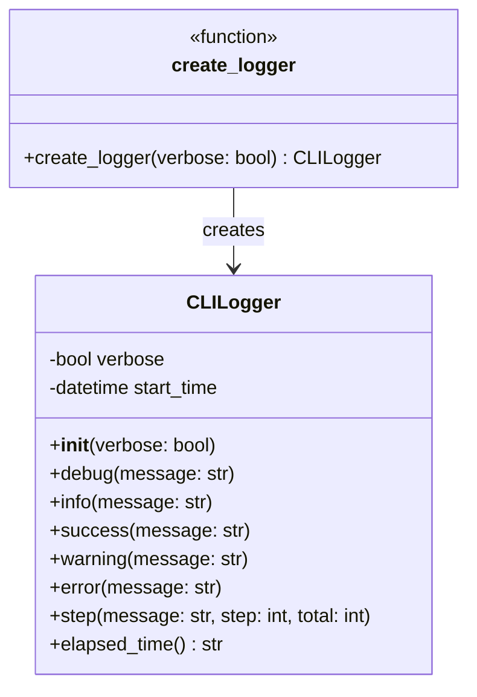
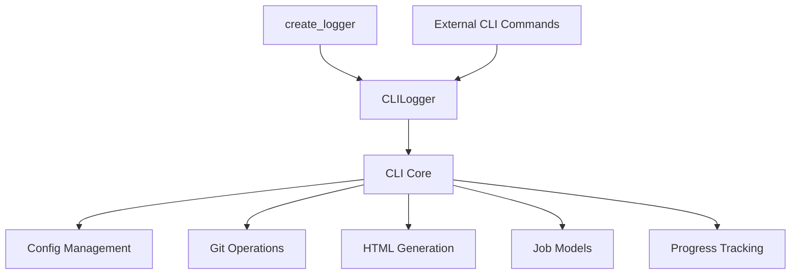
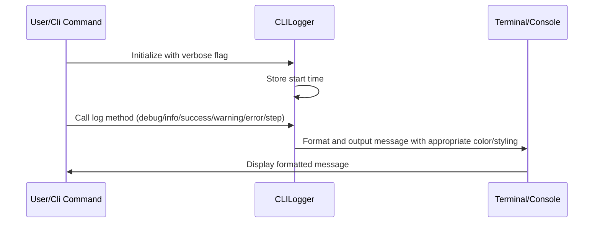
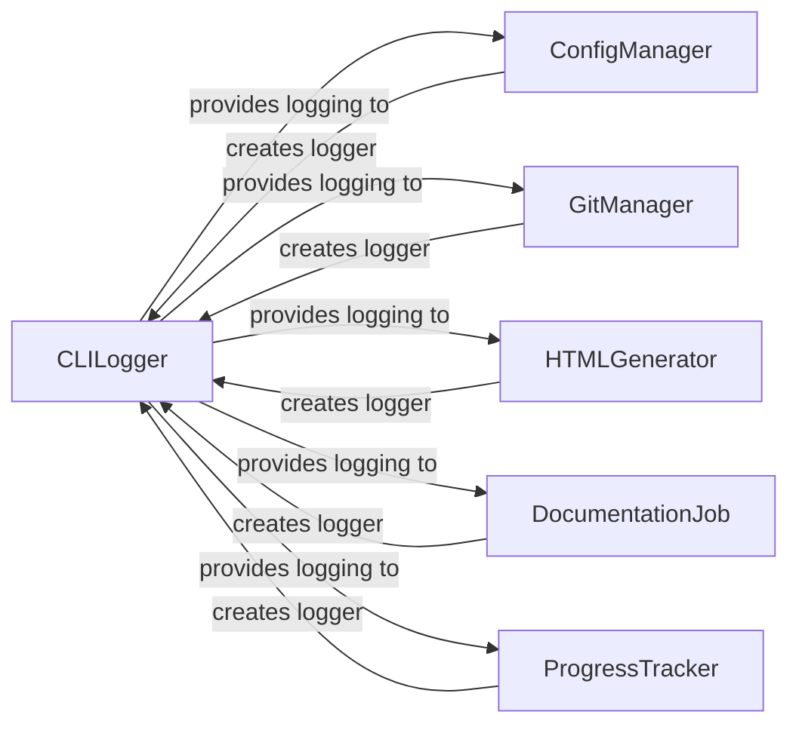

# Logging Utilities Module

## Overview

The logging_utils module provides CLI-focused logging capabilities with colored output and progress tracking for the CodeWiki application. It is part of the CLI core functionality and serves as the primary logging interface for command-line operations.

The module centers around the `CLILogger` class, which offers different logging levels with appropriate color coding and supports both normal and verbose output modes. This module is essential for providing clear, user-friendly feedback during documentation generation and other CLI operations.

## Architecture

## Core Components

### CLILogger Class

The `CLILogger` class is the primary component of this module, providing a comprehensive logging interface for CLI applications.

**Key Features:**
- Support for verbose and normal logging modes
- Colored output for different log levels
- Step tracking with optional progress indicators
- Elapsed time tracking since logger initialization

**Methods:**
- `debug(message)`: Logs debug messages in cyan (only in verbose mode)
- `info(message)`: Logs general information messages
- `success(message)`: Logs success messages in green with checkmark
- `warning(message)`: Logs warning messages in yellow with warning icon
- `error(message)`: Logs error messages in red with error icon
- `step(message, step, total)`: Logs processing steps with optional progress tracking
- `elapsed_time()`: Returns formatted elapsed time since logger creation

### create_logger Function

A convenience function that creates and returns a configured `CLILogger` instance.

## Dependencies and Integration

The logging_utils module has the following dependencies:

- **click**: Used for colored terminal output and formatting
- **datetime**: Used for timestamp generation and elapsed time calculation
- **sys**: Used for error output routing

This module integrates with other CLI components as shown in the following diagram:

## Data Flow

The logging data flow follows this pattern:

## Usage Examples

The logging_utils module is used throughout the CLI core components, particularly in:

- [config_management.md](config_management.md): For logging configuration loading and validation
- [git_operations.md](git_operations.md): For logging repository operations and status updates
- [html_generation.md](html_generation.md): For logging documentation generation progress
- [progress_tracking.md](progress_tracking.md): For providing visual feedback during long-running operations

## Component Interactions

The logging_utils module interacts with other components in the following ways:

## System Integration

The logging_utils module fits into the overall system as a foundational component that provides consistent logging capabilities across the CLI interface. It works in conjunction with:

- [job_models.md](job_models.md) to provide status updates during documentation generation jobs
- [progress_tracking.md](progress_tracking.md) to provide visual feedback during long-running operations
- [config_management.md](config_management.md) to provide feedback during configuration loading and validation

## Error Handling

The logging_utils module handles errors gracefully by:
- Routing error messages to stderr using the `err=True` parameter in click.secho
- Providing clear visual indicators for different log levels
- Supporting both verbose and normal modes to control output detail

## Performance Considerations

The logging_utils module is designed to be lightweight and efficient, with minimal overhead for logging operations. The verbose mode provides additional detail only when needed, helping to maintain performance during normal operations.