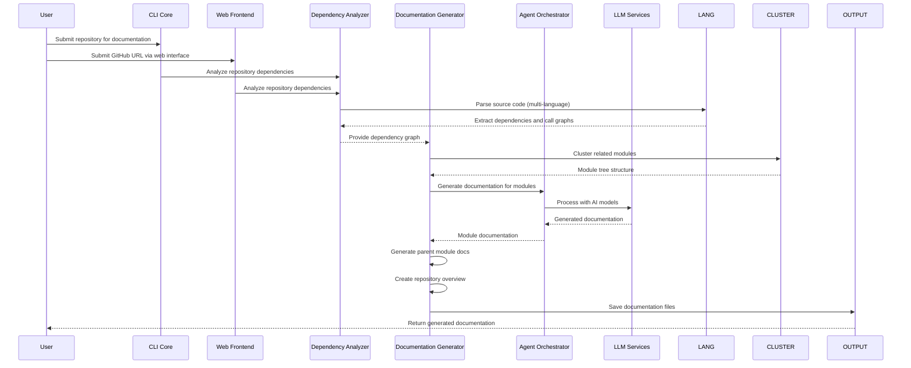

# CodeWiki Repository Overview

## Purpose

CodeWiki is a comprehensive documentation generation tool that creates detailed documentation for code repositories using AI-powered analysis. The system analyzes code dependencies, generates call graphs, clusters related modules, and produces human-readable documentation for entire repositories. It supports multiple programming languages including Python, JavaScript, TypeScript, Java, C#, C, C++, and PHP, making it suitable for diverse codebases.

The repository provides both command-line and web-based interfaces for documentation generation, with features for GitHub integration, progress tracking, and HTML documentation viewers for GitHub Pages deployment.

## Architecture

### End-to-End System Architecture

```mermaid
graph TB
    subgraph "User Interfaces"
        CLI[CLI Interface]
        WEB[Web Frontend]
    end
    
    subgraph "Core Processing Engine"
        DOC_GEN[Documentation Generator]
        DEP_ANALYZER[Dependency Analyzer]
        CLUSTER[Module Clustering]
        AGENT_ORCH[Agent Orchestrator]
    end
    
    subgraph "Language Analysis"
        LANG_PY[Python Analyzer]
        LANG_JS[JavaScript Analyzer]
        LANG_TS[TypeScript Analyzer]
        LANG_JAVA[Java Analyzer]
        LANG_CS[C# Analyzer]
        LANG_C[C/C++ Analyzer]
        LANG_PHP[PHP Analyzer]
    end
    
    subgraph "Supporting Services"
        CONFIG[Core Config]
        UTILS[Core Utils]
        CACHE[Cache Manager]
        GIT[Git Manager]
    end
    
    subgraph "Output Generation"
        HTML_GEN[HTML Generator]
        DOC_FILES[Documentation Files]
        METADATA[Metadata Files]
    end
    
    subgraph "External Systems"
        LLM[LLM Services]
        GITHUB[GitHub Repositories]
        KEYRING[System Keyring]
    end
    
    CLI --> DOC_GEN
    WEB --> DOC_GEN
    DOC_GEN --> DEP_ANALYZER
    DOC_GEN --> CLUSTER
    DOC_GEN --> AGENT_ORCH
    DEP_ANALYZER --> LANG_PY
    DEP_ANALYZER --> LANG_JS
    DEP_ANALYZER --> LANG_TS
    DEP_ANALYZER --> LANG_JAVA
    DEP_ANALYZER --> LANG_CS
    DEP_ANALYZER --> LANG_C
    DEP_ANALYZER --> LANG_PHP
    DOC_GEN --> CONFIG
    DOC_GEN --> UTILS
    WEB --> CACHE
    CLI --> GIT
    DOC_GEN --> HTML_GEN
    DOC_GEN --> DOC_FILES
    DOC_GEN --> METADATA
    AGENT_ORCH --> LLM
    CLI --> GITHUB
    WEB --> GITHUB
    CLI --> KEYRING
    CONFIG --> KEYRING
    
    style CLI fill:#e1f5fe,stroke:#01579b,stroke-width:2px
    style WEB fill:#e1f5fe,stroke:#01579b,stroke-width:2px
    style DOC_GEN fill:#f3e5f5,stroke:#4a148c,stroke-width:2px
    style DEP_ANALYZER fill:#e8f5e8,stroke:#1b5e20,stroke-width:2px
```

### Processing Workflow

## Core Modules Documentation

### [Dependency Analyzer](dependency_analyzer.md)
Comprehensive code analysis system that extracts and analyzes dependencies across multiple programming languages using AST and tree-sitter parsers. Generates dependency graphs, call relationships, and repository structure information.

### [Documentation Generator](documentation_generator.md)
Core orchestrator that manages the complete documentation generation workflow using dynamic programming approach, processing modules in dependency order from leaf nodes to parent modules.

### [CLI Core](cli_core.md)
Command-line interface module providing user interaction, configuration management with secure keyring storage, git operations, progress tracking, and GitHub Pages HTML generation.

### [Web Frontend](web_frontend.md)
FastAPI-based web interface for repository submission and documentation viewing, featuring job queue management, caching system, and background processing capabilities.

### [Core Config](core_config.md)
Centralized configuration system managing global settings, LLM configurations, directory paths, and application context detection for both CLI and web modes.

### [Core Utils](core_utils.md)
Essential utility functions providing file management operations, JSON/text file handling, and directory management services used across all modules.