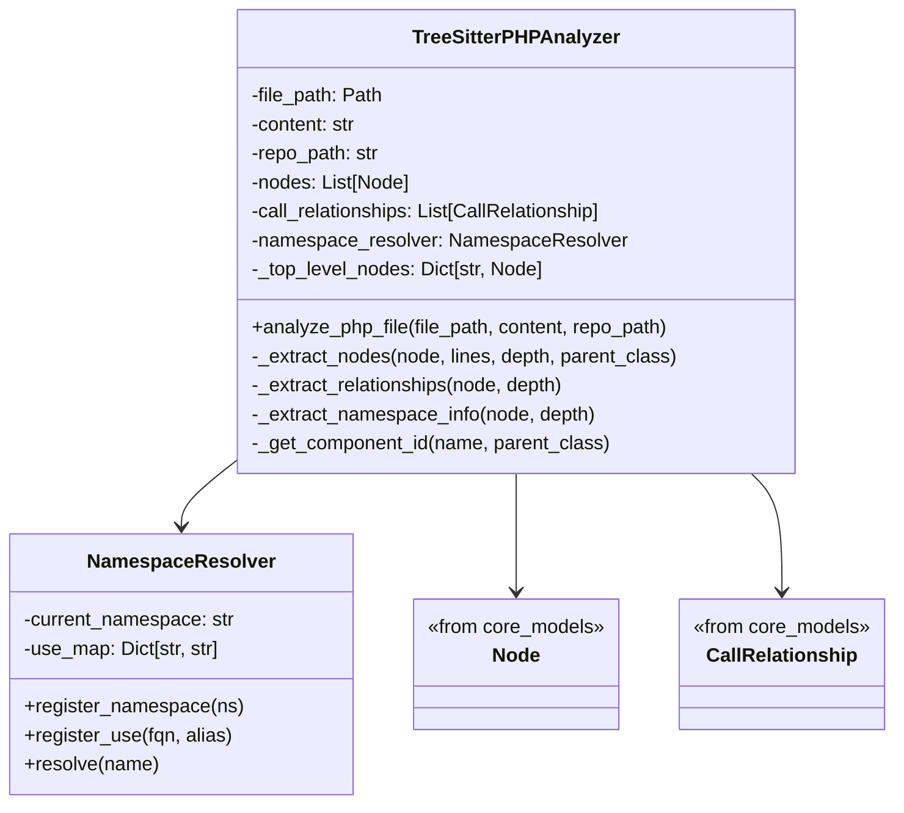
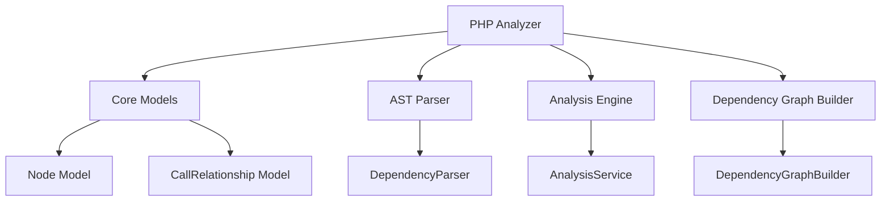
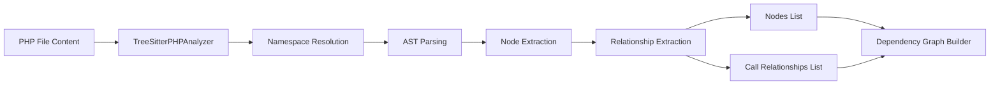

# PHP Analyzer Module Documentation

## Introduction

The PHP Analyzer module is a specialized component of the dependency_analyzer system that provides PHP language-specific analysis capabilities. It uses tree-sitter parsing to extract classes, interfaces, traits, enums, functions, and methods from PHP files, along with their dependency relationships such as use statements, extends, implements, object creation, and static calls.

This module is part of the language_analyzers subsystem and works in conjunction with other language analyzers to provide comprehensive multi-language dependency analysis.

## Architecture Overview

The PHP Analyzer module consists of two main components:

1. **TreeSitterPHPAnalyzer**: The primary analyzer class that parses PHP files using tree-sitter
2. **NamespaceResolver**: A utility class that resolves PHP class names to fully qualified names using use statements



## Component Details

### TreeSitterPHPAnalyzer

The TreeSitterPHPAnalyzer is the main class responsible for analyzing PHP files. It uses tree-sitter-php to parse the file content and extract various PHP constructs.

#### Key Features:
- Extracts classes, interfaces, traits, enums, functions, and methods
- Identifies dependency relationships (use, extends, implements, new, static calls)
- Handles namespace resolution using the NamespaceResolver
- Extracts PHPDoc comments for documentation
- Processes function/method parameters
- Handles template files (blade.php, phtml, etc.) by skipping them

#### Analysis Process:
1. **Namespace and Use Extraction**: First pass to identify namespace and use statements
2. **Node Extraction**: Second pass to identify all PHP constructs
3. **Relationship Extraction**: Third pass to identify dependencies between constructs

### NamespaceResolver

The NamespaceResolver handles PHP's complex namespace resolution system, including:
- Current namespace tracking
- Use statement registration (with aliases)
- Name resolution to fully qualified names
- Support for group use statements

## Dependencies and Integration

The PHP Analyzer module integrates with several other modules in the system:



### Core Dependencies:
- **Node** and **CallRelationship** models from core_models
- **tree_sitter** and **tree_sitter_php** libraries for parsing
- **logging** for error and debug information

## Data Flow

The data flow in the PHP Analyzer follows this pattern:



## Supported PHP Constructs

The analyzer supports the following PHP constructs:

- **Classes** (including abstract classes)
- **Interfaces**
- **Traits**
- **Enums** (PHP 8.1+)
- **Functions**
- **Methods** (including static methods)
- **Namespace declarations**
- **Use statements** (including group use)
- **Inheritance** (extends)
- **Implementation** (implements)
- **Object creation** (new)
- **Static calls** (::)

## Configuration and Constants

The module includes several configuration constants:

- `PHP_PRIMITIVES`: Set of PHP primitive and built-in types to exclude from dependencies
- `TEMPLATE_PATTERNS`: File extensions to skip (blade.php, phtml, etc.)
- `TEMPLATE_DIRECTORIES`: Directories containing template files to skip
- `MAX_RECURSION_DEPTH`: Maximum recursion depth to prevent stack overflow

## Usage

The module provides a simple function interface for analysis:

```python
from codewiki.src.be.dependency_analyzer.analyzers.php import analyze_php_file

nodes, relationships = analyze_php_file(file_path, content, repo_path)
```

## Error Handling

The analyzer includes robust error handling:
- Recursion depth limits to prevent stack overflow
- Exception handling for parsing errors
- Logging for debugging and monitoring
- Graceful handling of malformed PHP files

## Integration with Other Modules

For more information about how the PHP Analyzer integrates with other system components, see:
- [dependency_analyzer.md](dependency_analyzer.md) - Main dependency analyzer documentation
- [language_analyzers.md](language_analyzers.md) - Language analyzer framework
- [core_models.md](core_models.md) - Core data models
- [dependency_graph_builder.md](dependency_graph_builder.md) - Graph building component
- [analysis_engine.md](analysis_engine.md) - Analysis engine framework

## Performance Considerations

- The analyzer uses tree-sitter for efficient parsing
- Template files are skipped to avoid unnecessary processing
- Maximum recursion depth prevents stack overflow
- Namespace resolution is optimized with caching

## Limitations

- Template files (blade.php, phtml, etc.) are skipped
- Complex PHP constructs may not be fully supported
- Maximum recursion depth may limit analysis of very complex files
- Some PHP 8+ features may have limited support

## Future Enhancements

Potential areas for improvement include:
- Support for additional PHP 8+ features
- Better handling of complex type declarations
- Performance optimization for large codebases
- Enhanced error recovery mechanisms