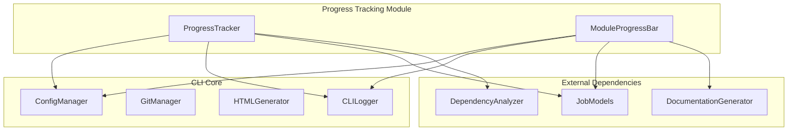
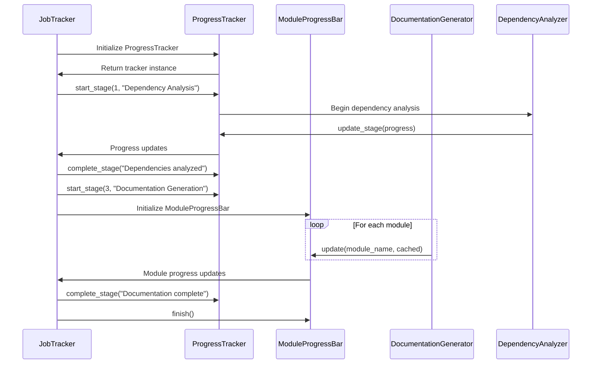

# Progress Tracking Module Documentation

## Overview

The progress tracking module provides utilities for monitoring and displaying progress during documentation generation processes. It includes components for tracking multi-stage processes and module-by-module progress indicators, with features like ETA estimation and verbose logging options.

This module is part of the CLI core functionality and works in conjunction with other modules like [job_models](job_models.md), [documentation_generator](documentation_generator.md), and [dependency_analyzer](dependency_analyzer.md) to provide comprehensive progress feedback during documentation generation workflows.

## Architecture



## Core Components

### ProgressTracker

The `ProgressTracker` class manages multi-stage progress tracking with ETA estimation. It follows a predefined workflow with five distinct stages:

1. **Dependency Analysis** (40% of time)
2. **Module Clustering** (20% of time)
3. **Documentation Generation** (30% of time)
4. **HTML Generation** (5% of time, optional)
5. **Finalization** (5% of time)

#### Key Features:
- Stage-based progress tracking
- ETA estimation based on historical progress
- Verbose and non-verbose output modes
- Time formatting utilities
- Stage-specific progress updates

#### Methods:
- `start_stage(stage, description)`: Begin a new stage
- `update_stage(progress, message)`: Update progress within current stage
- `complete_stage(message)`: Complete current stage
- `get_overall_progress()`: Get total progress percentage
- `get_eta()`: Estimate time remaining

### ModuleProgressBar

The `ModuleProgressBar` class provides a progress bar for tracking module-by-module generation. It uses Click's built-in progress bar functionality for non-verbose mode and simple text output for verbose mode.

#### Key Features:
- Module-level progress tracking
- Support for cached vs. generated modules
- Integration with Click's progress bar
- Verbose and non-verbose display modes

#### Methods:
- `update(module_name, cached)`: Update progress for a module
- `finish()`: Complete the progress bar

## Data Flow



## Component Interactions

The progress tracking module integrates with several other modules in the system:

- **[ConfigManager](config_management.md)**: Uses configuration settings to determine verbose mode and other progress tracking options
- **[DocumentationJob](job_models.md)**: Tracks progress of documentation generation jobs
- **[DependencyAnalyzer](dependency_analyzer.md)**: Provides progress updates during dependency analysis phase
- **[DocumentationGenerator](documentation_generator.md)**: Tracks progress during documentation generation phase
- **[CLILogger](logging_utils.md)**: Provides logging capabilities for progress messages

## Usage Examples

### Basic Usage
```python
# Initialize progress tracker
tracker = ProgressTracker(verbose=True)

# Start first stage
tracker.start_stage(1, "Dependency Analysis")
tracker.update_stage(0.5, "Analyzing Python files...")
tracker.complete_stage("Dependencies analyzed")

# Get overall progress
progress = tracker.get_overall_progress()
eta = tracker.get_eta()
```

### Module Progress Tracking
```python
# Track module-by-module progress
progress_bar = ModuleProgressBar(total_modules=50, verbose=False)

for module in modules:
    # Process module
    progress_bar.update(module.name, cached=False)

progress_bar.finish()
```

## Integration with System Workflows

The progress tracking module is integrated into the main documentation generation workflow through the [CLI core](cli_core.md). It works in conjunction with:

- **Job Management**: Tracks progress of [DocumentationJob](job_models.md) instances
- **Dependency Analysis**: Provides progress feedback during [dependency analysis](dependency_analyzer.md)
- **Documentation Generation**: Monitors progress during documentation creation
- **HTML Generation**: Tracks progress during HTML output generation

## Configuration

The progress tracking module respects configuration settings from the [ConfigManager](config_management.md), particularly:

- `verbose` setting for detailed progress output
- Progress display preferences
- Logging level configurations

## Error Handling

The progress tracking module is designed to be robust and not interfere with the main processing workflow. It handles potential errors gracefully:

- Invalid progress values are clamped to valid ranges (0.0 to 1.0)
- ETA calculations return None when insufficient data is available
- Progress updates are ignored if the tracker is not properly initialized

## Performance Considerations

- Progress updates are designed to be lightweight to avoid impacting main processing performance
- ETA calculations use simple linear estimation based on elapsed time
- Verbose mode may impact performance due to additional console output
- Progress tracking is optional and can be disabled for performance-critical operations

## Future Enhancements

Potential areas for improvement include:

- More sophisticated ETA algorithms that account for varying stage complexity
- Integration with distributed processing for multi-node progress tracking
- Customizable stage weights based on repository characteristics
- Progress persistence across application restarts