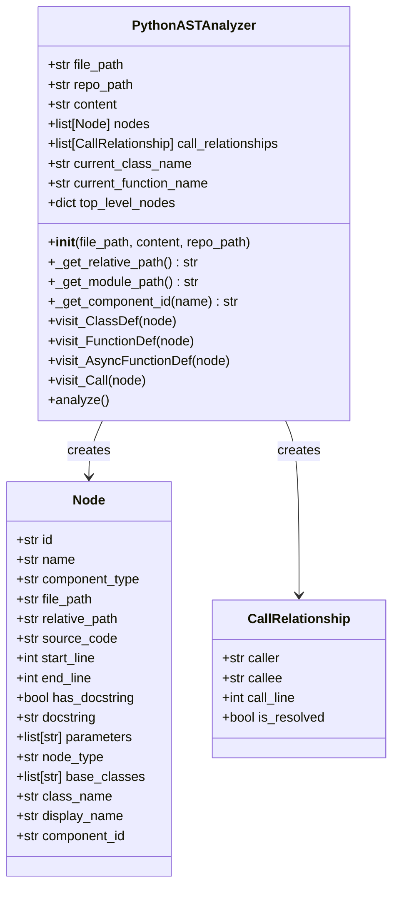
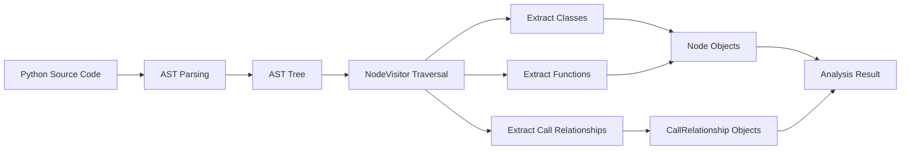
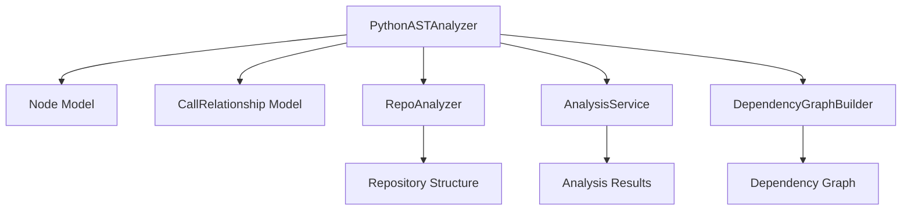

# Python AST Analyzer Module

## Overview

The Python AST Analyzer module is a component of the dependency_analyzer system that specifically handles Python code analysis using Python's built-in Abstract Syntax Tree (AST) module. It parses Python source code to extract classes, functions, and their relationships, creating a structured representation of the codebase that can be used for dependency analysis and documentation generation.

This module is part of the language_analyzers component within the dependency_analyzer system and works in conjunction with other language analyzers to provide comprehensive multi-language code analysis capabilities.

## Architecture

The Python AST Analyzer follows a visitor pattern implementation using Python's `ast.NodeVisitor` class. The architecture consists of:

- **PythonASTAnalyzer**: The main analyzer class that traverses the AST
- **analyze_python_file**: A utility function that provides a simple interface for analysis
- **Node and CallRelationship models**: Data structures for representing code elements and their relationships

## Core Components

### PythonASTAnalyzer Class

The `PythonASTAnalyzer` class extends `ast.NodeVisitor` and implements the core analysis logic. It processes Python source code by:

1. Parsing the source code into an AST using `ast.parse()`
2. Traversing the AST using visitor methods
3. Extracting relevant code elements (classes, functions)
4. Recording relationships between elements
5. Building a collection of `Node` and `CallRelationship` objects

Key methods include:
- `visit_ClassDef()`: Processes class definitions
- `visit_FunctionDef()`: Processes function definitions
- `visit_AsyncFunctionDef()`: Processes async function definitions
- `visit_Call()`: Processes function calls and creates relationships
- `analyze()`: Main entry point for analysis

### analyze_python_file Function

A utility function that provides a simple interface for analyzing Python files. It creates a `PythonASTAnalyzer` instance, performs the analysis, and returns the extracted nodes and relationships.

## Data Flow

The data flow in the Python AST Analyzer follows this sequence:

1. **Input**: Python source code file path and content
2. **Parsing**: Source code is parsed into an AST using `ast.parse()`
3. **Traversal**: The AST is traversed using the visitor pattern
4. **Extraction**: Classes, functions, and call relationships are extracted
5. **Output**: Collections of `Node` and `CallRelationship` objects

## Component Interactions

The Python AST Analyzer interacts with several other components in the system:

- **Node Model**: Used to represent extracted classes, functions, and other code elements
- **CallRelationship Model**: Used to represent relationships between code elements
- **RepoAnalyzer**: Provides repository context for relative path calculations
- **AnalysisService**: Coordinates analysis across multiple files and languages
- **DependencyGraphBuilder**: Uses the analysis results to build comprehensive dependency graphs

## Analysis Process

### Class Analysis
When the analyzer encounters a class definition:
1. Extracts the class name and base classes
2. Creates a `Node` object with class information
3. Records source code, line numbers, and docstring
4. Adds the class to the collection of nodes
5. Creates inheritance relationships with base classes

### Function Analysis
For function definitions:
1. Extracts function name and parameters
2. Creates a `Node` object with function information
3. Records source code, line numbers, and docstring
4. Adds the function to the collection of nodes (if it meets inclusion criteria)
5. Tracks the current function context for relationship analysis

### Relationship Analysis
For function calls:
1. Identifies the caller (current class or function context)
2. Extracts the callee name from the call expression
3. Creates a `CallRelationship` object linking caller to callee
4. Marks relationships as resolved if the callee exists in the current file's top-level nodes

## Language-Specific Features

The Python AST Analyzer handles Python-specific language features:

- **Built-in filtering**: Ignores calls to Python built-in functions
- **Class inheritance**: Detects and records class inheritance relationships
- **Method calls**: Distinguishes between method calls and function calls
- **Async functions**: Properly handles async function definitions
- **Private functions**: Filters out test functions that start with `_test_`

## Integration with System

The Python AST Analyzer integrates with the broader system through:

- **[dependency_analyzer.md](dependency_analyzer.md)**: As part of the language analyzer collection
- **[analysis_engine.md](analysis_engine.md)**: Provides analysis results to the analysis engine
- **[dependency_graph_builder.md](dependency_graph_builder.md)**: Supplies relationship data for dependency graph construction
- **[repo_analyzer.md](repo_analyzer.md)**: Uses repository context for path calculations

## Usage Context

The Python AST Analyzer is typically used within the following workflow:

1. **Repository Analysis**: The [repo_analyzer.md](repo_analyzer.md) identifies Python files in a repository
2. **File Processing**: Each Python file is processed by the Python AST Analyzer
3. **Analysis Aggregation**: Results are aggregated by the [analysis_service.md](analysis_service.md)
4. **Graph Construction**: The [dependency_graph_builder.md](dependency_graph_builder.md) creates dependency graphs
5. **Documentation Generation**: The [documentation_generator.md](documentation_generator.md) uses the analysis results

## Error Handling

The analyzer includes robust error handling:
- **Syntax errors**: Gracefully handles files with invalid Python syntax
- **Path resolution**: Handles various path formats and repository structures
- **Warning suppression**: Suppresses syntax warnings from invalid escape sequences in analyzed code
- **Exception logging**: Logs errors with full traceback information

## Performance Considerations

The analyzer is designed for efficient processing:
- **Single-pass analysis**: Traverses the AST once to extract all information
- **Memory efficient**: Builds collections incrementally during traversal
- **Selective inclusion**: Filters out test functions to reduce output size
- **Built-in filtering**: Excludes built-in function calls to reduce noise

## Limitations

Current limitations of the Python AST Analyzer:
- Only analyzes top-level classes and functions
- Limited cross-file relationship analysis
- Does not handle complex import resolution
- May miss dynamically called functions
- Does not analyze nested functions

## Future Enhancements

Potential improvements for future versions:
- Enhanced import analysis for cross-file relationships
- Support for type hints and annotations
- Nested function analysis
- Dynamic call resolution
- Integration with external dependency analysis tools