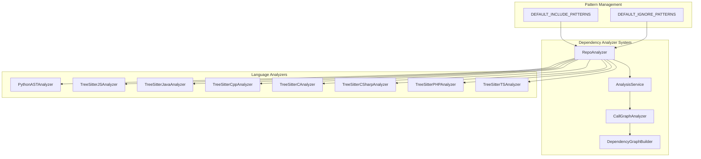

# Repo Analyzer Module Documentation

## Overview

The `repo_analyzer` module is a core component of the dependency_analyzer system that provides functionality to analyze repository structures and generate detailed file tree representations with filtering capabilities. This module is responsible for scanning and cataloging the files and directories within a code repository, applying inclusion and exclusion patterns to focus on relevant source code files.

The module is part of the broader dependency analysis system that helps understand codebase structure, identify entry points, and build dependency graphs for various programming languages.

## Architecture



## Core Components

### RepoAnalyzer Class

The `RepoAnalyzer` class is the primary component of this module, responsible for repository structure analysis.

#### Constructor
```python
def __init__(
    self,
    include_patterns: Optional[List[str]] = None,
    exclude_patterns: Optional[List[str]] = None,
) -> None
```

**Parameters:**
- `include_patterns`: List of file patterns to include in analysis (defaults to `DEFAULT_INCLUDE_PATTERNS`)
- `exclude_patterns`: List of file patterns to exclude from analysis (appended to `DEFAULT_IGNORE_PATTERNS`)

#### Methods

**analyze_repository_structure(repo_dir: str) -> Dict**
Analyzes the repository structure and returns a comprehensive analysis result.

**Returns:**
- `file_tree`: Hierarchical representation of the repository structure
- `summary`: Statistics about the repository including total files and size

**_build_file_tree(repo_dir: str) -> Dict**
Recursively builds a file tree representation of the repository, applying security checks and filtering patterns.

**_should_exclude_path(path: str, filename: str) -> bool**
Determines if a path should be excluded based on exclusion patterns.

**_should_include_file(path: str, filename: str) -> bool**
Determines if a file should be included based on inclusion patterns.

**_count_files(tree: Dict) -> int**
Counts the total number of files in the tree structure.

**_calculate_size(tree: Dict) -> float**
Calculates the total size of files in the tree structure in kilobytes.

## Data Flow


## Security Features

The `RepoAnalyzer` implements several security measures:

1. **Symlink Protection**: Rejects symbolic links to prevent directory traversal attacks
2. **Path Escalation Prevention**: Ensures paths don't escape the base repository directory
3. **Pattern-Based Filtering**: Uses comprehensive ignore patterns to exclude sensitive files

## Pattern Configuration

The module leverages the [patterns](patterns.md) module which provides:

- **DEFAULT_IGNORE_PATTERNS**: Comprehensive list of files and directories to exclude (build artifacts, logs, IDE files, etc.)
- **DEFAULT_INCLUDE_PATTERNS**: List of file extensions to include in analysis (source code, configuration files, etc.)

## Integration with Other Modules

### Analysis Engine
The `RepoAnalyzer` works closely with the [analysis_service](analysis_service.md) and [call_graph_analyzer](call_graph_analyzer.md) to provide repository structure information that feeds into dependency analysis.

### Language Analyzers
The repository structure analysis supports multiple programming languages through various TreeSitter and AST analyzers:
- [PythonASTAnalyzer](language_analyzers.md#pythonastanalyzer)
- [TreeSitterJSAnalyzer](language_analyzers.md#treesitterjsanalyzer)
- [TreeSitterJavaAnalyzer](language_analyzers.md#treesitterjavaanalyzer)
- [TreeSitterCppAnalyzer](language_analyzers.md#treesittercppanalyzer)
- [TreeSitterCAnalyzer](language_analyzers.md#treesittercanalyzer)
- [TreeSitterCSharpAnalyzer](language_analyzers.md#treesittercsharpanalyzer)
- [TreeSitterPHPAnalyzer](language_analyzers.md#treesitterphpanalyzer)
- [TreeSitterTSAnalyzer](language_analyzers.md#treesittertsanalyzer)

### Dependency Graph Builder
The repository structure information is used by the [dependency_graph_builder](dependency_graph_builder.md) to create comprehensive dependency graphs.

## Usage Examples

### Basic Usage
```python
from codewiki.src.be.dependency_analyzer.analysis.repo_analyzer import RepoAnalyzer

analyzer = RepoAnalyzer()
result = analyzer.analyze_repository_structure("/path/to/repository")
print(f"Total files: {result['summary']['total_files']}")
print(f"Total size: {result['summary']['total_size_kb']:.2f} KB")
```

### Custom Patterns
```python
# Include only Python and JavaScript files
analyzer = RepoAnalyzer(
    include_patterns=["*.py", "*.js"],
    exclude_patterns=["tests/", "node_modules/"]
)
result = analyzer.analyze_repository_structure("/path/to/repository")
```

## Output Format

The `analyze_repository_structure` method returns a dictionary with the following structure:

```json
{
  "file_tree": {
    "type": "directory",
    "name": "repository_name",
    "path": ".",
    "children": [
      {
        "type": "directory",
        "name": "src",
        "path": "src",
        "children": [
          {
            "type": "file",
            "name": "main.py",
            "path": "src/main.py",
            "extension": ".py",
            "_size_bytes": 1024
          }
        ]
      }
    ]
  },
  "summary": {
    "total_files": 42,
    "total_size_kb": 128.5
  }
}
```

## Dependencies

- [patterns](patterns.md): Provides default inclusion and exclusion patterns
- [analysis_service](analysis_service.md): Uses repository structure for dependency analysis
- [call_graph_analyzer](call_graph_analyzer.md): Leverages repository structure for call graph analysis

## Performance Considerations

- The module uses recursive tree building with proper error handling for permission issues
- File size calculations are cached during the tree building process
- Pattern matching uses efficient `fnmatch` operations
- Security checks are performed early to avoid unnecessary processing

## Error Handling

The module handles various error conditions:
- Permission errors when accessing directories
- Path resolution issues
- Symlink and path traversal security violations
- Invalid file system objects

## Testing Strategy

The module should be tested with:
- Various repository structures
- Different file inclusion/exclusion patterns
- Security edge cases (symlinks, path traversal attempts)
- Large repositories to verify performance