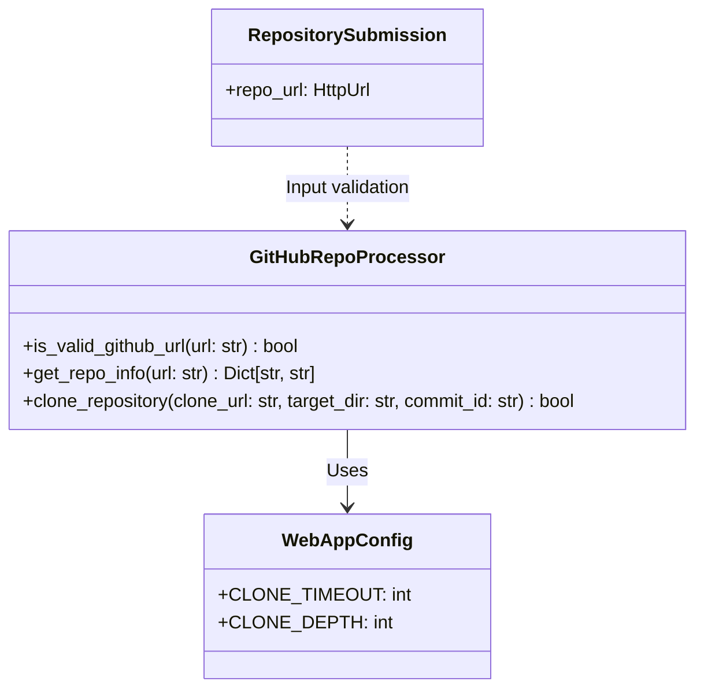
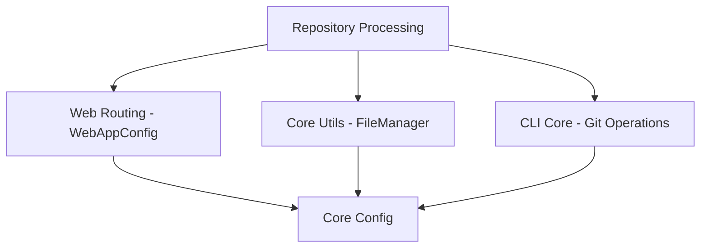
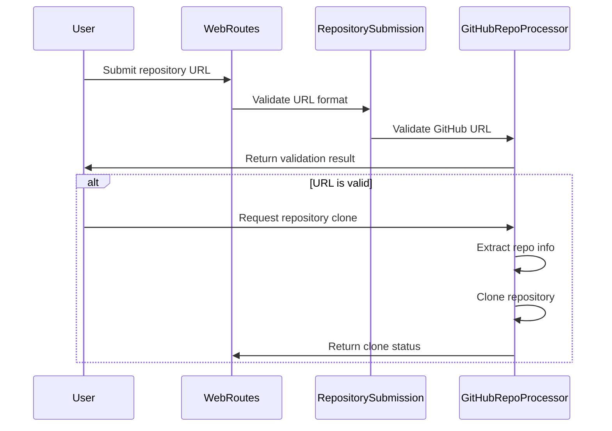
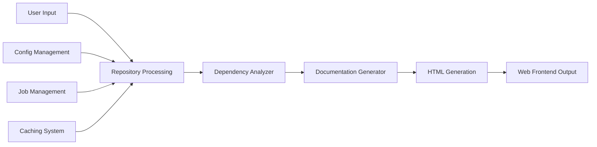

# Repository Processing Module

## Overview

The repository_processing module is a core component of the CodeWiki web application that handles the processing of GitHub repositories. This module is responsible for validating GitHub URLs, extracting repository information, and cloning repositories to prepare them for documentation generation. It serves as the entry point for the documentation generation pipeline by preparing source code repositories for analysis.

## Architecture

The repository_processing module consists of two main components that work together to handle repository processing:

## Core Components

### GitHubRepoProcessor

The `GitHubRepoProcessor` class provides static methods for handling GitHub repository operations:

- **`is_valid_github_url(url: str) -> bool`**: Validates if a URL is a proper GitHub repository URL by checking the domain and path structure
- **`get_repo_info(url: str) -> Dict[str, str]`**: Extracts repository information (owner, repo name, full name, clone URL) from a GitHub URL
- **`clone_repository(clone_url: str, target_dir: str, commit_id: str = None) -> bool`**: Clones a GitHub repository to a target directory, with optional commit-specific checkout

### RepositorySubmission

The `RepositorySubmission` Pydantic model handles the validation of repository submission data:

- **`repo_url: HttpUrl`**: A validated HTTP URL field that ensures the submitted URL is a proper HTTP/HTTPS URL

## Dependencies

The repository_processing module depends on several other modules in the CodeWiki system:

- **WebAppConfig**: Provides configuration values for repository cloning (timeout and depth settings)
- **FileManager**: Used for file system operations during repository cloning
- **GitManager**: Provides additional Git operations that may be used in conjunction with repository processing

## Data Flow

The data flow in the repository_processing module follows this sequence:

## Component Interactions

The repository_processing module interacts with other modules in the following ways:

1. **With Web Routing**: Receives repository URLs from web forms and returns processing status
2. **With Job Management**: Provides cloned repositories for documentation generation jobs
3. **With Caching System**: Works with CacheManager to store processed repositories
4. **With CLI Core**: Uses GitManager for advanced Git operations when needed

## Integration with Overall System

The repository_processing module fits into the overall CodeWiki system as follows:

The module serves as the initial processing step in the documentation generation pipeline, preparing repositories for the dependency_analyzer module which performs code analysis, followed by the documentation_generator module which creates documentation, and finally the html_generation module which formats the output.

## Configuration

The repository_processing module uses configuration values from [web_routing](web_routing.md) and [core_config](core_config.md):

- `CLONE_TIMEOUT`: Maximum time allowed for repository cloning operations
- `CLONE_DEPTH`: Depth of repository history to clone (for shallow clones)

## Error Handling

The module implements error handling for:
- Invalid GitHub URLs
- Repository cloning failures
- Network timeouts during cloning
- File system permission issues

## Usage Examples

The repository_processing module is typically used in the following scenarios:
- Processing user-submitted GitHub repository URLs
- Preparing repositories for documentation generation
- Validating repository accessibility before processing
- Cloning repositories at specific commits for historical documentation

For more information about related modules, see:
- [web_routing](web_routing.md) for web application routing and configuration
- [job_management](job_management.md) for documentation job tracking
- [dependency_analyzer](dependency_analyzer.md) for code analysis after repository processing
- [cli_core](cli_core.md) for command-line operations and Git management