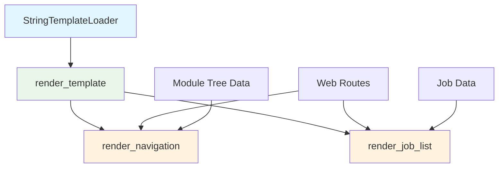
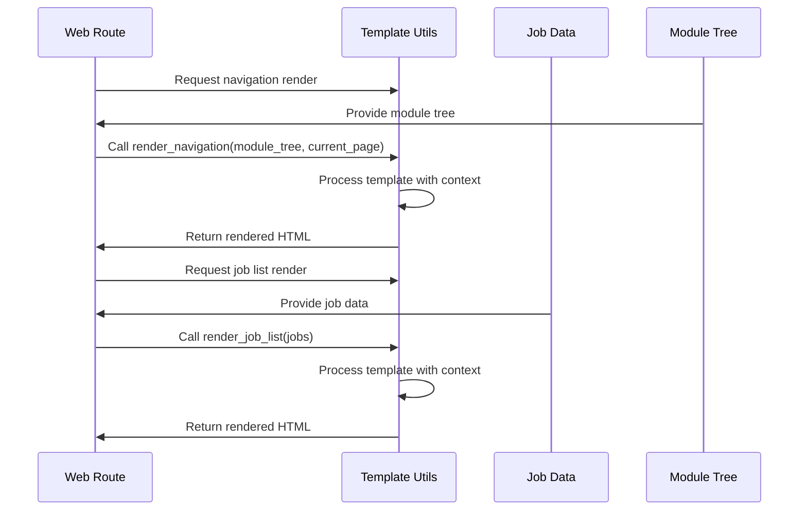

# Template Utilities Module Documentation

## Overview

The `template_utils` module provides template rendering capabilities for the web frontend of the CodeWiki application. It leverages Jinja2 templating engine to render HTML content dynamically, primarily for generating navigation menus and job lists in the web interface. This module is part of the web frontend layer and serves as a utility for rendering various UI components.

## Architecture

The module follows a simple utility-based architecture with a custom Jinja2 loader and several template rendering functions:



## Core Components

### StringTemplateLoader

The `StringTemplateLoader` is a custom Jinja2 loader that enables template rendering from string content rather than files. This is particularly useful for dynamic template generation in web applications.

**Key Features:**
- Inherits from `jinja2.BaseLoader`
- Accepts template strings directly in constructor
- Provides template source for Jinja2 environment

**Usage:**
```python
loader = StringTemplateLoader(template_string)
```

## Functions

### render_template(template, context)

Renders a Jinja2 template string with the provided context data.

**Parameters:**
- `template` (str): HTML template string with Jinja2 syntax
- `context` (Dict[str, Any]): Dictionary of variables to substitute in the template

**Returns:**
- `str`: Rendered HTML string

**Implementation Details:**
- Creates a Jinja2 environment with the custom `StringTemplateLoader`
- Enables autoescape for HTML/XML content
- Configures trim_blocks and lstrip_blocks for cleaner output

### render_navigation(module_tree, current_page)

Renders navigation HTML from a module tree structure, typically used to generate sidebar navigation in documentation interfaces.

**Parameters:**
- `module_tree` (Dict[str, Any]): Dictionary representing the module tree structure
- `current_page` (str): Current page filename for highlighting the active navigation item

**Returns:**
- `str`: HTML string for navigation menu

**Template Features:**
- Iterates through module tree sections
- Generates links for both parent modules and child modules
- Applies active class to current page
- Formats section names with proper capitalization

### render_job_list(jobs)

Renders an HTML list of jobs, typically used in the job management interface to display repository processing jobs.

**Parameters:**
- `jobs` (list): List of job objects containing repository URLs, status, progress, etc.

**Returns:**
- `str`: HTML string for job list display

**Template Features:**
- Displays repository URL and job status
- Shows progress information when available
- Provides action buttons for completed jobs
- Applies status-specific styling

## Dependencies

This module depends on:
- [jinja2](https://jinja.palletsprojects.com/): Template engine for Python
- Standard Python typing modules for type hints

## Integration Points

The `template_utils` module integrates with:
- [web_routing](web_routing.md): Used by web routes to render dynamic HTML content
- [job_management](job_management.md): Provides job list rendering for job status displays
- [web_app_config](web_app_config.md): May be used in configuration of web application templates

## Data Flow



## Usage Examples

### Basic Template Rendering
```python
template = "<h1>Hello {{ name }}!</h1>"
context = {"name": "World"}
result = render_template(template, context)
# Output: "<h1>Hello World!</h1>"
```

### Navigation Rendering
```python
module_tree = {
    "documentation_generator": {
        "components": ["DocumentationGenerator"],
        "children": {
            "generator_core": {"components": ["GeneratorCore"]}
        }
    }
}
nav_html = render_navigation(module_tree, "documentation_generator.md")
```

### Job List Rendering
```python
jobs = [
    {"repo_url": "https://github.com/example/repo", "status": "completed", "job_id": "123"}
]
job_list_html = render_job_list(jobs)
```

## Error Handling

The module includes basic error handling through Jinja2's built-in mechanisms. Template rendering errors will propagate as Jinja2 exceptions, which should be handled by the calling components.

## Performance Considerations

- Templates are processed on-demand rather than pre-compiled
- For high-frequency rendering, consider caching rendered templates
- The custom loader is lightweight and efficient for string-based templates

## Security Considerations

- Autoescape is enabled by default for HTML/XML content
- Input validation should be performed by calling components before template rendering
- Template injection vulnerabilities can occur if untrusted input is passed directly to templates

## Testing Considerations

When testing components that use this module:
- Verify template rendering with various context inputs
- Test edge cases like empty lists or missing context values
- Ensure proper escaping of special characters
- Validate generated HTML structure

## Future Enhancements

Potential improvements could include:
- Template caching for better performance
- Support for more complex template layouts
- Integration with CSS framework classes
- Additional template helper functions