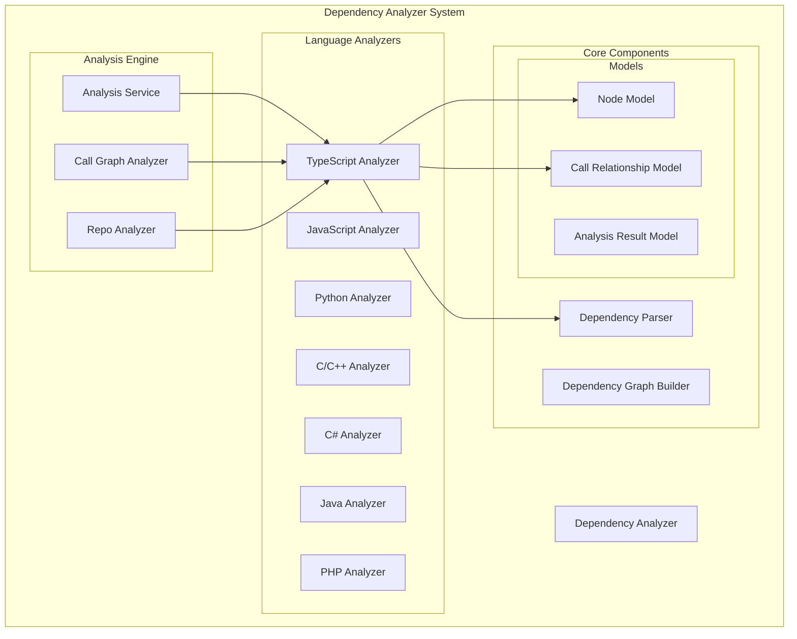
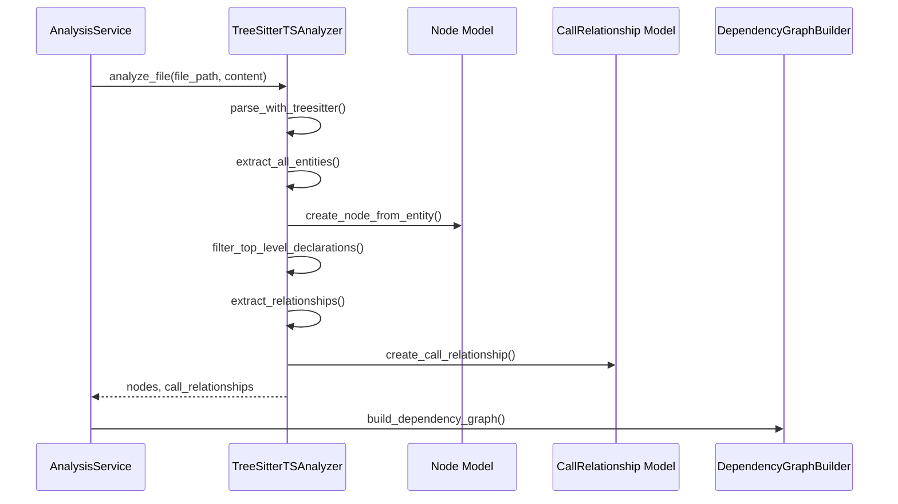

# TypeScript Analyzer Module

## Overview

The `typescript_analyzer` module is a specialized component within the dependency_analyzer system that provides TypeScript code analysis capabilities using Tree-sitter parsing. This module extracts top-level declarations, identifies relationships between code entities, and generates dependency information for TypeScript files.

The module is part of the broader dependency analysis engine that supports multiple programming languages and is designed to work within the CodeWiki system for code understanding and documentation generation.

## Architecture



## Core Components

### TreeSitterTSAnalyzer

The main class responsible for analyzing TypeScript files using Tree-sitter parsing technology.

#### Key Features:
- **AST-based Analysis**: Uses Tree-sitter's TypeScript grammar to parse and analyze code
- **Entity Extraction**: Identifies functions, classes, interfaces, types, enums, and variables
- **Relationship Detection**: Discovers call relationships, inheritance, and type dependencies
- **Top-level Filtering**: Focuses on top-level declarations while filtering out nested entities
- **Context Awareness**: Maintains context information for accurate relationship mapping

#### Entity Types Supported:
- Functions (regular, generator, arrow functions)
- Classes (regular, abstract)
- Interfaces
- Type aliases
- Enums
- Variables (const, let, var)
- Export statements
- Ambient declarations

## Data Flow

```mermaid
flowchart LR
    A[TypeScript File Content] --> B[TreeSitterTSAnalyzer Initialization]
    B --> C[Parse AST with Tree-sitter]
    C --> D[Extract All Entities]
    D --> E[Filter Top-level Declarations]
    E --> F[Create Node Objects]
    F --> G[Extract Relationships]
    G --> H[Build Call Relationships]
    H --> I[Return Nodes & Relationships]
    
    style A fill:#e1f5fe
    style I fill:#e8f5e8
```



## Component Interaction



## Analysis Process

### 1. Initialization
The analyzer initializes with:
- File path
- File content
- Repository path (optional)
- Tree-sitter TypeScript parser

### 2. AST Parsing
- Parses the TypeScript file content into an Abstract Syntax Tree
- Uses Tree-sitter's TypeScript grammar for accurate parsing
- Handles parsing errors gracefully

### 3. Entity Extraction
The analyzer traverses the AST to identify various entity types:

```python
# Supported entity types
entity_types = [
    "function_declaration",
    "generator_function_declaration", 
    "arrow_function",
    "method_definition",
    "class_declaration",
    "abstract_class_declaration",
    "interface_declaration",
    "type_alias_declaration",
    "enum_declaration",
    "variable_declarator",
    "export_statement",
    "lexical_declaration",
    "variable_declaration",
    "ambient_declaration"
]
```

### 4. Top-level Declaration Filtering
The analyzer implements sophisticated logic to identify truly top-level declarations:

- Filters out entities nested within function bodies
- Handles export statements and ambient declarations
- Maintains parent context information
- Excludes variables from top-level consideration

### 5. Relationship Extraction
The analyzer identifies various types of relationships:

- **Call relationships**: Function and method calls
- **Constructor dependencies**: Type annotations in constructor parameters
- **Inheritance relationships**: Class extends and interface implements
- **Type relationships**: Type annotations and type arguments
- **Member access**: Property and method access patterns

## Key Methods

### `_extract_all_entities(node, all_entities, depth)`
Recursively traverses the AST to identify and extract all code entities, maintaining depth information for proper filtering.

### `_filter_top_level_declarations(all_entities)`
Filters entities to include only those that are truly top-level declarations, excluding nested functions and methods.

### `_extract_all_relationships(node, all_entities)`
Analyzes the AST to identify relationships between entities, including calls, inheritance, and type dependencies.

### `_create_node_from_entity(entity_data)`
Converts extracted entity data into standardized Node objects compatible with the dependency analysis system.

## Integration with Other Modules

### [dependency_graph_builder.md](dependency_graph_builder.md)
The extracted nodes and relationships are passed to the dependency graph builder to create comprehensive dependency graphs.

### [analysis_service.md](analysis_service.md)
The TypeScript analyzer is invoked by the analysis service as part of the multi-language analysis pipeline.

### [core_models.md](core_models.md)
The analyzer produces Node and CallRelationship objects that conform to the core data models used throughout the system.

## Error Handling

The analyzer implements robust error handling:
- Parser initialization failures are logged and handled gracefully
- Individual file analysis errors don't stop the overall analysis process
- Detailed logging for debugging analysis issues
- Fallback mechanisms when specific entity types cannot be processed

## Performance Considerations

- Efficient AST traversal algorithms
- Memory-conscious entity storage
- Selective entity extraction to avoid processing nested elements unnecessarily
- Caching of parser instances where possible

## Usage Context

This module is typically used within the broader dependency analysis workflow:

1. Repository analysis identifies TypeScript files
2. Files are processed by the TypeScript analyzer
3. Extracted dependencies are combined with other language analyses
4. Comprehensive dependency graphs are generated
5. Results feed into documentation generation and code understanding tools

## Dependencies

- `tree_sitter`: Core parsing library
- `tree_sitter_typescript`: TypeScript grammar for Tree-sitter
- [core_models.md](core_models.md): Node and CallRelationship models
- Standard Python libraries for file handling and logging