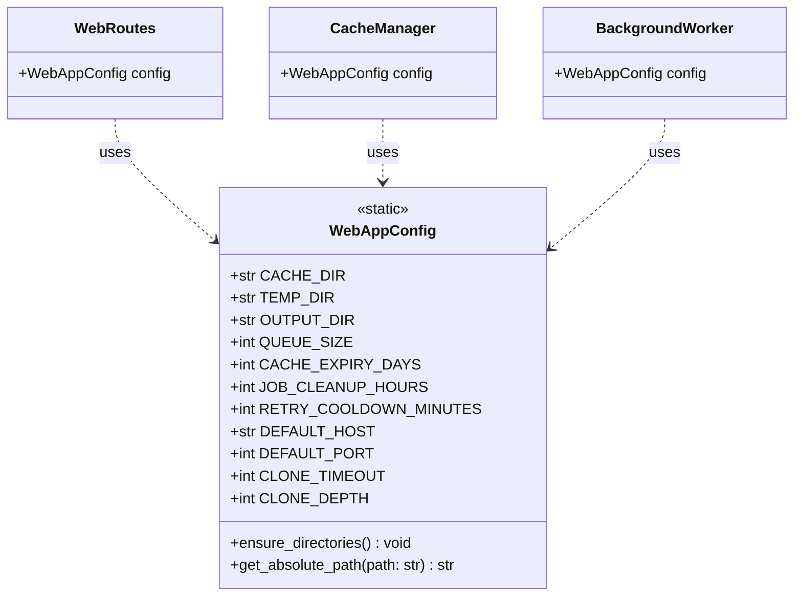
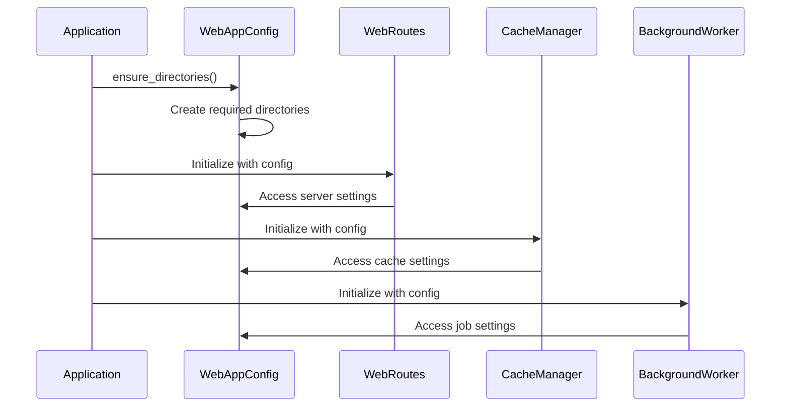

# WebAppConfig Module Documentation

## Introduction

The `web_app_config` module provides configuration settings for the CodeWiki web application. It contains the `WebAppConfig` class which centralizes all configuration parameters needed for the web frontend, including directory paths, queue settings, caching parameters, job management settings, server configuration, and Git operations.

## Core Component: WebAppConfig Class

The `WebAppConfig` class is a static configuration class that defines various settings used throughout the web application. It includes:

- Directory paths for caching, temporary files, and output
- Queue and cache management settings
- Job cleanup and retry parameters
- Server configuration (host and port)
- Git operation settings

### Configuration Parameters

#### Directory Settings
- `CACHE_DIR`: Path to cache directory (`./output/cache`)
- `TEMP_DIR`: Path to temporary files directory (`./output/temp`)
- `OUTPUT_DIR`: Path to main output directory (`./output`)

#### Queue and Cache Settings
- `QUEUE_SIZE`: Maximum size of the processing queue (100 items)
- `CACHE_EXPIRY_DAYS`: Number of days before cache entries expire (365 days)

#### Job Management Settings
- `JOB_CLEANUP_HOURS`: Hours after which jobs are cleaned up (24000 hours)
- `RETRY_COOLDOWN_MINUTES`: Minutes to wait before retrying failed operations (3 minutes)

#### Server Settings
- `DEFAULT_HOST`: Default server host (`127.0.0.1`)
- `DEFAULT_PORT`: Default server port (8000)

#### Git Settings
- `CLONE_TIMEOUT`: Timeout for Git clone operations in seconds (300 seconds)
- `CLONE_DEPTH`: Depth for shallow Git clones (1)

### Key Methods

#### ensure_directories()
Ensures that all required directories exist by creating them if they don't already exist. This method creates the cache, temporary, and output directories.

#### get_absolute_path(path: str) -> str
Converts a relative path to an absolute path, which is useful for consistent file operations across different environments.

## Architecture and Integration



## Dependencies and Relationships

The `WebAppConfig` module is used by several other modules in the web frontend:

- [web_routing](web_routing.md): Uses configuration for server settings and directory paths
- [caching_system](caching_system.md): Relies on cache directory and expiry settings
- [job_management](job_management.md): Uses queue size and job cleanup settings
- [repository_processing](repository_processing.md): Utilizes Git settings for repository operations

## Data Flow


## Component Interaction



## Usage Examples

The configuration is typically used as follows:

```python
from codewiki.src.fe.config import WebAppConfig

# Ensure directories exist at startup
WebAppConfig.ensure_directories()

# Access configuration values
cache_dir = WebAppConfig.CACHE_DIR
server_host = WebAppConfig.DEFAULT_HOST
server_port = WebAppConfig.DEFAULT_PORT

# Get absolute paths when needed
absolute_cache_path = WebAppConfig.get_absolute_path(WebAppConfig.CACHE_DIR)
```

## Integration with Other Modules

The `WebAppConfig` module integrates with the broader system through:

- [core_config](core_config.md): May be extended or overridden by core configuration
- [web_frontend](web_frontend.md): Provides essential configuration for the entire web frontend
- [cli_core](cli_core.md): Shares some configuration patterns with CLI components

## Best Practices

1. **Initialization**: Always call `ensure_directories()` at application startup to ensure required directories exist
2. **Path Handling**: Use `get_absolute_path()` when working with file paths to ensure consistency
3. **Configuration Updates**: Modify configuration values through the class attributes rather than hardcoding values elsewhere
4. **Environment Considerations**: Consider environment-specific overrides for production deployments

## Security Considerations

- Directory paths should be validated when accepting user input
- Default server settings may need adjustment for production environments
- Cache expiry settings should balance performance with data freshness requirements

## Performance Implications

- Cache expiry settings affect storage usage and data freshness
- Queue size limits impact concurrent processing capabilities
- Directory structure impacts file I/O performance

## Future Enhancements

Potential improvements could include:
- Environment variable overrides for configuration values
- Configuration validation mechanisms
- Dynamic configuration reloading capabilities
- Separate configuration for different deployment environments