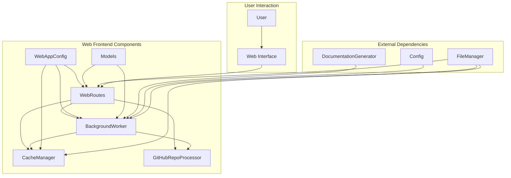
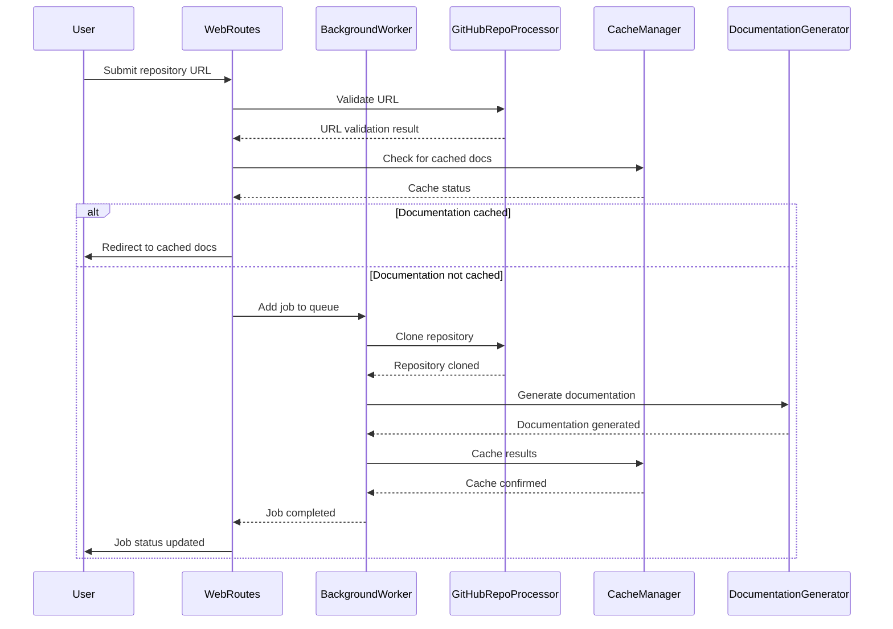

# Web Frontend Module Documentation

## Overview

The web_frontend module provides a FastAPI-based web interface for the CodeWiki application. It enables users to submit GitHub repositories for documentation generation and provides a user-friendly interface to view the generated documentation. The module handles job management, caching, and repository processing in the background.

## Architecture Overview

## Core Components

### [WebAppConfig](web_app_config.md)
Configuration class that manages all web application settings including cache directories, queue sizes, and server settings.

### Models
Data models for the web application including:
- `RepositorySubmission`: Handles repository submission form data
- `JobStatusResponse`: API response model for job status
- `JobStatus`: Tracks documentation generation job status
- `CacheEntry`: Represents cached documentation results

### [Repository Processing](repository_processing.md)
Handles GitHub repository processing including URL validation, repository information extraction, and repository cloning.

### [Caching System](caching_system.md)
Manages documentation cache with features for caching, retrieving, and cleaning up expired documentation.

### [Job Management](job_management.md)
Background worker that processes documentation generation jobs in a queue-based system with proper status tracking.

### [Web Routing](web_routing.md)
Handles all web routes for the application including the main page, job status API, and documentation viewing.

### [Template Utilities](template_utils.md)
Provides template rendering utilities using Jinja2 for generating HTML responses.

## Module Integration

The web_frontend module integrates with several other modules in the CodeWiki system:

- **[dependency_analyzer.md]**: Used for analyzing repository structure during documentation generation
- **[documentation_generator.md]**: Core component that generates documentation from repository analysis
- **[cli_core.md]**: Provides models and utilities for job management and configuration
- **[core_config.md]**: Supplies global configuration settings
- **[core_utils.md]**: Provides file management utilities

## Key Features

1. **Repository Submission**: Users can submit GitHub repositories via a web form
2. **Job Queue Management**: Processes documentation generation jobs in the background
3. **Caching System**: Caches generated documentation to avoid redundant processing
4. **Progress Tracking**: Provides real-time status updates for documentation jobs
5. **Documentation Viewer**: Allows users to browse generated documentation
6. **Commit-Specific Processing**: Supports documentation generation for specific commits

## Data Flow

## Configuration

The web frontend uses the `WebAppConfig` class to manage various settings:

- **CACHE_DIR**: Directory for storing cached documentation
- **TEMP_DIR**: Temporary directory for repository cloning
- **QUEUE_SIZE**: Maximum number of jobs in the processing queue
- **CACHE_EXPIRY_DAYS**: Number of days before cached documentation expires
- **SERVER_SETTINGS**: Host and port configuration for the web server