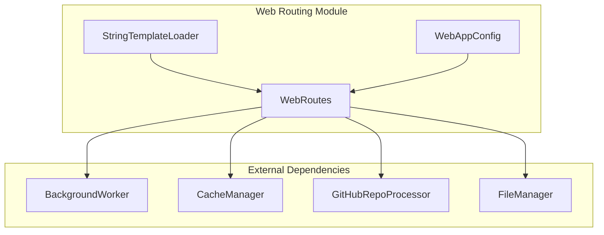
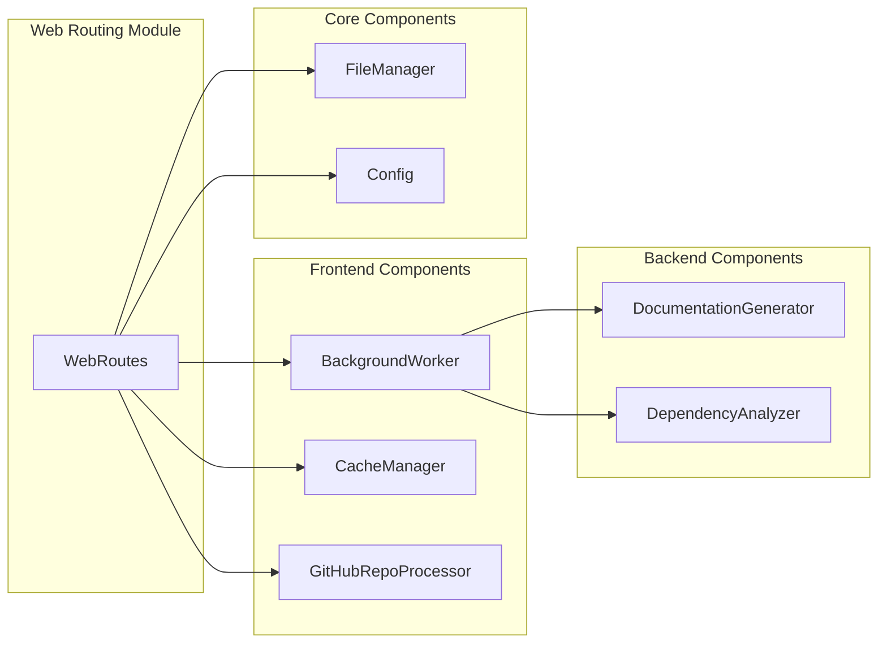
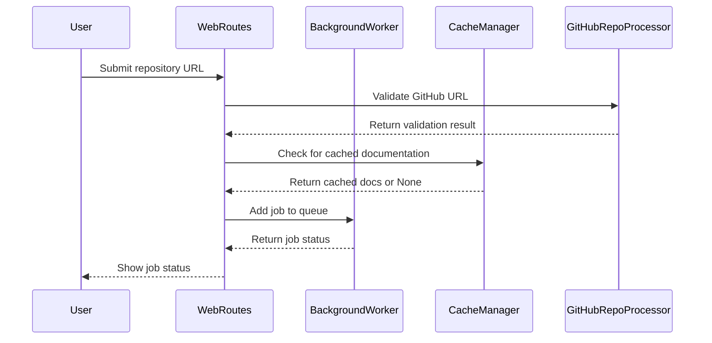
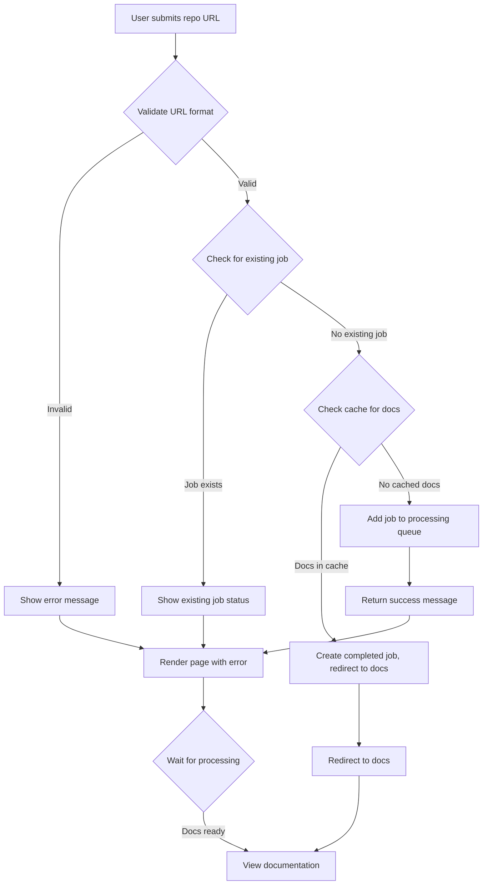
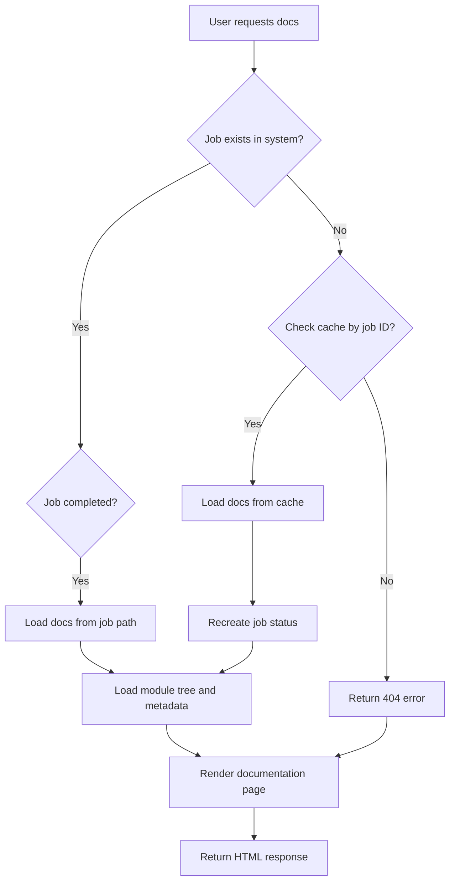

# Web Routing Module Documentation

## Overview

The web_routing module is a critical component of the CodeWiki web application that handles all HTTP routes and request processing. It provides the interface between users and the documentation generation system, managing repository submissions, job status tracking, and documentation viewing. The module integrates with background processing, caching, and template rendering systems to deliver a seamless user experience.

## Architecture

The web_routing module consists of three main components that work together to handle web requests:

## Core Components

### WebRoutes

The `WebRoutes` class is the primary handler for all web routes in the application. It manages:

- Main page rendering with repository submission form
- Repository submission processing
- Job status tracking and API endpoints
- Documentation viewing and serving
- Job cleanup operations

#### Key Methods

- `index_get()`: Renders the main page with recent jobs and submission form
- `index_post()`: Processes repository submissions and adds jobs to the queue
- `get_job_status()`: API endpoint for checking job status
- `view_docs()`: Redirects to generated documentation
- `serve_generated_docs()`: Serves individual documentation files
- `cleanup_old_jobs()`: Removes expired job entries

### StringTemplateLoader

The `StringTemplateLoader` is a custom Jinja2 template loader that enables rendering of string-based templates. It provides:

- Template rendering utilities using Jinja2
- Navigation rendering from module tree structures
- Job list rendering for display

### WebAppConfig

The `WebAppConfig` class manages all configuration settings for the web application, including:

- Directory paths for cache, temp, and output
- Queue and cache settings
- Job cleanup parameters
- Server configuration
- Git operation settings

## Component Interactions

The web_routing module interacts with several other modules in the system:

## Data Flow

The web_routing module follows this data flow pattern:

## Process Flow

### Repository Submission Process

### Documentation Serving Process

## Configuration Settings

The web_routing module uses the following configuration parameters:

| Setting | Default Value | Purpose |
|---------|---------------|---------|
| CACHE_DIR | "./output/cache" | Directory for cached documentation |
| TEMP_DIR | "./output/temp" | Temporary file storage |
| OUTPUT_DIR | "./output" | Main output directory |
| QUEUE_SIZE | 100 | Maximum number of queued jobs |
| CACHE_EXPIRY_DAYS | 365 | Days before cache expires |
| JOB_CLEANUP_HOURS | 24000 | Hours before old jobs are cleaned up |
| RETRY_COOLDOWN_MINUTES | 3 | Minutes before retrying failed jobs |
| DEFAULT_HOST | "127.0.0.1" | Default server host |
| DEFAULT_PORT | 8000 | Default server port |

## Error Handling

The web_routing module implements comprehensive error handling:

- **URL Validation**: Checks for valid GitHub repository URLs
- **Job Status**: Prevents duplicate submissions and handles retry cooldowns
- **File Access**: Validates documentation file existence before serving
- **Template Rendering**: Handles template errors gracefully
- **HTTP Exceptions**: Returns appropriate status codes for various error conditions

## Integration Points

The web_routing module integrates with:

- [job_management](job_management.md) for job status tracking
- [caching_system](caching_system.md) for documentation caching
- [repository_processing](repository_processing.md) for GitHub repository handling
- [core_utils](core_utils.md) for file operations
- [documentation_generator](documentation_generator.md) for documentation generation

## Dependencies

The web_routing module depends on several external libraries:

- FastAPI for web framework functionality
- Jinja2 for template rendering
- Pathlib for file path operations
- Dataclasses for data structure management

## Performance Considerations

- **Caching**: Implements caching to avoid redundant documentation generation
- **Job Cleanup**: Automatically removes old job entries to prevent memory bloat
- **URL Normalization**: Standardizes repository URLs for consistent comparison
- **Queue Management**: Limits queue size to prevent system overload

## Security Considerations

- **Input Validation**: Validates GitHub URLs to prevent malicious input
- **Path Validation**: Ensures requested files exist before serving
- **Rate Limiting**: Implements retry cooldowns to prevent abuse
- **Directory Traversal Protection**: Uses Path operations to prevent access to unauthorized files

## Testing Considerations

When testing the web_routing module, consider:

- URL validation edge cases
- Job status race conditions
- Cache invalidation scenarios
- Error response handling
- Template rendering with various data inputs