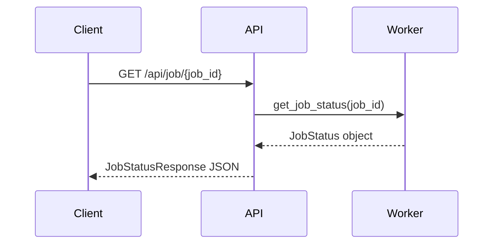
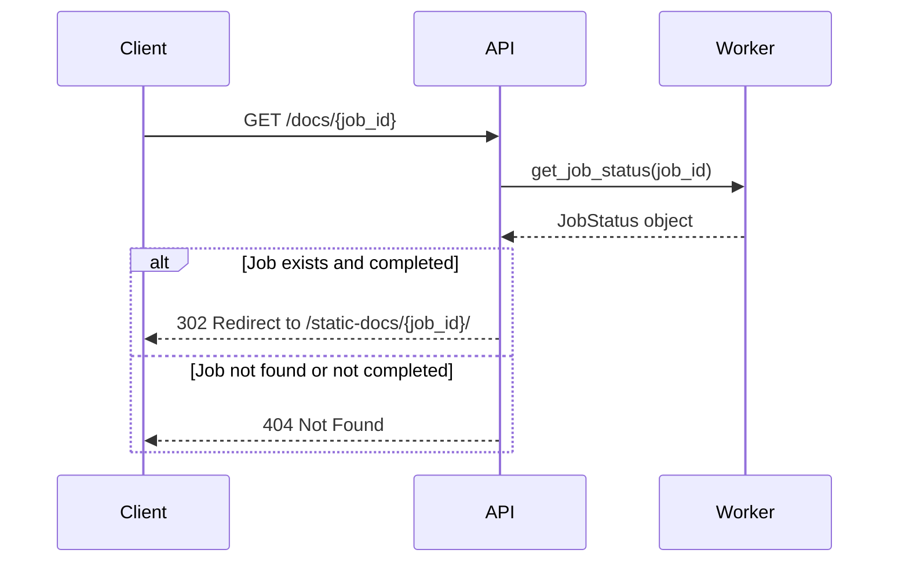
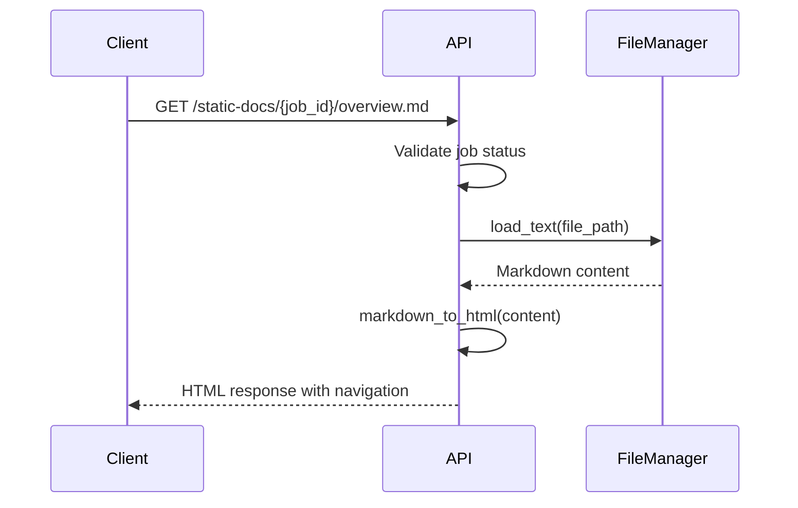
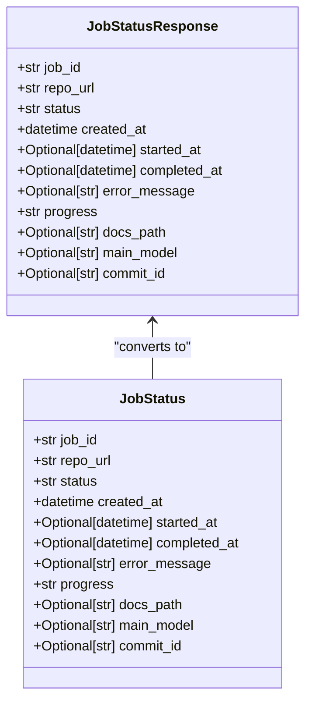
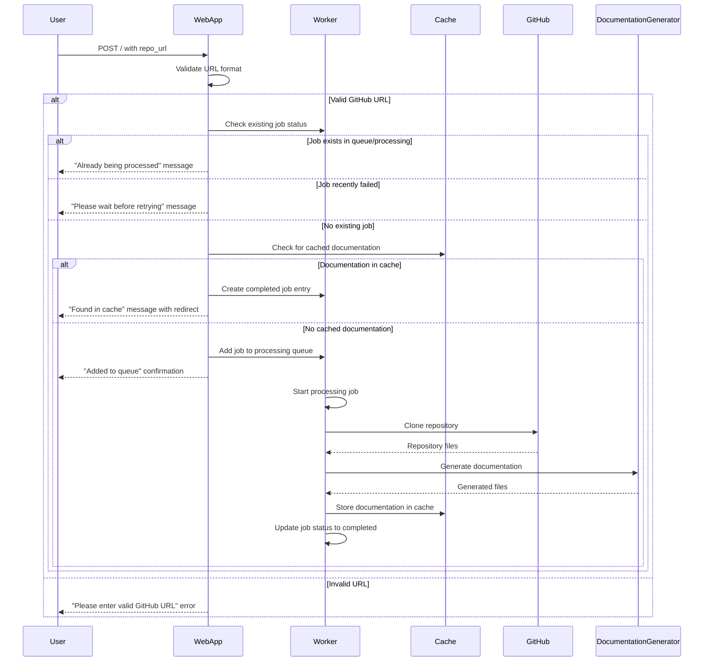
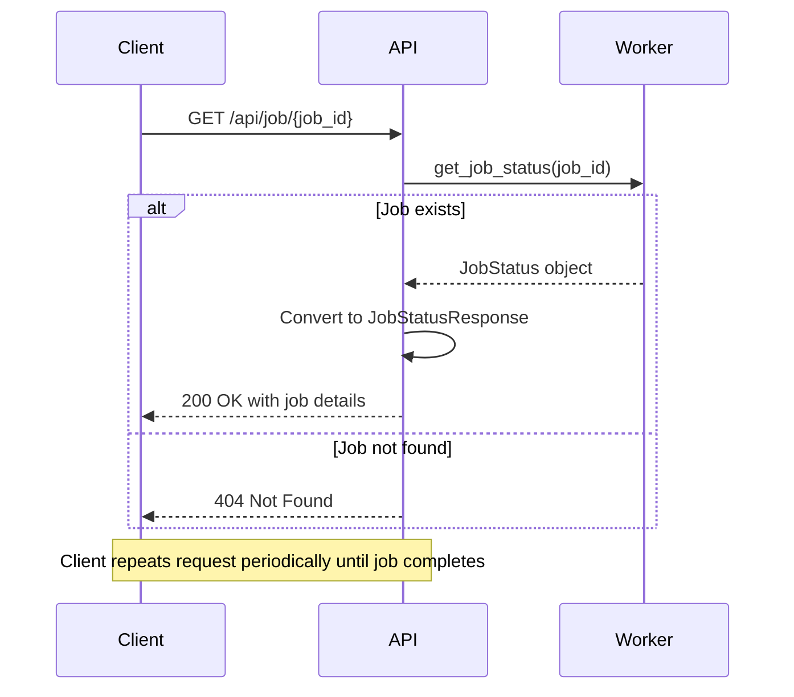
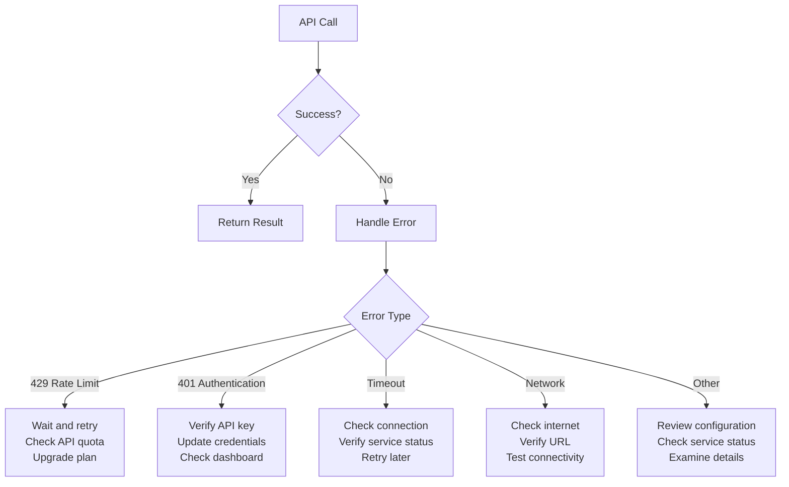
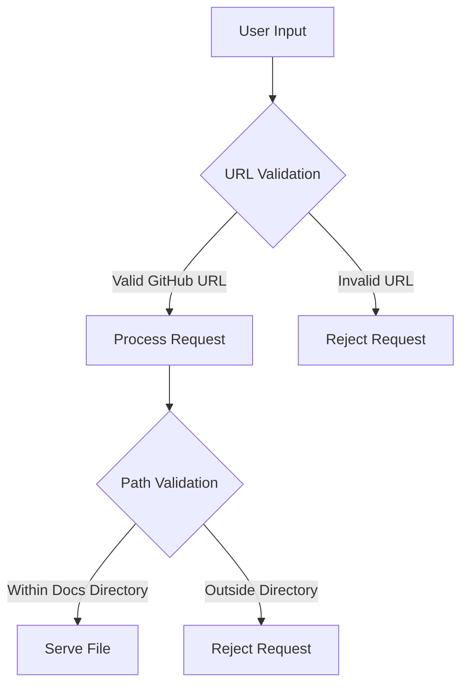
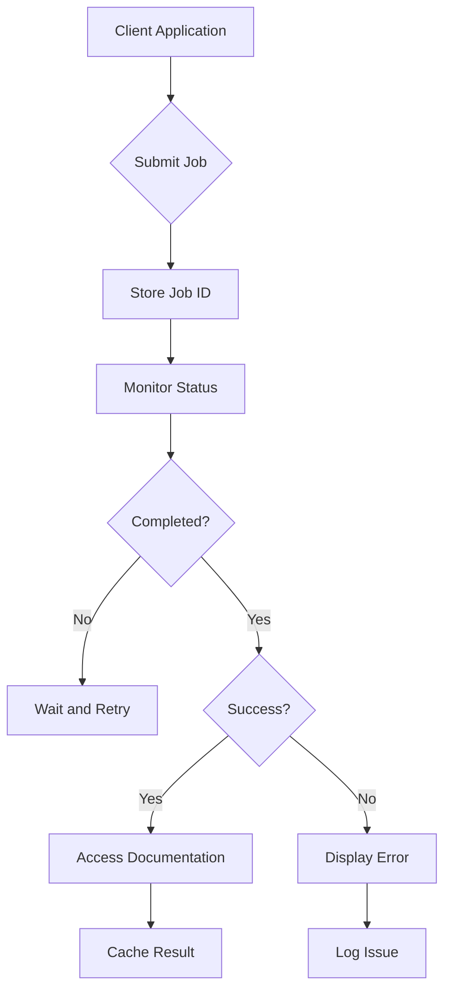

# API Reference

<cite>
**Referenced Files in This Document**   
- [web_app.py](file://codewiki/src/fe/web_app.py)
- [routes.py](file://codewiki/src/fe/routes.py)
- [models.py](file://codewiki/src/fe/models.py)
- [background_worker.py](file://codewiki/src/fe/background_worker.py)
- [cache_manager.py](file://codewiki/src/fe/cache_manager.py)
- [config.py](file://codewiki/src/fe/config.py)
- [github_processor.py](file://codewiki/src/fe/github_processor.py)
- [job.py](file://codewiki/cli/models/job.py)
- [api_errors.py](file://codewiki/cli/utils/api_errors.py)
- [visualise_docs.py](file://codewiki/src/fe/visualise_docs.py)
</cite>

## Table of Contents
1. [Introduction](#introduction)
2. [Core Endpoints](#core-endpoints)
3. [Job Model Structure](#job-model-structure)
4. [Request-Response Flow](#request-response-flow)
5. [Error Handling](#error-handling)
6. [API Usage Examples](#api-usage-examples)
7. [Security Considerations](#security-considerations)
8. [Client Implementation Guidelines](#client-implementation-guidelines)

## Introduction

The CodeWiki API provides a RESTful interface for generating comprehensive documentation for GitHub repositories. The API enables users to submit documentation generation jobs, monitor their progress, and access the generated documentation. Built on FastAPI, the web interface offers both a user-friendly web form and a programmatic API for integration with third-party tools.

The API follows a job-based architecture where documentation generation is processed asynchronously. When a repository is submitted, a job is created and placed in a processing queue. Users can then query the job status to monitor progress and retrieve the generated documentation when complete. The system includes caching mechanisms to avoid redundant processing of previously documented repositories.

**Section sources**
- [web_app.py](file://codewiki/src/fe/web_app.py#L1-L133)
- [routes.py](file://codewiki/src/fe/routes.py#L1-L299)

## Core Endpoints

The CodeWiki API exposes several endpoints for interacting with the documentation generation system. The primary endpoints are `/api/job/{job_id}` for retrieving job status and `/docs/{job_id}` for accessing generated documentation.

### Job Status Endpoint

The `/api/job/{job_id}` endpoint provides real-time status information about a documentation generation job. This endpoint supports the GET method and returns a JSON response with detailed job information.

**HTTP Method**: GET  
**URL Pattern**: `/api/job/{job_id}`  
**Authentication**: None required  
**Parameters**:
- `job_id` (path): Unique identifier for the job, derived from the repository's full name (e.g., "owner--repo" for "owner/repo")

The endpoint returns a `JobStatusResponse` Pydantic model containing comprehensive job information including status, timestamps, progress messages, and error details if applicable.



**Diagram sources**
- [web_app.py](file://codewiki/src/fe/web_app.py#L54-L57)
- [routes.py](file://codewiki/src/fe/routes.py#L155-L161)
- [models.py](file://codewiki/src/fe/models.py#L17-L30)

### Documentation Access Endpoint

The `/docs/{job_id}` endpoint provides access to generated documentation for a completed job. This endpoint supports the GET method and returns an HTTP redirect to the documentation viewer.

**HTTP Method**: GET  
**URL Pattern**: `/docs/{job_id}`  
**Authentication**: None required  
**Parameters**:
- `job_id` (path): Unique identifier for the job

When a job is completed, this endpoint redirects clients to the static documentation viewer at `/static-docs/{job_id}/`. If the job is not found or documentation is not available, appropriate HTTP error responses are returned.



**Diagram sources**
- [web_app.py](file://codewiki/src/fe/web_app.py#L60-L63)
- [routes.py](file://codewiki/src/fe/routes.py#L163-L177)

### Static Documentation Endpoint

The `/static-docs/{job_id}/` and `/static-docs/{job_id}/{filename:path}` endpoints serve the actual generated documentation files. These endpoints support the GET method and return HTML responses with rendered markdown content.

**HTTP Method**: GET  
**URL Patterns**:
- `/static-docs/{job_id}/` - Redirects to overview.md
- `/static-docs/{job_id}/{filename:path}` - Serves specific documentation file

The endpoint converts markdown files to HTML with special handling for Mermaid diagrams and provides a consistent navigation interface using the module tree structure.



**Diagram sources**
- [routes.py](file://codewiki/src/fe/routes.py#L179-L268)
- [visualise_docs.py](file://codewiki/src/fe/visualise_docs.py#L107-L180)

## Job Model Structure

The job model structure in CodeWiki represents the state and metadata of a documentation generation job. The system uses two related models: `JobStatus` for internal tracking and `JobStatusResponse` for API responses.

### JobStatusResponse Model

The `JobStatusResponse` Pydantic model defines the schema for API responses from the `/api/job/{job_id}` endpoint. This model includes the following fields:

| Field | Type | Description |
|-------|------|-------------|
| job_id | str | Unique identifier for the job |
| repo_url | str | GitHub repository URL |
| status | str | Current job status (queued, processing, completed, failed) |
| created_at | datetime | Timestamp when job was created |
| started_at | Optional[datetime] | Timestamp when job started processing |
| completed_at | Optional[datetime] | Timestamp when job completed |
| error_message | Optional[str] | Error message if job failed |
| progress | str | Human-readable progress message |
| docs_path | Optional[str] | File system path to generated documentation |
| main_model | Optional[str] | LLM model used for generation |
| commit_id | Optional[str] | Git commit ID for documentation |

### JobStatus Dataclass

The `JobStatus` dataclass is used internally to track job state. It contains the same fields as `JobStatusResponse` but is implemented as a dataclass rather than a Pydantic model for performance reasons.



**Diagram sources**
- [models.py](file://codewiki/src/fe/models.py#L17-L46)
- [routes.py](file://codewiki/src/fe/routes.py#L32-L46)

**Section sources**
- [models.py](file://codewiki/src/fe/models.py#L17-L46)
- [job.py](file://codewiki/cli/models/job.py#L48-L157)

## Request-Response Flow

The request-response flow for submitting documentation generation jobs and monitoring their progress follows a well-defined sequence of operations.

### Job Submission Flow

When a user submits a GitHub repository URL through the web interface or API, the following sequence occurs:



**Diagram sources**
- [routes.py](file://codewiki/src/fe/routes.py#L55-L154)
- [background_worker.py](file://codewiki/src/fe/background_worker.py#L163-L255)

### Job Status Monitoring Flow

Clients can monitor job progress by periodically querying the job status endpoint:



**Diagram sources**
- [routes.py](file://codewiki/src/fe/routes.py#L155-L161)
- [background_worker.py](file://codewiki/src/fe/background_worker.py#L55-L57)

## Error Handling

The CodeWiki API implements comprehensive error handling with appropriate HTTP status codes and descriptive error responses.

### HTTP Status Codes

The API uses standard HTTP status codes to indicate the result of requests:

| Status Code | Meaning | Usage |
|-----------|-------|------|
| 200 OK | Successful request | Job status retrieval |
| 302 Found | Temporary redirect | Redirect to documentation viewer |
| 400 Bad Request | Client error | Invalid parameters |
| 404 Not Found | Resource not found | Job not found or documentation unavailable |
| 500 Internal Server Error | Server error | Unexpected server-side issues |

### Error Response Format

When an error occurs, the API returns a JSON response with a detail field describing the error:

```json
{
  "detail": "Job not found"
}
```

The error handling is implemented using FastAPI's HTTPException, which automatically sets the appropriate status code and response format.

### Rate Limiting and Fail-Fast Behavior

The system includes fail-fast error handling for LLM API issues, as implemented in the `APIErrorHandler` class. When LLM API errors occur, they are categorized and presented with specific troubleshooting guidance:

- **429 Rate Limit Exceeded**: Indicates the API quota has been reached
- **401 Authentication Failed**: Indicates invalid or expired API keys
- **Timeout Errors**: Indicates connectivity issues with the LLM provider
- **Network Errors**: Indicates connection problems



**Diagram sources**
- [api_errors.py](file://codewiki/cli/utils/api_errors.py#L14-L87)
- [routes.py](file://codewiki/src/fe/routes.py#L158-L159)

**Section sources**
- [api_errors.py](file://codewiki/cli/utils/api_errors.py#L1-L141)
- [routes.py](file://codewiki/src/fe/routes.py#L155-L177)

## API Usage Examples

The following examples demonstrate how to interact with the CodeWiki API using common tools.

### Submitting a Job with curl

To submit a documentation generation job for a GitHub repository:

```bash
curl -X POST http://localhost:8000/ \
  -H "Content-Type: application/x-www-form-urlencoded" \
  -d "repo_url=https://github.com/owner/repository"
```

This returns an HTML response with a confirmation message and job ID.

### Checking Job Status

To retrieve the status of a job:

```bash
curl http://localhost:8000/api/job/owner--repository
```

Example response for a completed job:
```json
{
  "job_id": "owner--repository",
  "repo_url": "https://github.com/owner/repository",
  "status": "completed",
  "created_at": "2025-01-15T10:30:00",
  "started_at": "2025-01-15T10:31:00",
  "completed_at": "2025-01-15T10:45:00",
  "error_message": null,
  "progress": "Documentation generation completed",
  "docs_path": "/path/to/output/docs/owner--repository-docs",
  "main_model": "claude-sonnet-4",
  "commit_id": null
}
```

### Accessing Generated Documentation

To access the generated documentation:

```bash
curl -I http://localhost:8000/docs/owner--repository
```

This returns a 302 redirect to the documentation viewer at `/static-docs/owner--repository/`.

### Python Requests Example

Using the Python requests library to monitor job status:

```python
import requests
import time
from typing import Dict, Optional

def monitor_job_status(job_id: str, base_url: str = "http://localhost:8000") -> Optional[Dict]:
    """Monitor job status until completion or failure."""
    url = f"{base_url}/api/job/{job_id}"
    
    while True:
        response = requests.get(url)
        
        if response.status_code == 404:
            print(f"Job {job_id} not found")
            return None
            
        if response.status_code != 200:
            print(f"Error checking status: {response.status_code}")
            return None
            
        data = response.json()
        print(f"Status: {data['status']}, Progress: {data['progress']}")
        
        if data['status'] == 'completed':
            print(f"Documentation available at {base_url}/docs/{job_id}")
            return data
        elif data['status'] == 'failed':
            print(f"Job failed: {data['error_message']}")
            return data
            
        time.sleep(5)  # Wait 5 seconds before next check

# Usage
job_id = "owner--repository"
result = monitor_job_status(job_id)
```

**Section sources**
- [web_app.py](file://codewiki/src/fe/web_app.py#L48-L51)
- [routes.py](file://codewiki/src/fe/routes.py#L155-L161)

## Security Considerations

The CodeWiki API includes several security considerations for safe operation and integration.

### Input Validation

All user inputs are validated to prevent security vulnerabilities:

- GitHub URLs are validated using the `is_valid_github_url` method to ensure they point to legitimate GitHub repositories
- Path traversal attacks are prevented in the documentation serving endpoint by validating that requested files are within the documentation directory
- Repository URLs are normalized to prevent duplicate processing of the same repository under different URL formats



**Diagram sources**
- [github_processor.py](file://codewiki/src/fe/github_processor.py#L18-L32)
- [visualise_docs.py](file://codewiki/src/fe/visualise_docs.py#L153-L158)

### Rate Limiting Policies

While the current implementation does not include explicit rate limiting, the system has inherent limitations that serve as natural rate controls:

- **Queue Size**: The processing queue has a maximum size of 100 jobs (configurable via `QUEUE_SIZE`)
- **Job Cleanup**: Completed and failed jobs are automatically cleaned up after 24,000 hours (approximately 2.7 years)
- **Retry Cooldown**: Failed jobs have a 3-minute cooldown period before they can be retried

These settings are defined in the `WebAppConfig` class and can be adjusted based on deployment requirements.

### Authentication

The current API implementation does not require authentication for access. This design decision enables easy integration and public access to generated documentation. For deployments requiring access control, authentication can be implemented at the reverse proxy or load balancer level.

### Sensitive Information Protection

The system protects sensitive information through several mechanisms:

- API keys are not exposed through the web interface or API responses
- Temporary repository clones are stored in a dedicated temporary directory and cleaned up after processing
- Cache entries are stored with hashed repository URLs to prevent information leakage
- Error messages are sanitized to avoid exposing system internals

**Section sources**
- [config.py](file://codewiki/src/fe/config.py#L19-L27)
- [github_processor.py](file://codewiki/src/fe/github_processor.py#L18-L32)
- [cache_manager.py](file://codewiki/src/fe/cache_manager.py#L61-L63)

## Client Implementation Guidelines

When building third-party integrations with the CodeWiki API, consider the following guidelines for robust and efficient implementations.

### Asynchronous Job Monitoring

Since documentation generation is an asynchronous process, clients should implement polling mechanisms to monitor job status:

```python
import time
from typing import Optional

def wait_for_job_completion(job_id: str, api_client, max_wait: int = 3600, poll_interval: int = 5):
    """Wait for job completion with timeout."""
    start_time = time.time()
    
    while time.time() - start_time < max_wait:
        status = api_client.get_job_status(job_id)
        
        if status.status == "completed":
            return status
        elif status.status == "failed":
            raise Exception(f"Job failed: {status.error_message}")
            
        time.sleep(poll_interval)
    
    raise TimeoutError(f"Job did not complete within {max_wait} seconds")
```

### Error Handling and Retry Logic

Implement robust error handling with appropriate retry strategies:

```python
import time
import random
from typing import Any

def make_api_request_with_retry(func, max_retries: int = 3, base_delay: float = 1.0):
    """Make API request with exponential backoff retry logic."""
    for attempt in range(max_retries):
        try:
            return func()
        except (ConnectionError, TimeoutError) as e:
            if attempt == max_retries - 1:
                raise
                
            # Exponential backoff with jitter
            delay = base_delay * (2 ** attempt) + random.uniform(0, 1)
            time.sleep(delay)
    
    return None
```

### Caching Strategies

Clients can implement additional caching to improve performance:

- Cache job status responses for a short duration (e.g., 30 seconds) to reduce API calls
- Store references to completed documentation to avoid repeated status checks
- Implement local caching of frequently accessed documentation

### Integration Best Practices

- Use the job ID derived from the repository's full name (with "/" replaced by "--") for consistent identification
- Handle 302 redirects properly when accessing documentation
- Monitor the `progress` field for user-facing status updates
- Implement proper timeout handling for long-running jobs
- Respect the retry cooldown period for failed jobs



**Diagram sources**
- [background_worker.py](file://codewiki/src/fe/background_worker.py#L33-L34)
- [routes.py](file://codewiki/src/fe/routes.py#L78-L80)

**Section sources**
- [background_worker.py](file://codewiki/src/fe/background_worker.py#L1-L256)
- [routes.py](file://codewiki/src/fe/routes.py#L1-L299)
- [config.py](file://codewiki/src/fe/config.py#L1-L51)