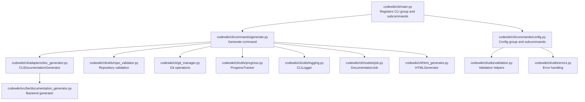
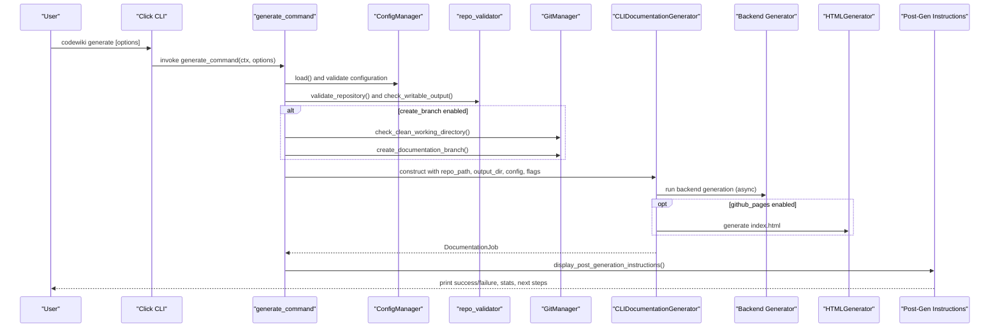
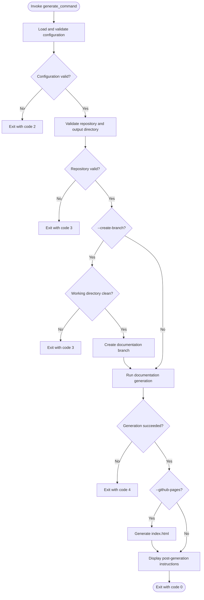
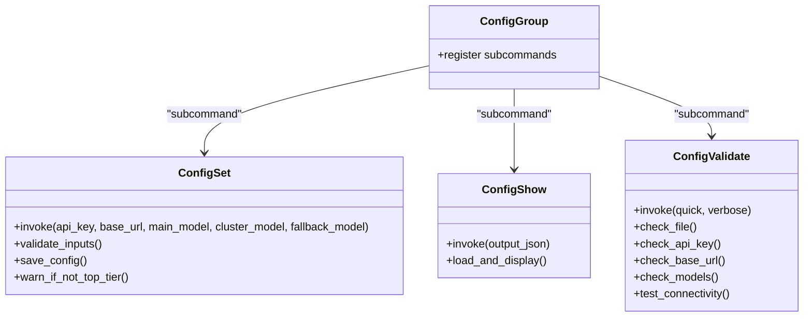
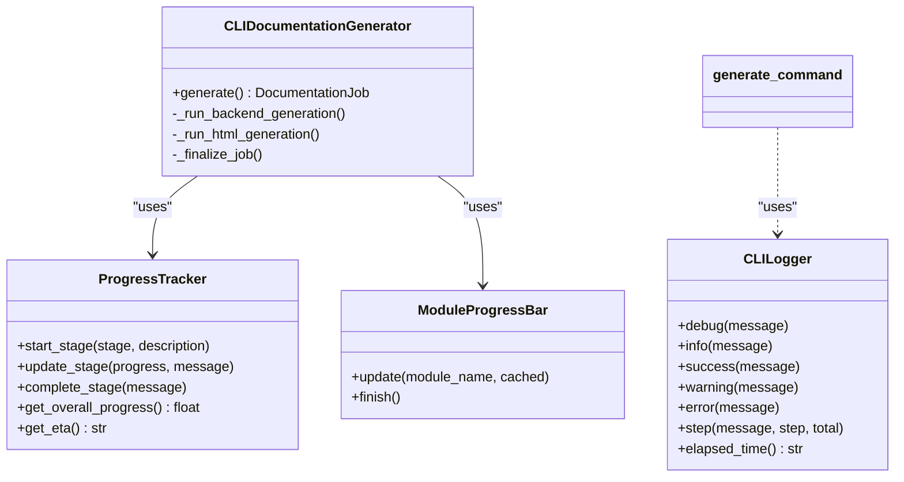
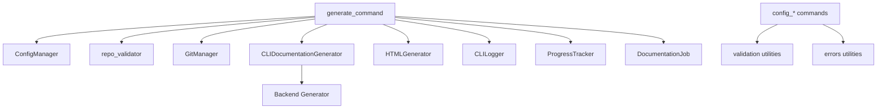

# CLI Command Reference

<cite>
**Referenced Files in This Document**
- [main.py](file://codewiki/cli/main.py)
- [generate.py](file://codewiki/cli/commands/generate.py)
- [config.py](file://codewiki/cli/commands/config.py)
- [progress.py](file://codewiki/cli/utils/progress.py)
- [errors.py](file://codewiki/cli/utils/errors.py)
- [logging.py](file://codewiki/cli/utils/logging.py)
- [job.py](file://codewiki/cli/models/job.py)
- [doc_generator.py](file://codewiki/cli/adapters/doc_generator.py)
- [html_generator.py](file://codewiki/cli/html_generator.py)
- [git_manager.py](file://codewiki/cli/git_manager.py)
- [repo_validator.py](file://codewiki/cli/utils/repo_validator.py)
- [README.md](file://README.md)
</cite>

## Table of Contents
1. [Introduction](#introduction)
2. [Project Structure](#project-structure)
3. [Core Components](#core-components)
4. [Architecture Overview](#architecture-overview)
5. [Detailed Component Analysis](#detailed-component-analysis)
6. [Dependency Analysis](#dependency-analysis)
7. [Performance Considerations](#performance-considerations)
8. [Troubleshooting Guide](#troubleshooting-guide)
9. [Conclusion](#conclusion)
10. [Appendices](#appendices)

## Introduction
This document provides a comprehensive CLI command reference for the Click-based command-line interface of CodeWiki. It covers all available commands, including codewiki generate and codewiki config, along with their subcommands and options. It explains syntax, parameters, options, return values, and exit codes. It also details the progress tracking system, success/failure indicators, error handling, and how the CLI integrates with underlying Python modules. Practical examples are drawn from the repository’s README.

## Project Structure
The CLI is organized around Click groups and commands. The main entry registers the CLI group, version command, and subcommands. The generate command orchestrates configuration loading, repository validation, optional git branch creation, documentation generation, and post-generation instructions. The config group manages API credentials and settings.

**Diagram sources**
- [main.py](file://codewiki/cli/main.py#L1-L57)
- [generate.py](file://codewiki/cli/commands/generate.py#L1-L266)
- [config.py](file://codewiki/cli/commands/config.py#L1-L399)
- [doc_generator.py](file://codewiki/cli/adapters/doc_generator.py#L1-L289)
- [repo_validator.py](file://codewiki/cli/utils/repo_validator.py#L1-L188)
- [git_manager.py](file://codewiki/cli/git_manager.py#L1-L228)
- [progress.py](file://codewiki/cli/utils/progress.py#L1-L223)
- [logging.py](file://codewiki/cli/utils/logging.py#L1-L86)
- [job.py](file://codewiki/cli/models/job.py#L1-L157)
- [html_generator.py](file://codewiki/cli/html_generator.py#L1-L285)
- [errors.py](file://codewiki/cli/utils/errors.py#L1-L114)

**Section sources**
- [main.py](file://codewiki/cli/main.py#L1-L57)

## Core Components
- CLI entrypoint and version command: Registers the CLI group and version output.
- Generate command: Validates configuration, repository, optional git branch creation, runs documentation generation, and prints post-generation instructions.
- Config group: Provides subcommands to set, show, and validate configuration.
- Utilities: Progress tracking, logging, error handling, repository validation, git operations, and HTML generation.

**Section sources**
- [main.py](file://codewiki/cli/main.py#L1-L57)
- [generate.py](file://codewiki/cli/commands/generate.py#L1-L266)
- [config.py](file://codewiki/cli/commands/config.py#L1-L399)

## Architecture Overview
The CLI command flow integrates Click decorators with internal utilities and the backend documentation generator. The generate command constructs a CLIDocumentationGenerator, which coordinates backend generation, progress tracking, and optional HTML generation. Post-generation, it displays instructions and statistics.

**Diagram sources**
- [generate.py](file://codewiki/cli/commands/generate.py#L1-L266)
- [doc_generator.py](file://codewiki/cli/adapters/doc_generator.py#L1-L289)
- [repo_validator.py](file://codewiki/cli/utils/repo_validator.py#L1-L188)
- [git_manager.py](file://codewiki/cli/git_manager.py#L1-L228)
- [html_generator.py](file://codewiki/cli/html_generator.py#L1-L285)

## Detailed Component Analysis

### CLI Entry and Version Command
- Registers the CLI group and version option.
- Exposes a version command for printing version information.
- Imports and registers subcommands for config and generate.

**Section sources**
- [main.py](file://codewiki/cli/main.py#L1-L57)

### Generate Command
- Purpose: Generate comprehensive documentation for a code repository.
- Syntax: codewiki generate [options]
- Options:
  - --output, -o: Output directory for generated documentation (default: docs)
  - --create-branch: Create a new git branch for documentation changes
  - --github-pages: Generate index.html for GitHub Pages deployment
  - --no-cache: Force full regeneration, ignoring cache
  - --verbose, -v: Show detailed progress and debug information
- Behavior:
  - Loads and validates configuration; exits with configuration error if missing or incomplete.
  - Validates repository and output directory writability.
  - Optionally creates a documentation branch if git repository is clean.
  - Constructs GenerationOptions and CLIDocumentationGenerator with LLM config and flags.
  - Runs backend generation asynchronously and optionally generates HTML.
  - Prints post-generation instructions with statistics and next steps.
- Return values and exit codes:
  - Success: 0
  - Configuration error: 2
  - Repository error: 3
  - API error: 4
  - File system error: 5
  - General error: 1
  - Keyboard interrupt: 130
- Practical examples from README:
  - Basic generation: codewiki generate
  - Custom output directory: codewiki generate --output ./documentation
  - Create git branch for documentation: codewiki generate --create-branch
  - Generate HTML viewer for GitHub Pages: codewiki generate --github-pages
  - Enable verbose logging: codewiki generate --verbose
  - Full-featured generation: codewiki generate --create-branch --github-pages --verbose

**Diagram sources**
- [generate.py](file://codewiki/cli/commands/generate.py#L1-L266)
- [errors.py](file://codewiki/cli/utils/errors.py#L1-L114)
- [repo_validator.py](file://codewiki/cli/utils/repo_validator.py#L1-L188)
- [git_manager.py](file://codewiki/cli/git_manager.py#L1-L228)
- [doc_generator.py](file://codewiki/cli/adapters/doc_generator.py#L1-L289)
- [html_generator.py](file://codewiki/cli/html_generator.py#L1-L285)

**Section sources**
- [generate.py](file://codewiki/cli/commands/generate.py#L1-L266)
- [README.md](file://README.md#L115-L136)

### Config Group and Subcommands
- Purpose: Manage CodeWiki configuration (API credentials and settings).
- Subcommands:
  - codewiki config set
    - Options:
      - --api-key: LLM API key (stored securely in system keychain)
      - --base-url: LLM API base URL
      - --main-model: Primary model for documentation generation
      - --cluster-model: Model for module clustering (recommend top-tier)
      - --fallback-model: Fallback model for documentation generation
    - Behavior: Validates inputs, saves configuration, warns if cluster model is not top-tier.
    - Exit codes: 0 on success, 2 on configuration error.
  - codewiki config show
    - Options:
      - --json: Output in JSON format
    - Behavior: Displays current configuration with masked API key and storage location.
  - codewiki config validate
    - Options:
      - --quick: Skip API connectivity test
      - --verbose, -v: Show detailed validation steps
    - Behavior: Checks configuration file existence/format, API key presence, base URL validity, model configuration, and optionally tests API connectivity.

**Diagram sources**
- [config.py](file://codewiki/cli/commands/config.py#L1-L399)

**Section sources**
- [config.py](file://codewiki/cli/commands/config.py#L1-L399)

### Progress Tracking System
- ProgressTracker: Tracks overall progress across five stages with weighted estimates and ETA calculation.
- ModuleProgressBar: Provides a progress bar for module-by-module generation with verbose and non-verbose modes.
- CLIDocumentationGenerator integrates ProgressTracker to report stage transitions and completion messages.
- CLILogger provides step-level logging with colored output and optional verbose debug messages.

**Diagram sources**
- [progress.py](file://codewiki/cli/utils/progress.py#L1-L223)
- [logging.py](file://codewiki/cli/utils/logging.py#L1-L86)
- [doc_generator.py](file://codewiki/cli/adapters/doc_generator.py#L1-L289)
- [generate.py](file://codewiki/cli/commands/generate.py#L1-L266)

**Section sources**
- [progress.py](file://codewiki/cli/utils/progress.py#L1-L223)
- [logging.py](file://codewiki/cli/utils/logging.py#L1-L86)
- [doc_generator.py](file://codewiki/cli/adapters/doc_generator.py#L1-L289)
- [generate.py](file://codewiki/cli/commands/generate.py#L1-L266)

### Relationship Between CLI Commands and Python Modules
- generate_command depends on:
  - ConfigManager for configuration loading and validation
  - repo_validator for repository and output directory checks
  - GitManager for branch creation and status checks
  - CLIDocumentationGenerator for backend orchestration
  - HTMLGenerator for GitHub Pages index.html generation
  - Job models and statistics for reporting
- config commands depend on:
  - ConfigManager for saving/loading configuration
  - Validation utilities for input sanitization
  - Error utilities for consistent exit codes

**Section sources**
- [generate.py](file://codewiki/cli/commands/generate.py#L1-L266)
- [config.py](file://codewiki/cli/commands/config.py#L1-L399)
- [doc_generator.py](file://codewiki/cli/adapters/doc_generator.py#L1-L289)
- [html_generator.py](file://codewiki/cli/html_generator.py#L1-L285)
- [job.py](file://codewiki/cli/models/job.py#L1-L157)
- [repo_validator.py](file://codewiki/cli/utils/repo_validator.py#L1-L188)
- [git_manager.py](file://codewiki/cli/git_manager.py#L1-L228)

## Dependency Analysis
The CLI commands are loosely coupled to their utilities and adapters, promoting modularity and testability. The generate command centralizes orchestration, delegating specialized tasks to dedicated modules.

**Diagram sources**
- [generate.py](file://codewiki/cli/commands/generate.py#L1-L266)
- [config.py](file://codewiki/cli/commands/config.py#L1-L399)
- [doc_generator.py](file://codewiki/cli/adapters/doc_generator.py#L1-L289)
- [html_generator.py](file://codewiki/cli/html_generator.py#L1-L285)
- [repo_validator.py](file://codewiki/cli/utils/repo_validator.py#L1-L188)
- [git_manager.py](file://codewiki/cli/git_manager.py#L1-L228)
- [progress.py](file://codewiki/cli/utils/progress.py#L1-L223)
- [logging.py](file://codewiki/cli/utils/logging.py#L1-L86)
- [job.py](file://codewiki/cli/models/job.py#L1-L157)
- [errors.py](file://codewiki/cli/utils/errors.py#L1-L114)

**Section sources**
- [generate.py](file://codewiki/cli/commands/generate.py#L1-L266)
- [config.py](file://codewiki/cli/commands/config.py#L1-L399)

## Performance Considerations
- Stage weights: Dependency Analysis (40%), Module Clustering (20%), Documentation Generation (30%), HTML Generation (5%), Finalization (5%). This influences ETA calculations.
- Verbose mode increases backend logging verbosity and detailed step reporting.
- Using --no-cache forces full regeneration, increasing runtime.
- GitHub Pages generation adds an extra stage for HTML creation.

[No sources needed since this section provides general guidance]

## Troubleshooting Guide
Common issues and resolutions:
- Configuration not found or invalid:
  - Run codewiki config set to configure API credentials and models.
  - Use codewiki config validate to check configuration completeness.
- Not a git repository:
  - Initialize with git init if using --create-branch.
- Working directory has uncommitted changes:
  - Commit or stash changes before creating documentation branch.
- Output directory not writable:
  - Ensure parent directory exists and is writable.
- API connectivity failures:
  - Verify base URL and API key; test connectivity with codewiki config validate.
- Keyboard interrupts:
  - The CLI exits with code 130.

Exit codes summary:
- 0: Success
- 1: General error
- 2: Configuration error
- 3: Repository error
- 4: API error
- 5: File system error
- 130: Interrupted by user

**Section sources**
- [generate.py](file://codewiki/cli/commands/generate.py#L1-L266)
- [config.py](file://codewiki/cli/commands/config.py#L1-L399)
- [errors.py](file://codewiki/cli/utils/errors.py#L1-L114)

## Conclusion
The CodeWiki CLI provides a robust interface for generating repository documentation with optional git integration and GitHub Pages support. The generate command orchestrates configuration validation, repository checks, optional branch creation, backend generation, and post-generation instructions. The config group streamlines credential and model management. Progress tracking and logging offer clear feedback during long-running operations. Adhering to the documented options and exit codes ensures reliable automation and troubleshooting.

[No sources needed since this section summarizes without analyzing specific files]

## Appendices

### Command Reference Summary
- codewiki generate
  - Options: --output/-o, --create-branch, --github-pages, --no-cache, --verbose/-v
  - Exit codes: 0, 1, 2, 3, 4, 5, 130
  - Examples: README shows basic generation, custom output, branch creation, GitHub Pages, verbose, and combined options.
- codewiki config set
  - Options: --api-key, --base-url, --main-model, --cluster-model, --fallback-model
  - Exit codes: 0, 2
- codewiki config show
  - Options: --json
- codewiki config validate
  - Options: --quick, --verbose/-v

**Section sources**
- [generate.py](file://codewiki/cli/commands/generate.py#L1-L266)
- [config.py](file://codewiki/cli/commands/config.py#L1-L399)
- [README.md](file://README.md#L115-L136)