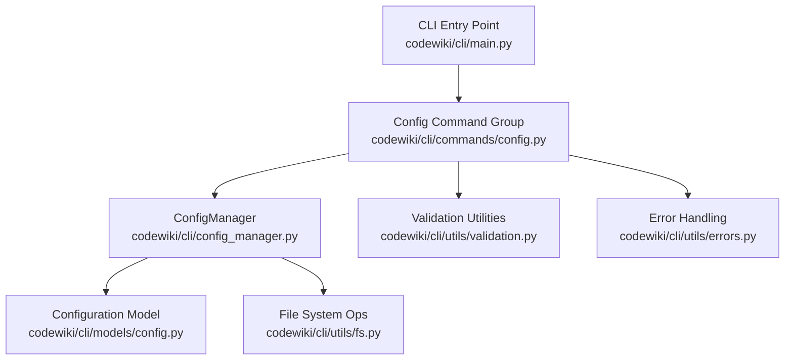
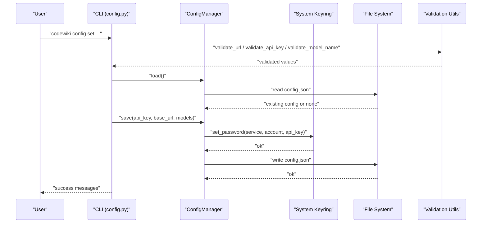
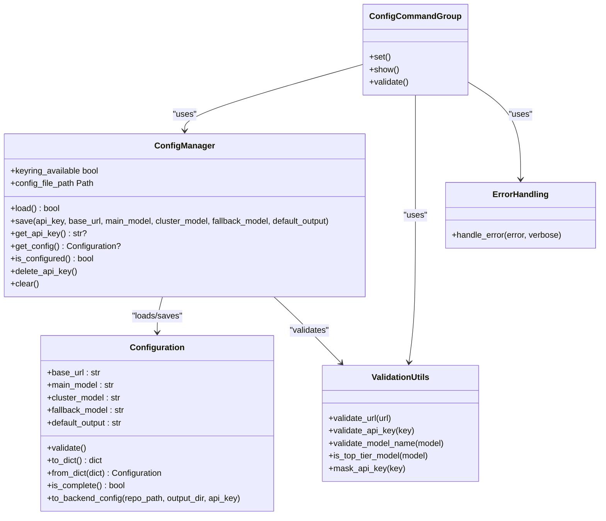
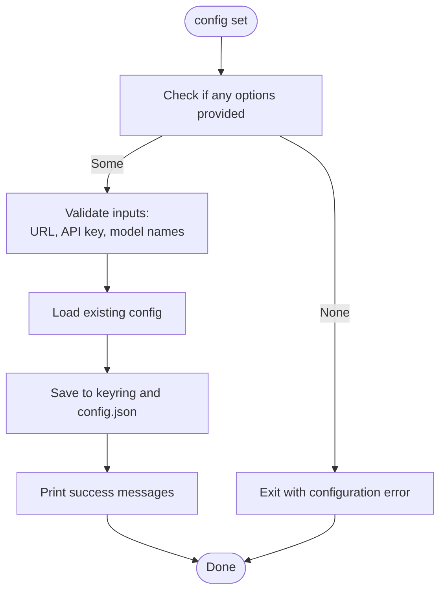
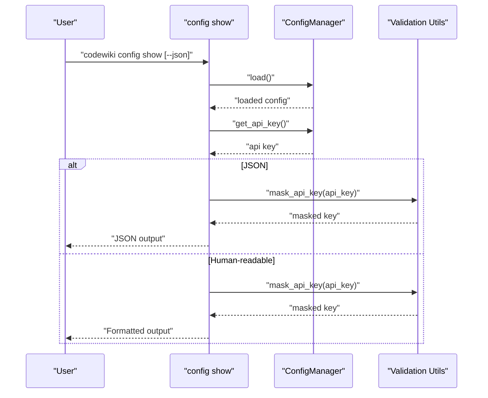
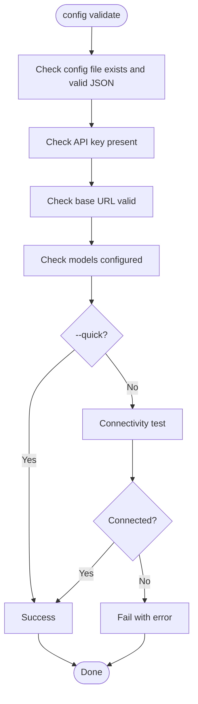
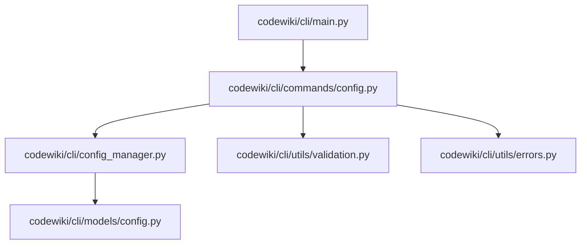

# Config Command

<cite>
**Referenced Files in This Document**
- [config.py](file://codewiki/cli/commands/config.py)
- [config_manager.py](file://codewiki/cli/config_manager.py)
- [validation.py](file://codewiki/cli/utils/validation.py)
- [errors.py](file://codewiki/cli/utils/errors.py)
- [config.py](file://codewiki/cli/models/config.py)
- [main.py](file://codewiki/cli/main.py)
- [README.md](file://README.md)
</cite>

## Table of Contents
1. [Introduction](#introduction)
2. [Project Structure](#project-structure)
3. [Core Components](#core-components)
4. [Architecture Overview](#architecture-overview)
5. [Detailed Component Analysis](#detailed-component-analysis)
6. [Dependency Analysis](#dependency-analysis)
7. [Performance Considerations](#performance-considerations)
8. [Troubleshooting Guide](#troubleshooting-guide)
9. [Conclusion](#conclusion)

## Introduction
This document explains the codewiki config command group responsible for configuration management. It covers how to securely store LLM credentials and settings using the system keychain (macOS Keychain, Windows Credential Manager, Linux Secret Service) or encrypted files, and documents the subcommands set, show, and validate with their parameters, behaviors, validation rules, and secure storage mechanisms. It also describes the five-step validation process, the impact of --quick and --verbose flags, and practical examples from the codebase.

## Project Structure
The configuration management system is organized around a CLI command group that delegates to a configuration manager and validation utilities. The CLI entry point registers the config group and integrates it with the generate command.

**Diagram sources**
- [main.py](file://codewiki/cli/main.py#L33-L40)
- [config.py](file://codewiki/cli/commands/config.py#L26-L399)
- [config_manager.py](file://codewiki/cli/config_manager.py#L1-L232)
- [validation.py](file://codewiki/cli/utils/validation.py#L1-L251)
- [errors.py](file://codewiki/cli/utils/errors.py#L1-L114)
- [config.py](file://codewiki/cli/models/config.py#L1-L109)

**Section sources**
- [main.py](file://codewiki/cli/main.py#L33-L40)
- [config.py](file://codewiki/cli/commands/config.py#L26-L399)

## Core Components
- Config command group: Provides three subcommands: set, show, and validate.
- ConfigManager: Centralizes configuration loading, saving, and secure keyring integration.
- Validation utilities: Provide URL, API key, model name, and masking helpers.
- Error handling: Standardized exit codes and error reporting.
- Configuration model: Defines the persisted settings structure and conversion to backend configuration.

**Section sources**
- [config.py](file://codewiki/cli/commands/config.py#L26-L399)
- [config_manager.py](file://codewiki/cli/config_manager.py#L1-L232)
- [validation.py](file://codewiki/cli/utils/validation.py#L1-L251)
- [errors.py](file://codewiki/cli/utils/errors.py#L1-L114)
- [config.py](file://codewiki/cli/models/config.py#L1-L109)

## Architecture Overview
The config command group orchestrates user actions and delegates to the ConfigManager, which persists non-sensitive settings to a JSON file and stores the API key in the system keychain. Validation utilities enforce correctness, and error handling ensures consistent feedback.

**Diagram sources**
- [config.py](file://codewiki/cli/commands/config.py#L58-L161)
- [config_manager.py](file://codewiki/cli/config_manager.py#L51-L160)
- [validation.py](file://codewiki/cli/utils/validation.py#L13-L100)

## Detailed Component Analysis

### Config Command Group
The config group defines three subcommands:
- set: Sets configuration values with secure storage for API keys.
- show: Displays current configuration, masking API keys for security.
- validate: Validates configuration and optionally tests API connectivity.

Key behaviors:
- set validates inputs before saving and warns when using non-top-tier models for clustering.
- show supports human-readable and JSON output formats with API key masking.
- validate performs a five-step process and respects --quick and --verbose flags.

**Section sources**
- [config.py](file://codewiki/cli/commands/config.py#L26-L399)

#### Subcommand: config set
Purpose:
- Store LLM credentials and settings securely.

Options:
- --api-key: LLM API key (stored in system keychain)
- --base-url: LLM API base URL
- --main-model: Primary model for documentation generation
- --cluster-model: Model for module clustering (top-tier recommended)
- --fallback-model: Fallback model for documentation generation

Validation rules:
- API key: Non-empty, minimum length enforced by validator.
- Base URL: Must parse with a scheme and hostname; HTTPS required except for localhost.
- Model names: Non-empty after trimming.

Secure storage:
- API key stored in system keychain (macOS Keychain, Windows Credential Manager, Linux Secret Service).
- If keyring is unavailable, a warning is shown and the user is informed about encrypted file storage.

Non-sensitive settings:
- base_url, main_model, cluster_model, fallback_model, default_output are persisted to ~/.codewiki/config.json.

Behavioral notes:
- If no options are provided, the command exits with a configuration error.
- If cluster model is not top-tier, a yellow warning is printed with recommended models.

Practical example (from repository documentation):
- Full setup example using OpenAI-compatible provider and recommended models.

**Section sources**
- [config.py](file://codewiki/cli/commands/config.py#L58-L161)
- [validation.py](file://codewiki/cli/utils/validation.py#L13-L100)
- [validation.py](file://codewiki/cli/utils/validation.py#L209-L229)
- [README.md](file://README.md#L43-L70)

#### Subcommand: config show
Purpose:
- Display current configuration.

Output formats:
- Human-readable: Prints credentials, API settings, output settings, and configuration file path. API key is masked.
- JSON: Emits a JSON object containing masked API key, storage location, settings, defaults, and config file path.

Security:
- API key is masked for display using a masking utility.

Practical example (from repository documentation):
- Show current configuration and show as JSON.

**Section sources**
- [config.py](file://codewiki/cli/commands/config.py#L163-L248)
- [validation.py](file://codewiki/cli/utils/validation.py#L231-L250)
- [README.md](file://README.md#L95-L114)

#### Subcommand: config validate
Purpose:
- Validate configuration and optionally test API connectivity.

Five-step process:
1. Configuration file exists and is valid JSON.
2. API key is present (retrieved from keyring).
3. Base URL is present and valid.
4. Models are configured (main, cluster, fallback).
5. Optional API connectivity test using the configured base URL and API key.

Flags:
- --quick: Skip API connectivity test.
- --verbose: Print detailed steps and additional information.

Impact of flags:
- --quick: Reduces validation to configuration and settings checks.
- --verbose: Enhances output with step-by-step details and extra diagnostics.

Practical example (from repository documentation):
- Full validation with API test and quick validation.

**Section sources**
- [config.py](file://codewiki/cli/commands/config.py#L250-L399)
- [README.md](file://README.md#L95-L114)

### ConfigManager
Responsibilities:
- Initialize and check availability of system keyring.
- Load configuration from ~/.codewiki/config.json and API key from keyring.
- Save configuration updates, validate before persisting, and store API key in keyring.
- Provide getters for API key and configuration.
- Determine completeness of configuration.
- Clear configuration (remove API key from keyring and delete config file).

Storage locations:
- API key: Stored in system keychain via keyring service/account.
- Non-sensitive settings: Stored in ~/.codewiki/config.json with a version marker.

Integration points:
- Uses the Configuration model for validation and serialization.
- Uses file system utilities for safe reads/writes.

**Section sources**
- [config_manager.py](file://codewiki/cli/config_manager.py#L1-L232)
- [config.py](file://codewiki/cli/models/config.py#L1-L109)

### Validation Utilities
Functions used by config commands:
- validate_url: Ensures scheme and hostname, enforces HTTPS except for localhost.
- validate_api_key: Ensures non-empty and minimum length.
- validate_model_name: Ensures non-empty after trimming.
- is_top_tier_model: Determines if a model is considered top-tier for clustering.
- mask_api_key: Masks API key for display.

**Section sources**
- [validation.py](file://codewiki/cli/utils/validation.py#L13-L100)
- [validation.py](file://codewiki/cli/utils/validation.py#L209-L250)

### Error Handling
- Standardized exit codes for success, general error, configuration error, repository error, API error, and filesystem error.
- handle_error: Converts exceptions to CLI-friendly messages and exit codes, with optional verbose stack traces.

**Section sources**
- [errors.py](file://codewiki/cli/utils/errors.py#L1-L114)

### Configuration Model
- Defines persisted settings: base_url, main_model, cluster_model, fallback_model (default), default_output (default).
- Provides validation and conversion to/from dictionaries.
- Offers a bridge to backend configuration for runtime usage.

**Section sources**
- [config.py](file://codewiki/cli/models/config.py#L1-L109)

## Architecture Overview
The config command group integrates with ConfigManager and validation utilities to provide a secure and robust configuration lifecycle.

**Diagram sources**
- [config.py](file://codewiki/cli/commands/config.py#L26-L399)
- [config_manager.py](file://codewiki/cli/config_manager.py#L1-L232)
- [config.py](file://codewiki/cli/models/config.py#L1-L109)
- [validation.py](file://codewiki/cli/utils/validation.py#L1-L251)
- [errors.py](file://codewiki/cli/utils/errors.py#L1-L114)

## Detailed Component Analysis

### config set: Secure Storage and Validation
- Secure storage:
  - API key stored in system keychain; if unavailable, a warning is emitted and the user is informed about encrypted file storage.
- Validation:
  - URL, API key, and model names validated before saving.
  - Non-top-tier cluster model triggers a warning with recommended alternatives.
- Persistence:
  - Non-sensitive settings saved to ~/.codewiki/config.json with versioning.

**Diagram sources**
- [config.py](file://codewiki/cli/commands/config.py#L58-L161)
- [config_manager.py](file://codewiki/cli/config_manager.py#L84-L160)
- [validation.py](file://codewiki/cli/utils/validation.py#L13-L100)

**Section sources**
- [config.py](file://codewiki/cli/commands/config.py#L58-L161)
- [config_manager.py](file://codewiki/cli/config_manager.py#L84-L160)
- [validation.py](file://codewiki/cli/utils/validation.py#L13-L100)
- [validation.py](file://codewiki/cli/utils/validation.py#L209-L229)

### config show: Output Formats and Security
- Human-readable output prints credentials, API settings, output settings, and configuration file path; API key is masked.
- JSON output includes masked API key, storage location, settings, defaults, and config file path.

**Diagram sources**
- [config.py](file://codewiki/cli/commands/config.py#L163-L248)
- [validation.py](file://codewiki/cli/utils/validation.py#L231-L250)

**Section sources**
- [config.py](file://codewiki/cli/commands/config.py#L163-L248)
- [validation.py](file://codewiki/cli/utils/validation.py#L231-L250)

### config validate: Five-Step Process and Flags
- Steps:
  1. Configuration file exists and is valid JSON.
  2. API key present (retrieved from keyring).
  3. Base URL present and valid.
  4. Models configured (main, cluster, fallback).
  5. Optional API connectivity test using configured base URL and API key.
- Flags:
  - --quick: Skip step 5.
  - --verbose: Print detailed step-by-step information.

**Diagram sources**
- [config.py](file://codewiki/cli/commands/config.py#L250-L399)

**Section sources**
- [config.py](file://codewiki/cli/commands/config.py#L250-L399)

### Practical Examples from the Codebase
- Full configuration setup example using OpenAI-compatible provider and recommended models.
- Show configuration and show as JSON.
- Validate configuration with and without API connectivity test.

**Section sources**
- [README.md](file://README.md#L43-L70)
- [README.md](file://README.md#L95-L114)

## Dependency Analysis
The config command group depends on ConfigManager, validation utilities, and error handling. ConfigManager depends on the Configuration model and file system utilities. The CLI entry point registers the config group alongside the generate command.

**Diagram sources**
- [config.py](file://codewiki/cli/commands/config.py#L26-L399)
- [config_manager.py](file://codewiki/cli/config_manager.py#L1-L232)
- [validation.py](file://codewiki/cli/utils/validation.py#L1-L251)
- [errors.py](file://codewiki/cli/utils/errors.py#L1-L114)
- [config.py](file://codewiki/cli/models/config.py#L1-L109)
- [main.py](file://codewiki/cli/main.py#L33-L40)

**Section sources**
- [config.py](file://codewiki/cli/commands/config.py#L26-L399)
- [config_manager.py](file://codewiki/cli/config_manager.py#L1-L232)
- [validation.py](file://codewiki/cli/utils/validation.py#L1-L251)
- [errors.py](file://codewiki/cli/utils/errors.py#L1-L114)
- [config.py](file://codewiki/cli/models/config.py#L1-L109)
- [main.py](file://codewiki/cli/main.py#L33-L40)

## Performance Considerations
- Keyring operations are lightweight but may incur OS-level overhead; the system keyring availability is checked once during initialization.
- JSON read/write operations are small and fast; ensure the config directory exists to avoid repeated retries.
- Validation utilities are simple and fast; URL and model validations are O(1) checks.
- Connectivity testing is optional (--quick) and performed only when requested.

## Troubleshooting Guide
Common issues and resolutions:
- Missing API key:
  - Symptom: Validation reports missing API key.
  - Resolution: Run config set with --api-key or ensure system keychain is available.
- Invalid base URL:
  - Symptom: Validation reports invalid URL or requires HTTPS.
  - Resolution: Provide a valid URL with scheme and hostname; HTTPS is required except for localhost.
- Non-top-tier model warning:
  - Symptom: Warning about cluster model not being top-tier.
  - Resolution: Use recommended top-tier models for clustering.
- Connectivity failures:
  - Symptom: API connectivity test fails.
  - Resolution: Verify endpoint, credentials, network, and rate limits; retry with --quick to bypass connectivity test.
- Configuration not found:
  - Symptom: Show reports configuration not found.
  - Resolution: Run config set to initialize settings.

**Section sources**
- [config.py](file://codewiki/cli/commands/config.py#L250-L399)
- [config.py](file://codewiki/cli/commands/config.py#L163-L248)
- [validation.py](file://codewiki/cli/utils/validation.py#L13-L100)
- [validation.py](file://codewiki/cli/utils/validation.py#L209-L229)

## Conclusion
The codewiki config command group provides a secure, validated, and user-friendly way to manage LLM credentials and settings. It leverages system keychain storage for API keys, validates inputs rigorously, and offers clear output formats and validation workflows. The --quick and --verbose flags give flexibility for different operational needs, while error handling ensures consistent feedback across scenarios.