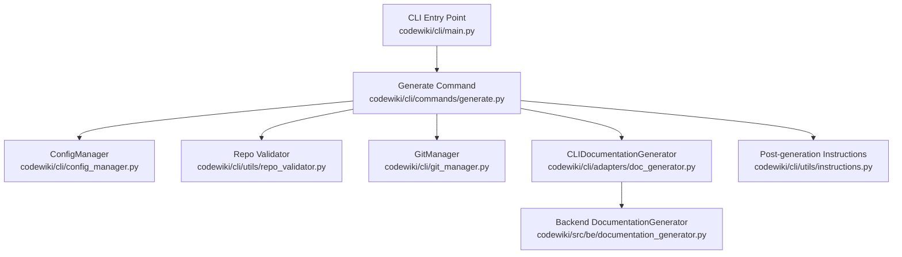
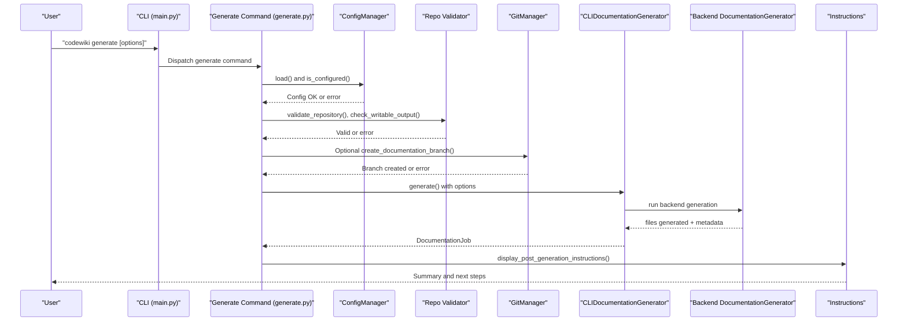
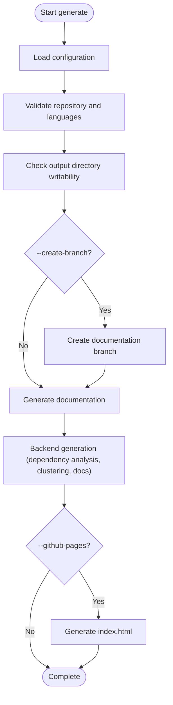
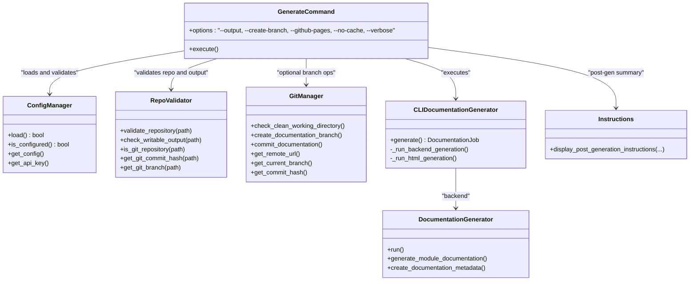

# Generate Command

<cite>
**Referenced Files in This Document**
- [generate.py](file://codewiki/cli/commands/generate.py)
- [config_manager.py](file://codewiki/cli/config_manager.py)
- [git_manager.py](file://codewiki/cli/git_manager.py)
- [doc_generator.py](file://codewiki/cli/adapters/doc_generator.py)
- [documentation_generator.py](file://codewiki/src/be/documentation_generator.py)
- [job.py](file://codewiki/cli/models/job.py)
- [repo_validator.py](file://codewiki/cli/utils/repo_validator.py)
- [instructions.py](file://codewiki/cli/utils/instructions.py)
- [main.py](file://codewiki/cli/main.py)
</cite>

## Table of Contents
1. [Introduction](#introduction)
2. [Project Structure](#project-structure)
3. [Core Components](#core-components)
4. [Architecture Overview](#architecture-overview)
5. [Detailed Component Analysis](#detailed-component-analysis)
6. [Dependency Analysis](#dependency-analysis)
7. [Performance Considerations](#performance-considerations)
8. [Troubleshooting Guide](#troubleshooting-guide)
9. [Conclusion](#conclusion)

## Introduction
The codewiki generate command analyzes a code repository and produces AI-powered documentation. It validates configuration and repository readiness, optionally creates a dedicated git branch for documentation changes, and generates Markdown documentation with optional HTML viewer for GitHub Pages. The command integrates with ConfigManager for configuration, CLIDocumentationGenerator for execution, and GitManager for branch operations.

## Project Structure
The generate command is implemented as a Click command and orchestrates several modules:
- CLI command definition and option parsing
- Configuration loading and validation
- Repository validation and output directory checks
- Optional git branch creation
- Documentation generation via a CLI adapter wrapping the backend generator
- Post-generation instructions and summary

**Diagram sources**
- [main.py](file://codewiki/cli/main.py#L33-L40)
- [generate.py](file://codewiki/cli/commands/generate.py#L34-L91)
- [config_manager.py](file://codewiki/cli/config_manager.py#L51-L83)
- [repo_validator.py](file://codewiki/cli/utils/repo_validator.py#L36-L69)
- [git_manager.py](file://codewiki/cli/git_manager.py#L14-L44)
- [doc_generator.py](file://codewiki/cli/adapters/doc_generator.py#L26-L72)
- [documentation_generator.py](file://codewiki/src/be/documentation_generator.py#L29-L37)
- [instructions.py](file://codewiki/cli/utils/instructions.py#L48-L151)

**Section sources**
- [main.py](file://codewiki/cli/main.py#L33-L40)
- [generate.py](file://codewiki/cli/commands/generate.py#L34-L91)

## Core Components
- Generate command options:
  - --output, -o: Output directory for generated documentation (default: docs)
  - --create-branch: Create a new git branch for documentation changes
  - --github-pages: Generate index.html for GitHub Pages deployment
  - --no-cache: Force full regeneration, ignoring cache
  - --verbose, -v: Show detailed progress and debug information
- Execution stages:
  - Configuration validation
  - Repository validation and language detection
  - Output directory checks
  - Optional git branch creation
  - Documentation generation (with optional HTML generation)
  - Post-generation instructions and summary

**Section sources**
- [generate.py](file://codewiki/cli/commands/generate.py#L34-L91)
- [generate.py](file://codewiki/cli/commands/generate.py#L100-L246)

## Architecture Overview
The generate command coordinates configuration, repository validation, optional git operations, and documentation generation. The CLI adapter wraps the backend generator, passing configuration and coordinating progress tracking and HTML generation.

**Diagram sources**
- [main.py](file://codewiki/cli/main.py#L33-L40)
- [generate.py](file://codewiki/cli/commands/generate.py#L100-L246)
- [config_manager.py](file://codewiki/cli/config_manager.py#L51-L83)
- [repo_validator.py](file://codewiki/cli/utils/repo_validator.py#L36-L69)
- [git_manager.py](file://codewiki/cli/git_manager.py#L73-L122)
- [doc_generator.py](file://codewiki/cli/adapters/doc_generator.py#L114-L164)
- [documentation_generator.py](file://codewiki/src/be/documentation_generator.py#L249-L292)
- [instructions.py](file://codewiki/cli/utils/instructions.py#L48-L151)

## Detailed Component Analysis

### Generate Command Options and Behavior
- --output, -o
  - Syntax: --output PATH or -o PATH
  - Default: docs
  - Purpose: Sets the output directory for generated documentation
  - Practical use: Override default docs directory for CI or custom locations
- --create-branch
  - Syntax: --create-branch
  - Default: disabled
  - Purpose: Creates a timestamped documentation branch and checks out it
  - Practical use: Isolate documentation changes from main branch
- --github-pages
  - Syntax: --github-pages
  - Default: disabled
  - Purpose: Generates index.html for local preview and GitHub Pages deployment
  - Practical use: Preview documentation locally and publish via GitHub Pages
- --no-cache
  - Syntax: --no-cache
  - Default: disabled
  - Purpose: Forces full regeneration, ignoring cached module trees
  - Practical use: Rebuild after significant code changes or when cache appears stale
- --verbose, -v
  - Syntax: --verbose or -v
  - Default: disabled
  - Purpose: Enables detailed progress and backend logging
  - Practical use: Debug generation issues or monitor progress

Real-world examples:
- Basic generation: codewiki generate
- Branch creation with GitHub Pages: codewiki generate --create-branch --github-pages
- Cache bypassing: codewiki generate --no-cache

**Section sources**
- [generate.py](file://codewiki/cli/commands/generate.py#L34-L91)
- [generate.py](file://codewiki/cli/commands/generate.py#L186-L214)

### Configuration Validation
- Loads configuration from file and keyring
- Validates completeness (API key present and config fields valid)
- Raises ConfigurationError with actionable guidance if missing or incomplete

**Section sources**
- [generate.py](file://codewiki/cli/commands/generate.py#L100-L117)
- [config_manager.py](file://codewiki/cli/config_manager.py#L51-L83)
- [config_manager.py](file://codewiki/cli/config_manager.py#L185-L201)

### Repository Validation and Output Directory Checks
- Validates repository path and detects supported languages
- Ensures output directory exists and is writable
- Warns if not a git repository (when --create-branch is not used)

**Section sources**
- [generate.py](file://codewiki/cli/commands/generate.py#L123-L149)
- [repo_validator.py](file://codewiki/cli/utils/repo_validator.py#L36-L69)
- [repo_validator.py](file://codewiki/cli/utils/repo_validator.py#L72-L115)

### Optional Git Branch Creation
- Requires a clean working directory (no uncommitted changes)
- Creates a timestamped branch named docs/codewiki-YYYYMMDD-HHMMSS
- Provides PR creation URL for GitHub if remote is detected

**Section sources**
- [generate.py](file://codewiki/cli/commands/generate.py#L159-L184)
- [git_manager.py](file://codewiki/cli/git_manager.py#L45-L72)
- [git_manager.py](file://codewiki/cli/git_manager.py#L73-L122)

### Documentation Generation Workflow
- Builds GenerationOptions from CLI flags
- Initializes CLIDocumentationGenerator with repo path, output dir, and LLM config
- Runs backend generation asynchronously, tracking progress across stages
- Optionally generates HTML viewer (index.html) for GitHub Pages
- Produces metadata.json and collects generated files

**Diagram sources**
- [generate.py](file://codewiki/cli/commands/generate.py#L186-L214)
- [doc_generator.py](file://codewiki/cli/adapters/doc_generator.py#L114-L164)
- [doc_generator.py](file://codewiki/cli/adapters/doc_generator.py#L165-L248)
- [doc_generator.py](file://codewiki/cli/adapters/doc_generator.py#L249-L279)
- [documentation_generator.py](file://codewiki/src/be/documentation_generator.py#L249-L292)

**Section sources**
- [generate.py](file://codewiki/cli/commands/generate.py#L186-L214)
- [doc_generator.py](file://codewiki/cli/adapters/doc_generator.py#L114-L164)
- [doc_generator.py](file://codewiki/cli/adapters/doc_generator.py#L165-L248)
- [doc_generator.py](file://codewiki/cli/adapters/doc_generator.py#L249-L279)
- [documentation_generator.py](file://codewiki/src/be/documentation_generator.py#L249-L292)

### Post-generation Instructions and Summary
- Displays output directory and generated files
- Shows statistics such as module count and generation time
- Provides next steps for pushing branch, creating PR, enabling GitHub Pages, and viewing published docs

**Section sources**
- [generate.py](file://codewiki/cli/commands/generate.py#L215-L246)
- [instructions.py](file://codewiki/cli/utils/instructions.py#L48-L151)

## Dependency Analysis
The generate command depends on:
- ConfigManager for configuration loading and validation
- RepoValidator for repository and output checks
- GitManager for branch operations
- CLIDocumentationGenerator for orchestration and progress tracking
- Backend DocumentationGenerator for the heavy lifting of analysis and generation
- Instructions for post-generation guidance

**Diagram sources**
- [generate.py](file://codewiki/cli/commands/generate.py#L100-L246)
- [config_manager.py](file://codewiki/cli/config_manager.py#L51-L83)
- [repo_validator.py](file://codewiki/cli/utils/repo_validator.py#L36-L69)
- [git_manager.py](file://codewiki/cli/git_manager.py#L14-L44)
- [doc_generator.py](file://codewiki/cli/adapters/doc_generator.py#L26-L72)
- [documentation_generator.py](file://codewiki/src/be/documentation_generator.py#L29-L37)
- [instructions.py](file://codewiki/cli/utils/instructions.py#L48-L151)

**Section sources**
- [generate.py](file://codewiki/cli/commands/generate.py#L100-L246)
- [config_manager.py](file://codewiki/cli/config_manager.py#L51-L83)
- [repo_validator.py](file://codewiki/cli/utils/repo_validator.py#L36-L69)
- [git_manager.py](file://codewiki/cli/git_manager.py#L14-L44)
- [doc_generator.py](file://codewiki/cli/adapters/doc_generator.py#L26-L72)
- [documentation_generator.py](file://codewiki/src/be/documentation_generator.py#L29-L37)
- [instructions.py](file://codewiki/cli/utils/instructions.py#L48-L151)

## Performance Considerations
- --no-cache forces full regeneration, which increases runtime and LLM usage; use only when necessary
- --verbose enables backend logging and progress updates; useful for diagnostics but may slow down output
- Large repositories with many files will take longer to analyze and cluster; consider narrowing scope or using caching
- GitHub Pages HTML generation adds an extra stage; disable if only Markdown output is needed

[No sources needed since this section provides general guidance]

## Troubleshooting Guide
Common issues and resolutions:
- Missing or incomplete configuration
  - Symptom: ConfigurationError during validation
  - Resolution: Run configuration commands to set API key and models
  - Reference: [generate.py](file://codewiki/cli/commands/generate.py#L100-L117), [config_manager.py](file://codewiki/cli/config_manager.py#L185-L201)
- Not a git repository
  - Symptom: Warning when --create-branch is not used; error when --create-branch is used
  - Resolution: Initialize git repository or remove --create-branch
  - Reference: [generate.py](file://codewiki/cli/commands/generate.py#L133-L143), [generate.py](file://codewiki/cli/commands/generate.py#L135-L141)
- Uncommitted changes
  - Symptom: RepositoryError when attempting to create documentation branch
  - Resolution: Commit or stash changes, then retry
  - Reference: [git_manager.py](file://codewiki/cli/git_manager.py#L45-L72), [generate.py](file://codewiki/cli/commands/generate.py#L168-L180)
- Permission errors writing output
  - Symptom: RepositoryError indicating parent directory not writable or cannot create directory
  - Resolution: Adjust permissions or choose a different output directory
  - Reference: [repo_validator.py](file://codewiki/cli/utils/repo_validator.py#L72-L115)
- LLM API failures
  - Symptom: APIError during generation
  - Resolution: Verify API key and base URL, network connectivity, and rate limits
  - Reference: [doc_generator.py](file://codewiki/cli/adapters/doc_generator.py#L114-L164), [documentation_generator.py](file://codewiki/src/be/documentation_generator.py#L249-L292)

Interpreting terminal output:
- Steps: The command prints step-by-step progress (configuration, repository, output, branch, generation)
- Success: A green success banner and a list of generated files are shown
- Failure: An error banner with a concise message; use --verbose for detailed logs
- Next steps: Clear instructions for reviewing docs, pushing branches, creating PRs, and enabling GitHub Pages

**Section sources**
- [generate.py](file://codewiki/cli/commands/generate.py#L100-L246)
- [repo_validator.py](file://codewiki/cli/utils/repo_validator.py#L72-L115)
- [git_manager.py](file://codewiki/cli/git_manager.py#L45-L72)
- [doc_generator.py](file://codewiki/cli/adapters/doc_generator.py#L114-L164)
- [documentation_generator.py](file://codewiki/src/be/documentation_generator.py#L249-L292)

## Conclusion
The codewiki generate command provides a robust pipeline for AI-powered documentation generation. By integrating configuration management, repository validation, optional git branching, and backend generation with progress tracking, it streamlines documentation workflows. Use the provided options to tailor the process to your needs, and leverage the post-generation instructions to deploy and share your documentation effectively.