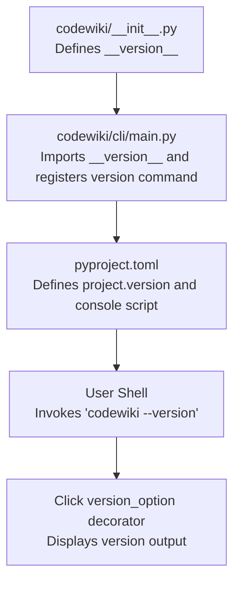
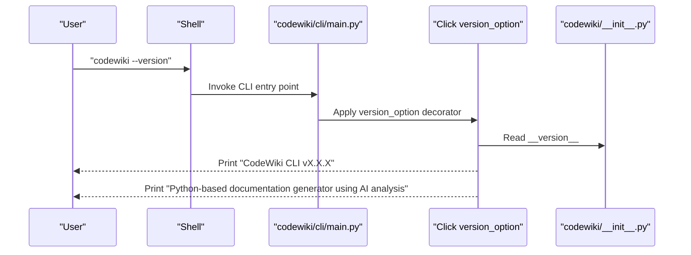
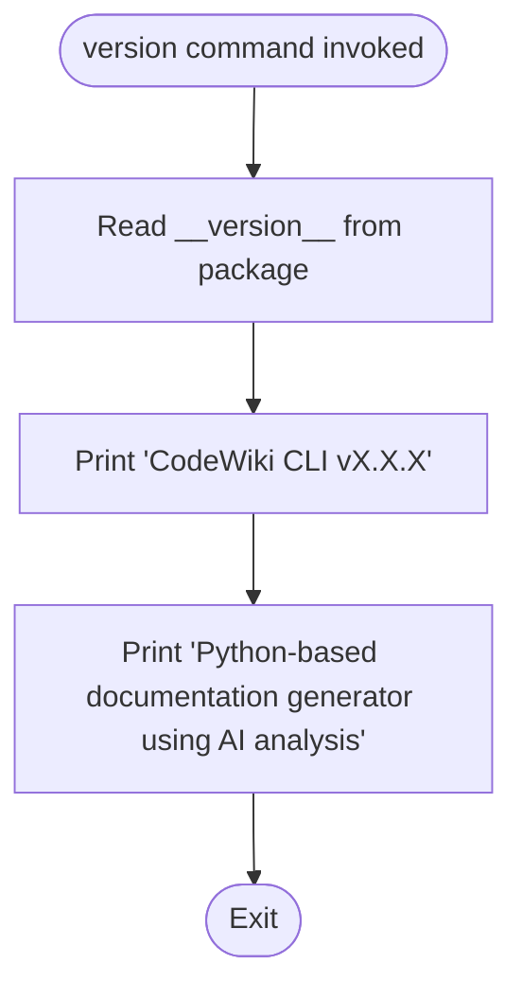
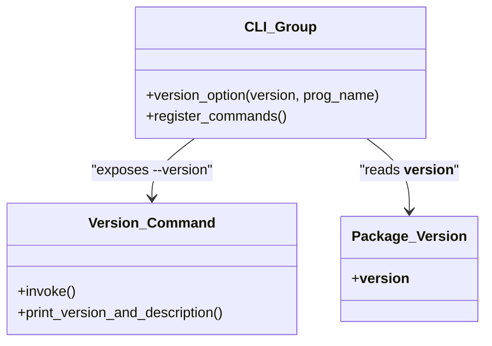
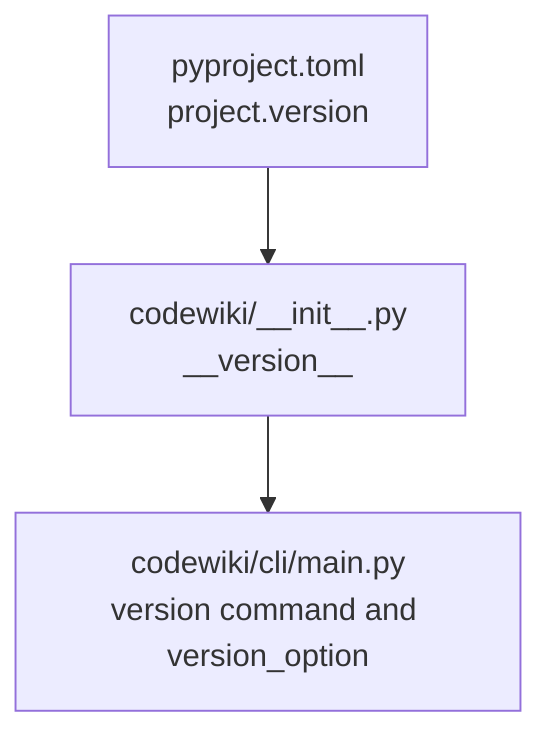

# Version Command

<cite>
**Referenced Files in This Document**
- [codewiki/cli/main.py](file://codewiki/cli/main.py)
- [codewiki/__init__.py](file://codewiki/__init__.py)
- [pyproject.toml](file://pyproject.toml)
- [README.md](file://README.md)
</cite>

## Table of Contents
1. [Introduction](#introduction)
2. [Project Structure](#project-structure)
3. [Core Components](#core-components)
4. [Architecture Overview](#architecture-overview)
5. [Detailed Component Analysis](#detailed-component-analysis)
6. [Dependency Analysis](#dependency-analysis)
7. [Performance Considerations](#performance-considerations)
8. [Troubleshooting Guide](#troubleshooting-guide)
9. [Conclusion](#conclusion)

## Introduction
The codewiki version command provides a standardized way to report the current CLI version and technology stack information. It displays the CodeWiki CLI version and indicates that the tool is a Python-based documentation generator powered by AI analysis. This capability is essential for troubleshooting, compatibility verification, and issue reporting.

## Project Structure
The version command is implemented within the CLI entry module and integrates with the main CLI group. The package version is centrally defined and exposed to the CLI.

**Diagram sources**
- [codewiki/__init__.py](file://codewiki/__init__.py#L1-L15)
- [codewiki/cli/main.py](file://codewiki/cli/main.py#L1-L57)
- [pyproject.toml](file://pyproject.toml#L1-L125)

**Section sources**
- [codewiki/cli/main.py](file://codewiki/cli/main.py#L1-L57)
- [codewiki/__init__.py](file://codewiki/__init__.py#L1-L15)
- [pyproject.toml](file://pyproject.toml#L1-L125)

## Core Components
- Version command definition: A dedicated command that prints the CLI version and a short description of the technology stack.
- Central version source: The package version is defined in the package’s initialization file and imported by the CLI.
- CLI integration: The main CLI group uses Click’s version_option decorator to expose the version information globally.

Key behaviors:
- The version command prints “CodeWiki CLI vX.X.X” and “Python-based documentation generator using AI analysis.”
- The CLI group decorator automatically wires version reporting to the global “--version” flag.

**Section sources**
- [codewiki/cli/main.py](file://codewiki/cli/main.py#L1-L57)
- [codewiki/__init__.py](file://codewiki/__init__.py#L1-L15)

## Architecture Overview
The version reporting pipeline connects the user invocation to the CLI group and the version command.

**Diagram sources**
- [codewiki/cli/main.py](file://codewiki/cli/main.py#L1-L57)
- [codewiki/__init__.py](file://codewiki/__init__.py#L1-L15)

## Detailed Component Analysis

### Version Command Implementation
The version command is defined as a Click command within the CLI group. It prints the version and a brief description of the tool’s nature.

Implementation highlights:
- The command is registered under the CLI group and is callable directly.
- It uses the package’s __version__ attribute to render the version string.
- It prints a concise statement indicating the tool is Python-based and AI-driven.

**Diagram sources**
- [codewiki/cli/main.py](file://codewiki/cli/main.py#L1-L57)
- [codewiki/__init__.py](file://codewiki/__init__.py#L1-L15)

**Section sources**
- [codewiki/cli/main.py](file://codewiki/cli/main.py#L1-L57)

### CLI Group Integration and Click Decorators
The CLI group applies Click’s version_option decorator to enable global version reporting. This decorator reads the package version and formats the output consistently.

Integration details:
- The decorator is applied to the CLI group, enabling “--version” to be available across all subcommands.
- The program name is set to “CodeWiki CLI,” ensuring consistent branding in version output.

**Diagram sources**
- [codewiki/cli/main.py](file://codewiki/cli/main.py#L1-L57)
- [codewiki/__init__.py](file://codewiki/__init__.py#L1-L15)

**Section sources**
- [codewiki/cli/main.py](file://codewiki/cli/main.py#L1-L57)

### Expected Output Format
When invoked, the version command produces two lines:
- First line: “CodeWiki CLI vX.X.X”
- Second line: “Python-based documentation generator using AI analysis”

This format ensures clarity for both human and automated consumption.

**Section sources**
- [codewiki/cli/main.py](file://codewiki/cli/main.py#L1-L57)

### Command Syntax and Invocation
- Global syntax: codewiki --version
- Alternative: codewiki version (direct command)
- Both forms rely on the Click version_option decorator and the version command respectively.

Usage examples:
- Display version: codewiki --version
- Display version via command: codewiki version

These examples are derived from the project’s documentation and CLI behavior.

**Section sources**
- [README.md](file://README.md#L31-L42)
- [codewiki/cli/main.py](file://codewiki/cli/main.py#L1-L57)

### Integration with Main CLI Group
The CLI group defines the global behavior and registers subcommands. The version command is integrated alongside other commands, ensuring consistent UX.

Integration points:
- The CLI group is decorated with version_option to expose version reporting.
- Subcommands are registered on the group, including the version command.

**Section sources**
- [codewiki/cli/main.py](file://codewiki/cli/main.py#L1-L57)

### Role in Troubleshooting and Support
The version command plays a crucial role in support scenarios:
- Compatibility checks: Users can confirm whether their installed version matches documented features.
- Issue reporting: Providing the exact version and technology stack helps maintainers diagnose problems.
- Environment verification: Knowing the Python-based nature of the tool aids in identifying environment-related issues.

**Section sources**
- [codewiki/cli/main.py](file://codewiki/cli/main.py#L1-L57)
- [README.md](file://README.md#L231-L237)

### Edge Cases and Implications
Potential edge cases:
- Version retrieval failure: If the package __version__ is unavailable or unreadable, the version command may fail to render the expected output. This could occur if the package is improperly installed or if import paths are incorrect.
- Decorator misconfiguration: Misconfiguration of the Click version_option decorator could prevent the global “--version” flag from functioning.

Implications:
- A failure in version retrieval would hinder compatibility checks and support diagnostics.
- Users should verify installation and environment setup if version output is missing or malformed.

Mitigation strategies:
- Reinstall the package to ensure __version__ is correctly populated.
- Confirm that the console script entry point resolves to the CLI module.
- Validate that the package metadata in pyproject.toml aligns with the runtime version.

**Section sources**
- [codewiki/__init__.py](file://codewiki/__init__.py#L1-L15)
- [pyproject.toml](file://pyproject.toml#L1-L125)
- [codewiki/cli/main.py](file://codewiki/cli/main.py#L1-L57)

## Dependency Analysis
The version command depends on the package’s version attribute and the CLI group’s decorator configuration.

**Diagram sources**
- [pyproject.toml](file://pyproject.toml#L1-L125)
- [codewiki/__init__.py](file://codewiki/__init__.py#L1-L15)
- [codewiki/cli/main.py](file://codewiki/cli/main.py#L1-L57)

**Section sources**
- [pyproject.toml](file://pyproject.toml#L1-L125)
- [codewiki/__init__.py](file://codewiki/__init__.py#L1-L15)
- [codewiki/cli/main.py](file://codewiki/cli/main.py#L1-L57)

## Performance Considerations
- The version command performs minimal computation and I/O, so performance impact is negligible.
- Using Click’s built-in version_option reduces overhead compared to manual version printing.

[No sources needed since this section provides general guidance]

## Troubleshooting Guide
Common issues and resolutions:
- No output or unexpected output when invoking --version:
  - Verify installation integrity and reinstall if necessary.
  - Ensure the console script entry point is correctly mapped.
- Version mismatch between installed package and reported version:
  - Confirm pyproject.toml project.version matches the installed package version.
  - Reinstall from the intended source to align versions.

Support references:
- Version command implementation and CLI group registration.
- Package version definition and console script mapping.

**Section sources**
- [codewiki/cli/main.py](file://codewiki/cli/main.py#L1-L57)
- [codewiki/__init__.py](file://codewiki/__init__.py#L1-L15)
- [pyproject.toml](file://pyproject.toml#L1-L125)

## Conclusion
The codewiki version command provides a reliable mechanism to report the CLI version and highlight the tool’s Python-based, AI-powered nature. It integrates seamlessly with the CLI group via Click’s version_option decorator and serves as a cornerstone for compatibility checks and support workflows. Proper installation and alignment of package metadata ensure accurate version reporting and smooth troubleshooting experiences.