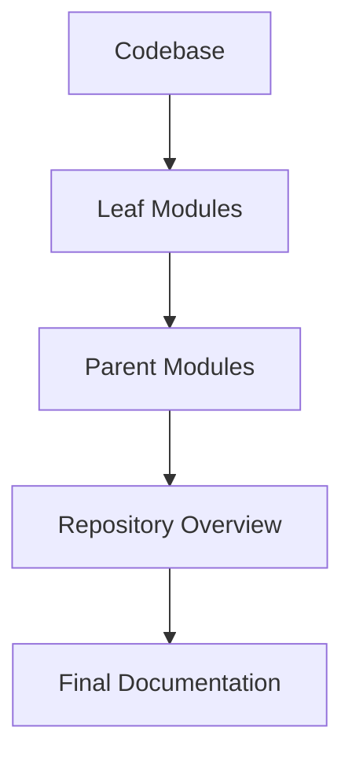
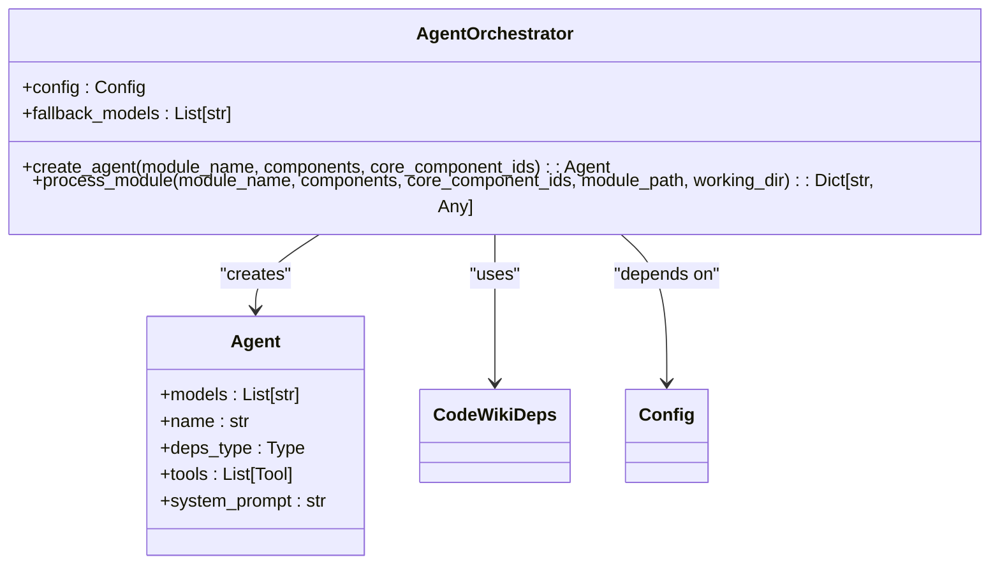
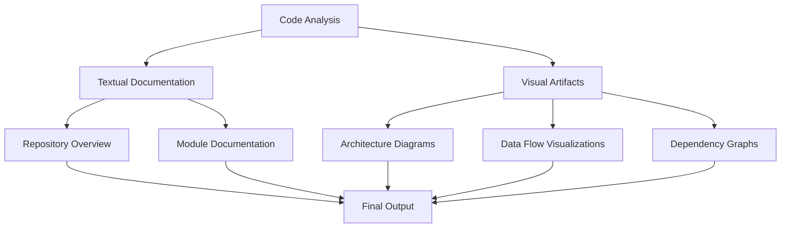
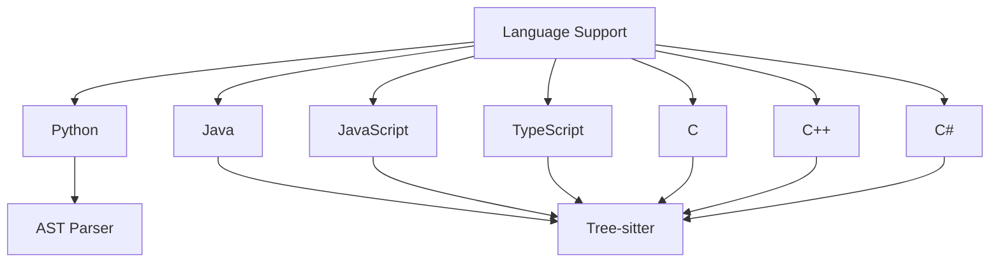
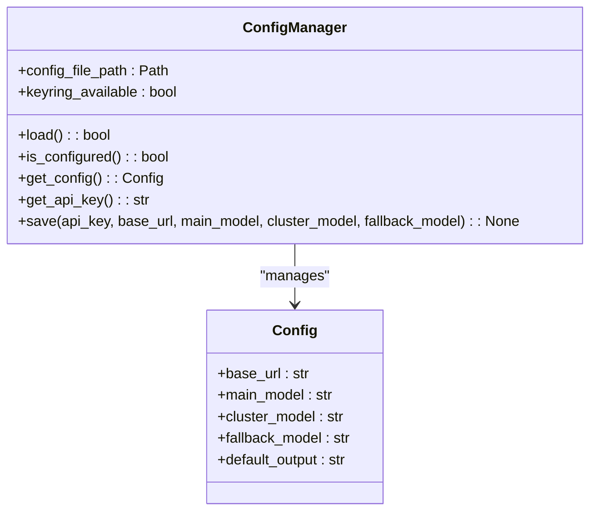
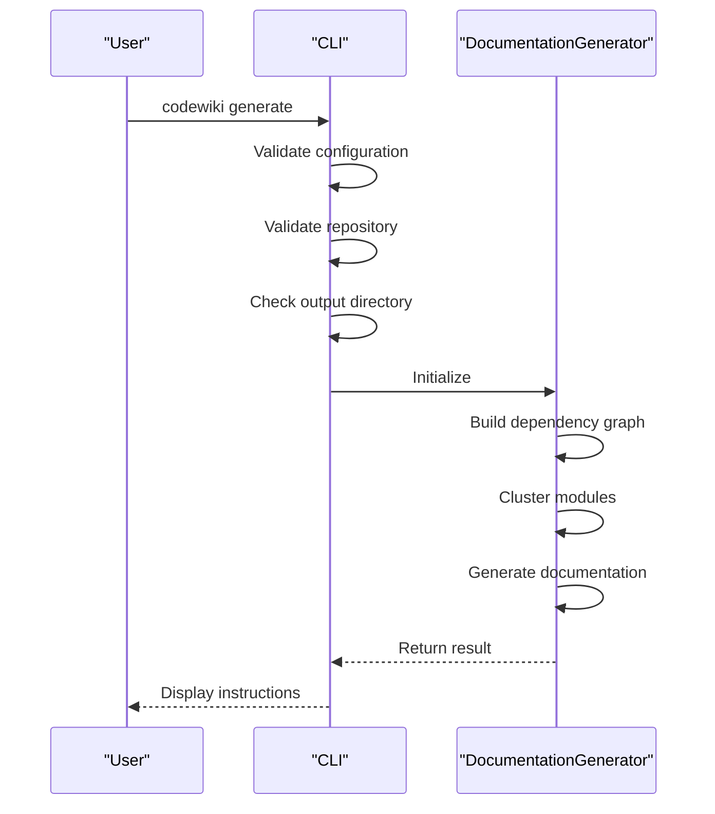
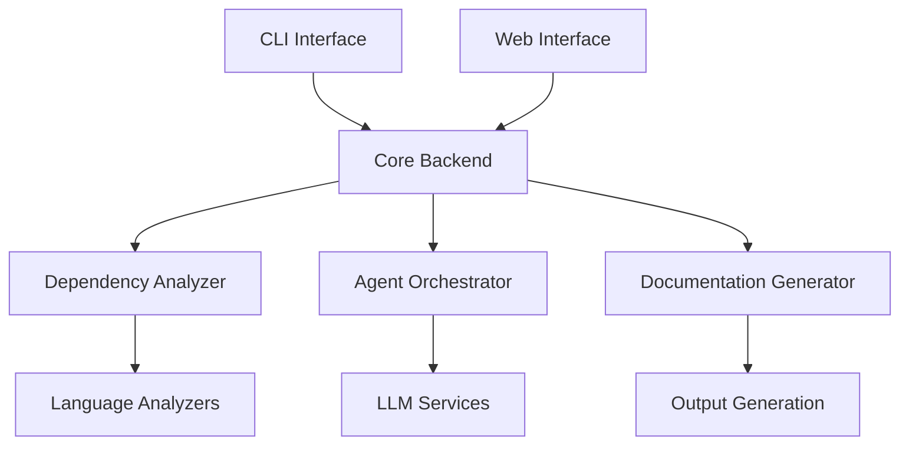
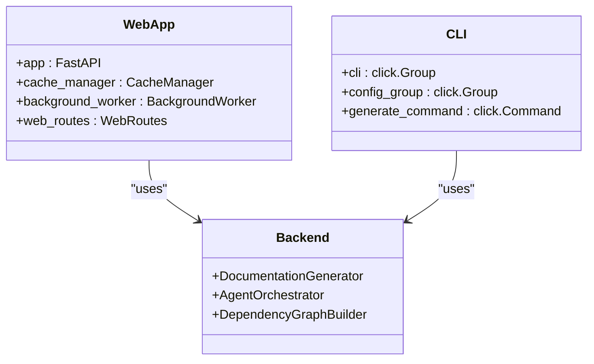

# CodeWiki Overview

<cite>
**Referenced Files in This Document**   
- [README.md](file://README.md)
- [pyproject.toml](file://pyproject.toml)
- [codewiki/cli/main.py](file://codewiki/cli/main.py)
- [codewiki/src/be/main.py](file://codewiki/src/be/main.py)
- [codewiki/run_web_app.py](file://codewiki/run_web_app.py)
- [codewiki/cli/commands/generate.py](file://codewiki/cli/commands/generate.py)
- [codewiki/cli/commands/config.py](file://codewiki/cli/commands/config.py)
- [codewiki/src/be/documentation_generator.py](file://codewiki/src/be/documentation_generator.py)
- [codewiki/src/be/agent_orchestrator.py](file://codewiki/src/be/agent_orchestrator.py)
- [codewiki/src/be/dependency_analyzer/dependency_graphs_builder.py](file://codewiki/src/be/dependency_analyzer/dependency_graphs_builder.py)
- [codewiki/src/be/cluster_modules.py](file://codewiki/src/be/cluster_modules.py)
- [codewiki/src/be/dependency_analyzer/analyzers/python.py](file://codewiki/src/be/dependency_analyzer/analyzers/python.py)
- [codewiki/src/be/dependency_analyzer/analyzers/java.py](file://codewiki/src/be/dependency_analyzer/analyzers/java.py)
- [codewiki/src/config.py](file://codewiki/src/config.py)
</cite>

## Table of Contents
1. [Introduction](#introduction)
2. [Core Value Proposition](#core-value-proposition)
3. [Architectural Innovations](#architectural-innovations)
4. [Supported Languages and Use Cases](#supported-languages-and-use-cases)
5. [Installation and Configuration](#installation-and-configuration)
6. [Documentation Generation Process](#documentation-generation-process)
7. [CLI and Web Interface Relationship](#cli-and-web-interface-relationship)
8. [Performance Metrics and Evaluation](#performance-metrics-and-evaluation)
9. [Additional Resources](#additional-resources)

## Introduction

CodeWiki is an open-source framework designed to transform large-scale codebases into comprehensive, architecture-aware documentation using AI-powered analysis. The system addresses the challenge of understanding complex software repositories by generating holistic documentation that captures not only individual functions but also their cross-file, cross-module, and system-level interactions. CodeWiki supports multiple programming languages and provides both command-line and web interfaces for documentation generation.

**Section sources**
- [README.md](file://README.md#L77-L88)

## Core Value Proposition

CodeWiki's primary value lies in its ability to generate repository-level documentation that maintains architectural context across different granularity levels. Unlike traditional documentation tools that focus on individual code elements, CodeWiki analyzes the entire codebase to create documentation that reflects the system's architecture and component relationships. This approach enables developers to quickly understand complex codebases, accelerate onboarding processes, and maintain documentation that evolves with the code.

The system is designed to handle codebases ranging from 86K to 1.4M lines of code, making it suitable for both medium and large-scale projects. By leveraging AI analysis, CodeWiki can identify patterns, dependencies, and architectural decisions that might not be immediately apparent from the code alone.

**Section sources**
- [README.md](file://README.md#L77-L88)
- [README.md](file://README.md#L175-L198)

## Architectural Innovations

### Hierarchical Decomposition

CodeWiki employs a hierarchical decomposition strategy inspired by dynamic programming principles. This approach allows the system to partition repositories into coherent modules while preserving architectural context across multiple granularity levels. The decomposition process begins with leaf modules (individual components) and progressively builds up to parent modules and the overall repository overview, ensuring that context is maintained throughout the documentation generation process.



**Diagram sources**
- [codewiki/src/be/documentation_generator.py](file://codewiki/src/be/documentation_generator.py#L74-L92)
- [README.md](file://README.md#L208-L209)

### Recursive Agentic System

The recursive multi-agent processing system is a key innovation that enables CodeWiki to maintain quality while scaling to repository-level scope. The system uses adaptive multi-agent processing with dynamic task delegation capabilities, where different AI agents specialize in analyzing different types of modules based on their complexity. Complex modules are handled by more sophisticated agents, while simpler modules are processed by lightweight agents, optimizing both quality and efficiency.



**Diagram sources**
- [codewiki/src/be/agent_orchestrator.py](file://codewiki/src/be/agent_orchestrator.py#L59-L149)
- [README.md](file://README.md#L210-L211)

### Multi-Modal Synthesis

CodeWiki's multi-modal synthesis capability generates both textual documentation and visual artifacts for comprehensive understanding. The system produces architecture diagrams, data flow visualizations, dependency graphs, and sequence diagrams alongside textual descriptions. This multi-modal approach provides developers with multiple perspectives on the codebase, enhancing comprehension and enabling different types of analysis.



**Diagram sources**
- [README.md](file://README.md#L154-L158)
- [codewiki/src/be/documentation_generator.py](file://codewiki/src/be/documentation_generator.py#L224-L232)

## Supported Languages and Use Cases

### Supported Languages

CodeWiki supports seven programming languages, enabling cross-language documentation generation:

- **Python**: Analyzed using AST parsing with comprehensive class, function, and method extraction
- **Java**: Analyzed using Tree-sitter with support for classes, interfaces, enums, and records
- **JavaScript**: Analyzed with support for ES6+ features and module patterns
- **TypeScript**: Analyzed with type information preservation
- **C**: Analyzed with function and struct extraction
- **C++**: Analyzed with class, template, and inheritance support
- **C#**: Analyzed with support for classes, interfaces, and .NET framework patterns



**Diagram sources**
- [README.md](file://README.md#L91-L92)
- [codewiki/src/be/dependency_analyzer/analyzers/python.py](file://codewiki/src/be/dependency_analyzer/analyzers/python.py#L15-L267)
- [codewiki/src/be/dependency_analyzer/analyzers/java.py](file://codewiki/src/be/dependency_analyzer/analyzers/java.py#L13-L356)

### Primary Use Cases

CodeWiki addresses several critical use cases in software development:

1. **Onboarding**: Accelerates the onboarding process for new team members by providing comprehensive documentation of existing codebases
2. **Codebase Understanding**: Enables developers to quickly understand complex or unfamiliar codebases
3. **Documentation Maintenance**: Automates the creation and updating of documentation, reducing the burden on development teams
4. **Knowledge Preservation**: Captures architectural decisions and implementation patterns that might otherwise be lost
5. **Code Review**: Provides context for code reviews by showing how changes affect the overall system architecture

**Section sources**
- [README.md](file://README.md#L77-L88)

## Installation and Configuration

### Installation

CodeWiki can be installed directly from the GitHub repository using pip:

```bash
pip install git+https://github.com/FSoft-AI4Code/CodeWiki.git
```

The installation includes all necessary dependencies, including the Tree-sitter language pack for code analysis and the LiteLLM library for LLM integration.

**Section sources**
- [README.md](file://README.md#L35-L41)
- [pyproject.toml](file://pyproject.toml#L26-L53)

### Configuration

CodeWiki supports multiple models via an OpenAI-compatible SDK layer. Configuration is managed through the CLI:

```bash
codewiki config set \
  --api-key YOUR_API_KEY \
  --base-url https://api.anthropic.com \
  --main-model claude-sonnet-4 \
  --cluster-model claude-sonnet-4 \
  --fallback-model glm-4p5
```

API keys are securely stored in the system keychain (macOS Keychain, Windows Credential Manager, or Linux Secret Service), while other settings are stored in `~/.codewiki/config.json`.



**Diagram sources**
- [README.md](file://README.md#L48-L53)
- [codewiki/cli/commands/config.py](file://codewiki/cli/commands/config.py#L26-L399)
- [codewiki/src/config.py](file://codewiki/src/config.py#L40-L114)

## Documentation Generation Process

### CLI Commands

The documentation generation process is initiated through the CLI:

```bash
# Basic generation
codewiki generate

# With git branch creation and GitHub Pages
codewiki generate --create-branch --github-pages

# Force full regeneration
codewiki generate --no-cache
```

The CLI handles pre-generation checks, configuration validation, repository validation, and output directory management before initiating the documentation generation process.



**Diagram sources**
- [README.md](file://README.md#L62-L67)
- [codewiki/cli/commands/generate.py](file://codewiki/cli/commands/generate.py#L34-L266)
- [codewiki/src/be/documentation_generator.py](file://codewiki/src/be/documentation_generator.py#L249-L292)

### Output Structure

Generated documentation includes both textual descriptions and visual artifacts:

```text
./docs/
├── overview.md              # Repository overview (start here!)
├── module1.md               # Module documentation
├── module2.md               # Additional modules...
├── module_tree.json         # Hierarchical module structure
├── first_module_tree.json   # Initial clustering result
├── metadata.json            # Generation metadata
└── index.html               # Interactive viewer (with --github-pages)
```

The output structure is designed to be both human-readable and machine-processable, with Markdown files for human consumption and JSON files for programmatic access to the module hierarchy and metadata.

**Section sources**
- [README.md](file://README.md#L162-L171)

## CLI and Web Interface Relationship

CodeWiki provides both a command-line interface (CLI) and a web application interface, sharing the same core backend functionality. The CLI is designed for local development and integration into CI/CD pipelines, while the web interface provides a user-friendly way to submit GitHub repositories for documentation generation.



The web application is implemented using FastAPI and includes features such as a background processing queue, cache system for generated documentation, and job status tracking. The CLI and web interface share the same configuration system and documentation generation logic, ensuring consistent output regardless of the interface used.



**Diagram sources**
- [codewiki/run_web_app.py](file://codewiki/run_web_app.py#L1-L16)
- [codewiki/src/fe/web_app.py](file://codewiki/src/fe/web_app.py#L13-L133)
- [codewiki/cli/main.py](file://codewiki/cli/main.py#L12-L57)

## Performance Metrics and Evaluation

CodeWiki has been evaluated on CodeWikiBench, the first benchmark specifically designed for repository-level documentation quality assessment. The evaluation covers 21 repositories spanning all supported languages, with codebases ranging from 86K to 1.4M lines of code.

### Performance by Language Category

| Language Category | CodeWiki (Sonnet-4) | DeepWiki | Improvement |
|-------------------|---------------------|----------|-------------|
| High-Level (Python, JS, TS) | **79.14%** | 68.67% | **+10.47%** |
| Managed (C#, Java) | **68.84%** | 64.80% | **+4.04%** |
| Systems (C, C++) | 53.24% | 56.39% | -3.15% |
| **Overall Average** | **68.79%** | **64.06%** | **+4.73%** |

### Results on Representative Repositories

| Repository | Language | LOC | CodeWiki-Sonnet-4 | DeepWiki | Improvement |
|------------|----------|-----|-------------------|----------|-------------|
| All-Hands-AI--OpenHands | Python | 229K | **82.45%** | 73.04% | **+9.41%** |
| puppeteer--puppeteer | TypeScript | 136K | **83.00%** | 64.46% | **+18.54%** |
| sveltejs--svelte | JavaScript | 125K | **71.96%** | 68.51% | **+3.45%** |
| Unity-Technologies--ml-agents | C# | 86K | **79.78%** | 74.80% | **+4.98%** |
| elastic--logstash | Java | 117K | **57.90%** | 54.80% | **+3.10%** |

The results demonstrate CodeWiki's effectiveness in generating high-quality documentation, particularly for high-level and managed languages. The system's hierarchical decomposition and recursive agentic processing enable it to maintain quality while scaling to large codebases.

**Section sources**
- [README.md](file://README.md#L175-L198)

## Additional Resources

### Documentation & Guides
- **[Docker Deployment](docker/DOCKER_README.md)** - Containerized deployment instructions
- **[Development Guide](DEVELOPMENT.md)** - Project structure, architecture, and contributing guidelines
- **[CodeWikiBench](https://github.com/FSoft-AI4Code/CodeWikiBench)** - Repository-level documentation benchmark
- **[Live Demo](https://fsoft-ai4code.github.io/codewiki-demo/)** - Interactive demo and examples

### Academic Resources
- **[Paper](https://arxiv.org/abs/2510.24428)** - Full research paper with detailed methodology and results
- **[Citation](#citation)** - How to cite CodeWiki in your research

If you use CodeWiki in your research, please cite:

```bibtex
@misc{hoang2025codewikievaluatingaisability,
      title={CodeWiki: Evaluating AI's Ability to Generate Holistic Documentation for Large-Scale Codebases},
      author={Anh Nguyen Hoang and Minh Le-Anh and Bach Le and Nghi D. Q. Bui},
      year={2025},
      eprint={2510.24428},
      archivePrefix={arXiv},
      primaryClass={cs.SE},
      url={https://arxiv.org/abs/2510.24428},
}
```

**Section sources**
- [README.md](file://README.md#L240-L268)