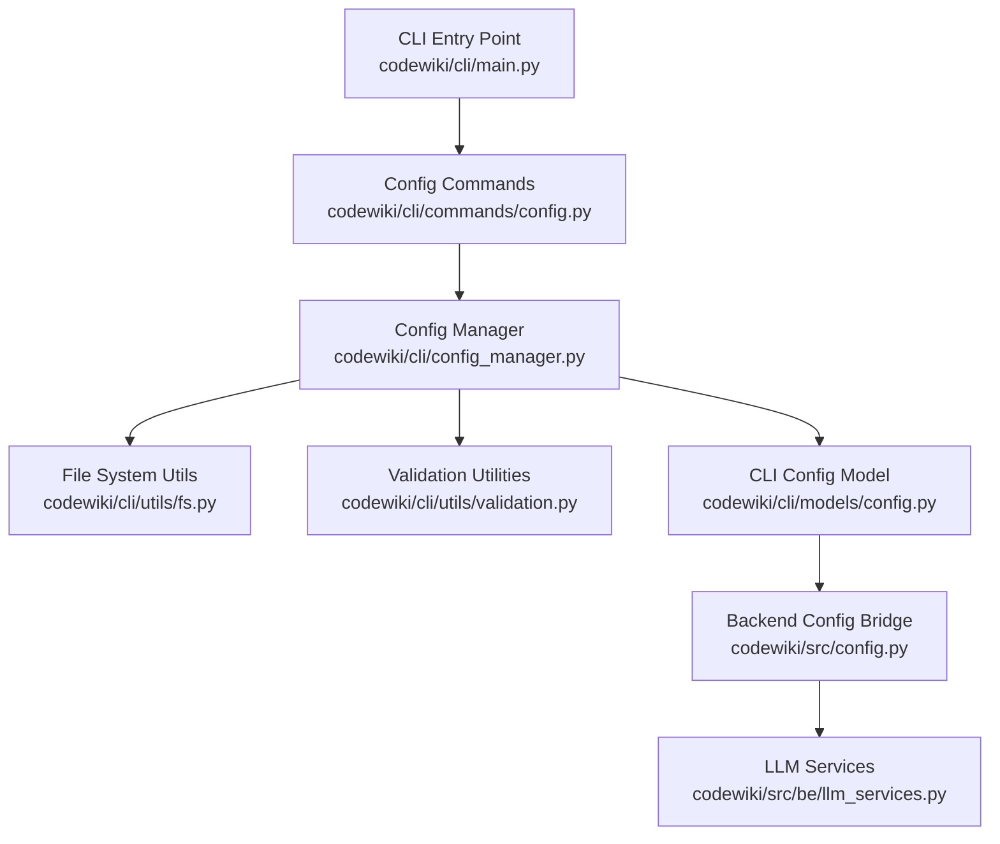
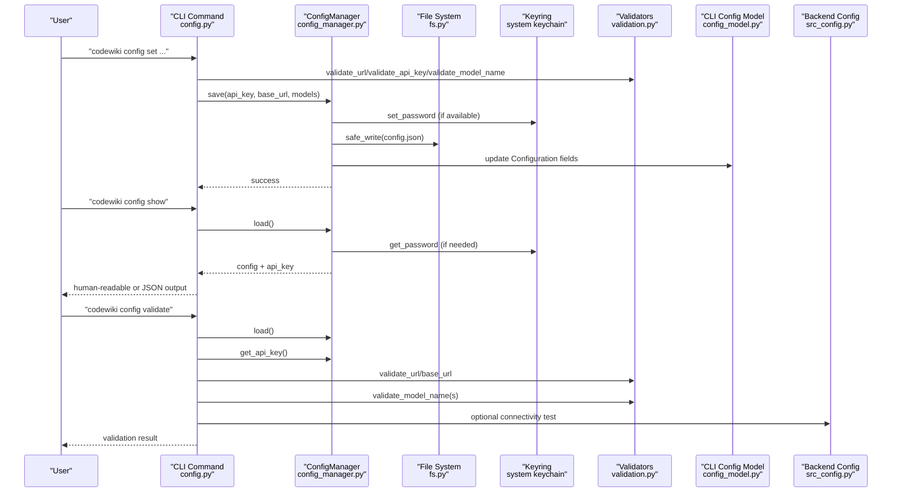
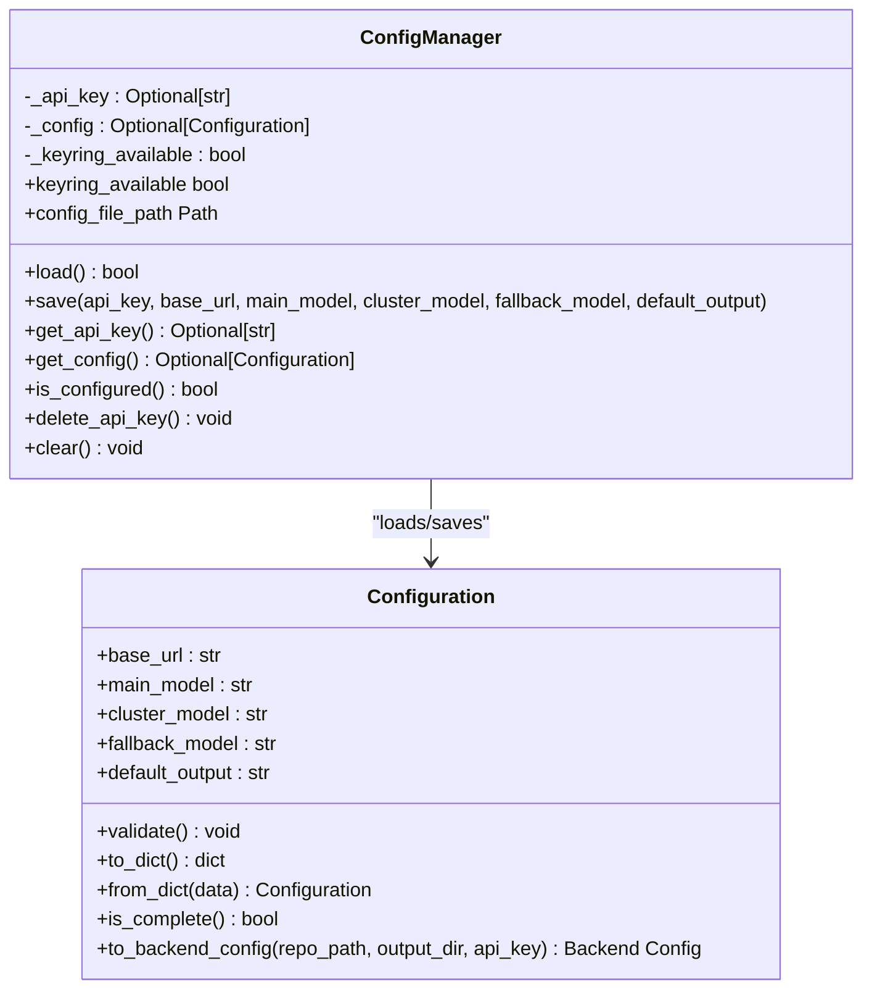
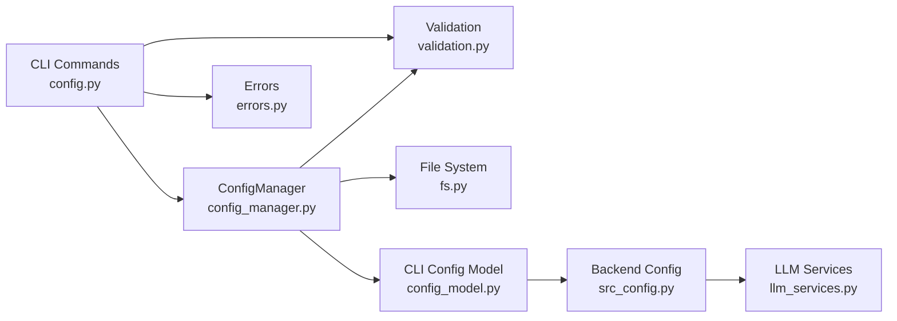

# Configuration Management

<cite>
**Referenced Files in This Document**
- [README.md](file://README.md)
- [main.py](file://codewiki/cli/main.py)
- [config.py](file://codewiki/cli/commands/config.py)
- [config_manager.py](file://codewiki/cli/config_manager.py)
- [config_model.py](file://codewiki/cli/models/config.py)
- [validation.py](file://codewiki/cli/utils/validation.py)
- [fs.py](file://codewiki/cli/utils/fs.py)
- [errors.py](file://codewiki/cli/utils/errors.py)
- [src_config.py](file://codewiki/src/config.py)
- [llm_services.py](file://codewiki/src/be/llm_services.py)
</cite>

## Table of Contents
1. [Introduction](#introduction)
2. [Project Structure](#project-structure)
3. [Core Components](#core-components)
4. [Architecture Overview](#architecture-overview)
5. [Detailed Component Analysis](#detailed-component-analysis)
6. [Dependency Analysis](#dependency-analysis)
7. [Performance Considerations](#performance-considerations)
8. [Troubleshooting Guide](#troubleshooting-guide)
9. [Conclusion](#conclusion)

## Introduction
This document explains the configuration management system in CodeWiki. It covers how to set up API keys, base URLs, and model configurations for main, cluster, and fallback LLMs using the “codewiki config set” command. It documents the secure storage mechanism using the system keychain (macOS Keychain, Windows Credential Manager, Linux Secret Service) for API keys and the configuration file location at "~/.codewiki/config.json". It also details the validation process via “codewiki config validate”, viewing current settings via “codewiki config show”, and the configuration data model including defaults. Finally, it addresses common configuration issues such as invalid API keys, network connectivity problems, and rate limiting considerations.

## Project Structure
The configuration system spans the CLI commands, configuration manager, data models, validators, and file system utilities. The CLI entry point registers the configuration group and integrates it into the main CLI.

**Diagram sources**
- [main.py](file://codewiki/cli/main.py#L33-L40)
- [config.py](file://codewiki/cli/commands/config.py#L1-L399)
- [config_manager.py](file://codewiki/cli/config_manager.py#L1-L232)
- [fs.py](file://codewiki/cli/utils/fs.py#L1-L191)
- [validation.py](file://codewiki/cli/utils/validation.py#L1-L251)
- [config_model.py](file://codewiki/cli/models/config.py#L1-L109)
- [src_config.py](file://codewiki/src/config.py#L1-L114)
- [llm_services.py](file://codewiki/src/be/llm_services.py#L1-L86)

**Section sources**
- [main.py](file://codewiki/cli/main.py#L33-L40)

## Core Components
- CLI configuration commands:
  - “codewiki config set”: Sets API key, base URL, main model, cluster model, and fallback model. Validates inputs and persists configuration.
  - “codewiki config show”: Displays current configuration, masking API keys and indicating storage location.
  - “codewiki config validate”: Validates configuration file existence and format, checks API key presence, validates base URL and model names, and optionally tests API connectivity.
- Configuration manager:
  - Loads and saves configuration to "~/.codewiki/config.json".
  - Stores API keys in the system keychain when available; falls back to encrypted-like file storage when keychain is unavailable.
  - Provides helpers to check completeness and retrieve current values.
- Validation utilities:
  - Validates URLs, API keys, and model names.
  - Masks API keys for display.
  - Identifies top-tier models for clustering.
- Data model:
  - Defines the persisted configuration fields and defaults.
  - Converts CLI configuration to backend configuration for generation.

**Section sources**
- [config.py](file://codewiki/cli/commands/config.py#L32-L399)
- [config_manager.py](file://codewiki/cli/config_manager.py#L1-L232)
- [validation.py](file://codewiki/cli/utils/validation.py#L1-L251)
- [config_model.py](file://codewiki/cli/models/config.py#L1-L109)

## Architecture Overview
The configuration lifecycle involves CLI commands invoking the configuration manager, which reads/writes the JSON file and interacts with the system keychain. The CLI configuration model is bridged to the backend configuration used during generation.

**Diagram sources**
- [config.py](file://codewiki/cli/commands/config.py#L32-L399)
- [config_manager.py](file://codewiki/cli/config_manager.py#L51-L160)
- [fs.py](file://codewiki/cli/utils/fs.py#L60-L114)
- [validation.py](file://codewiki/cli/utils/validation.py#L13-L100)
- [config_model.py](file://codewiki/cli/models/config.py#L1-L109)
- [src_config.py](file://codewiki/src/config.py#L74-L114)

## Detailed Component Analysis

### Configuration Commands
- “codewiki config set”
  - Accepts options for API key, base URL, main model, cluster model, and fallback model.
  - Validates inputs before saving.
  - Persists configuration to "~/.codewiki/config.json" and stores API key in the system keychain when available.
  - Emits warnings for non-top-tier cluster models.
- “codewiki config show”
  - Loads configuration and prints masked API key and storage location.
  - Supports JSON output for automation.
- “codewiki config validate”
  - Checks configuration file existence and validity.
  - Ensures API key presence and correct format.
  - Validates base URL and model names.
  - Optionally performs an API connectivity test.

**Section sources**
- [config.py](file://codewiki/cli/commands/config.py#L32-L399)

### Configuration Manager
- Responsibilities:
  - Initialize and check availability of system keyring.
  - Load configuration from "~/.codewiki/config.json" and retrieve API key from keyring.
  - Save configuration updates, validating fields and persisting to JSON.
  - Provide helpers to check completeness and clear configuration.
- Storage:
  - API keys: system keychain (macOS Keychain, Windows Credential Manager, Linux Secret Service).
  - Non-sensitive settings: "~/.codewiki/config.json".

**Diagram sources**
- [config_manager.py](file://codewiki/cli/config_manager.py#L26-L232)
- [config_model.py](file://codewiki/cli/models/config.py#L20-L109)

**Section sources**
- [config_manager.py](file://codewiki/cli/config_manager.py#L1-L232)

### Validation Utilities
- URL validation:
  - Requires scheme and hostname; enforces HTTPS unless localhost is allowed.
- API key validation:
  - Rejects empty or too-short keys.
- Model name validation:
  - Rejects empty model names.
- Top-tier model detection:
  - Flags non-top-tier models for clustering.
- API key masking:
  - Masks displayed API keys for safety.

**Section sources**
- [validation.py](file://codewiki/cli/utils/validation.py#L13-L100)
- [validation.py](file://codewiki/cli/utils/validation.py#L209-L251)

### Configuration Data Model
- Fields:
  - base_url: LLM API base URL.
  - main_model: Primary model for documentation generation.
  - cluster_model: Model for module clustering.
  - fallback_model: Fallback model for documentation generation (default: "glm-4p5").
  - default_output: Default output directory (default: "docs").
- Defaults:
  - fallback_model: "glm-4p5"
  - default_output: "docs"
- Validation:
  - Validates URL and all model names.
- Conversion:
  - Converts CLI configuration to backend configuration for generation.

**Section sources**
- [config_model.py](file://codewiki/cli/models/config.py#L20-L109)

### Backend Integration
- CLI configuration bridges to backend configuration used during generation.
- Backend configuration includes LLM settings and output directories.

**Section sources**
- [config_model.py](file://codewiki/cli/models/config.py#L82-L109)
- [src_config.py](file://codewiki/src/config.py#L74-L114)

## Dependency Analysis
- CLI commands depend on:
  - ConfigManager for persistence and retrieval.
  - Validation utilities for input checks.
  - Error utilities for consistent exit codes.
- ConfigManager depends on:
  - File system utilities for safe read/write.
  - Validation utilities for field validation.
  - CLI configuration model for data representation.
- Backend configuration depends on:
  - CLI configuration bridge for runtime values.

**Diagram sources**
- [config.py](file://codewiki/cli/commands/config.py#L1-L399)
- [config_manager.py](file://codewiki/cli/config_manager.py#L1-L232)
- [validation.py](file://codewiki/cli/utils/validation.py#L1-L251)
- [errors.py](file://codewiki/cli/utils/errors.py#L1-L114)
- [fs.py](file://codewiki/cli/utils/fs.py#L1-L191)
- [config_model.py](file://codewiki/cli/models/config.py#L1-L109)
- [src_config.py](file://codewiki/src/config.py#L1-L114)
- [llm_services.py](file://codewiki/src/be/llm_services.py#L1-L86)

**Section sources**
- [config.py](file://codewiki/cli/commands/config.py#L1-L399)
- [config_manager.py](file://codewiki/cli/config_manager.py#L1-L232)

## Performance Considerations
- Keyring availability:
  - The configuration manager probes keyring availability and proceeds without it if unavailable. Expect slower initial retrieval if keyring is not configured.
- File I/O:
  - Safe file operations use atomic writes to minimize corruption risk.
- Validation overhead:
  - Validation is lightweight and runs quickly; API connectivity test is optional and off by default.

[No sources needed since this section provides general guidance]

## Troubleshooting Guide
- Invalid API key:
  - Symptom: Validation rejects empty or too-short keys.
  - Resolution: Re-run “codewiki config set --api-key <key>” with a valid key.
- Missing base URL:
  - Symptom: Validation reports missing base URL.
  - Resolution: Re-run “codewiki config set --base-url <url>” with a valid URL.
- Missing models:
  - Symptom: Validation reports missing main, cluster, or fallback models.
  - Resolution: Re-run “codewiki config set --main-model <model> --cluster-model <model> --fallback-model <model>”.
- Network connectivity issues:
  - Symptom: API connectivity test fails.
  - Resolution: Verify base URL, network access, and provider availability. Retry with “codewiki config validate --quick” to skip connectivity test.
- Rate limiting considerations:
  - Symptom: API errors or timeouts.
  - Resolution: Reduce concurrent requests, retry after cooldown, or switch to a higher-tier model/provider.
- Keyring unavailable:
  - Symptom: Warning that system keychain is unavailable; API key stored in encrypted file.
  - Resolution: Configure system keychain (macOS Keychain, Windows Credential Manager, Linux Secret Service). On Linux, ensure a Secret Service implementation is installed and unlocked.

**Section sources**
- [config.py](file://codewiki/cli/commands/config.py#L250-L399)
- [errors.py](file://codewiki/cli/utils/errors.py#L1-L114)
- [validation.py](file://codewiki/cli/utils/validation.py#L13-L100)

## Conclusion
CodeWiki’s configuration management provides a secure, user-friendly way to manage API keys and LLM settings. API keys are stored in the system keychain when available, with a fallback to a local configuration file. Users can set, view, and validate their configuration using dedicated CLI commands. The configuration data model defines clear defaults and validation rules, ensuring reliable generation workflows.