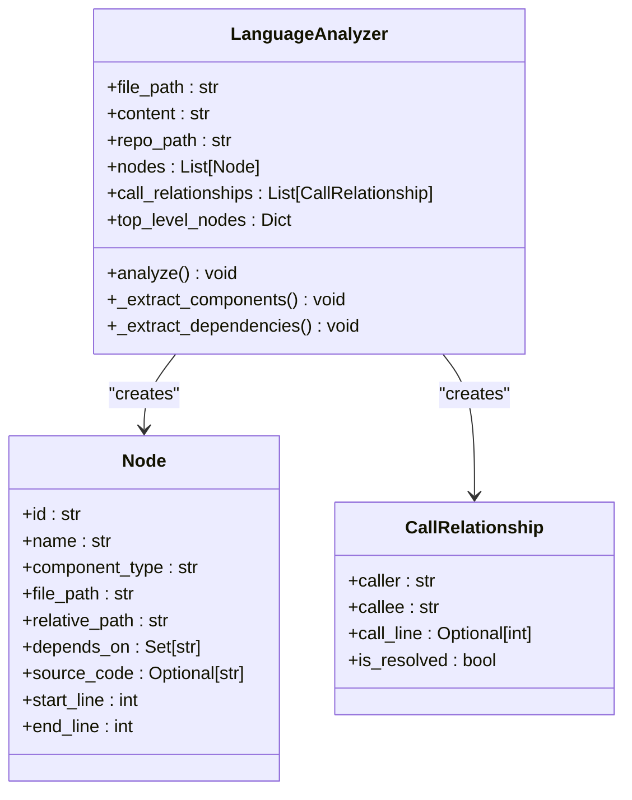
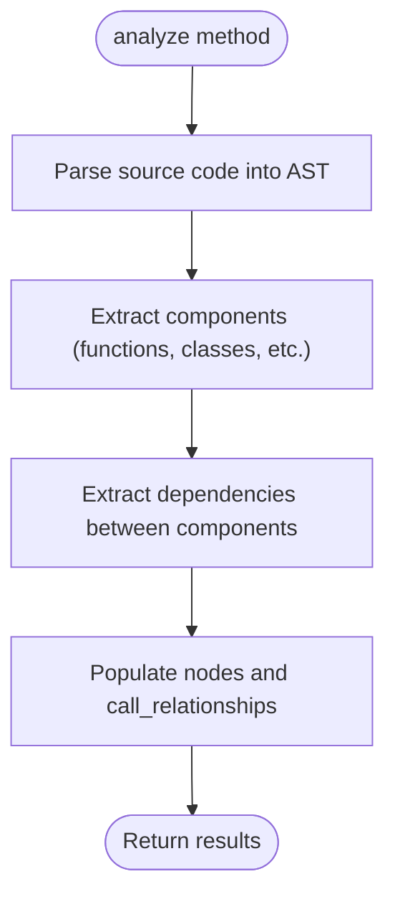
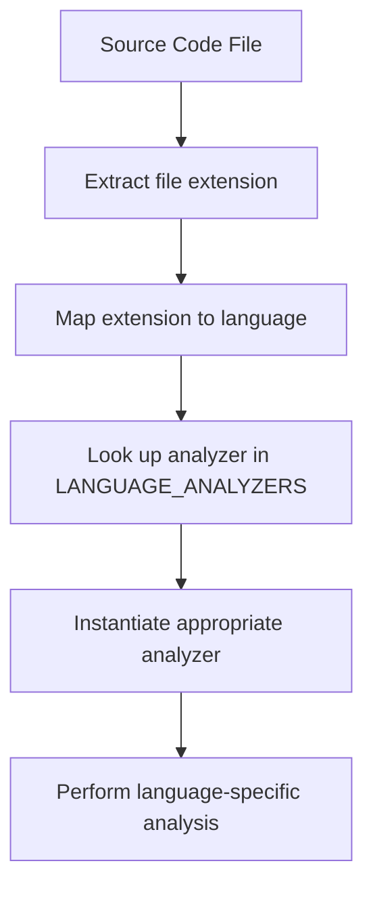
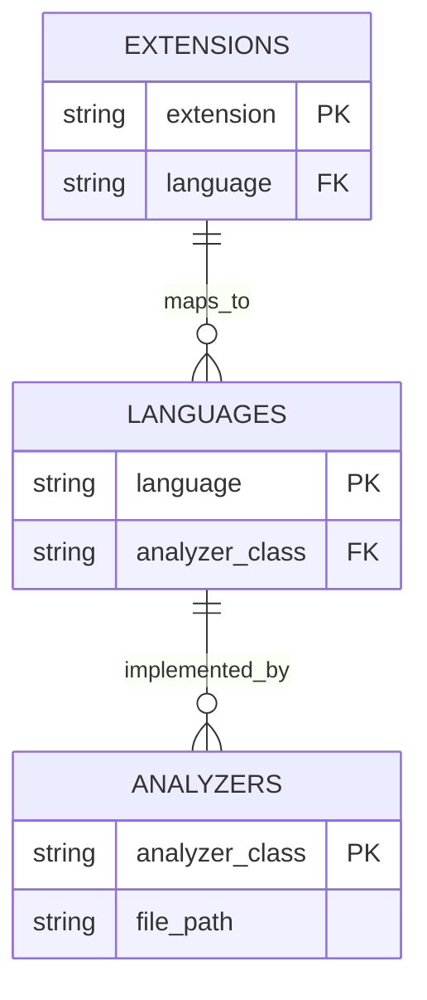
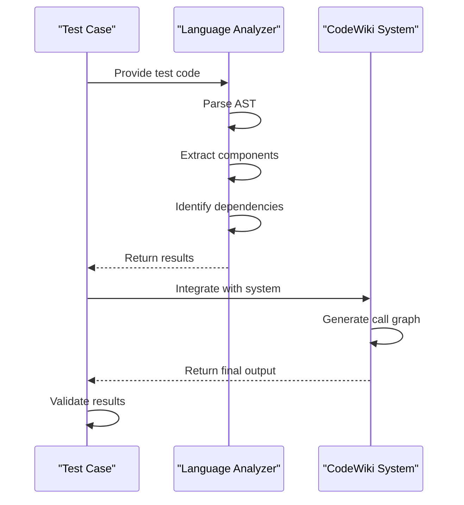

# Adding Support for New Languages

<cite>
**Referenced Files in This Document**   
- [ast_parser.py](file://codewiki/src/be/dependency_analyzer/ast_parser.py)
- [python.py](file://codewiki/src/be/dependency_analyzer/analyzers/python.py)
- [javascript.py](file://codewiki/src/be/dependency_analyzer/analyzers/javascript.py)
- [core.py](file://codewiki/src/be/dependency_analyzer/models/core.py)
- [analysis_service.py](file://codewiki/src/be/dependency_analyzer/analysis/analysis_service.py)
- [call_graph_analyzer.py](file://codewiki/src/be/dependency_analyzer/analysis/call_graph_analyzer.py)
- [patterns.py](file://codewiki/src/be/dependency_analyzer/utils/patterns.py)
</cite>

## Table of Contents
1. [Introduction](#introduction)
2. [Creating a New Language Analyzer](#creating-a-new-language-analyzer)
3. [Required Methods Implementation](#required-methods-implementation)
4. [Registering the Analyzer](#registering-the-analyzer)
5. [Configuration and File Extension Mapping](#configuration-and-file-extension-mapping)
6. [Testing and Validation](#testing-and-validation)
7. [Common Pitfalls and Best Practices](#common-pitfalls-and-best-practices)
8. [Conclusion](#conclusion)

## Introduction
CodeWiki provides a flexible framework for analyzing code repositories across multiple programming languages. The system uses language-specific analyzers to extract dependencies and components from source code files. This document details the process of extending CodeWiki to support new programming languages by creating custom analyzers that integrate with the existing dependency analysis framework.

The core architecture relies on AST (Abstract Syntax Tree) parsing to extract meaningful information about code structure, dependencies, and relationships between components. By following the patterns established in existing analyzers, developers can create new language analyzers that seamlessly integrate with the system.

**Section sources**
- [ast_parser.py](file://codewiki/src/be/dependency_analyzer/ast_parser.py#L1-L146)
- [analysis_service.py](file://codewiki/src/be/dependency_analyzer/analysis/analysis_service.py#L1-L370)

## Creating a New Language Analyzer
To add support for a new programming language in CodeWiki, you need to create a new analyzer class that follows the established patterns in the `analyzers` module. The process involves creating a new Python file in the `codewiki/src/be/dependency_analyzer/analyzers/` directory and implementing a class that can parse the target language's syntax and extract relevant information.

The analyzer should be designed to work with the existing dependency analysis framework, which expects certain methods and data structures to be implemented. The analyzer will be responsible for:

1. Parsing source code files of the target language
2. Extracting top-level components (functions, classes, methods, etc.)
3. Identifying dependencies between components
4. Creating standardized data structures that can be consumed by the rest of the system

When creating a new analyzer, it's recommended to use existing analyzers like `python.py` or `javascript.py` as reference implementations. These files demonstrate the expected patterns and provide examples of how to handle common scenarios in code analysis.



**Diagram sources **
- [python.py](file://codewiki/src/be/dependency_analyzer/analyzers/python.py#L15-L267)
- [javascript.py](file://codewiki/src/be/dependency_analyzer/analyzers/javascript.py#L18-L706)
- [core.py](file://codewiki/src/be/dependency_analyzer/models/core.py#L7-L64)

**Section sources**
- [python.py](file://codewiki/src/be/dependency_analyzer/analyzers/python.py#L1-L267)
- [javascript.py](file://codewiki/src/be/dependency_analyzer/analyzers/javascript.py#L1-L706)

## Required Methods Implementation
When creating a new language analyzer, there are several key methods that must be implemented to ensure proper integration with the CodeWiki system. These methods follow patterns established in existing analyzers and are essential for extracting meaningful information from source code files.

### Core Analysis Methods
The primary analysis method is `analyze()`, which orchestrates the entire analysis process. This method should:

1. Parse the source code into an AST (Abstract Syntax Tree)
2. Traverse the AST to extract components and dependencies
3. Populate the analyzer's internal data structures



**Diagram sources **
- [python.py](file://codewiki/src/be/dependency_analyzer/analyzers/python.py#L227-L246)
- [javascript.py](file://codewiki/src/be/dependency_analyzer/analyzers/javascript.py#L51-L71)

The `extract_components()` method (or equivalent) is responsible for identifying top-level components in the source code. This typically involves traversing the AST and identifying nodes that represent functions, classes, methods, and other significant code elements. The extracted components should be stored in the analyzer's `nodes` list as `Node` objects.

The `extract_dependencies()` method (or equivalent) identifies relationships between components, such as function calls, class inheritance, and interface implementation. These relationships are stored as `CallRelationship` objects in the analyzer's `call_relationships` list.

### Helper Methods
Several helper methods are commonly implemented across analyzers to support the core analysis functionality:

- `_get_module_path()`: Converts a file path into a module path using dot notation
- `_get_component_id()`: Generates a unique identifier for a component based on its name and location
- `_find_child_by_type()`: Helper method to find child nodes of a specific type in the AST
- `_get_node_text()`: Extracts the text content of a node from the source code

These methods help standardize the analysis process and ensure consistent data representation across different language analyzers.

**Section sources**
- [python.py](file://codewiki/src/be/dependency_analyzer/analyzers/python.py#L1-L267)
- [javascript.py](file://codewiki/src/be/dependency_analyzer/analyzers/javascript.py#L1-L706)

## Registering the Analyzer
After implementing the new language analyzer, it must be registered in the system to make it available for use. This involves adding the analyzer to the `LANGUAGE_ANALYZERS` dictionary in the `ast_parser.py` file.

The registration process follows these steps:

1. Import the new analyzer class at the top of `ast_parser.py`
2. Add an entry to the `LANGUAGE_ANALYZERS` dictionary mapping the language name to the analyzer class
3. Ensure the analyzer is properly instantiated when needed

The `LANGUAGE_ANALYZERS` dictionary serves as a registry that maps language names to their corresponding analyzer classes. When CodeWiki processes a repository, it uses this registry to determine which analyzer to use for each file based on its extension.



**Diagram sources **
- [ast_parser.py](file://codewiki/src/be/dependency_analyzer/ast_parser.py#L1-L146)
- [call_graph_analyzer.py](file://codewiki/src/be/dependency_analyzer/analysis/call_graph_analyzer.py#L1-L536)

The registration process ensures that the new analyzer is properly integrated into the analysis pipeline and can be used to process files of the target language.

**Section sources**
- [ast_parser.py](file://codewiki/src/be/dependency_analyzer/ast_parser.py#L1-L146)
- [call_graph_analyzer.py](file://codewiki/src/be/dependency_analyzer/analysis/call_graph_analyzer.py#L1-L536)

## Configuration and File Extension Mapping
To associate file extensions with the new language, configuration changes are required in the `patterns.py` file. This file contains the `CODE_EXTENSIONS` dictionary, which maps file extensions to language names.

The process involves:

1. Adding new file extensions to the `CODE_EXTENSIONS` dictionary
2. Ensuring the language name matches the key used in the `LANGUAGE_ANALYZERS` dictionary
3. Following the established naming conventions for language identifiers

For example, to add support for a new language with `.xyz` extension:

```python
CODE_EXTENSIONS = {
    # ... existing extensions
    ".xyz": "xyzlang",
    # ... additional extensions
}
```

The language identifier should be lowercase and follow the pattern used for other languages (e.g., "python", "javascript", "typescript").

Additionally, you may want to update the `DEFAULT_INCLUDE_PATTERNS` list to include the new file extension, ensuring that files with this extension are included in the analysis by default.



**Diagram sources **
- [patterns.py](file://codewiki/src/be/dependency_analyzer/utils/patterns.py#L178-L202)
- [ast_parser.py](file://codewiki/src/be/dependency_analyzer/ast_parser.py#L1-L146)

These configuration changes ensure that files with the new extension are properly identified and processed by the appropriate analyzer.

**Section sources**
- [patterns.py](file://codewiki/src/be/dependency_analyzer/utils/patterns.py#L1-L648)

## Testing and Validation
Thorough testing is essential when adding support for a new programming language. The testing process should include both unit tests and integration tests to ensure the analyzer works correctly and integrates properly with the rest of the system.

### Unit Testing
Unit tests should focus on verifying the correctness of the analyzer's individual components and methods. Key areas to test include:

- AST parsing accuracy
- Component extraction (functions, classes, methods)
- Dependency detection (function calls, inheritance, etc.)
- Edge cases and error handling

Test cases should cover a variety of code patterns and structures commonly found in the target language. This includes testing with malformed code to ensure the analyzer handles errors gracefully.

### Integration Testing
Integration tests verify that the new analyzer works correctly within the overall CodeWiki system. These tests should:

1. Process real code files of the target language
2. Verify that components are correctly extracted and represented
3. Check that dependencies are accurately identified
4. Ensure the analyzer integrates properly with the call graph generation

The validation process should include checking the output against expected results, particularly focusing on:

- Correct identification of component types (function, class, method, etc.)
- Accurate representation of component relationships
- Proper handling of namespaces and modules
- Correct line number and source code extraction



**Diagram sources **
- [python.py](file://codewiki/src/be/dependency_analyzer/analyzers/python.py#L248-L267)
- [javascript.py](file://codewiki/src/be/dependency_analyzer/analyzers/javascript.py#L687-L706)

**Section sources**
- [python.py](file://codewiki/src/be/dependency_analyzer/analyzers/python.py#L248-L267)
- [javascript.py](file://codewiki/src/be/dependency_analyzer/analyzers/javascript.py#L687-L706)

## Common Pitfalls and Best Practices
When implementing a new language analyzer, several common pitfalls should be avoided to ensure reliable and accurate analysis.

### Incorrect Node Traversal Logic
One of the most common issues is incorrect AST traversal logic, which can lead to missed components or incorrect dependency relationships. To avoid this:

- Carefully study the AST structure of the target language
- Use debugging tools to visualize the AST and verify traversal paths
- Implement comprehensive test cases that cover various code structures
- Follow the patterns established in existing analyzers

### Incomplete Dependency Extraction
Incomplete dependency extraction can occur when certain types of relationships are not properly identified. Common missed dependencies include:

- Implicit dependencies (e.g., through reflection or dynamic loading)
- Inheritance and interface implementation
- Module imports and exports
- Method calls through interfaces or abstract classes

To ensure comprehensive dependency extraction:

- Analyze multiple codebases to identify common patterns
- Study the language specification to understand all possible dependency types
- Implement fallback mechanisms for cases where direct analysis is not possible
- Use heuristics to identify likely dependencies when exact analysis is challenging

### Performance Considerations
Language analyzers should be designed with performance in mind, especially when processing large codebases. Best practices include:

- Optimizing AST traversal to minimize unnecessary operations
- Using efficient data structures for storing and querying components
- Implementing caching mechanisms for frequently accessed data
- Processing files in parallel when possible

### Error Handling
Robust error handling is essential for a reliable analyzer. The analyzer should:

- Gracefully handle malformed code and syntax errors
- Provide meaningful error messages for debugging
- Continue processing when possible, even if some files cannot be analyzed
- Log errors appropriately for troubleshooting

Following these best practices will help ensure that the new language analyzer is accurate, reliable, and performs well in real-world scenarios.

**Section sources**
- [python.py](file://codewiki/src/be/dependency_analyzer/analyzers/python.py#L227-L246)
- [javascript.py](file://codewiki/src/be/dependency_analyzer/analyzers/javascript.py#L51-L71)
- [core.py](file://codewiki/src/be/dependency_analyzer/models/core.py#L7-L64)

## Conclusion
Adding support for new programming languages in CodeWiki involves creating a custom analyzer that follows established patterns and integrates with the existing dependency analysis framework. By implementing the required methods, registering the analyzer, configuring file extension mappings, and thoroughly testing the implementation, developers can extend CodeWiki's capabilities to support additional languages.

The process leverages the modular architecture of CodeWiki, allowing new analyzers to be added without modifying the core system. This extensibility makes CodeWiki a powerful tool for analyzing multi-language repositories and understanding complex codebases.

When implementing a new analyzer, it's important to study existing implementations, follow established patterns, and thoroughly test the implementation to ensure accuracy and reliability. By doing so, developers can contribute to the growing ecosystem of language support in CodeWiki and enable analysis of a wider range of codebases.