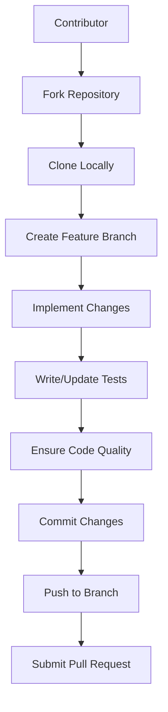
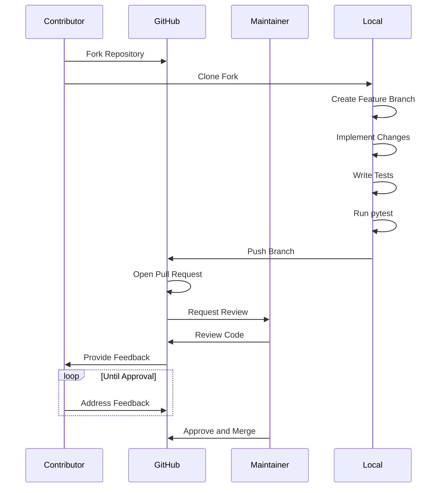
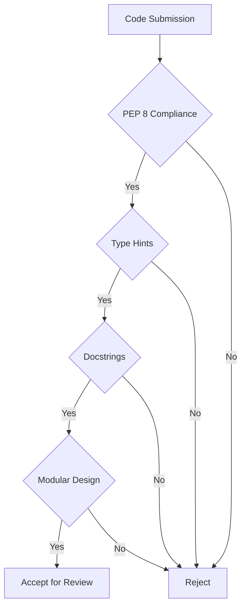

# Contribution Workflow

<cite>
**Referenced Files in This Document**   
- [DEVELOPMENT.md](file://DEVELOPMENT.md)
- [README.md](file://README.md)
- [pyproject.toml](file://pyproject.toml)
- [requirements.txt](file://requirements.txt)
- [codewiki/cli/main.py](file://codewiki/cli/main.py)
- [codewiki/cli/commands/generate.py](file://codewiki/cli/commands/generate.py)
- [codewiki/cli/git_manager.py](file://codewiki/cli/git_manager.py)
- [codewiki/cli/utils/validation.py](file://codewiki/cli/utils/validation.py)
- [codewiki/cli/utils/repo_validator.py](file://codewiki/cli/utils/repo_validator.py)
</cite>

## Table of Contents
1. [Introduction](#introduction)
2. [Contribution Requirements](#contribution-requirements)
3. [Step-by-Step Contribution Process](#step-by-step-contribution-process)
4. [Branch Naming Conventions](#branch-naming-conventions)
5. [Commit Message Guidelines](#commit-message-guidelines)
6. [Code Quality Standards](#code-quality-standards)
7. [Testing Requirements](#testing-requirements)
8. [Pull Request Review Process](#pull-request-review-process)
9. [Syncing Fork with Upstream](#syncing-fork-with-upstream)
10. [Maintainer Review Process](#maintainer-review-process)
11. [Conclusion](#conclusion)

## Introduction
This document outlines the complete contribution workflow for CodeWiki, an open-source framework for automated repository-level documentation generation. The contribution process follows a standardized workflow from forking the repository to submitting a pull request, with specific guidelines for code quality, testing, and collaboration. This documentation is based on the official DEVELOPMENT.md guidelines and the project's codebase structure.

**Section sources**
- [DEVELOPMENT.md](file://DEVELOPMENT.md#L1-L245)
- [README.md](file://README.md#L1-L289)

## Contribution Requirements
To contribute to CodeWiki, contributors must meet specific technical and quality requirements. The project requires Python 3.12+ and Node.js for mermaid diagram validation. All contributions must include appropriate tests and adhere to the project's code quality standards.

The project uses a comprehensive dependency management system defined in pyproject.toml, which specifies required packages including Click for CLI functionality, GitPython for git operations, tree-sitter for code parsing, and various LLM integration libraries. Development dependencies include pytest for testing, black for code formatting, mypy for type checking, and ruff for linting.

All contributions must follow PEP 8 style guidelines, include type hints where applicable, and provide docstrings for public functions and classes. The codebase emphasizes modularity, with clear separation between CLI, backend analysis, and frontend components.

**Diagram sources**
- [DEVELOPMENT.md](file://DEVELOPMENT.md#L179-L187)
- [pyproject.toml](file://pyproject.toml#L63-L70)

**Section sources**
- [DEVELOPMENT.md](file://DEVELOPMENT.md#L47-L50)
- [pyproject.toml](file://pyproject.toml#L10-L11)
- [pyproject.toml](file://pyproject.toml#L63-L70)

## Step-by-Step Contribution Process
The contribution process for CodeWiki follows a standardized Git workflow that begins with forking the repository and ends with submitting a pull request. Contributors should first fork the main repository on GitHub, then clone their fork locally to begin development.

After cloning, contributors should create a virtual environment and install the package in development mode using `pip install -e .` as specified in the DEVELOPMENT.md guide. This setup allows for immediate testing of changes to the CLI and other components.

The core contribution workflow involves creating a feature branch, implementing changes, writing or updating tests, ensuring all tests pass, and then submitting a pull request. The process is designed to maintain code quality and ensure that all contributions are properly reviewed before merging into the main codebase.

**Diagram sources**
- [DEVELOPMENT.md](file://DEVELOPMENT.md#L180-L187)
- [README.md](file://README.md#L35-L41)

**Section sources**
- [DEVELOPMENT.md](file://DEVELOPMENT.md#L54-L68)
- [README.md](file://README.md#L35-L41)

## Branch Naming Conventions
CodeWiki follows a standardized branch naming convention to organize contributions and maintain clarity in the development workflow. All feature branches should be prefixed with `feature/` followed by a descriptive name of the feature being implemented.

This convention is evident in the contribution guidelines specified in DEVELOPMENT.md, which explicitly states: `git checkout -b feature/your-feature`. The prefix helps distinguish feature branches from other types of branches such as bug fixes or releases, and makes it easier for maintainers to identify the purpose of each branch.

The branch naming convention supports the project's modular architecture by allowing multiple features to be developed simultaneously without naming conflicts. When creating a documentation branch through the CLI with the `--create-branch` flag, the system automatically generates a timestamped branch name following the pattern `docs/codewiki-YYYYMMDD-HHMMSS`, which aligns with the overall branching strategy.

**Section sources**
- [DEVELOPMENT.md](file://DEVELOPMENT.md#L182)
- [codewiki/cli/git_manager.py](file://codewiki/cli/git_manager.py#L103-L104)

## Commit Message Guidelines
CodeWiki follows a concise and descriptive commit message convention to maintain a clear and informative commit history. Commit messages should be clear, descriptive, and follow the imperative mood (e.g., "Add new feature" rather than "Added new feature").

As specified in the DEVELOPMENT.md contribution guidelines, commits should be made with the command `git commit -am 'Add new feature'`. This convention ensures that commit messages are consistent across contributions and provide meaningful information about the changes made.

The project's git management system, implemented in git_manager.py, uses standardized commit messages when automatically committing documentation changes. The default message "Add generated documentation\n\nGenerated by CodeWiki CLI" follows conventional commit formatting with a subject line and body, providing both a summary and additional context.

**Section sources**
- [DEVELOPMENT.md](file://DEVELOPMENT.md#L186)
- [codewiki/cli/git_manager.py](file://codewiki/cli/git_manager.py#L142-L143)

## Code Quality Standards
CodeWiki enforces strict code quality standards to maintain consistency and reliability across the codebase. All Python code must follow PEP 8 guidelines, include type hints where applicable, and have docstrings for public functions and classes.

The project's pyproject.toml file specifies development dependencies including black, mypy, and ruff, which are used for code formatting, type checking, and linting respectively. These tools ensure that all code adheres to the project's quality standards before being committed.

The codebase demonstrates a modular architecture with clear separation of concerns between components. The CLI, backend analysis, and frontend components are organized in distinct directories with well-defined interfaces. Functions are kept focused and modular, following the principle of single responsibility.

**Diagram sources**
- [DEVELOPMENT.md](file://DEVELOPMENT.md#L173-L177)
- [pyproject.toml](file://pyproject.toml#L107-L113)

**Section sources**
- [DEVELOPMENT.md](file://DEVELOPMENT.md#L173-L177)
- [pyproject.toml](file://pyproject.toml#L107-L113)

## Testing Requirements
CodeWiki has comprehensive testing requirements to ensure the reliability and correctness of all contributions. Contributors must write or update tests for any changes they make, and ensure that all tests pass before submitting a pull request.

The project uses pytest as its testing framework, with configuration specified in pyproject.toml. Tests can be run with the simple command `pytest`, or with coverage reporting using `pytest --cov=codewiki tests/`. The test suite includes unit tests, integration tests, and functional tests for the various components of the system.

Testing is particularly important for the core functionality of CodeWiki, which includes dependency analysis, module clustering, and documentation generation. Changes to the language analyzers in `src/be/dependency_analyzer/analyzers/` must be accompanied by corresponding tests to ensure that the parsing and analysis of code in different programming languages remains accurate.

**Section sources**
- [DEVELOPMENT.md](file://DEVELOPMENT.md#L159-L169)
- [pyproject.toml](file://pyproject.toml#L118-L124)

## Pull Request Review Process
The pull request review process for CodeWiki is designed to ensure code quality, architectural consistency, and adherence to project standards. When a contributor submits a pull request, it enters a review process where maintainers evaluate the changes based on several criteria.

Maintainers review the code for adherence to PEP 8, proper use of type hints, comprehensive docstrings, and overall code quality. They also assess whether the changes align with the project's architecture and design principles, particularly the modular separation between CLI, backend analysis, and frontend components.

The review process also includes verification that all tests pass and that appropriate tests have been added or updated for the changes. Maintainers may request modifications to improve code quality, add additional tests, or clarify documentation before approving the pull request for merging.

**Section sources**
- [DEVELOPMENT.md](file://DEVELOPMENT.md#L179-L187)
- [README.md](file://README.md#L241-L243)

## Syncing Fork with Upstream
To keep a fork of CodeWiki synchronized with the upstream repository, contributors should regularly pull changes from the main repository. This ensures that their local development environment includes the latest features, bug fixes, and improvements.

The process involves adding the upstream repository as a remote, fetching the latest changes, and merging them into the local branch. This practice prevents merge conflicts and ensures that new features are built on the most current version of the codebase.

While the specific implementation details are not explicitly documented in the provided files, standard Git practices apply. Contributors should use commands like `git remote add upstream https://github.com/FSoft-AI4Code/CodeWiki.git` to set up the upstream remote, followed by `git fetch upstream` and `git merge upstream/main` to incorporate the latest changes.

**Section sources**
- [DEVELOPMENT.md](file://DEVELOPMENT.md#L56)
- [README.md](file://README.md#L36)

## Maintainer Review Process
The maintainer review process for CodeWiki pull requests is thorough and focuses on multiple aspects of code quality and project alignment. Maintainers evaluate contributions based on code quality, adherence to project standards, test coverage, and architectural consistency.

When reviewing a pull request, maintainers check that the code follows PEP 8 guidelines, includes appropriate type hints, and has comprehensive docstrings for public interfaces. They also verify that the changes fit within the project's modular architecture and do not introduce unnecessary complexity or dependencies.

The review process includes ensuring that all tests pass and that new functionality is properly tested. Maintainers may also assess the impact of the changes on performance, particularly for the core analysis and documentation generation components that process large codebases.

**Section sources**
- [DEVELOPMENT.md](file://DEVELOPMENT.md#L179-L187)
- [README.md](file://README.md#L241-L243)

## Conclusion
The contribution workflow for CodeWiki is designed to maintain high code quality while enabling collaborative development. By following the standardized process of forking, creating feature branches, implementing changes with proper testing, and submitting pull requests, contributors can effectively participate in the project's development.

The project's emphasis on code quality, with requirements for PEP 8 compliance, type hints, and comprehensive testing, ensures that the codebase remains maintainable and reliable. The modular architecture and clear separation of concerns between components make it easier for contributors to understand the system and make targeted improvements.

For detailed contribution guidelines, refer to the DEVELOPMENT.md file in the repository, which provides comprehensive information on the project structure, development setup, and contribution process.

**Section sources**
- [DEVELOPMENT.md](file://DEVELOPMENT.md#L1-L245)
- [README.md](file://README.md#L241-L243)