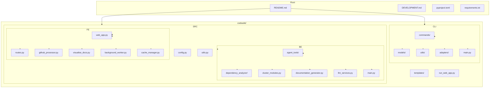
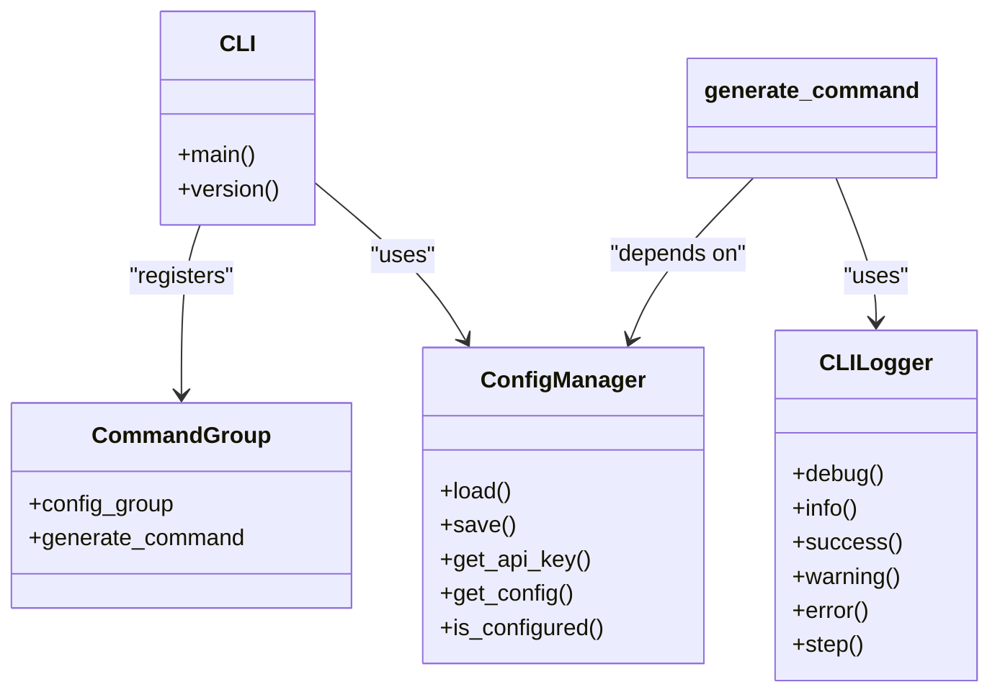
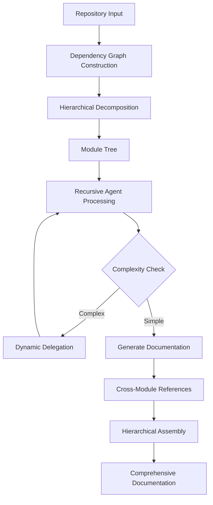
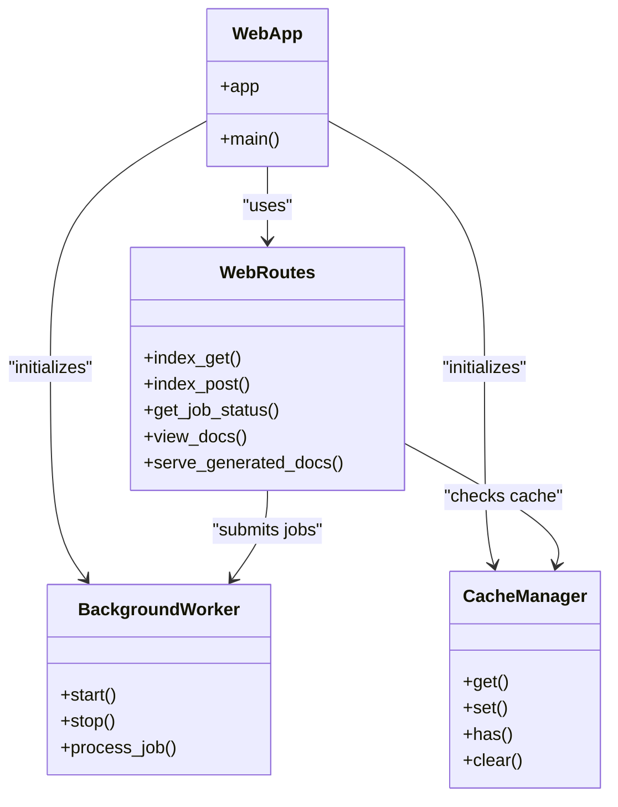

# Developer Guide and Extensibility

<cite>
**Referenced Files in This Document**   
- [README.md](file://README.md)
- [DEVELOPMENT.md](file://DEVELOPMENT.md)
- [pyproject.toml](file://pyproject.toml)
- [requirements.txt](file://requirements.txt)
- [codewiki/cli/main.py](file://codewiki/cli/main.py)
- [codewiki/src/be/main.py](file://codewiki/src/be/main.py)
- [codewiki/src/fe/web_app.py](file://codewiki/src/fe/web_app.py)
- [codewiki/src/be/dependency_analyzer/ast_parser.py](file://codewiki/src/be/dependency_analyzer/ast_parser.py)
- [codewiki/src/be/dependency_analyzer/analyzers/python.py](file://codewiki/src/be/dependency_analyzer/analyzers/python.py)
- [codewiki/src/be/agent_tools/read_code_components.py](file://codewiki/src/be/agent_tools/read_code_components.py)
- [codewiki/src/be/agent_tools/generate_sub_module_documentations.py](file://codewiki/src/be/agent_tools/generate_sub_module_documentations.py)
- [codewiki/src/be/agent_tools/deps.py](file://codewiki/src/be/agent_tools/deps.py)
- [codewiki/cli/commands/generate.py](file://codewiki/cli/commands/generate.py)
- [codewiki/cli/utils/logging.py](file://codewiki/cli/utils/logging.py)
- [codewiki/src/be/dependency_analyzer/models/core.py](file://codewiki/src/be/dependency_analyzer/models/core.py)
- [codewiki/src/config.py](file://codewiki/src/config.py)
- [codewiki/cli/config_manager.py](file://codewiki/cli/config_manager.py)
</cite>

## Table of Contents
1. [Project Structure](#project-structure)
2. [CLI Architecture](#cli-architecture)
3. [Backend Architecture](#backend-architecture)
4. [Frontend Architecture](#frontend-architecture)
5. [Development Setup](#development-setup)
6. [Adding Support for New Languages](#adding-support-for-new-languages)
7. [Developing Agent Tools](#developing-agent-tools)
8. [Testing Strategy](#testing-strategy)
9. [Code Style Guidelines](#code-style-guidelines)
10. [Contribution Workflow](#contribution-workflow)
11. [Debugging Techniques](#debugging-techniques)

## Project Structure

The CodeWiki project follows a modular structure with clear separation between CLI, backend, and frontend components:



**Diagram sources**
- [README.md](file://README.md)
- [DEVELOPMENT.md](file://DEVELOPMENT.md)

**Section sources**
- [README.md](file://README.md#L1-L289)
- [DEVELOPMENT.md](file://DEVELOPMENT.md#L1-L41)

## CLI Architecture

The CLI component provides a user-friendly interface for documentation generation and configuration management. It's built using the Click framework and follows a command-based architecture.



**Diagram sources**
- [codewiki/cli/main.py](file://codewiki/cli/main.py#L1-L57)
- [codewiki/cli/commands/generate.py](file://codewiki/cli/commands/generate.py#L1-L266)
- [codewiki/cli/utils/logging.py](file://codewiki/cli/utils/logging.py#L1-L86)
- [codewiki/cli/config_manager.py](file://codewiki/cli/config_manager.py#L1-L232)

**Section sources**
- [codewiki/cli/main.py](file://codewiki/cli/main.py#L1-L57)
- [codewiki/cli/commands/generate.py](file://codewiki/cli/commands/generate.py#L1-L266)

## Backend Architecture

The backend component handles the core functionality of code analysis, dependency extraction, and documentation generation using a recursive agent system.



**Diagram sources**
- [DEVELOPMENT.md](file://DEVELOPMENT.md#L191-L204)

**Section sources**
- [codewiki/src/be/main.py](file://codewiki/src/be/main.py#L1-L66)
- [codewiki/src/be/documentation_generator.py](file://codewiki/src/be/documentation_generator.py)

## Frontend Architecture

The frontend component provides a web interface for users to submit GitHub repositories for documentation generation, featuring background processing and caching.



**Diagram sources**
- [codewiki/src/fe/web_app.py](file://codewiki/src/fe/web_app.py#L1-L133)
- [codewiki/src/fe/routes.py](file://codewiki/src/fe/routes.py)
- [codewiki/src/fe/background_worker.py](file://codewiki/src/fe/background_worker.py)
- [codewiki/src/fe/cache_manager.py](file://codewiki/src/fe/cache_manager.py)

**Section sources**
- [codewiki/src/fe/web_app.py](file://codewiki/src/fe/web_app.py#L1-L133)

## Development Setup

To set up a development environment for CodeWiki, follow these steps:

1. **Clone the repository:**
```bash
git clone https://github.com/FSoft-AI4Code/CodeWiki.git
cd CodeWiki
```

2. **Create a virtual environment:**
```bash
python3.12 -m venv .venv
source .venv/bin/activate  # On Windows: .venv\Scripts\activate
```

3. **Install in development mode:**
```bash
pip install -e .
pip install -r requirements.txt
```

4. **Install development dependencies:**
```bash
pip install -e ".[dev]"
```

The project requires Python 3.12+, Node.js (for Mermaid diagram validation), Git, and Tree-sitter language parsers. The `pyproject.toml` file contains all project metadata and dependencies.

**Section sources**
- [DEVELOPMENT.md](file://DEVELOPMENT.md#L54-L68)
- [pyproject.toml](file://pyproject.toml#L1-L125)
- [requirements.txt](file://requirements.txt#L1-L165)

## Adding Support for New Languages

To add support for a new programming language in CodeWiki, follow these steps:

1. **Create a language analyzer** in `src/be/dependency_analyzer/analyzers/`:

```python
from .base import BaseAnalyzer

class NewLanguageAnalyzer(BaseAnalyzer):
    def __init__(self):
        super().__init__("new_language")
    
    def extract_dependencies(self, ast_node):
        # Implement dependency extraction
        pass
    
    def extract_components(self, ast_node):
        # Implement component extraction
        pass
```

2. **Register the analyzer** in `src/be/dependency_analyzer/ast_parser.py`:

```python
LANGUAGE_ANALYZERS = {
    # ... existing languages ...
    "new_language": NewLanguageAnalyzer,
}
```

3. **Add file extensions** to the configuration in `ast_parser.py`:

```python
def _file_to_module_path(self, file_path: str) -> str:
    path = file_path
    extensions = ['.py', '.js', '.ts', '.java', '.cs', '.cpp', '.hpp', '.h', '.c', '.newlang']  # Add new extension
    # ... rest of implementation
```

4. **Implement AST parsing** using Tree-sitter or another parsing library to extract code components and relationships.

5. **Add tests** for the new language analyzer to ensure proper functionality.

The dependency analyzer uses Tree-sitter based parsing for code analysis, which provides consistent ASTs across multiple languages.

**Section sources**
- [DEVELOPMENT.md](file://DEVELOPMENT.md#L122-L157)
- [codewiki/src/be/dependency_analyzer/ast_parser.py](file://codewiki/src/be/dependency_analyzer/ast_parser.py#L1-L146)
- [codewiki/src/be/dependency_analyzer/analyzers/python.py](file://codewiki/src/be/dependency_analyzer/analyzers/python.py#L1-L267)

## Developing Agent Tools

Agent tools are functions that can be called by the AI agents during the documentation generation process. They extend the capabilities of the agent system by providing access to codebase information and editing functions.

To create a new agent tool:

1. **Define the tool function** with appropriate parameters:

```python
async def tool_name(ctx: RunContext[CodeWikiDeps], param1: str, param2: list) -> str:
    """Tool description
    
    Args:
        param1: Description of param1
        param2: Description of param2
    """
    # Tool implementation
    return result
```

2. **Register the tool** using the Tool decorator:

```python
tool_name_tool = Tool(function=tool_name, name="tool_name", description="Tool description", takes_ctx=True)
```

3. **Add the tool** to the agent's tool list in the appropriate agent configuration.

Existing agent tools include:
- `read_code_components`: Reads the source code of specified components
- `generate_sub_module_documentation`: Generates documentation for sub-modules
- `str_replace_editor`: Edits documentation content
- `deps`: Provides dependency traversal capabilities

The tools are designed to work with the `CodeWikiDeps` dependency class which provides access to the codebase components, module tree, and configuration.

**Section sources**
- [codewiki/src/be/agent_tools/read_code_components.py](file://codewiki/src/be/agent_tools/read_code_components.py#L1-L22)
- [codewiki/src/be/agent_tools/generate_sub_module_documentations.py](file://codewiki/src/be/agent_tools/generate_sub_module_documentations.py#L1-L93)
- [codewiki/src/be/agent_tools/deps.py](file://codewiki/src/be/agent_tools/deps.py#L1-L16)

## Testing Strategy

CodeWiki uses pytest for testing with coverage measurement to ensure code quality.

To run tests:

```bash
# Run all tests
pytest

# Run specific test file
pytest tests/test_dependency_analyzer.py

# Run with coverage
pytest --cov=codewiki tests/
```

The testing strategy includes:
- Unit tests for individual components
- Integration tests for component interactions
- Coverage measurement to identify untested code
- Async testing support for asynchronous components

Test dependencies are specified in the `pyproject.toml` file under the `dev` optional dependencies, which include pytest, pytest-cov, and pytest-asyncio.

**Section sources**
- [DEVELOPMENT.md](file://DEVELOPMENT.md#L158-L169)
- [pyproject.toml](file://pyproject.toml#L62-L70)

## Code Style Guidelines

CodeWiki follows PEP 8 style guidelines with additional requirements for type hints and documentation:

- **PEP 8 compliance**: Follow Python style guide for code formatting
- **Type hints**: Use type hints for all function parameters and return values
- **Docstrings**: Write comprehensive docstrings for all public functions and classes
- **Function focus**: Keep functions focused and modular
- **Line length**: 100 characters (configured in pyproject.toml)
- **Target Python version**: 3.12

The project uses several code quality tools configured in `pyproject.toml`:
- Black for code formatting
- MyPy for type checking
- Ruff for linting

```toml
[tool.black]
line-length = 100
target-version = ['py312']

[tool.mypy]
python_version = "3.12"
warn_return_any = true
warn_unused_configs = true
disallow_untyped_defs = false
disallow_incomplete_defs = false

[tool.ruff]
line-length = 100
target-version = "py312"
```

**Section sources**
- [DEVELOPMENT.md](file://DEVELOPMENT.md#L171-L177)
- [pyproject.toml](file://pyproject.toml#L103-L117)

## Contribution Workflow

The contribution workflow for CodeWiki follows standard GitHub practices:

1. **Fork the repository** on GitHub
2. **Create a feature branch**: `git checkout -b feature/your-feature`
3. **Make your changes** following the code style guidelines
4. **Write/update tests** for your changes
5. **Ensure tests pass**: `pytest`
6. **Commit your changes**: `git commit -am 'Add new feature'`
7. **Push to the branch**: `git push origin feature/your-feature`
8. **Submit a pull request** through the GitHub interface

The project uses a configuration manager that securely stores API keys in the system keychain (macOS Keychain, Windows Credential Manager, or Linux Secret Service) while storing other settings in `~/.codewiki/config.json`.

For debugging, verbose logging can be enabled via the `--verbose` flag or by setting the `CODEWIKI_LOG_LEVEL` environment variable to `DEBUG`.

**Section sources**
- [DEVELOPMENT.md](file://DEVELOPMENT.md#L178-L187)
- [codewiki/cli/utils/logging.py](file://codewiki/cli/utils/logging.py#L1-L86)
- [codewiki/cli/config_manager.py](file://codewiki/cli/config_manager.py#L1-L232)