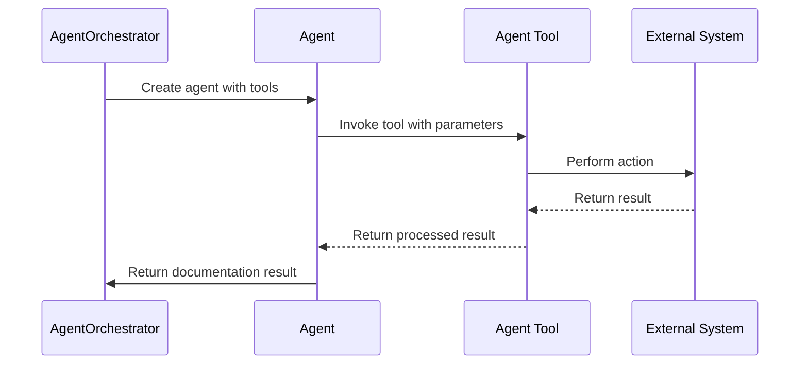
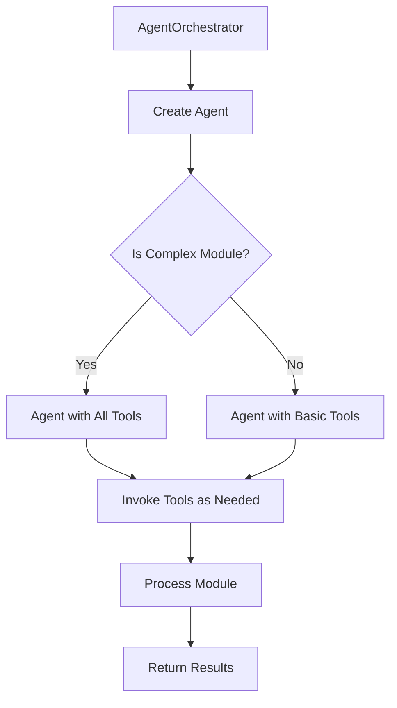
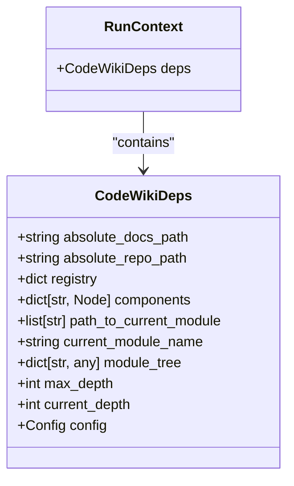
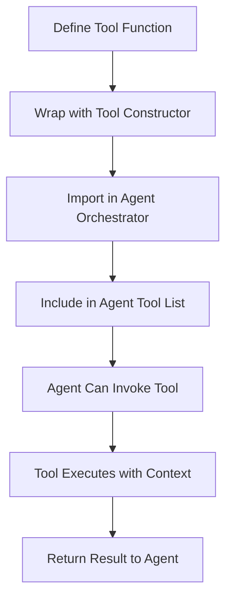
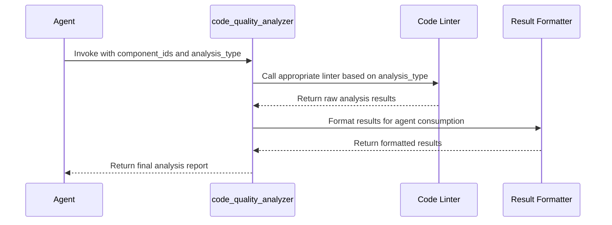
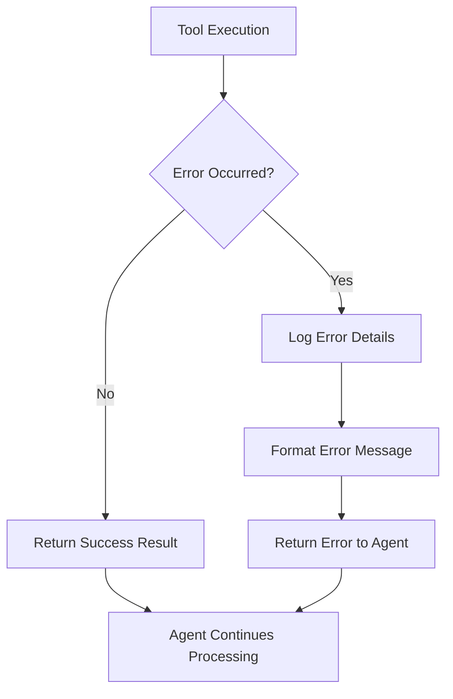
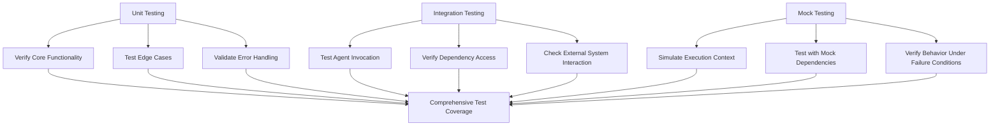

# Developing Agent Tools

<cite>
**Referenced Files in This Document**   
- [read_code_components.py](file://codewiki/src/be/agent_tools/read_code_components.py)
- [generate_sub_module_documentations.py](file://codewiki/src/be/agent_tools/generate_sub_module_documentations.py)
- [str_replace_editor.py](file://codewiki/src/be/agent_tools/str_replace_editor.py)
- [agent_orchestrator.py](file://codewiki/src/be/agent_orchestrator.py)
- [deps.py](file://codewiki/src/be/agent_tools/deps.py)
- [llm_services.py](file://codewiki/src/be/llm_services.py)
- [prompt_template.py](file://codewiki/src/be/prompt_template.py)
- [utils.py](file://codewiki/src/be/utils.py)
- [config.py](file://codewiki/src/config.py)
</cite>

## Table of Contents
1. [Introduction](#introduction)
2. [Agent Tools in Recursive Documentation Generation](#agent-tools-in-recursive-documentation-generation)
3. [Tool Invocation and Agent Orchestrator](#tool-invocation-and-agent-orchestrator)
4. [Tool Interface Contracts](#tool-interface-contracts)
5. [Tool Registration and Access](#tool-registration-and-access)
6. [Implementing a New Code Quality Analysis Tool](#implementing-a-new-code-quality-analysis-tool)
7. [LLM Integration and Error Handling](#llm-integration-and-error-handling)
8. [Testing Strategies for Agent Tools](#testing-strategies-for-agent-tools)
9. [Conclusion](#conclusion)

## Introduction
The CodeWiki framework employs an agent-based architecture for automated documentation generation, where specialized agent tools perform specific tasks in a recursive documentation process. This document provides comprehensive guidance on developing new agent tools within this framework, explaining their role in the recursive documentation generation process, their interaction patterns with the agent orchestrator, and the required implementation patterns for new tools.

**Section sources**
- [agent_orchestrator.py](file://codewiki/src/be/agent_orchestrator.py#L59-L149)
- [prompt_template.py](file://codewiki/src/be/prompt_template.py#L1-L337)

## Agent Tools in Recursive Documentation Generation
Agent tools in the CodeWiki framework play a critical role in the recursive documentation generation process by enabling agents to perform specific actions that facilitate comprehensive documentation creation. These tools are invoked by the agent orchestrator to execute tasks that require external system interactions or specialized processing beyond the capabilities of the LLM alone.

The recursive nature of documentation generation is enabled through tools like `generate_sub_module_documentation`, which creates sub-agents to handle documentation for complex modules. When a module is identified as complex (containing multiple files), the agent uses this tool to spawn sub-agents that recursively generate documentation for each sub-module, creating a hierarchical documentation structure that mirrors the codebase organization.

The `read_code_components` tool allows agents to retrieve source code for specific components, enabling them to analyze implementation details when generating documentation. This capability is essential for creating accurate and detailed documentation that reflects the actual code implementation rather than relying solely on high-level descriptions.

**Diagram sources**
- [agent_orchestrator.py](file://codewiki/src/be/agent_orchestrator.py#L59-L149)
- [read_code_components.py](file://codewiki/src/be/agent_tools/read_code_components.py#L5-L22)

**Section sources**
- [generate_sub_module_documentations.py](file://codewiki/src/be/agent_tools/generate_sub_module_documentations.py#L17-L93)
- [read_code_components.py](file://codewiki/src/be/agent_tools/read_code_components.py#L5-L22)

## Tool Invocation and Agent Orchestrator
The agent orchestrator is responsible for managing the lifecycle of agents and their tool invocation. It creates appropriate agents based on module complexity and provides them with the necessary tools for documentation generation. The orchestrator determines whether to create a complex agent with full tool access or a simpler agent for leaf modules based on the complexity of the module being processed.

When processing a module, the orchestrator creates an agent with dependencies that include the module tree, component registry, and configuration. It then invokes the agent with a formatted user prompt that contains information about the module and its core components. The agent can then invoke tools as needed during its execution, with the orchestrator handling the tool execution and returning results to the agent.

The tool invocation process follows a consistent pattern where tools are defined as asynchronous functions that accept a `RunContext` parameter containing dependencies and additional parameters specific to the tool's functionality. The orchestrator manages the execution context and ensures that tools have access to the necessary dependencies through the context object.

**Diagram sources**
- [agent_orchestrator.py](file://codewiki/src/be/agent_orchestrator.py#L66-L88)
- [generate_sub_module_documentations.py](file://codewiki/src/be/agent_tools/generate_sub_module_documentations.py#L50-L65)

**Section sources**
- [agent_orchestrator.py](file://codewiki/src/be/agent_orchestrator.py#L59-L149)

## Tool Interface Contracts
Agent tools in the CodeWiki framework follow a standardized interface contract that ensures consistency across all tools. Each tool is implemented as an asynchronous function that accepts a `RunContext[CodeWikiDeps]` parameter as its first argument, followed by tool-specific parameters. The `RunContext` provides access to dependencies such as the component registry, module tree, and configuration.

The `CodeWikiDeps` class defines the dependency structure that all tools can access, including:
- `absolute_docs_path`: Absolute path to the documentation directory
- `absolute_repo_path`: Absolute path to the repository root
- `registry`: Dictionary for persistent storage across tool calls
- `components`: Dictionary mapping component IDs to component objects
- `path_to_current_module`: List representing the current module path in the hierarchy
- `current_module_name`: Name of the current module being processed
- `module_tree`: Hierarchical representation of the module structure
- `max_depth`: Maximum depth for recursive documentation generation
- `current_depth`: Current depth in the module hierarchy
- `config`: Configuration object containing LLM and system settings

Tools must return a string result that can be processed by the agent. The string typically contains the result of the tool's operation, which may include success messages, error information, or data retrieved from external systems.

**Diagram sources**
- [deps.py](file://codewiki/src/be/agent_tools/deps.py#L5-L16)
- [read_code_components.py](file://codewiki/src/be/agent_tools/read_code_components.py#L5-L22)

**Section sources**
- [deps.py](file://codewiki/src/be/agent_tools/deps.py#L5-L16)
- [read_code_components.py](file://codewiki/src/be/agent_tools/read_code_components.py#L5-L22)

## Tool Registration and Access
Agent tools are registered and accessed through the Pydantic AI framework's `Tool` class, which wraps the tool function and provides metadata about the tool. Each tool is defined as a function and then wrapped with the `Tool` constructor, specifying the function, name, description, and whether it takes a context parameter.

The registration process involves creating a tool instance with the following parameters:
- `function`: The asynchronous function that implements the tool's logic
- `name`: The name used to identify the tool when invoked by the agent
- `description`: A detailed description of the tool's purpose and capabilities
- `takes_ctx`: Boolean indicating whether the tool requires access to the execution context

Tools are imported and included in the agent's tool list when the agent is created by the orchestrator. The orchestrator determines which tools to include based on the complexity of the module being processed, providing a full set of tools for complex modules and a limited set for simpler leaf modules.

**Diagram sources**
- [read_code_components.py](file://codewiki/src/be/agent_tools/read_code_components.py#L22)
- [str_replace_editor.py](file://codewiki/src/be/agent_tools/str_replace_editor.py#L769-L782)
- [agent_orchestrator.py](file://codewiki/src/be/agent_orchestrator.py#L74-L77)

**Section sources**
- [read_code_components.py](file://codewiki/src/be/agent_tools/read_code_components.py#L22)
- [str_replace_editor.py](file://codewiki/src/be/agent_tools/str_replace_editor.py#L769-L782)
- [agent_orchestrator.py](file://codewiki/src/be/agent_orchestrator.py#L74-L77)

## Implementing a New Code Quality Analysis Tool
To implement a new agent tool for code quality analysis, follow these steps:

1. Create a new Python file in the `codewiki/src/be/agent_tools/` directory named `code_quality_analyzer.py`
2. Define an asynchronous function that accepts the required parameters, including the `RunContext[CodeWikiDeps]` parameter
3. Implement the code quality analysis logic using appropriate libraries or system calls
4. Wrap the function with the `Tool` constructor to register it as an agent tool
5. Import the tool in the agent orchestrator and include it in the appropriate agent configurations

The tool should accept parameters such as:
- `component_ids`: List of component IDs to analyze for code quality
- `analysis_type`: Type of analysis to perform (e.g., "style", "complexity", "security")
- `threshold`: Threshold value for determining pass/fail status

The tool should return a formatted string containing the analysis results, including any issues found, severity levels, and recommendations for improvement. It should also handle errors gracefully and provide meaningful error messages when analysis cannot be completed.

**Diagram sources**
- [read_code_components.py](file://codewiki/src/be/agent_tools/read_code_components.py#L5-L22)
- [str_replace_editor.py](file://codewiki/src/be/agent_tools/str_replace_editor.py#L709-L783)

**Section sources**
- [read_code_components.py](file://codewiki/src/be/agent_tools/read_code_components.py#L5-L22)
- [str_replace_editor.py](file://codewiki/src/be/agent_tools/str_replace_editor.py#L709-L783)

## LLM Integration and Error Handling
Agent tools integrate with LLM services through the framework's dependency injection system, which provides access to LLM configuration and services via the `CodeWikiDeps` object. Tools can access the LLM configuration through `ctx.deps.config` and use the `llm_services.py` module to make direct calls to LLM providers when needed.

The framework provides robust error handling mechanisms for tool execution. Each tool should implement comprehensive error handling to catch and process exceptions that may occur during execution. Errors should be logged using the framework's logging system and returned to the agent in a structured format that allows the agent to understand the nature of the error and potentially recover from it.

For tools that modify system state, such as the `str_replace_editor`, the framework implements a history mechanism that allows for undo operations. This is achieved through the `registry` dependency, which maintains a history of file states that can be restored if needed. Tools should also validate their inputs before execution and provide clear error messages when invalid parameters are provided.

**Diagram sources**
- [str_replace_editor.py](file://codewiki/src/be/agent_tools/str_replace_editor.py#L740-L766)
- [utils.py](file://codewiki/src/be/utils.py#L45-L89)
- [llm_services.py](file://codewiki/src/be/llm_services.py#L58-L86)

**Section sources**
- [str_replace_editor.py](file://codewiki/src/be/agent_tools/str_replace_editor.py#L740-L766)
- [utils.py](file://codewiki/src/be/utils.py#L45-L89)
- [llm_services.py](file://codewiki/src/be/llm_services.py#L58-L86)

## Testing Strategies for Agent Tools
Testing agent tools requires a combination of unit testing, integration testing, and mock-based testing to ensure reliability and correctness. The framework provides several mechanisms for testing tools in isolation using mock environments that simulate the agent execution context.

Unit tests should verify the core functionality of the tool, including:
- Correct processing of valid inputs
- Appropriate handling of edge cases
- Proper error handling for invalid inputs
- Expected output format and content

Integration tests should verify that the tool works correctly within the agent system, including:
- Proper registration and invocation through the agent orchestrator
- Correct interaction with dependencies and external systems
- Expected behavior when called from an agent context

Mock environments can be created using the `CodeWikiDeps` class to simulate the execution context, allowing tools to be tested without requiring a full agent system. This approach enables comprehensive testing of tool behavior under various conditions, including simulated failures of external systems.

**Diagram sources**
- [utils.py](file://codewiki/src/be/utils.py#L202-L207)
- [str_replace_editor.py](file://codewiki/src/be/agent_tools/str_replace_editor.py#L760-L766)

**Section sources**
- [utils.py](file://codewiki/src/be/utils.py#L202-L207)
- [str_replace_editor.py](file://codewiki/src/be/agent_tools/str_replace_editor.py#L760-L766)

## Conclusion
Developing agent tools for the CodeWiki framework requires understanding the recursive documentation generation process, the agent orchestrator's role in tool invocation, and the standardized interface contracts that ensure consistency across tools. By following the patterns demonstrated by existing tools like `read_code_components` and `generate_sub_module_documentations`, developers can create new tools that integrate seamlessly with the framework.

The key aspects of successful agent tool development include proper interface implementation, effective LLM integration, robust error handling, and comprehensive testing strategies. Tools should be designed to work within the agent system's context, leveraging the provided dependencies and following the established patterns for tool registration and access.

By implementing new tools according to these guidelines, developers can extend the capabilities of the CodeWiki framework to support additional analysis, documentation, and code quality features, enhancing the overall effectiveness of the automated documentation generation process.