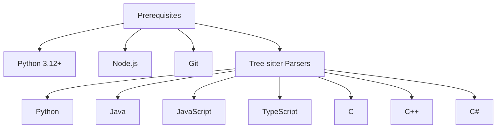
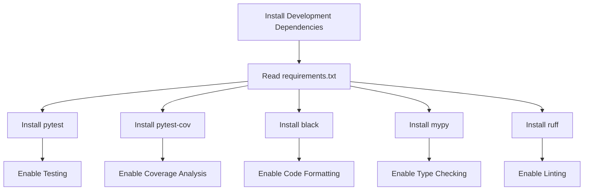
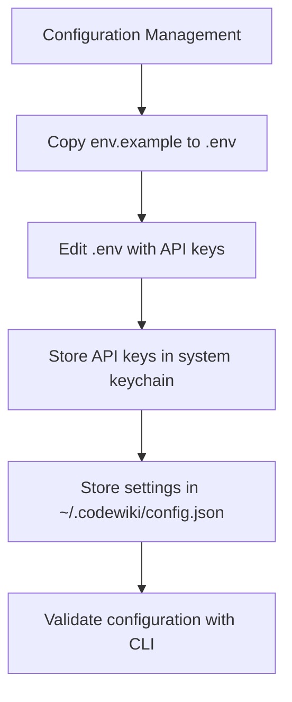

# Development Setup

<cite>
**Referenced Files in This Document**   
- [DEVELOPMENT.md](file://DEVELOPMENT.md)
- [pyproject.toml](file://pyproject.toml)
- [requirements.txt](file://requirements.txt)
- [README.md](file://README.md)
- [docker/DOCKER_README.md](file://docker/DOCKER_README.md)
- [codewiki/cli/main.py](file://codewiki/cli/main.py)
- [codewiki/src/be/dependency_analyzer/ast_parser.py](file://codewiki/src/be/dependency_analyzer/ast_parser.py)
- [docker/env.example](file://docker/env.example)
- [.gitignore](file://.gitignore)
- [docker/.dockerignore](file://docker/.dockerignore)
</cite>

## Table of Contents
1. [Introduction](#introduction)
2. [Prerequisites](#prerequisites)
3. [Repository Cloning](#repository-cloning)
4. [Virtual Environment Setup](#virtual-environment-setup)
5. [Package Installation](#package-installation)
6. [Development Dependencies](#development-dependencies)
7. [Verification and Testing](#verification-and-testing)
8. [Troubleshooting Common Issues](#troubleshooting-common-issues)
9. [Platform-Specific Considerations](#platform-specific-considerations)
10. [Configuration Management](#configuration-management)

## Introduction
This document provides comprehensive instructions for setting up a local development environment for CodeWiki, an AI-powered framework for generating holistic documentation for large-scale codebases. The setup process involves installing prerequisites, cloning the repository, creating a virtual environment, and installing the package in editable mode. This guide references the DEVELOPMENT.md file for exact setup sequences and environment configuration, ensuring developers can contribute effectively to the project.

**Section sources**
- [DEVELOPMENT.md](file://DEVELOPMENT.md#L1-L245)
- [README.md](file://README.md#L1-L289)

## Prerequisites
Before setting up the development environment, ensure the following prerequisites are installed on your system:

- **Python 3.12+**: Required for running the CodeWiki application and its dependencies. The project specifies Python 3.12+ in both the README.md and pyproject.toml files.
- **Node.js**: Necessary for Mermaid diagram validation in the generated documentation. This is mentioned in both the README.md and DEVELOPMENT.md files.
- **Git**: Essential for cloning the repository and managing version control.
- **Tree-sitter language parsers**: Used for parsing code in multiple languages (Python, Java, JavaScript, TypeScript, C, C++, C#). These parsers are listed as dependencies in the pyproject.toml file.

The pyproject.toml file explicitly lists the required Tree-sitter packages for each supported language, ensuring accurate syntax tree generation for dependency analysis.



**Diagram sources**
- [pyproject.toml](file://pyproject.toml#L26-L40)
- [DEVELOPMENT.md](file://DEVELOPMENT.md#L45-L50)

**Section sources**
- [DEVELOPMENT.md](file://DEVELOPMENT.md#L45-L50)
- [README.md](file://README.md#L231-L237)
- [pyproject.toml](file://pyproject.toml#L10)

## Repository Cloning
To begin the setup process, clone the CodeWiki repository from GitHub using the following command:

```bash
git clone https://github.com/FSoft-AI4Code/CodeWiki.git
cd CodeWiki
```

This command creates a local copy of the repository, allowing you to access all project files and directories. The repository structure includes the main codewiki package, Docker configuration files, documentation, and test suites. After cloning, navigate into the CodeWiki directory to proceed with the subsequent setup steps.

**Section sources**
- [DEVELOPMENT.md](file://DEVELOPMENT.md#L54-L57)

## Virtual Environment Setup
Creating an isolated virtual environment is crucial for managing dependencies without affecting the global Python installation. Use the following commands to set up a virtual environment:

### Unix/Linux/macOS:
```bash
python3.12 -m venv .venv
source .venv/bin/activate
```

### Windows:
```bash
python3.12 -m venv .venv
.venv\Scripts\activate
```

The virtual environment is named `.venv` and is created using Python 3.12, as specified in the DEVELOPMENT.md file. Activating the virtual environment ensures that all subsequent package installations are contained within this isolated environment. The `.gitignore` file includes entries for `.venv` and `venv/`, preventing the virtual environment from being committed to version control.

**Section sources**
- [DEVELOPMENT.md](file://DEVELOPMENT.md#L59-L61)
- [.gitignore](file://.gitignore#L5-L6)

## Package Installation
With the virtual environment activated, install CodeWiki in editable mode using pip. This allows you to make changes to the source code without reinstalling the package each time.

```bash
pip install -e .
```

This command installs the package as specified in the pyproject.toml file, which defines the project metadata and dependencies. The `-e` flag enables editable mode, linking the installed package directly to the source code in the current directory. This is particularly useful for development, as any modifications to the codebase are immediately reflected in the installed package.

The pyproject.toml file also specifies the required dependencies, including Click for CLI functionality, GitPython for Git operations, and various Tree-sitter packages for language parsing.

**Section sources**
- [DEVELOPMENT.md](file://DEVELOPMENT.md#L63-L64)
- [pyproject.toml](file://pyproject.toml#L26-L53)

## Development Dependencies
In addition to the core package, install the development dependencies listed in the requirements.txt file. These dependencies are necessary for testing, linting, and code quality checks.

```bash
pip install -r requirements.txt
```

The requirements.txt file contains a comprehensive list of packages, including testing frameworks like pytest, linting tools, and other utilities required for development. Installing these dependencies ensures that you can run tests and perform code analysis as part of the development workflow.



**Diagram sources**
- [requirements.txt](file://requirements.txt#L1-L165)

**Section sources**
- [DEVELOPMENT.md](file://DEVELOPMENT.md#L66-L67)
- [requirements.txt](file://requirements.txt#L1-L165)

## Verification and Testing
After installing the package and dependencies, verify the installation by running the following commands:

```bash
codewiki --version
pytest
```

The first command checks that the CodeWiki CLI is properly installed and accessible, displaying the version number. The second command runs the test suite to ensure that all components are functioning correctly. The DEVELOPMENT.md file provides additional testing commands, such as running specific test files or checking code coverage.

Running tests is an essential step to confirm that the development environment is set up correctly and that the codebase is in a working state before making any modifications.

**Section sources**
- [DEVELOPMENT.md](file://DEVELOPMENT.md#L160-L168)
- [codewiki/cli/main.py](file://codewiki/cli/main.py#L12-L13)

## Troubleshooting Common Issues
Several common issues may arise during the setup process. Addressing these proactively can save time and prevent frustration.

### Virtual Environment Activation
On Windows, if the virtual environment fails to activate, ensure that the execution policy allows script execution. Run the following command in PowerShell as an administrator:

```powershell
Set-ExecutionPolicy -ExecutionPolicy RemoteSigned -Scope CurrentUser
```

### Dependency Conflicts
If you encounter dependency conflicts, create a fresh virtual environment and reinstall the packages. Use the following commands:

```bash
rm -rf .venv
python3.12 -m venv .venv
source .venv/bin/activate  # On Windows: .venv\Scripts\activate
pip install -e .
pip install -r requirements.txt
```

### Parser Installation Errors
Tree-sitter parser errors may occur if the required language parsers are not properly installed. Ensure that all Tree-sitter packages listed in pyproject.toml are installed. If issues persist, reinstall the Tree-sitter packages:

```bash
pip uninstall tree-sitter tree-sitter-python tree-sitter-java tree-sitter-javascript tree-sitter-typescript tree-sitter-c tree-sitter-cpp tree-sitter-c-sharp tree-sitter-php
pip install tree-sitter tree-sitter-language-pack
```

**Section sources**
- [DEVELOPMENT.md](file://DEVELOPMENT.md#L218-L223)
- [pyproject.toml](file://pyproject.toml#L31-L40)

## Platform-Specific Considerations
Certain setup steps vary between operating systems. Pay attention to the following platform-specific details:

### Unix/Linux/macOS
- Use `source .venv/bin/activate` to activate the virtual environment.
- Ensure that Node.js is installed via a package manager like npm, yarn, or Homebrew.

### Windows
- Use `.venv\Scripts\activate` to activate the virtual environment.
- If encountering permission issues with script execution, adjust the PowerShell execution policy as described in the troubleshooting section.
- Ensure that Python 3.12 is added to the system PATH during installation.

The DEVELOPMENT.md file explicitly provides activation commands for both Unix and Windows systems, highlighting the importance of platform-specific instructions.

**Section sources**
- [DEVELOPMENT.md](file://DEVELOPMENT.md#L60)

## Configuration Management
Proper configuration is essential for the CodeWiki application to function correctly. The project uses environment variables and configuration files to manage settings.

### Environment Variables
Copy the `env.example` file to `.env` and fill in the required API keys and configuration values:

```bash
cp docker/env.example .env
```

Edit the `.env` file to include your LLM API keys and other settings. The `docker/env.example` file provides a template with placeholders for the main model, fallback model, cluster model, base URL, and API key.

### Configuration Storage
- **API keys**: Stored securely in the system keychain (macOS Keychain, Windows Credential Manager, Linux Secret Service).
- **Settings**: Stored in `~/.codewiki/config.json`.

The README.md file details the configuration management process, including how to set up API keys and validate the configuration using the CLI.



**Diagram sources**
- [docker/env.example](file://docker/env.example#L1-L35)
- [README.md](file://README.md#L139-L140)

**Section sources**
- [docker/env.example](file://docker/env.example#L1-L35)
- [README.md](file://README.md#L48-L53)
- [.gitignore](file://.gitignore#L55-L58)