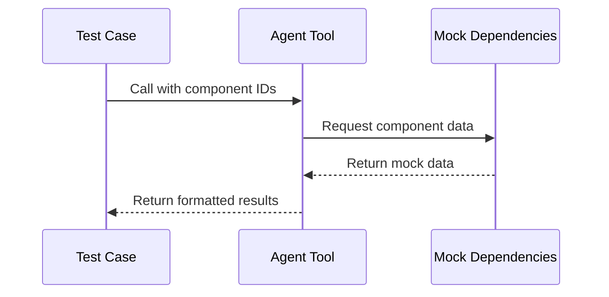
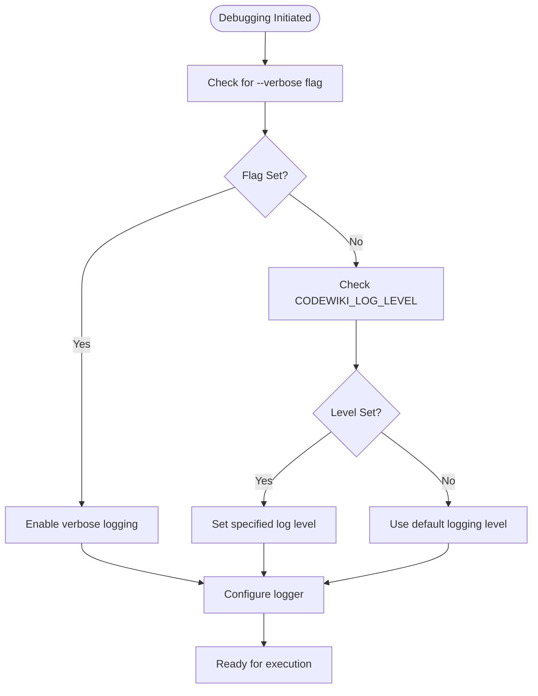
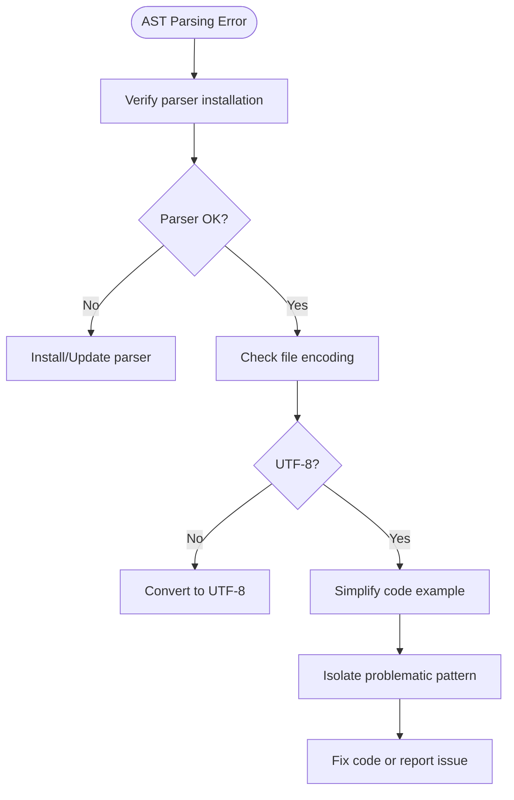

# Testing Strategy and Debugging Techniques

<cite>
**Referenced Files in This Document**   
- [DEVELOPMENT.md](file://DEVELOPMENT.md)
- [pyproject.toml](file://pyproject.toml)
- [codewiki/cli/commands/generate.py](file://codewiki/cli/commands/generate.py)
- [codewiki/cli/utils/logging.py](file://codewiki/cli/utils/logging.py)
- [codewiki/src/be/dependency_analyzer/utils/logging_config.py](file://codewiki/src/be/dependency_analyzer/utils/logging_config.py)
- [codewiki/src/be/agent_tools/read_code_components.py](file://codewiki/src/be/agent_tools/read_code_components.py)
- [codewiki/src/be/agent_tools/generate_sub_module_documentations.py](file://codewiki/src/be/agent_tools/generate_sub_module_documentations.py)
- [codewiki/src/be/dependency_analyzer/analyzers/python.py](file://codewiki/src/be/dependency_analyzer/analyzers/python.py)
- [codewiki/src/be/dependency_analyzer/analysis/repo_analyzer.py](file://codewiki/src/be/dependency_analyzer/analysis/repo_analyzer.py)
</cite>

## Table of Contents
1. [Introduction](#introduction)
2. [Testing Framework and Configuration](#testing-framework-and-configuration)
3. [Writing Effective Tests](#writing-effective-tests)
4. [Debugging Workflow](#debugging-workflow)
5. [Interpreting Log Output](#interpreting-log-output)
6. [Debugging Complex Scenarios](#debugging-complex-scenarios)
7. [Best Practices for Issue Isolation and Fix Validation](#best-practices-for-issue-isolation-and-fix-validation)
8. [Common Issues and Solutions](#common-issues-and-solutions)

## Introduction
This document provides comprehensive guidance on testing and debugging practices for CodeWiki development. It covers the use of pytest for unit and integration testing, explains how to write effective tests for various components, and details the debugging workflow using verbose logging and environment variables. The document also addresses debugging complex scenarios such as AST parsing errors, LLM API failures, and memory issues with large repositories, providing best practices for isolating issues and validating fixes.

## Testing Framework and Configuration

CodeWiki utilizes pytest as its primary testing framework, with configuration managed through the pyproject.toml file. The test suite is designed to validate the functionality of various components including language analyzers, agent tools, and CLI commands.

The pytest configuration in pyproject.toml specifies the test paths, Python file patterns, and additional options for code coverage measurement:

```bash
# Run all tests
pytest

# Run specific test file
pytest tests/test_dependency_analyzer.py

# Run with coverage
pytest --cov=codewiki tests/
```

The configuration includes options to display verbose output and generate coverage reports, enabling developers to identify untested code paths and ensure comprehensive test coverage.

**Section sources**
- [pyproject.toml](file://pyproject.toml#L118-L124)
- [DEVELOPMENT.md](file://DEVELOPMENT.md#L160-L168)

## Writing Effective Tests

### Testing Language Analyzers
Language analyzers in CodeWiki are responsible for parsing code in various programming languages and extracting structural information. To write effective tests for language analyzers:

1. Create test fixtures with sample code in the target language
2. Verify that the analyzer correctly identifies functions, classes, and other code components
3. Test edge cases such as syntax errors, unusual code patterns, and complex nested structures
4. Validate that the analyzer properly handles file paths and module hierarchies

For example, when testing the Python analyzer, create test cases with various function definitions, class hierarchies, and import statements to ensure comprehensive coverage.

### Testing Agent Tools
Agent tools in CodeWiki provide specific capabilities to the agent system, such as reading code components or generating sub-module documentation. When writing tests for agent tools:

1. Mock the dependencies required by the tool
2. Test the tool's behavior with valid and invalid inputs
3. Verify that the tool produces the expected output format
4. Test error handling for cases where components are not found

For instance, when testing the `read_code_components` tool, verify that it correctly retrieves source code for existing components and returns appropriate error messages for non-existent components.



**Diagram sources**
- [codewiki/src/be/agent_tools/read_code_components.py](file://codewiki/src/be/agent_tools/read_code_components.py)
- [codewiki/src/be/agent_tools/generate_sub_module_documentations.py](file://codewiki/src/be/agent_tools/generate_sub_module_documentations.py)

### Testing CLI Commands
CLI commands in CodeWiki provide the primary interface for users to generate documentation. Effective tests for CLI commands should:

1. Use pytest's click testing utilities to simulate command execution
2. Test both successful execution and error conditions
3. Verify that command options are properly handled
4. Validate that the expected output is generated

When testing the generate command, ensure that all command-line options such as `--output`, `--create-branch`, and `--github-pages` are properly processed and affect the generation process as expected.

**Section sources**
- [codewiki/cli/commands/generate.py](file://codewiki/cli/commands/generate.py)
- [codewiki/src/be/dependency_analyzer/analyzers/python.py](file://codewiki/src/be/dependency_analyzer/analyzers/python.py)

## Debugging Workflow

CodeWiki provides multiple mechanisms for debugging issues during development and usage. The primary debugging approaches involve verbose logging through command-line flags and environment variables.

### Verbose Logging
The `--verbose` flag can be used with CLI commands to enable detailed logging output:

```bash
codewiki generate --verbose
```

This flag increases the verbosity of the output, showing detailed progress information and debug messages that help trace the execution flow.

### Environment Variables
The `CODEWIKI_LOG_LEVEL` environment variable allows setting the logging level for more granular control:

```bash
export CODEWIKI_LOG_LEVEL=DEBUG
```

This variable configures the logging system to output debug-level messages across the application, providing comprehensive insight into the internal operations.

The logging system is implemented in multiple components:
- CLI logging in `codewiki/cli/utils/logging.py`
- Backend logging configuration in `codewiki/src/be/dependency_analyzer/utils/logging_config.py`

These implementations provide colored output for different log levels, making it easier to distinguish between informational messages, warnings, and errors.



**Diagram sources**
- [codewiki/cli/utils/logging.py](file://codewiki/cli/utils/logging.py)
- [codewiki/src/be/dependency_analyzer/utils/logging_config.py](file://codewiki/src/be/dependency_analyzer/utils/logging_config.py)

**Section sources**
- [codewiki/cli/commands/generate.py](file://codewiki/cli/commands/generate.py#L92)
- [DEVELOPMENT.md](file://DEVELOPMENT.md#L210-L216)

## Interpreting Log Output

CodeWiki's logging system provides structured output that helps developers trace execution flow and identify issues. The log output includes timestamps, log levels, and colored messages for easy readability.

### Log Levels and Their Meaning
- **DEBUG**: Detailed information for development and debugging
- **INFO**: Normal operational messages indicating progress
- **WARNING**: Issues that need attention but don't stop execution
- **ERROR**: Errors that prevent specific operations from completing
- **CRITICAL**: Severe issues requiring immediate attention

### Tracing Execution Flow
The logging system outputs messages that trace the execution flow through various stages of documentation generation:

1. Configuration validation
2. Repository analysis
3. Dependency graph construction
4. Module clustering
5. Agent-based documentation generation
6. Output generation

Each stage includes progress indicators and timing information, allowing developers to identify bottlenecks and verify that the process is proceeding as expected.

When debugging, pay attention to:
- The sequence of operations
- Timing information for each step
- Warnings about potential issues
- Error messages with stack traces

**Section sources**
- [codewiki/cli/utils/logging.py](file://codewiki/cli/utils/logging.py)
- [codewiki/src/be/dependency_analyzer/utils/logging_config.py](file://codewiki/src/be/dependency_analyzer/utils/logging_config.py)

## Debugging Complex Scenarios

### AST Parsing Errors
AST parsing errors can occur when the tree-sitter parsers encounter code that doesn't conform to expected syntax. To debug these issues:

1. Verify that the appropriate tree-sitter language parser is installed
2. Check that the file encoding is UTF-8
3. Examine the specific syntax that triggers the error
4. Test with simplified code examples to isolate the problematic pattern

The repository analyzer includes filtering capabilities that can help identify files with parsing issues by examining which files are included or excluded from analysis.



**Diagram sources**
- [codewiki/src/be/dependency_analyzer/analysis/repo_analyzer.py](file://codewiki/src/be/dependency_analyzer/analysis/repo_analyzer.py)
- [codewiki/src/be/dependency_analyzer/analyzers/python.py](file://codewiki/src/be/dependency_analyzer/analyzers/python.py)

### LLM API Failures
LLM API failures can stem from various causes including authentication issues, rate limiting, or service outages. To debug these issues:

1. Verify API keys and endpoints are correctly configured
2. Check for rate limit exceeded errors
3. Enable retry logic for transient failures
4. Validate network connectivity to the API endpoint

The configuration management system securely stores API keys and validates the configuration before use, helping prevent common authentication issues.

### Memory Issues with Large Repositories
Large repositories can cause memory issues due to the extensive analysis required. To address these:

1. Adjust module decomposition thresholds to reduce complexity
2. Increase delegation depth limits to distribute processing
3. Monitor memory usage during execution
4. Consider processing repositories in smaller chunks

The hierarchical decomposition strategy helps manage complexity by breaking large repositories into manageable modules, but tuning the decomposition parameters may be necessary for extremely large codebases.

**Section sources**
- [DEVELOPMENT.md](file://DEVELOPMENT.md#L220-L232)
- [codewiki/src/be/dependency_analyzer/analysis/repo_analyzer.py](file://codewiki/src/be/dependency_analyzer/analysis/repo_analyzer.py)

## Best Practices for Issue Isolation and Fix Validation

### Isolating Issues
When encountering a bug or unexpected behavior, follow these steps to isolate the issue:

1. Reproduce the issue with a minimal example
2. Determine which component is responsible
3. Check log output for error messages and warnings
4. Use verbose logging to trace execution flow
5. Verify configuration and environment variables

For language-specific issues, create a minimal code example that reproduces the problem. For CLI issues, test with minimal command-line options to identify which option triggers the issue.

### Validating Fixes
After implementing a fix, validate it through:

1. Creating targeted unit tests that reproduce the original issue
2. Running the full test suite to ensure no regressions
3. Testing with real-world examples
4. Verifying that the fix doesn't introduce new issues

When fixing issues in language analyzers, ensure that the fix doesn't negatively impact the analysis of other code patterns. For agent tools, verify that the fix maintains compatibility with the agent system's expectations.

**Section sources**
- [DEVELOPMENT.md](file://DEVELOPMENT.md#L183-L185)
- [pyproject.toml](file://pyproject.toml#L64-L70)

## Common Issues and Solutions

Refer to the DEVELOPMENT.md file for detailed information on common issues and their solutions. Key issues include:

- **Tree-sitter parser errors**: Ensure language parsers are properly installed and file encoding is UTF-8
- **LLM API errors**: Verify API keys, endpoints, and check rate limits
- **Memory issues with large repositories**: Adjust module decomposition thresholds and delegation depth limits

The development guide provides specific commands and configuration settings to address these issues, along with troubleshooting steps for various scenarios.

**Section sources**
- [DEVELOPMENT.md](file://DEVELOPMENT.md#L219-L232)