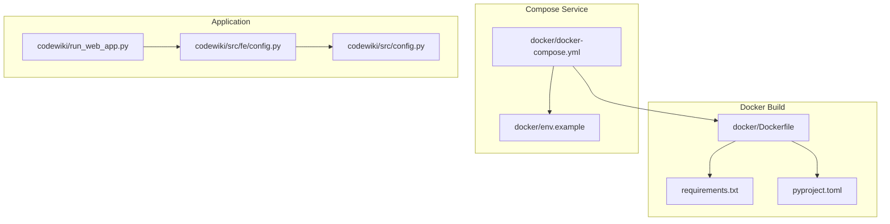
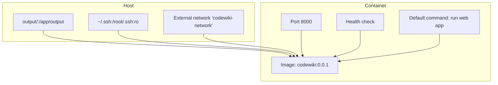
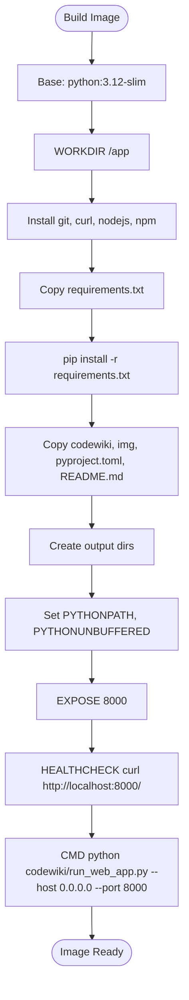
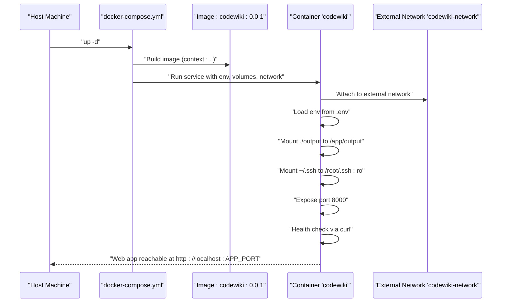
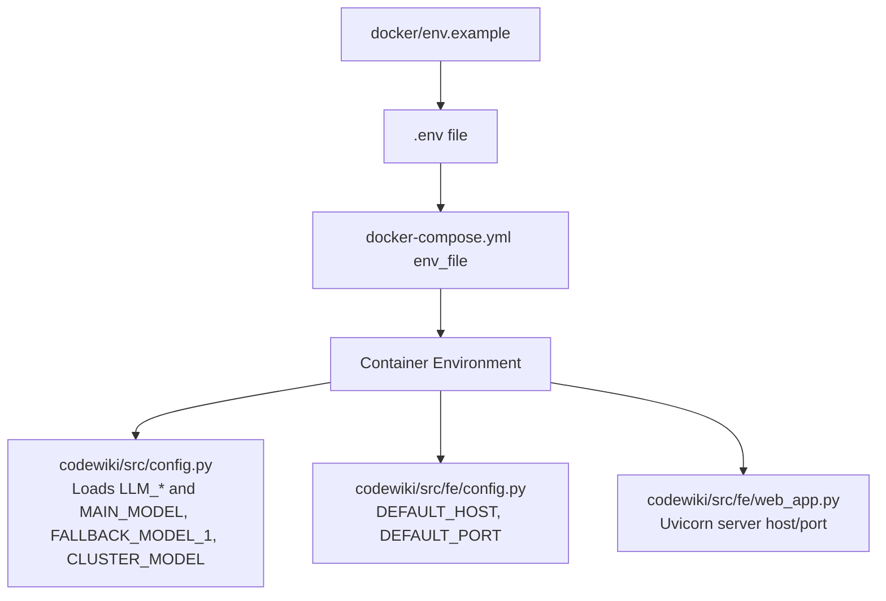
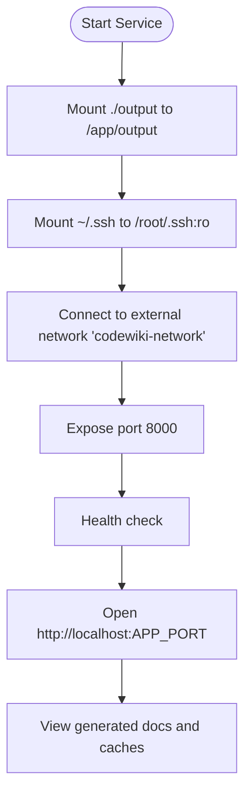
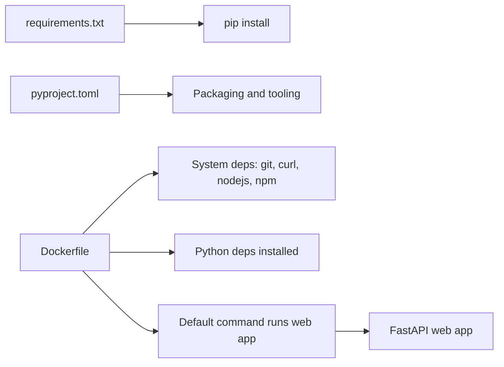

# Docker Deployment

<cite>
**Referenced Files in This Document**
- [Dockerfile](file://docker/Dockerfile)
- [docker-compose.yml](file://docker/docker-compose.yml)
- [env.example](file://docker/env.example)
- [DOCKER_README.md](file://docker/DOCKER_README.md)
- [requirements.txt](file://requirements.txt)
- [pyproject.toml](file://pyproject.toml)
- [run_web_app.py](file://codewiki/run_web_app.py)
- [web_app.py](file://codewiki/src/fe/web_app.py)
- [config.py](file://codewiki/src/config.py)
- [fe/config.py](file://codewiki/src/fe/config.py)
</cite>

## Table of Contents
1. [Introduction](#introduction)
2. [Project Structure](#project-structure)
3. [Core Components](#core-components)
4. [Architecture Overview](#architecture-overview)
5. [Detailed Component Analysis](#detailed-component-analysis)
6. [Dependency Analysis](#dependency-analysis)
7. [Performance Considerations](#performance-considerations)
8. [Troubleshooting Guide](#troubleshooting-guide)
9. [Conclusion](#conclusion)
10. [Appendices](#appendices)

## Introduction
This document explains how to deploy CodeWiki using Docker and Docker Compose. It covers the containerization strategy defined by the Dockerfile and docker-compose.yml, the build process and image configuration, service configuration and environment variable management, running the application with persistent volumes, configuring LLM API keys and other settings inside the container, networking considerations for accessing the web interface, persistence of configuration data and generated documentation, and troubleshooting guidance for common Docker issues.

## Project Structure
The Docker deployment is centered around three key files:
- docker/Dockerfile: Defines the container image, base OS, Python version, system dependencies, Python dependencies, working directory, exposed port, health checks, and default command.
- docker/docker-compose.yml: Orchestrates the CodeWiki service, including port mapping, environment variables, external network, volume mounts, restart policy, and health checks.
- docker/env.example: Provides a template for environment variables, including LLM API configuration, application port, and optional monitoring tokens.

**Diagram sources**
- [Dockerfile](file://docker/Dockerfile#L1-L43)
- [docker-compose.yml](file://docker/docker-compose.yml#L1-L35)
- [env.example](file://docker/env.example#L1-L35)
- [run_web_app.py](file://codewiki/run_web_app.py#L1-L16)
- [fe/config.py](file://codewiki/src/fe/config.py#L1-L51)
- [config.py](file://codewiki/src/config.py#L1-L114)

**Section sources**
- [Dockerfile](file://docker/Dockerfile#L1-L43)
- [docker-compose.yml](file://docker/docker-compose.yml#L1-L35)
- [env.example](file://docker/env.example#L1-L35)

## Core Components
- Container image definition: Built from a Python 3.12 slim base image, installs system dependencies (git, curl, nodejs, npm), copies and installs Python dependencies, sets environment variables, exposes port 8000, and defines a health check.
- Service orchestration: The compose file defines a service named codewiki, binds host port to container port 8000 (controlled by APP_PORT), loads environment variables from .env, mounts persistent output and SSH keys, connects to an external network, and sets restart policy.
- Environment variables: The env.example file documents required and optional variables, including LLM provider configuration, application port, and monitoring tokens. These are loaded into the container via env_file and compose environment entries.
- Web application entry point: The Dockerfile’s default command runs the web application with host and port arguments. The web app initializes FastAPI routes, cache manager, background worker, and ensures output directories exist.

**Section sources**
- [Dockerfile](file://docker/Dockerfile#L1-L43)
- [docker-compose.yml](file://docker/docker-compose.yml#L1-L35)
- [env.example](file://docker/env.example#L1-L35)
- [run_web_app.py](file://codewiki/run_web_app.py#L1-L16)
- [web_app.py](file://codewiki/src/fe/web_app.py#L1-L133)
- [fe/config.py](file://codewiki/src/fe/config.py#L1-L51)

## Architecture Overview
The containerized CodeWiki web application exposes a FastAPI interface. The service runs on port 8000 and serves static documentation files. Persistent data is stored under /app/output, which is mounted from the host. The application reads configuration from environment variables and creates required directories at startup.

**Diagram sources**
- [docker-compose.yml](file://docker/docker-compose.yml#L1-L35)
- [Dockerfile](file://docker/Dockerfile#L1-L43)

## Detailed Component Analysis

### Dockerfile Analysis
- Base image and Python version: Uses python:3.12-slim.
- Working directory: /app.
- System dependencies: git, curl, nodejs, npm.
- Python dependencies: installed from requirements.txt with pip.
- Application code: copies codewiki, img, pyproject.toml, and README.md.
- Output directories: creates output/cache, output/temp, output/docs, output/dependency_graphs.
- Environment variables: sets PYTHONPATH and PYTHONUNBUFFERED.
- Port exposure: 8000.
- Health check: probes localhost:8000 via curl.
- Default command: starts the web application with host 0.0.0.0 and port 8000.

**Diagram sources**
- [Dockerfile](file://docker/Dockerfile#L1-L43)

**Section sources**
- [Dockerfile](file://docker/Dockerfile#L1-L43)
- [requirements.txt](file://requirements.txt#L1-L165)
- [pyproject.toml](file://pyproject.toml#L1-L125)

### docker-compose.yml Analysis
- Service name and image: codewiki, built from docker/Dockerfile with context at parent directory.
- Container name: codewiki.
- Port mapping: ${APP_PORT:-8000}:8000.
- Environment: sets PYTHONPATH and PYTHONUNBUFFERED; loads variables from .env via env_file.
- Networks: connects to external network named codewiki-network.
- Volumes:
  - ./output:/app/output for persistent generated documentation and caches.
  - ~/.ssh:/root/.ssh:ro for private repository access.
- Restart policy: unless-stopped.
- Health check: repeats curl against localhost:8000 with intervals and retries.

**Diagram sources**
- [docker-compose.yml](file://docker/docker-compose.yml#L1-L35)

**Section sources**
- [docker-compose.yml](file://docker/docker-compose.yml#L1-L35)

### Environment Variable Management
- Template: docker/env.example documents required and optional variables, including LLM provider configuration, APP_PORT, and monitoring tokens.
- Loading: docker-compose.yml loads variables from .env via env_file and also sets PYTHONPATH and PYTHONUNBUFFERED explicitly.
- Application consumption:
  - The web application reads LLM configuration from environment variables (MAIN_MODEL, FALLBACK_MODEL_1, CLUSTER_MODEL, LLM_BASE_URL, LLM_API_KEY).
  - The web app uses WebAppConfig for directory defaults and server settings.
  - The CLI configuration loader reads environment variables for LLM settings when running in web app mode.

**Diagram sources**
- [env.example](file://docker/env.example#L1-L35)
- [docker-compose.yml](file://docker/docker-compose.yml#L1-L35)
- [config.py](file://codewiki/src/config.py#L1-L114)
- [fe/config.py](file://codewiki/src/fe/config.py#L1-L51)
- [web_app.py](file://codewiki/src/fe/web_app.py#L1-L133)

**Section sources**
- [env.example](file://docker/env.example#L1-L35)
- [docker-compose.yml](file://docker/docker-compose.yml#L1-L35)
- [config.py](file://codewiki/src/config.py#L1-L114)
- [fe/config.py](file://codewiki/src/fe/config.py#L1-L51)
- [web_app.py](file://codewiki/src/fe/web_app.py#L1-L133)

### Running CodeWiki in Docker with Volumes
- Persistent output: Mount ./output from the host to /app/output in the container so generated documentation and caches persist across restarts.
- SSH keys for private repos: Mount ~/.ssh to /root/.ssh:ro to enable cloning private repositories.
- Access the web interface: After starting the service, browse to http://localhost:APP_PORT (default 8000).

**Diagram sources**
- [docker-compose.yml](file://docker/docker-compose.yml#L1-L35)
- [DOCKER_README.md](file://docker/DOCKER_README.md#L227-L251)

**Section sources**
- [docker-compose.yml](file://docker/docker-compose.yml#L1-L35)
- [DOCKER_README.md](file://docker/DOCKER_README.md#L227-L251)

### Networking Considerations
- External network: The service connects to an external network named codewiki-network. Ensure the network exists before starting the service.
- Port binding: The host port is controlled by APP_PORT with a default of 8000. If port 8000 is in use, change APP_PORT in .env and restart the service.
- Health checks: Both Dockerfile and docker-compose.yml define health checks to probe the web app on localhost:8000.

**Section sources**
- [docker-compose.yml](file://docker/docker-compose.yml#L1-L35)
- [Dockerfile](file://docker/Dockerfile#L1-L43)
- [DOCKER_README.md](file://docker/DOCKER_README.md#L254-L309)

### Persistence of Configuration Data and Generated Documentation
- Output directory: The container creates and writes to /app/output. Mounting ./output to /app/output on the host ensures persistence of:
  - output/cache: cached dependency graphs and jobs
  - output/temp: temporary files
  - output/docs: generated documentation
  - output/dependency_graphs: JSON dependency graphs
- SSH keys: Mounting ~/.ssh enables private repository access without embedding credentials in the image.

**Section sources**
- [Dockerfile](file://docker/Dockerfile#L1-L43)
- [docker-compose.yml](file://docker/docker-compose.yml#L1-L35)
- [DOCKER_README.md](file://docker/DOCKER_README.md#L227-L251)

### Configuration of LLM API Keys and Other Settings
- LLM configuration: Set MAIN_MODEL, FALLBACK_MODEL_1, CLUSTER_MODEL, LLM_BASE_URL, and LLM_API_KEY in .env. The web app reads these from environment variables.
- Application port: Set APP_PORT in .env to control the host port.
- Monitoring: Optionally set LOGFIRE_TOKEN, LOGFIRE_PROJECT_NAME, and LOGFIRE_SERVICE_NAME in .env.
- LiteLLM proxy: If using a proxy, set LLM_BASE_URL to point to the proxy and provide the proxy API key.

**Section sources**
- [env.example](file://docker/env.example#L1-L35)
- [docker-compose.yml](file://docker/docker-compose.yml#L1-L35)
- [config.py](file://codewiki/src/config.py#L1-L114)
- [DOCKER_README.md](file://docker/DOCKER_README.md#L393-L417)

## Dependency Analysis
- Python dependencies: Installed from requirements.txt during image build. The project also declares dependencies in pyproject.toml for packaging and tooling.
- System dependencies: git, curl, nodejs, npm are installed to support repository cloning, health checks, and Mermaid diagram validation.
- Application runtime: The web application is started via the default command in the Dockerfile, which invokes the web app entry point.

**Diagram sources**
- [Dockerfile](file://docker/Dockerfile#L1-L43)
- [requirements.txt](file://requirements.txt#L1-L165)
- [pyproject.toml](file://pyproject.toml#L1-L125)
- [run_web_app.py](file://codewiki/run_web_app.py#L1-L16)
- [web_app.py](file://codewiki/src/fe/web_app.py#L1-L133)

**Section sources**
- [Dockerfile](file://docker/Dockerfile#L1-L43)
- [requirements.txt](file://requirements.txt#L1-L165)
- [pyproject.toml](file://pyproject.toml#L1-L125)
- [run_web_app.py](file://codewiki/run_web_app.py#L1-L16)
- [web_app.py](file://codewiki/src/fe/web_app.py#L1-L133)

## Performance Considerations
- Image size: Using python:3.12-slim reduces image size compared to full images.
- Dependency caching: Copying requirements.txt before copying application code improves Docker layer caching.
- Node.js requirement: Node.js and npm are included to support Mermaid diagram validation in generated documentation.
- Health checks: Health checks ensure the service is responsive and can be restarted automatically if needed.

[No sources needed since this section provides general guidance]

## Troubleshooting Guide
- Port already in use: Change APP_PORT in .env and restart the service.
- Container won’t start: Check logs for errors and verify LLM API key and network existence.
- Health check failing: Probe the local endpoint and inspect health logs.
- Permission issues with volumes: On Linux, adjust ownership of the output directory or run the container with user mapping.
- Private repository access: Ensure SSH keys are mounted and properly secured, and add the remote host to known_hosts inside the container.

**Section sources**
- [DOCKER_README.md](file://docker/DOCKER_README.md#L254-L330)
- [docker-compose.yml](file://docker/docker-compose.yml#L1-L35)

## Conclusion
The Docker deployment provides a reproducible, portable way to run CodeWiki’s web interface. The Dockerfile and docker-compose.yml define a clean container image, expose the web app on port 8000, and mount persistent volumes for generated documentation. Environment variables manage LLM configuration and application settings. With an external network and health checks, the service is easy to operate and troubleshoot.

[No sources needed since this section summarizes without analyzing specific files]

## Appendices
- Additional details and operational commands are documented in docker/DOCKER_README.md.

**Section sources**
- [DOCKER_README.md](file://docker/DOCKER_README.md#L1-L438)